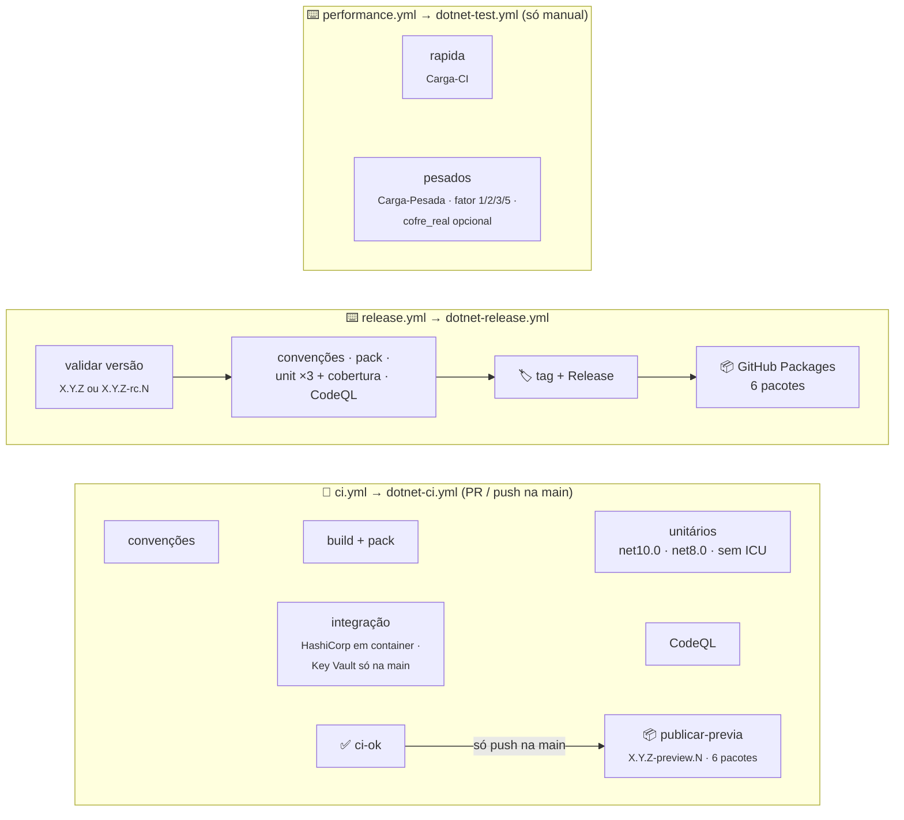
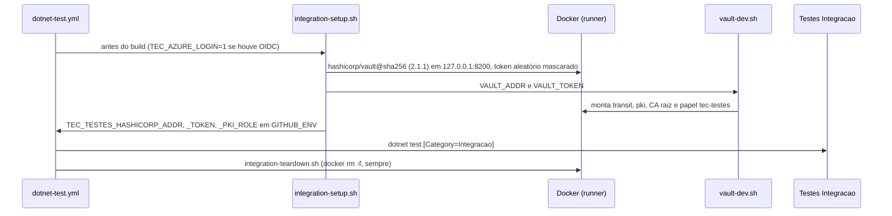

[🏠 TEC.Vault](../../README.md) › [📚 Documentação](../../docs/README.md) › ⚙️ CI/CD

# ⚙️ CI/CD e publicação

> Os três workflows do TEC.Vault são curtos: chamam os workflows reutilizáveis do
> [tec-workflows](https://github.com/tudoemcodigo/tec-workflows) e só declaram o que é deste repositório (solução, testes,
> scripts de integração e Variables do Azure).

## 📑 Sumário

- [🎯 Visão geral](#-visão-geral)
- [📂 Arquivos](#-arquivos)
- [🔀 ci.yml](#-ciyml)
- [📦 release.yml](#-releaseyml)
- [⏱️ performance.yml](#️-performanceyml)
- [🐳 Scripts de integração](#-scripts-de-integração)
- [🔑 Variables e Secrets](#-variables-e-secrets)
- [🚀 Como publicar](#-como-publicar)
- [🛡️ Segurança](#️-segurança)
- [❓ Solução de problemas](#-solução-de-problemas)

---

## 🎯 Visão geral



| Evento | Workflow | O que roda | Publica? |
|---|---|---|:---:|
| `pull_request` para a `main` / `merge_group` | `ci.yml` | Convenções, build + pack, unitários em matriz, integração (HashiCorp Vault; Azure se pula), CodeQL → check `ci-ok` | ❌ |
| `push` na `main` (merge) | `ci.yml` | O mesmo, **com** o Key Vault de testes via OIDC, e, com `ci-ok` verde, `publicar-previa` | ✅ `<Version>-preview.N` |
| `schedule` segunda 06:00 UTC / manual | `ci.yml` | O mesmo na `main`, **com** o Key Vault de testes via OIDC; CodeQL e auditoria com regras e vulnerabilidades novas | ❌ |
| Manual (**Performance**) | `performance.yml` | Input `suite`: `pesadas` (padrão, `Carga-Pesada`), `rapida` (`Carga-CI`) ou `todas` | ❌ |
| Manual (**Publicar versão**) | `release.yml` | Convenções, pack, unitários ×3 + cobertura e CodeQL, depois tag, Release e push dos 6 pacotes | ✅ `X.Y.Z` ou `-rc.N` |

> [!NOTE]
> Os antigos `carga.yml`, `codeql.yml` e `dependencias.yml` foram **removidos**: a carga está só no `performance.yml`
> (manual; tempo de parede em runner compartilhado é ruidoso e não pode bloquear PR nem versão); CodeQL e a auditoria de
> dependências rodam dentro do CI central (`dotnet-ci.yml`).

---

## 📂 Arquivos

| Arquivo | Função |
|---|---|
| [`ci.yml`](ci.yml) | Validação de PR, do push na `main` (com publicação da prévia) e semanal na `main`, com `dotnet-ci.yml@v1` |
| [`release.yml`](release.yml) | Publicação de versão estável ou `-rc.N`, com `dotnet-release.yml@v1` |
| [`performance.yml`](performance.yml) | Testes de carga só sob demanda (manual), com `dotnet-test.yml@v1` |
| [`../scripts/integration-setup.sh`](../scripts/integration-setup.sh) | Sobe o HashiCorp Vault descartável e exporta as variáveis `TEC_TESTES_HASHICORP_*` |
| [`../scripts/integration-teardown.sh`](../scripts/integration-teardown.sh) | Remove o container (sempre, mesmo com falha) |
| [`../scripts/vault-dev.sh`](../scripts/vault-dev.sh) | Monta Transit e PKI (CA raiz + papel `tec-testes`) num Vault dev; usado no CI e localmente |
| [`../dependabot.yml`](../dependabot.yml) · [`../zizmor.yml`](../zizmor.yml) | Canônicos do tec-workflows (não editar aqui) |

---

## 🔀 ci.yml

| Entrada | Valor |
|---|---|
| `solution` | `TEC.Vault.slnx` |
| `private-feed` | `true` (depende do `TEC.Core` do feed `tec-interno`) |
| `unit-tests` | `TEC.Vault.Tests /*/*/*/*[Category!=Integracao]` |
| `integration-tests` | `TEC.Vault.Tests /*/*/*/*[Category=Integracao]` |
| `integration-setup` / `integration-teardown` | `.github/scripts/integration-setup.sh` / `integration-teardown.sh` |
| `azure-client-id` / `azure-tenant-id` | `vars.AZURE_CLIENT_ID` / `vars.TEC_TESTES_TENANT_ID` |
| `azure-env` | `TEC_TESTES_VAULT_URI` e `TEC_TESTES_TENANT_ID` (aplicadas **só depois** do login no Azure) |

- Gatilhos: `pull_request` e `merge_group` para a `main`, `push` na `main`, `schedule` (segunda 06:00 UTC) e manual.
- Permissões: `contents: read` no topo; o job recebe também `pull-requests`, `actions`, `security-events` (leitura),
  `packages: write` (só o `publicar-previa` publica, no push na `main`) e `id-token: write` (OIDC, usado só na integração).
- No push na `main`, depois do `ci-ok` verde, o job `publicar-previa` publica os 6 pacotes como
  `<Version do Directory.Build.props>-preview.N` (N sequencial por versão, reinicia a cada nova `<Version>`; ex.: `0.0.1-preview.3`). Se a tag `v<Version>` já existe,
  o CI não falha: valida tudo normalmente, o `build + pack` emite um `::notice::` e o `publicar-previa` é pulado (suba a
  `<Version>` para voltar a gerar prévias). Em PR nada é publicado.
- Sem testes de carga: `Carga-CI` e `Carga-Pesada` ficam no `performance.yml`.
- `concurrency` por ref no PR, cancelando execuções antigas do mesmo PR; fora de PR, um grupo por execução (nenhum push na `main` perde a prévia).
- Em PR, o login OIDC não acontece: os testes de Azure se pulam com o motivo e os do HashiCorp Vault rodam normalmente.
- PR só de documentação (docs, LICENSE, CHANGELOG, READMEs de `samples/` e `.github/`) pula os jobs pesados. Os READMEs
  das pastas dos pacotes vão no `.nupkg` e **não** contam como só documentação.

---

## 📦 release.yml

Disparo manual (**Actions → Publicar versão → Run workflow**) com a entrada `versao` (`X.Y.Z` ou `X.Y.Z-rc.N`; prévias
saem do `ci.yml` no push na `main`).

| Entrada | Valor |
|---|---|
| `version` | `${{ inputs.versao }}` |
| `solution` / `private-feed` / `unit-tests` | Os mesmos do `ci.yml` |

Sequência: valida a versão (precisa ser disparado **da `main`**; tag `vX.Y.Z` não pode existir) → convenções, pack,
unitários ×3 (com relatório de cobertura) e CodeQL em paralelo → só com **todos** verdes cria a tag e o Release e publica
os 6 pacotes no GitHub Packages. Sem integração (já passou no PR e no push da `main`) e sem carga.
`concurrency: publicar-versao` sem cancelamento.

Permissões do job: `contents: write` (tag/Release), `packages: write` (push), `actions`/`security-events: read`
(CodeQL), `id-token: write` (exigido pela assinatura do workflow de testes reutilizável).

---

## ⏱️ performance.yml

Só manual (`workflow_dispatch`): os testes de carga não rodam no PR nem na publicação, porque tempo de parede em runner
compartilhado é ruidoso e não pode bloquear PR nem versão.

| Entrada | Padrão | Efeito |
|---|---|---|
| `suite` | `pesadas` | `pesadas` (job `pesados`), `rapida` (job `rapida`) ou `todas` |
| `fator` | `1` | `1`, `2`, `3` ou `5` (`TEC_CARGA_FATOR`) |
| `cofre_real` | `false` | Cenário contra o Key Vault de testes (só da `main`, exige as Variables de OIDC) |

- Job `rapida`: `TEC.Vault.LoadTests /*/*/*/*[Category=Carga-CI]` (segundos), artefato `carga`.
- Job `pesados`: `TEC.Vault.LoadTests /*/*/*/*[Category=Carga-Pesada]` com `timeout-minutes: 120` e artefato `pesados`.
- Com fator 1, cada cenário sustentado leva cerca de 3 minutos.
- Sem `cofre_real`, `azure-client-id` fica vazio, não há login e o cenário `Real_test_vault_with_rate_limit` se pula. Com
  ele, o cenário usa taxa limitada (até 20 ops/s) e remove os itens `tec-teste-carga-*` no fim.
- O relatório é gravado em `$TEC_CARGA_RELATORIOS/TEC.Vault.LoadTests.md` e publicado no resumo da execução.

> [!TIP]
> Medição de tempo em runner compartilhado tem ruído: compare **tendências** entre execuções, não números absolutos.

---

## 🐳 Scripts de integração



- O Vault do CI existe só durante o job, ouve só em `127.0.0.1` do runner e não guarda dado real: por isso roda também em
  pull request, sem segredo.
- O Key Vault de testes não precisa de script: as variáveis chegam por `azure-env` quando o login OIDC ocorreu.
- Localmente, use o mesmo `vault-dev.sh` contra um container na porta **18200** ([💻 Desenvolvimento local](../../docs/desenvolvimento.md)).

---

## 🔑 Variables e Secrets

Configurados **na organização** `tudoemcodigo` (*Settings → Secrets and variables*), com acesso aos repositórios `lib-tec-*`:

| Nome | Tipo | Uso |
|---|---|---|
| `AZURE_CLIENT_ID` | Variable | Application ID da aplicação federada de CI (OIDC) |
| `TEC_TESTES_TENANT_ID` | Variable | Tenant do login e dos testes |
| `TEC_TESTES_VAULT_URI` | Variable | URI do Key Vault exclusivo de testes (`https://<cofre-de-testes>.vault.azure.net/`) |
| `PACKAGES_READ_TOKEN` | Secret **do Dependabot** | PAT classic `read:packages` para o Dependabot restaurar o `TEC.Core` |

O repositório não precisa de nenhum Secret de Actions: o restore e a publicação usam o `GITHUB_TOKEN` efêmero e o Azure usa
OIDC.

<details>
<summary>Configurar o login federado (uma vez)</summary>

1. Entra ID → *App registrations* → aplicação dedicada aos testes (`<app-registration-de-testes>`).
2. *Certificates & secrets* → **Federated credentials** → *GitHub Actions deploying Azure resources*: organização
   `tudoemcodigo`, repositório `lib-tec-vault`, entidade **Branch**, branch `main`. Resultado: issuer
   `https://token.actions.githubusercontent.com`, subject `repo:tudoemcodigo@336660522/lib-tec-vault@1407922797:ref:refs/heads/main`
   (a organização usa o subject com os IDs numéricos), audience `api://AzureADTokenExchange`.
3. No cofre de testes → *Access control (IAM)*: **Key Vault Secrets Officer**, **Crypto Officer** e **Certificates
   Officer** para a aplicação, **somente nesse cofre**.
4. Crie as Variables da tabela acima.

```bash
az ad app federated-credential create --id <client-id> --parameters '{
  "name": "lib-tec-vault-main",
  "issuer": "https://token.actions.githubusercontent.com",
  "subject": "repo:tudoemcodigo@336660522/lib-tec-vault@1407922797:ref:refs/heads/main",
  "audiences": ["api://AzureADTokenExchange"]
}'
```

</details>

---

## 🚀 Como publicar

1. As dependências TEC.* (o `TEC.Core`) já estão no feed na versão referenciada.
2. Regenere e commite o lock em modo pacote:
   `dotnet restore TEC.Vault.slnx --force-evaluate`.
3. Atualize o [CHANGELOG](../../CHANGELOG.md) e confira a `Version` do `Directory.Build.props`.
4. PR → `ci / ci-ok` verde → merge. O CI do push na `main` publica a prévia `<Version>-preview.N`.
5. Versão estável ou rc: **Actions → Publicar versão → Run workflow** (da `main`) com a versão (ex.: `0.0.1` ou
   `0.0.1-rc.1`).
6. Primeira publicação: em *Package settings* de cada pacote, visibilidade **pública** e acesso dos repositórios da
   organização.
7. Para gerar novas prévias depois de publicar `X.Y.Z`, suba a `Version` do `Directory.Build.props` para a próxima
   (com a tag `v<Version>` existente, o CI da `main` valida tudo, mas não publica prévia até esse ajuste).

| Pacote publicado | Pasta |
|---|---|
| `TEC.Vault` | `TEC.Vault/` |
| `TEC.Vault.AzureKeyVault` | `TEC.Vault.AzureKeyVault/` |
| `TEC.Vault.HashiCorpVault` | `TEC.Vault.HashiCorpVault/` |
| `TEC.Vault.Infisical` | `TEC.Vault.Infisical/` |
| `TEC.Vault.InMemory` | `TEC.Vault.InMemory/` |
| `TEC.Vault.Synced` | `TEC.Vault.Synced/` |

> [!IMPORTANT]
> Os seis pacotes saem sempre com a **mesma versão**. O GitHub Packages não permite sobrescrever: uma versão publicada não
> pode ser repetida.

---

## 🛡️ Segurança

| Controle | Como |
|---|---|
| Menor privilégio | `contents: read` no topo; escrita só no `release.yml` e no `publicar-previa` do `ci.yml` (`packages: write`, push na `main`); `id-token: write` só nos jobs de teste |
| Azure sem segredo | OIDC só na `main` e fora de PR; a credencial federada só aceita o subject da `main` |
| Actions fixadas | Terceiros por SHA, tec-workflows por `v1`; `zizmor` audita; Dependabot com cooldown de 7 dias |
| Sem credencial no disco | `persist-credentials: false` em todo checkout (workflows centrais) |
| Sem pacote órfão | Tag + Release antes do push; release só com todos os portões verdes |
| Cadeia de suprimentos | `restore --locked-mode`, `NuGetAudit` como erro, `packageSourceMapping`, CodeQL `security-extended` |
| Integração isolada | Vault descartável fixado por digest, só em localhost do runner, token aleatório mascarado |

> [!WARNING]
> Dê à aplicação federada acesso **apenas ao cofre de testes**: os testes criam e removem itens definitivamente (purge).

---

## ❓ Solução de problemas

<details>
<summary>Testes de Azure aparecem como pulados</summary>

Esperado em pull request e no `performance.yml` sem `cofre_real`. Na `main`, confira se as Variables `AZURE_CLIENT_ID` e
`TEC_TESTES_VAULT_URI` existem e estão liberadas para este repositório, e se o passo **Login no Azure (OIDC)** concluiu.

</details>

<details>
<summary><code>AADSTS700213</code> / <code>No matching federated identity record</code></summary>

O subject da credencial federada não bate com o da execução (repositório `lib-tec-vault`, branch `main`). Confira a
credencial e se o workflow foi disparado da `main`.

</details>

<details>
<summary>Integração falha com <code>VAULT_ACESSO_NEGADO</code></summary>

A aplicação federada não tem os papéis *Officer* no cofre de testes (a propagação leva alguns minutos).

</details>

<details>
<summary><code>curl: (7)</code> ou <code>(22)</code> no <code>integration-setup.sh</code></summary>

`(7)`: o container não subiu em 60 s (veja o log do Docker). `(22)`: um mount já existe ou foi recusado (imagem trocada).

</details>

<details>
<summary><code>NU1100</code>, <code>401</code> ou <code>403</code> ao restaurar o <code>TEC.Core</code></summary>

Pacote ainda não publicado, privado ou sem acesso deste repositório. Publique o `TEC.Core` antes e libere o acesso em
*Package settings*.

</details>

<details>
<summary><code>A tag vX.Y.Z já existe</code> / <code>Execute a partir da main</code></summary>

Escolha outra versão ou dispare o **Publicar versão** selecionando a branch `main`.

</details>

<details>
<summary>Push na <code>main</code> não gerou prévia</summary>

A `Version` do `Directory.Build.props` já foi lançada (a tag `v<Version>` existe). O CI não falha: valida tudo
(convenções, build + pack, unitários, integração, CodeQL, `ci-ok`), o `build + pack` emite o aviso *"A versão X já foi
publicada (tag vX): nenhuma prévia gerada..."* e o `publicar-previa` é pulado. É o esperado quando o componente fica
numa versão publicada e recebe só correções. Para voltar a gerar prévias, abra um PR subindo a `Version` para a próxima.

</details>

<details>
<summary>Dependabot não abre PR do <code>TEC.Core</code></summary>

Secret do Dependabot `PACKAGES_READ_TOKEN` ausente, expirado ou sem `read:packages`.

</details>

---
[🏠 TEC.Vault](../../README.md) · [📚 Documentação](../../docs/README.md) · [🧪 Testes](../../docs/testes.md)
