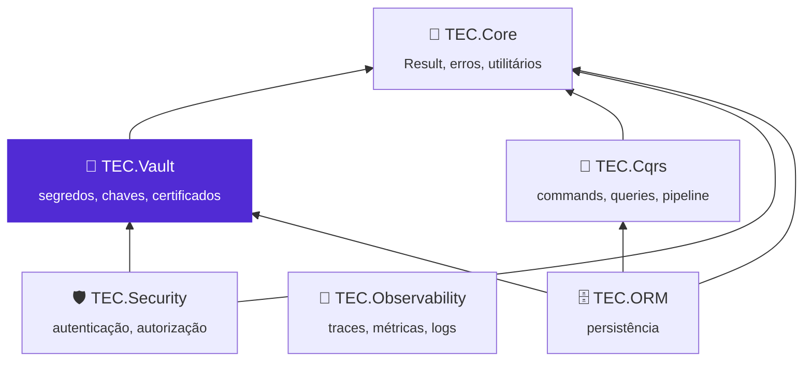
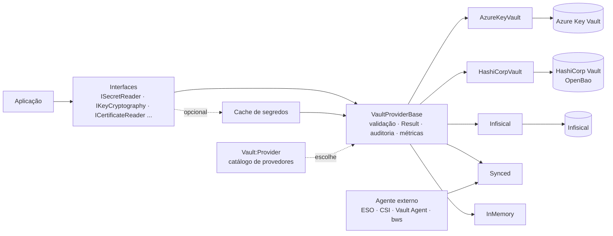

| [🔁 Resiliência](docs/resiliencia.md) | Retentativa e circuit breaker: o que abre o circuito, opções e telemetria |
<div align="center">


# 🔐 TEC.Vault

**Segredos, chaves e certificados com uma única API: troque de cofre sem mudar o código, criptografe sem expor chaves e audite cada acesso sem registrar valores.**

Azure Key Vault · HashiCorp Vault/OpenBao · Infisical · Segredos sincronizados (ESO, CSI, Vault Agent, Bitwarden) · Em memória · .NET 8 e 10 · Native AOT

[](https://github.com/tudoemcodigo/lib-tec-vault/actions/workflows/ci.yml)
[](#-compatibilidade)
[](#-compatibilidade)
[](CHANGELOG.md)
[](LICENSE)

[📥 Instalação](#-instalação) · [🚀 Início rápido](#-início-rápido) · [📚 Documentação](docs/README.md) · [📝 Changelog](CHANGELOG.md) · [⚙️ CI/CD](.github/workflows/README.md)

</div>

---

## 📑 Sumário

- [✨ Por que usar](#-por-que-usar)
- [📦 Pacotes](#-pacotes)
- [🧬 Ecossistema TEC](#-ecossistema-tec)
- [📥 Instalação](#-instalação)
- [🚀 Início rápido](#-início-rápido)
- [🧭 O que tem dentro](#-o-que-tem-dentro)
- [📚 Documentação](#-documentação)
- [⚡ Compatibilidade](#-compatibilidade)
- [🛡️ Segurança](#️-segurança)
- [🧪 Testes](#-testes)
- [🤝 Contribuição](#-contribuição)
- [🏷️ Versionamento](#️-versionamento)
- [📄 Licença](#-licença)

---

## ✨ Por que usar

| Sem o TEC.Vault | Com o TEC.Vault |
|---|---|
| Cada aplicação usa o SDK do cofre direto, com erro, retentativa e log diferentes | Uma API única (`ISecretReader`, `IKeyCryptography`, `ICertificateReader`...) com o mesmo comportamento em qualquer cofre |
| Trocar de cofre exige reescrever o acesso a segredos | Trocar de cofre é trocar o `appsettings.{Ambiente}.json` (`"Vault": { "Provider": "HashiCorpVault" }`), sem recompilar |
| Exceções do SDK chegam ao cliente com URL do cofre e identidade | Todo método retorna `Result`/`Result<T>` com códigos de `VaultErrors`; falhas de infraestrutura saem ocultas (HTTP 502) |
| Client secret no `appsettings` para abrir o cofre | Autenticação sem segredo (identidade gerenciada, federada, Kubernetes); credencial de desenvolvedor só em Development |
| Valores vazando em log por interpolação ou pelo SDK | Valores nunca em log, `ToString()` mascarado, nomes recusados só como tamanho + HMAC |
| Chave privada baixada para assinar ou cifrar | A chave fica no cofre: cifra, *wrap* e assinatura no próprio cofre; envelope para dados grandes |
| Cofre real até para rodar localmente | Provedor em memória completo (criptografia real), bloqueado fora de Development |

- ✅ **Seguro por padrão:** entrada validada antes de chamar o cofre, limites contra DoS (listagens, respostas, arquivos), auditoria de escritas e downloads de chave privada.
- ✅ **Escolha por configuração:** provedor por família (segredos, chaves, certificados), leitura estrita e compatível com AOT; erro de digitação derruba a subida, não a primeira requisição.
- ✅ **Completo:** CRUD, versões, lixeira, backup, geração e rotação de segredos, envelope, certificados (criação, importação PFX/PEM, PKI), `IConfiguration` com recarga, cache com proteção contra *stampede*, health check e telemetria.
- ✅ **Extensível:** `VaultProviderBase` e a base HTTP sem SDK, com testes de contrato prontos para um provedor novo.

## 📦 Pacotes

| Pacote | Para que serve | Quando instalar | Depende de |
|---|---|---|---|
| [`TEC.Vault`](TEC.Vault/README.md) | Interfaces, modelos, `VaultErrors`, validação, auditoria, métricas, cache, `IConfiguration`, health check, envelope, escolha por configuração e base para provedores | Vem com qualquer provedor; sozinho só para escrever um provedor ou uma biblioteca que recebe `ISecretReader` | `TEC.Core`, `Microsoft.Extensions.*` (sem SDK de nuvem) |
| [`TEC.Vault.AzureKeyVault`](TEC.Vault.AzureKeyVault/README.md) | Azure Key Vault: segredos, chaves e certificados, autenticação sem segredo | Aplicações no Azure | `TEC.Vault`, `Azure.Identity`, `Azure.Security.KeyVault.*` |
| [`TEC.Vault.HashiCorpVault`](TEC.Vault.HashiCorpVault/README.md) | HashiCorp Vault e OpenBao: KV v2 com lixeira, Transit, certificados com PKI; login Kubernetes, JWT, AppRole ou token | HashiCorp Vault/OpenBao (on-premises, Kubernetes, HCP) | `TEC.Vault` (HTTP, sem SDK) |
| [`TEC.Vault.Infisical`](TEC.Vault.Infisical/README.md) | Infisical (nuvem ou self-hosted): leitura e gravação de segredos | Aplicações que leem e gravam no Infisical pela API | `TEC.Vault` (HTTP, sem SDK) |
| [`TEC.Vault.Synced`](TEC.Vault.Synced/README.md) | Segredos já entregues por um agente: pasta montada, variáveis de ambiente, arquivo JSON/.env (só leitura) | External Secrets, CSI driver, Vault Agent, `infisical run`, `bws run` (Bitwarden) | `TEC.Vault` |
| [`TEC.Vault.InMemory`](TEC.Vault.InMemory/README.md) | Cofre em memória com o mesmo comportamento dos reais | Desenvolvimento local e testes (bloqueado fora de Development) | `TEC.Vault` |

Os seis pacotes saem sempre com a mesma versão e trazem `lib/net8.0` e `lib/net10.0`, a documentação XML em português e um README próprio.

## 🧬 Ecossistema TEC



O TEC.Vault guarda tudo o que é sensível no ecossistema e depende **só do TEC.Core**: as outras bibliotecas pedem segredos, chaves e certificados a ele em vez de lê-los da configuração.

| Componente | Relação com o TEC.Vault |
|---|---|
| 🧰 [TEC.Core](https://github.com/tudoemcodigo/lib-tec-core) | Dependência: `Result`/`Error`, `Guard`, gerador seguro de segredos, AES-GCM do envelope, HMAC, `BoundedFileReader`, `SensitiveDataMasker` |
| 🛡️ [TEC.Security](https://github.com/tudoemcodigo/lib-tec-security) | Consumidor: lê o certificado, a chave ou o segredo da aplicação por `ICertificateReader`, `IKeyCryptography` ou `ISecretReader` |
| 🗄️ [TEC.ORM](https://github.com/tudoemcodigo/lib-tec-orm) | Consumidor: lê a string de conexão do cofre por `ISecretReader` |
| 🧭 [TEC.Cqrs](https://github.com/tudoemcodigo/lib-tec-cqrs) | Independente; handlers podem injetar `ISecretReader`/`IKeyCryptography` e propagar o `Result` |
| 📡 [TEC.Observability](https://github.com/tudoemcodigo/lib-tec-observability) | Sem dependência de pacote: assina o `ActivitySource` e o `Meter` `TEC.Vault` e expõe o health check |

## 📥 Instalação

Os pacotes estão no **GitHub Packages** da organização `tudoemcodigo`, que sempre exige autenticação (mesmo para leitura). Crie um PAT *classic* com o escopo `read:packages`, registre a origem com o nome `tec-interno` e instale só os provedores que a aplicação pode usar (cada um traz o `TEC.Vault` junto):

```bash
dotnet nuget add source https://nuget.pkg.github.com/tudoemcodigo/index.json -n tec-interno -u <usuario> -p <PAT>

dotnet add package TEC.Vault.AzureKeyVault --version 0.0.1
dotnet add package TEC.Vault.HashiCorpVault --version 0.0.1
dotnet add package TEC.Vault.Infisical --version 0.0.1
dotnet add package TEC.Vault.Synced --version 0.0.1
dotnet add package TEC.Vault.InMemory --version 0.0.1
```

> [!IMPORTANT]
> Versão atual: **0.0.1** (ainda não publicada). Para evitar *dependency confusion*, mapeie `TEC.*` só para a origem `tec-interno` no `nuget.config` da aplicação (`packageSourceMapping`).

## 🚀 Início rápido

**1. Escolha o cofre de cada ambiente** no `appsettings` (endereço não é segredo; nenhum segredo vai aqui):

```json
// appsettings.Development.json: cofre em memória, sem infraestrutura
{ "Vault": { "Provider": "InMemory", "InMemory": { "InitialSecrets": { "parceiro-api-token": "token-local" } } } }
```

```json
// appsettings.Production.json: Azure Key Vault com identidade gerenciada
{ "Vault": { "Provider": "AzureKeyVault", "AzureKeyVault": { "VaultUri": "https://<nome-do-cofre>.vault.azure.net/" } } }
```

**2. Registre o cofre e o health check**, declarando os provedores **disponíveis**:

```csharp
using TEC.Vault.AzureKeyVault;
using TEC.Vault.DependencyInjection;
using TEC.Vault.HealthChecks;
using TEC.Vault.InMemory;

var builder = WebApplication.CreateBuilder(args);

builder.Services.AddTecVault(builder.Configuration.GetSection("Vault"), providers => providers
    .AddInMemory()          // escolhido em Development
    .AddAzureKeyVault());   // escolhido em produção

builder.Services.AddHealthChecks().AddTecVault();   // tags "ready" e "vault"

var app = builder.Build();
app.MapHealthChecks("/health/ready");
app.Run();
```

**3. Injete só a interface de que precisa** e trate o `Result`:

```csharp
using TEC.Core.Common.Results;
using TEC.Vault.Abstractions;

public sealed class PartnerClient(ISecretReader vault)   // só lê: injete o leitor
{
    public async Task<Result> CallAsync(CancellationToken cancellationToken)
    {
        var token = await vault.GetSecretAsync("parceiro-api-token", cancellationToken: cancellationToken);
        if (token.IsFailure)
            return token.ToFailure();   // NotFound, ExternalService... já padronizados

        // use token.Value.Value; nunca registre em log (ToString() já mascara)
        return Result.Success();
    }
}
```

Provedor desconhecido, chave digitada errado ou endereço inválido derrubam a **subida** com `InvalidOperationException` (citando o caminho da chave). Registro em código (`AddTecVault(vault => vault.UseAzureKeyVault(...))`), outros provedores e todas as opções: [📚 documentação](docs/README.md).

## 🧭 O que tem dentro



| Família | Leitura | Gestão | Extras | Opcionais |
|---|---|---|---|---|
| 🔑 Segredos | `ISecretReader` | `ISecretStore` | `GenerateSecretAsync`, `RotateSecretAsync` | `ISecretRecycleBin`, `ISecretBackup` |
| 🔐 Chaves | `IKeyReader` | `IKeyStore` | `IKeyCryptography`, `EncryptEnvelopeAsync` | `IKeyRecycleBin`, `IKeyBackup` |
| 📜 Certificados | `ICertificateReader` | `ICertificateStore` | Importação PFX/PEM, emissão por PKI | `ICertificateRecycleBin`, `ICertificateBackup` |
| 💓 Saúde | `IVaultHealthProbe` | — | `AddHealthChecks().AddTecVault()` | — |

| Provedor | Segredos | Chaves | Certificados | Lixeira | Backup |
|---|:---:|:---:|:---:|:---:|:---:|
| Azure Key Vault | ✅ | ✅ | ✅ | ✅ | ✅ |
| HashiCorp Vault / OpenBao | ✅ KV v2 | ✅ Transit | ✅ KV + PKI | ✅ | — |
| Infisical | ✅ | — | — | — | — |
| Synced (Directory, EnvironmentVariables, SecretsFile) | ✅ só leitura | — | — | — | — |
| Em memória | ✅ | ✅ | ✅ | ✅ | ✅ |

`AddTecVault` registra cada interface que o provedor implementa apontando para a mesma instância (singleton, thread-safe); pedir uma interface que o provedor não oferece falha na resolução do DI, não em tempo de execução.

## 📚 Documentação

| Arquivo | O que responde |
|---|---|
| [🔑 Segredos](docs/segredos.md) | Como ler, gravar, versionar, gerar, rotacionar, recuperar e fazer backup de segredos |
| [🔐 Chaves](docs/chaves.md) | Como criar e rotacionar chaves, cifrar, assinar e usar criptografia envelope |
| [📜 Certificados](docs/certificados.md) | Como criar, importar (PFX/PEM), baixar e gerenciar certificados |
| [🧩 Injeção de dependências](docs/injecao-de-dependencias.md) | O que `AddTecVault` registra, `VaultBuilder`, `VaultStores` |
| [⚙️ Escolha do cofre pela configuração](docs/configuracao-por-appsettings.md) | Como escolher o provedor por ambiente no `appsettings` e todas as chaves `Vault:*` |
| [🧾 Segredos no IConfiguration](docs/configuracao.md) | Como carregar segredos como configuração, com recarga incremental |
| [💾 Cache e health check](docs/cache-e-health-check.md) | Como ligar o cache de segredos e o health check |
| [🌐 Azure Key Vault](docs/provedor-azure-key-vault.md) | Opções, autenticação, RBAC e limites do provedor Azure |
| [🏛️ HashiCorp Vault](docs/provedor-hashicorp-vault.md) | KV v2, Transit, PKI, login, política de menor privilégio, OpenBao |
| [🟣 Infisical](docs/provedor-infisical.md) | Universal Auth, Kubernetes Auth, versões, tags e permissões |
| [📂 Synced](docs/provedor-synced.md) | Pasta, variáveis e arquivo entregues por agentes, com receitas (ESO, CSI, Vault Agent, `bws run`) |
| [🧠 Em memória](docs/provedor-em-memoria.md) | Cofre local para desenvolvimento e testes, e a trava de ambiente |
| [🧱 Novo provedor](docs/novo-provedor.md) | Como escrever um provedor (`VaultProviderBase`, base HTTP, catálogo, testes de contrato) |
| [📈 Observabilidade](docs/observabilidade.md) | Spans, métricas e eventos de log |
| [❌ Erros](docs/erros.md) | Códigos de `VaultErrors`, HTTP, conversão por provedor e exceções de configuração |
| [🛡️ Segurança](docs/seguranca.md) | Modelo de ameaças, controles, limites, riscos residuais e checklist |
| [🧪 Testes](docs/testes.md) | Categorias, como rodar local, integração e carga, variáveis `TEC_TESTES_*`/`TEC_CARGA_*` |
| [💻 Desenvolvimento local](docs/desenvolvimento.md) | Como compilar (feed `tec-interno` por padrão, repositórios vizinhos sob demanda) e regenerar lock files |
| [🧰 Samples](samples/README.md) | Escolha do cofre por ambiente e gerador de carga |
| [⚙️ CI/CD](.github/workflows/README.md) | Workflows, gatilhos, Variables e como publicar |

## ⚡ Compatibilidade

| Item | Suporte |
|---|---|
| .NET | `net8.0` e `net10.0` (LTS), mesma API pública nos dois alvos |
| Native AOT / trimming | ✅ `IsAotCompatible` em todos os pacotes; sem binding nem JSON por reflexão (configuração lida com `VaultSettings`, JSON com *source generator*/`Utf8JsonWriter`) ¹ |
| Sem ICU (`InvariantGlobalization`) | ✅ testado no CI |
| HTTP | Provedores sem SDK usam `VaultHttpClient` com `SocketsHttpHandler` de vida longa e renovação de conexões (sem `IHttpClientFactory`) |
| Cofres testados de verdade | HashiCorp Vault em container (KV v2, Transit, PKI) a cada PR; Key Vault de testes na `main` |
| Sistemas | Windows, Linux e macOS; Kubernetes (service account, volumes montados) |

¹ O `Azure.Core` gera avisos de trimming só no decodificador de PKCS#8 EC, usado por credenciais com certificado EC em PEM; `ManagedIdentity`, `WorkloadIdentity` e `Developer` não passam por ele.

## 🛡️ Segurança

Zero Trust: nome, versão, tags e respostas do cofre são tratados como não confiáveis. Endereços HTTPS validados (o token nunca vai a outro servidor), autenticação sem segredo, entrada validada antes da chamada, listagens limitadas (`MaxListItems`, padrão 10.000), respostas e arquivos de credencial com teto, valores nunca em log e erros de infraestrutura ocultos do cliente.

> [!CAUTION]
> Conceda à identidade da aplicação só o papel mínimo (ex.: *Key Vault Secrets User* para apenas ler) e ative proteção contra *purge* no cofre de produção. Modelo de ameaças, permissões por provedor e checklist: [docs/seguranca.md](docs/seguranca.md). Vulnerabilidades: não abra *issue* pública; escreva para [roberto@roberto.inf.br](mailto:roberto@roberto.inf.br).

## 🧪 Testes

```bash
dotnet test --project TEC.Vault.Tests -c Release                         # unitários + integração (pula sem ambiente)
dotnet test --project TEC.Vault.LoadTests -c Release --treenode-filter "/*/*/*/*[Category=Carga-CI]"   # carga rápida
```

Para a integração com HashiCorp Vault, suba um container descartável na porta **18200** e prepare-o com `.github/scripts/vault-dev.sh` (passo a passo em [docs/testes.md](docs/testes.md)).

595 testes unitários por TFM em `TEC.Vault.Tests` (TUnit, com testes de contrato, fuzzing e vazamento sob carga), 37 de integração (`[Category=Integracao]`: HashiCorp Vault real em container e Key Vault de testes, pulados com motivo sem ambiente), 7 de carga rápida (`Carga-CI`) e 13 pesados (`Carga-Pesada`), estes de carga só sob demanda no `performance.yml` (manual: tempo em runner compartilhado é ruidoso e não bloqueia PR nem versão). Detalhes em [docs/testes.md](docs/testes.md).

## 🤝 Contribuição

Branch a partir da `main` → código **e** testes (inclusive entradas inválidas) → `dotnet test` nos dois alvos → CHANGELOG e `docs/` atualizados → pull request com o check `ci / ci-ok` verde. Como compilar (credencial do feed `tec-interno`, modo local com `-p:TecUseLocalProjects=true`): [docs/desenvolvimento.md](docs/desenvolvimento.md).

## 🏷️ Versionamento

[SemVer](https://semver.org/lang/pt-BR/), uma versão para os seis pacotes (`Directory.Build.props`). Enquanto for `0.x`, mudanças incompatíveis podem ocorrer em versões MINOR; um membro novo em interface conta como incompatível (quebra provedores de terceiros). Cada merge na `main` publica a prévia `<Version>-preview.N`; versões estáveis e `-rc.N` saem só pelo workflow **Publicar versão** ([CI/CD](.github/workflows/README.md)).

## 📄 Licença

[MIT](LICENSE) · Criado e mantido por **Roberto Oliveira**, equipe **Tudo em Código** · [github.com/tudoemcodigo](https://github.com/tudoemcodigo)
