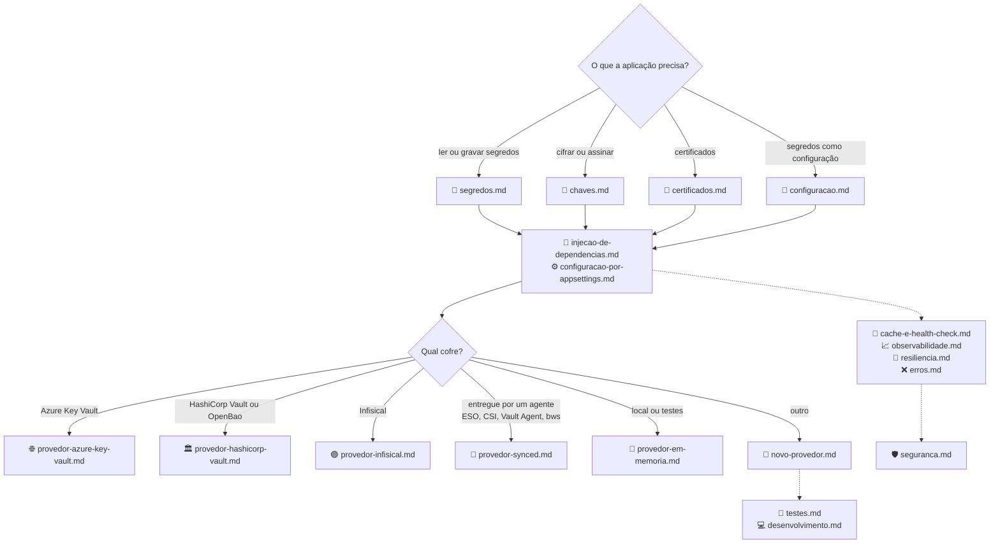

| 15 | [🔁 Resiliência](resiliencia.md) | Retentativa e circuit breaker: quando o circuito abre, opções e sinais de telemetria |
[🏠 TEC.Vault](../README.md) › 📚 Documentação

# 📚 Documentação do TEC.Vault

> Referência completa dos seis pacotes (`TEC.Vault`, `TEC.Vault.AzureKeyVault`, `TEC.Vault.HashiCorpVault`, `TEC.Vault.Infisical`, `TEC.Vault.Synced` e `TEC.Vault.InMemory`): como usar, opções, erros e cuidados de segurança, conferidos com o código.

## 📑 Sumário

- [🗂️ Temas](#️-temas)
- [🗺️ Mapa dos temas](#️-mapa-dos-temas)
- [📐 Convenções desta documentação](#-convenções-desta-documentação)

---

## 🗂️ Temas

| # | Tema | O que responde |
|:-:|---|---|
| 1 | [🔑 Segredos](segredos.md) | Como ler, gravar, versionar, gerar, rotacionar, recuperar da lixeira e fazer backup de segredos (`ISecretReader`, `ISecretStore`, `SecretStoreExtensions`) |
| 2 | [🔐 Chaves](chaves.md) | Como criar e rotacionar chaves, cifrar, fazer *wrap*, assinar e usar criptografia envelope (`IKeyStore`, `IKeyCryptography`, `KeyCryptographyExtensions`) |
| 3 | [📜 Certificados](certificados.md) | Como criar, importar (PFX/PEM), baixar e gerenciar certificados (`ICertificateReader`, `ICertificateStore`) |
| 4 | [🧩 Injeção de dependências](injecao-de-dependencias.md) | O que `AddTecVault` registra, `VaultBuilder`, `VaultStores` e por que chamar duas vezes falha |
| 5 | [⚙️ Escolha do cofre pela configuração](configuracao-por-appsettings.md) | Como escolher o provedor por ambiente e por família no `appsettings`; todas as chaves `Vault:*` |
| 6 | [🧾 Segredos no IConfiguration](configuracao.md) | Como carregar segredos como configuração, com prefixo e recarga incremental |
| 7 | [💾 Cache e health check](cache-e-health-check.md) | Como ligar o cache de segredos (consistência, *stampede*) e o health check |
| 8 | [🌐 Provedor Azure Key Vault](provedor-azure-key-vault.md) | Opções, autenticação sem segredo, RBAC, limites e conversão de erros do Azure |
| 9 | [🏛️ Provedor HashiCorp Vault](provedor-hashicorp-vault.md) | KV v2, Transit, PKI, métodos de login, política de menor privilégio, OpenBao, desenvolvimento local |
| 10 | [🟣 Provedor Infisical](provedor-infisical.md) | Universal Auth, Kubernetes Auth, versões, tags, aprovação e permissões |
| 11 | [📂 Provedor Synced](provedor-synced.md) | Pasta, variáveis e arquivo JSON/.env entregues por agentes, com receitas (ESO, CSI, Vault Agent, `infisical run`, `bws run`) |
| 12 | [🧠 Provedor em memória](provedor-em-memoria.md) | Cofre local para desenvolvimento e testes, diferenças de um cofre real e trava de ambiente |
| 13 | [🧱 Novo provedor](novo-provedor.md) | Como escrever um provedor: `VaultProviderBase`, regras comuns, base HTTP, catálogo de configuração, testes de contrato |
| 14 | [📈 Observabilidade](observabilidade.md) | Spans, métricas e eventos de log (nunca com valores nem nomes de item nas métricas) |
| 16 | [❌ Erros](erros.md) | Códigos de `VaultErrors`, tipo e HTTP, conversão por provedor e exceções de configuração |
| 17 | [🛡️ Segurança](seguranca.md) | Modelo de ameaças, controles, limites contra DoS, riscos residuais e checklist do cofre |
| 18 | [🧪 Testes](testes.md) | Categorias, como rodar local, integração (HashiCorp e Key Vault), carga e variáveis `TEC_TESTES_*`/`TEC_CARGA_*` |
| 19 | [💻 Desenvolvimento local](desenvolvimento.md) | Como compilar (feed `tec-interno` por padrão, repositórios vizinhos sob demanda), lock files e o HashiCorp Vault local |

Fora de `docs/`: [🧰 Samples](../samples/README.md) · [⚙️ CI/CD](../.github/workflows/README.md) · [📝 Changelog](../CHANGELOG.md) · READMEs dos pacotes ([TEC.Vault](../TEC.Vault/README.md), [AzureKeyVault](../TEC.Vault.AzureKeyVault/README.md), [HashiCorpVault](../TEC.Vault.HashiCorpVault/README.md), [Infisical](../TEC.Vault.Infisical/README.md), [Synced](../TEC.Vault.Synced/README.md), [InMemory](../TEC.Vault.InMemory/README.md)).

---

## 🗺️ Mapa dos temas

---

## 📐 Convenções desta documentação

| Convenção | Significado |
|---|---|
| Fonte da verdade | O código atual: nomes, assinaturas, padrões e mensagens foram conferidos nele |
| Estrutura | Cada tema tem breadcrumb, 📑 Sumário, 🎯 Visão geral, 🚀 Uso, ⚙️ Opções, ❌ Erros, 🛡️ Segurança, ❓ Perguntas frequentes e rodapé de navegação |
| `Result` | Todo método assíncrono retorna `Result`/`Result<T>` do [TEC.Core](https://github.com/tudoemcodigo/lib-tec-core); só o cancelamento pedido pelo chamador lança `OperationCanceledException` |
| Erros | Os códigos citados são os de [`VaultErrors`](erros.md) |
| Configuração inválida | Falha na **subida** com `InvalidOperationException`, citando o caminho da chave (ex.: `Vault:HashiCorpVault:MaxListItems`) |
| Placeholders | Valores entre `< >` (`<nome-do-cofre>`, `<tenant-id>`, `<client-id>`) são do seu ambiente; nenhum recurso real é citado |
| `CancellationToken` | Omitido das tabelas quando é o último parâmetro opcional |
| Alertas | `[!NOTE]` comportamento · `[!TIP]` boa prática · `[!IMPORTANT]` requisito · `[!WARNING]` armadilha · `[!CAUTION]` risco de segurança ou perda de dados |

---
[🏠 README](../README.md) · [🔑 Segredos](segredos.md) ➡️
