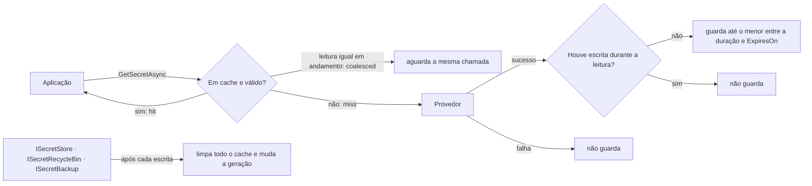
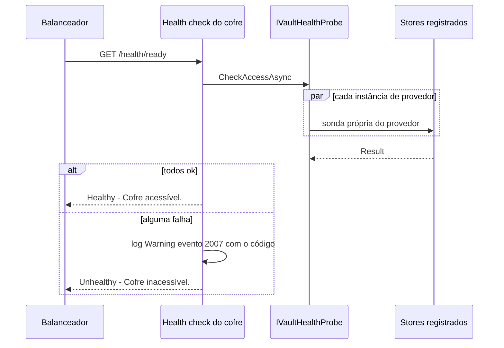

[🏠 TEC.Vault](../README.md) › [📚 Documentação](README.md) › 💾 Cache e health check

# 💾 Cache e health check

> Dois recursos operacionais: o cache opcional das leituras de segredos (menos latência e menos risco de limite de requisições) e a verificação de saúde do cofre (readiness), que confirma acesso sem ler valores.

## 📑 Sumário

- [🎯 Visão geral](#-visão-geral)
- [🚀 Uso](#-uso)
- [📘 Referência da API](#-referência-da-api)
- [⚙️ Opções](#️-opções)
- [❌ Erros](#-erros)
- [🛡️ Segurança](#️-segurança)
- [❓ Perguntas frequentes](#-perguntas-frequentes)

---

## 🎯 Visão geral

### Cache de segredos

Cache em memória de `ISecretReader.GetSecretAsync`, que funciona com qualquer provedor. **Desligado por padrão.**



| Aspecto | Comportamento |
|---|---|
| Isolamento | Instância privada de `MemoryCache` (não usa o `IMemoryCache` da aplicação), até **1.024** entradas |
| O que é guardado | Só leituras bem-sucedidas de `GetSecretAsync`, por nome + versão; nunca além de `ExpiresOn` do segredo. `ExistsAsync` e listagens não usam cache |
| Consistência | Um contador de geração muda a cada escrita: uma leitura em andamento quando a escrita terminou não grava no cache (o valor antigo nunca volta) |
| *Stampede* | Leituras simultâneas da mesma chave compartilham **uma** chamada ao cofre (`coalesced`) |
| Cancelamento | O cancelamento de um chamador não cancela os demais; a chamada compartilhada termina sozinha, limitada pelos timeouts do provedor |
| Falhas | Não são guardadas: a próxima leitura consulta o cofre de novo |
| Expiração | Um valor expirado nunca é servido; sai da memória no próximo acesso (varredura no máximo a cada minuto, ou a cada duração se menor, mínimo 1 s) |
| Encerramento | Com o container descartado, leituras em andamento terminam sem guardar; as seguintes vão direto ao provedor |
| Métrica | `vault.cache.requests` com `vault.cache.result` = `hit`, `miss` ou `coalesced` ([📈 Observabilidade](observabilidade.md)) |

Registro resultante com o cache ligado:

| Serviço | Implementação |
|---|---|
| `ISecretReader` | Cache (decorator do provedor) |
| `ISecretStore`, `ISecretRecycleBin`, `ISecretBackup` | Decorators que delegam ao provedor e **limpam o cache após cada escrita** (gravar, alterar, excluir, recuperar, purgar, restaurar), inclusive em falha |
| Classe concreta (ex.: `AzureKeyVaultSecretStore`) | Continua registrada e fala direto com o cofre, **sem** cache e **sem** limpar o cache |

### Health check

O check confirma que cada store registrado responde e que a identidade da aplicação tem permissão, **sem ler valores**. A resposta nunca traz o motivo da falha (endpoints de health costumam ser públicos); ele vai só para o log.



A sonda registrada pelo `AddTecVault` verifica **cada instância** de provedor registrada (uma vez, mesmo que atenda várias famílias), em paralelo, e só é saudável se todas responderem. Cada store usa a própria sonda (`IVaultHealthProbe`), que só toca metadados:

| Provedor | Verificação |
|---|---|
| Azure Key Vault | Uma página de um item de metadados (`secret.health`, `key.health`, `certificate.health`) |
| HashiCorp Vault | Listagem de nomes no KV (segredos e certificados) e de chaves no Transit |
| Infisical · Synced | Listagem de segredos (metadados) |
| Em memória | Sempre saudável |
| Provedor próprio sem sonda | Listagem de metadados (`ListSecretsAsync`, `ListKeysAsync`, `ListCertificatesAsync`) |
| Só `IKeyCryptography`, sem sonda | Não é verificado (não há operação barata e sem efeito). Se nenhum store for verificável, a sonda responde saudável e registra um aviso (evento 2010, `Warning`) na primeira verificação |

---

## 🚀 Uso

### Ligar o cache

```csharp
using TEC.Vault.AzureKeyVault;
using TEC.Vault.DependencyInjection;

builder.Services.AddTecVault(vault => vault
    .UseAzureKeyVault(o =>
    {
        o.VaultUri = new Uri("https://<nome-do-cofre>.vault.azure.net/");
        o.Stores = VaultStores.Secrets;
    })
    .EnableSecretCache(TimeSpan.FromMinutes(5)));
```

Pela configuração: `"Vault": { "Cache": { "Duration": "00:05:00" } }` ([⚙️ Escolha do cofre pela configuração](configuracao-por-appsettings.md)).

```csharp
using TEC.Vault.Abstractions;

public sealed class ApiKeyRotation(ISecretReader reader, ISecretStore writer)
{
    public async Task RunAsync(CancellationToken ct)
    {
        var a = await reader.GetSecretAsync("api-key", cancellationToken: ct);                // miss: vai ao cofre
        var b = await reader.GetSecretAsync("api-key", cancellationToken: ct);                // hit
        await writer.SetSecretAsync("api-key", "novo-valor", cancellationToken: ct);          // limpa o cache
        var c = await reader.GetSecretAsync("api-key", cancellationToken: ct);                // miss: valor novo
    }
}
```

### Adicionar o health check

```csharp
using Microsoft.Extensions.Diagnostics.HealthChecks;
using TEC.Vault.HealthChecks;

// ASP.NET Core puro: nome "vault", tags "ready" e "vault", 10 s
builder.Services.AddHealthChecks().AddTecVault();

var app = builder.Build();
app.MapHealthChecks("/health/ready", new() { Predicate = r => r.Tags.Contains(VaultHealthChecksBuilderExtensions.ReadyTag) });
```

Com o [TEC.Observability](https://github.com/tudoemcodigo/lib-tec-observability), o check entra no `/health/ready` sem configuração (e nunca no liveness):

```csharp
builder.Services.AddTecObservability(builder.Configuration)
    .HealthChecks.AddTecVault();
```

Com opções próprias:

```csharp
builder.Services.AddHealthChecks().AddTecVault(
    name: "cofre-segredos",
    failureStatus: HealthStatus.Degraded,
    tags: [VaultHealthChecksBuilderExtensions.ReadyTag, VaultHealthChecksBuilderExtensions.VaultTag, "critico"],
    timeout: TimeSpan.FromSeconds(5));
```

Uma sonda própria registrada **antes** do `AddTecVault` é mantida:

```csharp
builder.Services.AddSingleton<IVaultHealthProbe, MyProbe>();
builder.Services.AddTecVault(vault => vault.UseAzureKeyVault(o => o.VaultUri = new Uri("https://<nome-do-cofre>.vault.azure.net/")));
```

---

## 📘 Referência da API

### `VaultBuilder.EnableSecretCache`

> `TEC.Vault.DependencyInjection` · pacote `TEC.Vault`

| Membro | Retorno | Descrição |
|---|---|---|
| `EnableSecretCache(TimeSpan duration)` | `VaultBuilder` | Liga o cache; `duration` maior que zero e no máximo 1 hora (recomendado até 5 minutos) |

### `IVaultHealthProbe`

> `TEC.Vault.Abstractions` · `interface` · pacote `TEC.Vault`

| Membro | Retorno | Descrição |
|---|---|---|
| `CheckAccessAsync(CancellationToken cancellationToken = default)` | `Task<Result>` | Verifica se o cofre responde e se a identidade está autorizada, sem ler valores |

Implementada pelos stores de todos os provedores do TEC.Vault e pela sonda composta que o `AddTecVault` registra.

### `VaultHealthChecksBuilderExtensions`

> `TEC.Vault.HealthChecks` · `static class` · pacote `TEC.Vault`

| Membro | Retorno | Descrição |
|---|---|---|
| `AddTecVault(this IHealthChecksBuilder builder, string name = "vault", HealthStatus? failureStatus = null, IEnumerable<string>? tags = null, TimeSpan? timeout = null)` | `IHealthChecksBuilder` | Adiciona o check do cofre (exige `AddTecVault` nos serviços ou um `IVaultHealthProbe` próprio) |
| `ReadyTag` *(const)* | `string` | `"ready"`: a tag de readiness do TEC.Observability |
| `VaultTag` *(const)* | `string` | `"vault"`: tipo de dependência (como `database`, `sso`, `external`) |

---

## ⚙️ Opções

### Cache

| Opção | Padrão | Descrição |
|---|---|---|
| `EnableSecretCache(duration)` / `Vault:Cache:Duration` | desligado | Maior que zero, no máximo 1 hora; recomendado até 5 minutos |
| Entradas | 1.024 (fixo) | Limite da instância privada de cache |

### Health check

| Parâmetro | Padrão | Descrição |
|---|---|---|
| `name` | `"vault"` | Nome da verificação |
| `failureStatus` | `HealthStatus.Unhealthy` | Status em falha |
| `tags` | `["ready", "vault"]` | Informar substitui as duas (passe `[]` para nenhuma) |
| `timeout` | 10 segundos | Tempo máximo da verificação |
| `Stores` do provedor | `All` | Define **o que** é verificado: registre só o que a aplicação usa |

---

## ❌ Erros

| Exceção / código | Quando | O que fazer |
|---|---|---|
| `ArgumentOutOfRangeException` | `EnableSecretCache` com duração ≤ 0 ou > 1 hora | Use até 1 hora (recomendado até 5 minutos) |
| `InvalidOperationException` | `Configuração inválida em Vault:Cache:Duration: ...` | Corrija o valor na configuração |
| Códigos de `VaultErrors` | O cache só repassa os erros do provedor | Veja [❌ Erros](erros.md) |
| Health `Unhealthy` com `"Cofre inacessível."` | Algum store falhou; o código vai para o log (evento 2007), tipicamente `VAULT_ACESSO_NEGADO`, `VAULT_AUTENTICACAO_FALHOU` ou `VAULT_INDISPONIVEL` | Conceda a permissão de listagem que falta, confira a rede ou reduza `Stores` |

O health check nunca lança: a falha vira o `failureStatus` com a descrição fixa `"Cofre inacessível."`.

---

## 🛡️ Segurança

> [!IMPORTANT]
> Com o cache ligado, **grave sempre pelas interfaces** (`ISecretStore`, `ISecretRecycleBin`, `ISecretBackup`). Uma escrita pela classe concreta do provedor, ou por outra instância da aplicação, só é vista depois que o cache expira.

> [!WARNING]
> Leituras servidas do cache **não passam pela auditoria do cofre nem pela revogação de acesso** até expirarem. Mantenha a duração curta para segredos sensíveis.

- O cache guarda valores em memória do processo; ele nunca vai para disco, log ou métrica (a métrica só conta `hit`/`miss`/`coalesced`).
- A resposta do health check nunca traz o motivo da falha nem nomes de itens: endpoints de health costumam ser públicos.

> [!TIP]
> Registre só os stores que a aplicação usa (`Stores` do provedor). Com `Stores = VaultStores.Keys`, a identidade só precisa listar chaves para ficar saudável. Cofre fora do ar tira a instância do balanceamento (readiness), sem reiniciá-la.

---

## ❓ Perguntas frequentes

<details>
<summary>Gravei um segredo e a leitura continua devolvendo o valor antigo.</summary>

O cache está ligado e a escrita foi feita pela classe concreta do provedor (ou por outra instância da aplicação). Grave sempre por `ISecretStore`/`ISecretRecycleBin`/`ISecretBackup`; para outras instâncias, use uma duração curta.

</details>

<details>
<summary>Health check <code>Unhealthy</code> com a aplicação funcionando.</summary>

A sonda verifica **todos** os stores registrados; com `Stores = All` (padrão), a identidade precisa listar segredos, chaves **e** certificados. Registre só o que usa (`o.Stores = VaultStores.Secrets`) ou conceda a permissão que falta. O motivo está no log (evento 2007).

</details>

<details>
<summary>O health check lê o valor de algum segredo?</summary>

Não. Ele só lista metadados (ou lê uma página de um item, no Azure Key Vault).

</details>

<details>
<summary>O cache vale para chaves e certificados?</summary>

Não: só para `ISecretReader.GetSecretAsync`. Operações de chave (cifrar, assinar) são sempre feitas no cofre.

</details>

<details>
<summary>Coloco o health do cofre no liveness?</summary>

Não. Cofre fora do ar não se resolve reiniciando a aplicação: use readiness (tag `ready`), que tira a instância do balanceamento até o cofre voltar.

</details>

---
⬅️ [🧾 Segredos no IConfiguration](configuracao.md) · [📚 Índice](README.md) · [🌐 Provedor Azure Key Vault](provedor-azure-key-vault.md) ➡️
