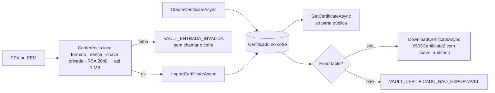

[🏠 TEC.Vault](../README.md) › [📚 Documentação](README.md) › 📜 Certificados

# 📜 Certificados

> Cria certificados X.509 (autoassinados ou por um emissor do cofre), importa PFX/PEM conferidos localmente, lê a parte pública e controla o download da chave privada.

## 📑 Sumário

- [🎯 Visão geral](#-visão-geral)
- [🚀 Uso](#-uso)
  - [Criar](#criar)
  - [Importar PFX ou PEM](#importar-pfx-ou-pem)
  - [Ler e baixar](#ler-e-baixar)
  - [Alterar, excluir, lixeira e backup](#alterar-excluir-lixeira-e-backup)
- [📘 Referência da API](#-referência-da-api)
- [⚙️ Opções](#️-opções)
- [❌ Erros](#-erros)
- [🛡️ Segurança](#️-segurança)
- [❓ Perguntas frequentes](#-perguntas-frequentes)

---

## 🎯 Visão geral

| Preciso de... | Injete | Papel típico no Azure |
|---|---|---|
| Parte pública, metadados, listagem | `ICertificateReader` | Key Vault Certificate User |
| Download com chave privada | `ICertificateReader` | Certificate User **+** Secrets User |
| Criar, importar, alterar, excluir | `ICertificateStore` | Key Vault Certificates Officer |
| Lixeira / backup | `ICertificateRecycleBin` / `ICertificateBackup` | Key Vault Certificates Officer |



**O que cada provedor oferece:**

| Provedor | `ICertificateStore` | `ICertificateRecycleBin` | `ICertificateBackup` | Emissão por CA (`Issuer`) | Renovação automática | HSM |
|---|:-:|:-:|:-:|---|:-:|:-:|
| [Azure Key Vault](provedor-azure-key-vault.md) | ✅ | ✅ | ✅ | Emissor configurado no cofre (`null` = autoassinado) | ✅ | ✅ |
| [HashiCorp Vault](provedor-hashicorp-vault.md) (KV + PKI) | ✅ | ✅ | — | PKI a partir de CSR (`null` = emissor padrão do mount; `"Self"` = autoassinado) | — | — |
| [Em memória](provedor-em-memoria.md) | ✅ | ✅ | ✅ | — (só autoassinado) | — | — |

Infisical e Synced só oferecem segredos.

---

## 🚀 Uso

Os exemplos supõem `using TEC.Vault.Abstractions; using TEC.Vault.Certificates; using TEC.Vault.Keys; using TEC.Core.Common.Results;`.

### Criar

```csharp
// Autoassinado (Issuer = null no Azure e na memória) com SAN e renovação automática
await certificados.CreateCertificateAsync("api-interna", new CreateCertificateOptions
{
    Subject = "CN=api.interna",
    DnsNames = ["api.interna", "api.interna.local"],
    ValidityInMonths = 12,
    KeyType = VaultKeyType.Rsa, KeySize = 3072,
    AutoRenewDaysBeforeExpiry = 30   // Exportable = false por padrão
}, ct);

// Emitido por uma autoridade configurada no cofre (nome do emissor no provedor)
await certificados.CreateCertificateAsync("portal", new CreateCertificateOptions
{
    Subject = "CN=portal.minhaempresa.com.br",
    DnsNames = ["portal.minhaempresa.com.br"],
    Issuer = "<nome-do-emissor>"
}, ct);
```

> [!NOTE]
> A criação **aguarda a emissão**. No Azure, emissão que passa de `OperationTimeout` (padrão 5 min) retorna `VAULT_INDISPONIVEL`. No HashiCorp Vault o par de chaves é gerado no processo e só o CSR vai ao PKI; veja [Provedor HashiCorp Vault](provedor-hashicorp-vault.md).

### Importar PFX ou PEM

O formato é detectado sozinho e o conteúdo é conferido **localmente** por `VaultCertificateRules` (comum a todos os provedores) antes de qualquer chamada ao cofre: tamanho (até 1 MB), formato, senha, chave privada presente e casando com o certificado, RSA de pelo menos 2048 bits.

```csharp
// PFX com senha
await certificados.ImportCertificateAsync("parceiro-mtls", pfx, new ImportCertificateOptions { Password = senhaPfx }, ct);

// PEM (certificado + chave no mesmo arquivo), detectado sozinho
await certificados.ImportCertificateAsync("parceiro-pem", await File.ReadAllBytesAsync("cert-e-chave.pem", ct), cancellationToken: ct);

// PEM com chave criptografada (ENCRYPTED PRIVATE KEY)
await certificados.ImportCertificateAsync("parceiro-pem-cifrado", pem,
    new ImportCertificateOptions { Password = senhaDaChave }, ct);
```

| Formato | Conteúdo | `Password` |
|---|---|---|
| **PKCS#12 (PFX)** | Binário DER (começa com `0x30`) | A do PFX, se houver |
| **PEM** | No mesmo arquivo: `CERTIFICATE` (+ cadeia) e a chave em `PRIVATE KEY` (PKCS#8), `RSA PRIVATE KEY` (PKCS#1) ou `EC PRIVATE KEY` (SEC1) | `null` |
| **PEM com chave criptografada** | `CERTIFICATE` + `ENCRYPTED PRIVATE KEY` (PKCS#8 criptografada) | A da chave |

- O PEM é reconhecido em qualquer posição: saída do `openssl pkcs12 -nodes` (linhas `Bag Attributes`, `subject=` antes dos blocos) e arquivos com BOM UTF-8 funcionam. Só os blocos PEM reconhecidos vão ao cofre.
- Os buffers criados pela biblioteca (texto decodificado, PEM normalizado, PKCS#12 temporário) são zerados após o uso; o array do chamador nunca é alterado — zere você mesmo depois de importar.
- No .NET 9+ o PFX é carregado com `X509CertificateLoader` (limites padrão contra PFX malicioso); no .NET 8, com o construtor de `X509Certificate2` só depois de conferir o tipo do conteúdo (`VaultCertificateLoader`).

```bash
# Gerar um PEM aceito a partir de um PFX
openssl pkcs12 -in certificado.pfx -nodes -out certificado-e-chave.pem
```

> [!WARNING]
> **PEM com chave criptografada custa CPU.** A chave é decifrada com o número de iterações PBKDF2 que o **próprio conteúdo** declara, e o .NET não limita esse número (diferente do PKCS#12 no `X509CertificateLoader`). A única defesa da biblioteca é o limite de 1 MB (`VaultCertificateRules.MaxCertificateBytes`). **Não exponha a importação a entradas não confiáveis sem limitar a taxa de chamadas.** Detalhes em [Segurança](seguranca.md).

### Ler e baixar

```csharp
// Parte pública: validade e thumbprint
var cert = await certificados.GetCertificateAsync("api-interna", cancellationToken: ct);
using (var x509 = cert.Value.ToX509Certificate())
    Console.WriteLine($"{x509.Subject} expira em {x509.NotAfter:d} ({cert.Value.Properties.Thumbprint})");

// Download com a chave privada (só certificado exportável; auditado como escrita)
var baixado = await certificados.DownloadCertificateAsync("parceiro-mtls", cancellationToken: ct);
if (baixado.IsSuccess)
{
    using var certificado = baixado.Value;   // o chamador descarta
    using var handler = new HttpClientHandler();
    handler.ClientCertificates.Add(certificado);
    // ...
}
```

<details>
<summary>📄 Exemplo completo: certificado de parceiro para mTLS</summary>

```csharp
using System.Security.Cryptography;
using System.Security.Cryptography.X509Certificates;
using TEC.Vault.Abstractions;
using TEC.Vault.Certificates;
using TEC.Core.Common.Results;

public sealed class CertificadosParceiro(ICertificateStore certificados)
{
    public async Task<Result<string>> ImportarAsync(byte[] pfx, string senha, CancellationToken ct)
    {
        try
        {
            var importado = await certificados.ImportCertificateAsync("parceiro-mtls", pfx,
                new ImportCertificateOptions { Password = senha, Exportable = true }, ct);   // exportável: será usado em mTLS
            return importado.IsSuccess ? importado.Value.Properties.Thumbprint! : importado.ToFailure<string>();
        }
        finally
        {
            CryptographicOperations.ZeroMemory(pfx);   // descarte a cópia com a chave privada
        }
    }

    // Não exportável → VAULT_CERTIFICADO_NAO_EXPORTAVEL. O chamador descarta o certificado.
    public Task<Result<X509Certificate2>> ParaMtlsAsync(CancellationToken ct) =>
        certificados.DownloadCertificateAsync("parceiro-mtls", cancellationToken: ct);

    public async Task<Result<DateTime>> ValidadeAsync(CancellationToken ct)
    {
        var publico = await certificados.GetCertificateAsync("parceiro-mtls", cancellationToken: ct);
        if (publico.IsFailure)
            return publico.ToFailure<DateTime>();
        using var x509 = publico.Value.ToX509Certificate();   // só a parte pública
        return x509.NotAfter;
    }
}
```

</details>

### Alterar, excluir, lixeira e backup

```csharp
// Desabilitar uma versão (no HashiCorp, habilitado e tags valem para o certificado inteiro)
await certificados.UpdateCertificatePropertiesAsync("api-interna", new CertificatePropertiesUpdate { Enabled = false }, versao, ct);

// Excluir (e o que o provedor associa, ex.: chave e segredo no Azure)
await certificados.DeleteCertificateAsync("api-interna", ct);

// Lixeira e backup
await lixeira.RecoverDeletedCertificateAsync("api-interna", ct);
var backup = await backups.BackupCertificateAsync("api-interna", ct);
await backups.RestoreCertificateBackupAsync(backup.Value, ct);   // o nome não pode existir
```

---

## 📘 Referência da API

### `ICertificateReader`

> `TEC.Vault.Abstractions` · `interface`

| Membro | Retorno | Descrição |
|---|---|---|
| `ProviderName` | `string` | Nome do provedor |
| `GetCertificateAsync(string name, string? version = null)` | `Task<Result<VaultCertificate>>` | Parte pública (DER) e metadados |
| `DownloadCertificateAsync(string name, string? version = null)` | `Task<Result<X509Certificate2>>` | Certificado **com a chave privada**, só se exportável. Auditado. O chamador descarta |
| `ListCertificatesAsync()` | `Task<Result<IReadOnlyList<CertificateProperties>>>` | Metadados de todos os certificados |
| `ListCertificateVersionsAsync(string name)` | `Task<Result<IReadOnlyList<CertificateProperties>>>` | Metadados de todas as versões |

### `ICertificateStore` (herda `ICertificateReader`)

| Membro | Retorno | Descrição |
|---|---|---|
| `CreateCertificateAsync(string name, CreateCertificateOptions options)` | `Task<Result<VaultCertificate>>` | Cria o certificado (ou nova versão) e aguarda a emissão |
| `ImportCertificateAsync(string name, byte[] certificate, ImportCertificateOptions? options = null)` | `Task<Result<VaultCertificate>>` | Importa PFX ou PEM com chave privada |
| `UpdateCertificatePropertiesAsync(string name, CertificatePropertiesUpdate update, string? version = null)` | `Task<Result<CertificateProperties>>` | Altera habilitado e tags |
| `DeleteCertificateAsync(string name)` | `Task<Result<DeletedVaultItem>>` | Exclui (e o que o provedor associar) e aguarda |

### `ICertificateRecycleBin` e `ICertificateBackup` (capacidades opcionais)

| Membro | Retorno | Descrição |
|---|---|---|
| `ListDeletedCertificatesAsync()` | `Task<Result<IReadOnlyList<DeletedVaultItem>>>` | Certificados excluídos e recuperáveis |
| `RecoverDeletedCertificateAsync(string name)` | `Task<Result<VaultCertificate>>` | Recupera e aguarda |
| `PurgeDeletedCertificateAsync(string name)` | `Task<Result>` | Remove definitivamente. **Irreversível** |
| `BackupCertificateAsync(string name)` | `Task<Result<byte[]>>` | Backup protegido (opaco) |
| `RestoreCertificateBackupAsync(byte[] backup)` | `Task<Result<VaultCertificate>>` | Restaura um backup gerado por `BackupCertificateAsync` |

<details>
<summary>📋 Modelos de certificado e regras comuns</summary>

#### `CertificateProperties` (herda [`VaultItemProperties`](segredos.md#-referência-da-api))

| Membro | Tipo | Descrição |
|---|---|---|
| `Thumbprint` | `string?` | SHA-1 em hexadecimal maiúsculo (identificação; não use para decisões de segurança) |

#### `VaultCertificate`

| Membro | Tipo | Descrição |
|---|---|---|
| `Properties` | `CertificateProperties` | Metadados |
| `Cer` | `byte[]` | Certificado público em DER (.cer) |
| `Name` / `Version` | `string` / `string?` | Atalhos |
| `ToX509Certificate()` | `X509Certificate2` | Parte pública, sem chave privada. Descarte após o uso. Lança `CryptographicException` se `Cer` não for X.509 |

#### `CertificateContentFormat`

`Pkcs12` (0) · `Pem` (1).

#### `VaultCertificateRules` e `VaultCertificateLoader` (`TEC.Vault.Providers`)

Regras usadas por todos os provedores (e por quem escreve um [novo provedor](novo-provedor.md)):

| Membro | Descrição |
|---|---|
| `VaultCertificateRules.MaxCertificateBytes` | 1 MB: maior conteúdo importado |
| `VaultCertificateRules.MaxSubjectLength` | 1024 caracteres |
| `VaultCertificateRules.MaxDnsNames` | 100 nomes DNS (SAN) |
| `VaultCertificateRules.Create(options)` | Valida subject, DNS, validade, renovação, formato e forma da chave |
| `VaultCertificateRules.InspectImport(...)` | Conferência local do conteúdo importado |
| `VaultCertificateLoader.SafeKeyStorageFlags` | `EphemeralKeySet` (Windows, Linux) ou `DefaultKeySet` (macOS) |

</details>

---

## ⚙️ Opções

Os certificados não têm opções globais; o comportamento vem de cada chamada. Opções do provedor (ex.: `OperationTimeout` do Azure, `Pki` do HashiCorp) ficam na página do [provedor](README.md).

### `CreateCertificateOptions`

| Opção | Padrão | Descrição |
|---|---|---|
| `Subject` | — (obrigatório) | X.500, ex.: `CN=api.minhaempresa.com.br`; até 1024 caracteres |
| `DnsNames` | `null` | SAN, até 100 |
| `Issuer` | `null` | Emissor configurado no provedor; semântica de `null` varia por provedor (tabela da [Visão geral](#-visão-geral)) |
| `ValidityInMonths` | `12` | 1 a 120 |
| `KeyType` | `Rsa` | `Rsa` ou `Ec` |
| `KeySize` | `3072` | 2048, 3072 ou 4096 |
| `Curve` | `P256` | Curva EC |
| `HardwareProtected` | `false` | Exige HSM |
| `Exportable` | `false` | Permite baixar a chave privada (Zero Trust: padrão desligado) |
| `ContentFormat` | `Pkcs12` | `Pkcs12` ou `Pem` |
| `AutoRenewDaysBeforeExpiry` | `null` | Renovação automática N dias antes (1 a 365); `null` = padrão do provedor |
| `Enabled` | `true` | Habilitado |
| `Tags` | `null` | Metadados |

### `ImportCertificateOptions`

`ToString()` e o depurador mascaram `Password`.

| Opção | Padrão | Descrição |
|---|---|---|
| `Password` | `null` | Senha do PFX ou da chave PEM criptografada |
| `Exportable` | `false` | Permite baixar a chave depois |
| `Enabled` | `true` | Habilitado |
| `Tags` | `null` | Metadados |

### `CertificatePropertiesUpdate`

`Enabled` (`bool?`) e `Tags` (substituem as atuais). Propriedades `null` não são alteradas.

---

## ❌ Erros

| Código | Quando ocorre | O que fazer |
|---|---|---|
| `VAULT_ENTRADA_INVALIDA` | `Subject` vazio, longo ou X.500 inválido; mais de 100 DNS ou DNS inválido; `ValidityInMonths` fora de 1 a 120; `AutoRenewDaysBeforeExpiry` fora de 1 a 365; emissor inválido; forma da chave; na importação: vazio, acima de 1 MB, formato irreconhecível, senha errada, sem chave privada, chave que não casa, RSA < 2048 | Corrija a entrada; nada foi enviado ao cofre |
| `VAULT_OPERACAO_NAO_SUPORTADA` | Emissor, HSM ou renovação automática num provedor sem suporte (emissor, HSM ou renovação na memória; HSM ou renovação no HashiCorp; PKI sem `Pki.Role`) | Use um recurso que o provedor oferece |
| `VAULT_CERTIFICADO_NAO_EXPORTAVEL` | Download de certificado criado/importado sem `Exportable` | Assine pela chave do cofre ou recrie como exportável |
| `VAULT_ITEM_NAO_ENCONTRADO` | Certificado ou versão inexistente; nome fora da lixeira | Confira nome e versão |
| `VAULT_ITEM_DESABILITADO` | Download de certificado desabilitado | Habilite a versão |
| `VAULT_CONFLITO` | Nome de certificado excluído ainda na lixeira; restauração com nome existente | Recupere ou purgue o excluído |
| `VAULT_ACESSO_NEGADO` | No Azure, download sem *Secrets User* (o conteúdo fica no segredo gerenciado) | Conceda o papel à identidade |
| `VAULT_REQUISICAO_RECUSADA` | Backup inválido | Gere o backup de novo |
| `VAULT_INDISPONIVEL` | Emissão passou de `OperationTimeout` (Azure) e demais falhas transitórias | Tente de novo; veja [Erros](erros.md) |

---

## 🛡️ Segurança

> [!WARNING]
> A chave baixada é carregada com `EphemeralKeySet` (não vai para disco) no Windows e no Linux. No macOS, onde isso não existe, é usado `DefaultKeySet` (a chave pode ir para um keychain temporário). No Windows, `EphemeralKeySet` não funciona com `SslStream` como **servidor**: para TLS de servidor, use o certificado pelo próprio host.

> [!TIP]
> Prefira `Exportable = false` (padrão) e assine pela chave do cofre com [`IKeyCryptography`](chaves.md): no Azure, a chave do certificado fica disponível com o mesmo nome. Use download só quando a chave precisar mesmo sair (ex.: mTLS em cliente HTTP).

> [!WARNING]
> Importação de PEM criptografado não tem limite de iterações PBKDF2 no .NET: limite a taxa quando o conteúdo vier de fora. Veja [Segurança](seguranca.md).

> [!CAUTION]
> `PurgeDeletedCertificateAsync` é irreversível. No Azure, purgar o certificado remove também a chave e o segredo associados.

---

## ❓ Perguntas frequentes

<details>
<summary>O PEM gerado pelo OpenSSL tem "Bag Attributes" antes dos blocos. Funciona?</summary>

Sim. O PEM é reconhecido em qualquer posição e só os blocos `CERTIFICATE` e de chave privada são enviados ao cofre.
</details>

<details>
<summary>Por que <code>ToX509Certificate()</code> não tem chave privada?</summary>

`VaultCertificate` traz só a parte pública (`Cer`). Para a chave privada use `DownloadCertificateAsync`, que exige certificado exportável e é auditado.
</details>

<details>
<summary>Como crio um certificado autoassinado no HashiCorp Vault?</summary>

Informe `Issuer = "Self"`. Com `Issuer = null` o HashiCorp emite pelo PKI com o emissor padrão do mount (exige `Pki.Role` configurado).
</details>

<details>
<summary>Posso usar o thumbprint para validar o certificado?</summary>

Não para decisões de segurança: é SHA-1 e serve só para identificação. Valide a cadeia e o par de chaves.
</details>

---
⬅️ [🔐 Chaves](chaves.md) · [📚 Índice](README.md) · [🧩 Injeção de dependências](injecao-de-dependencias.md) ➡️
