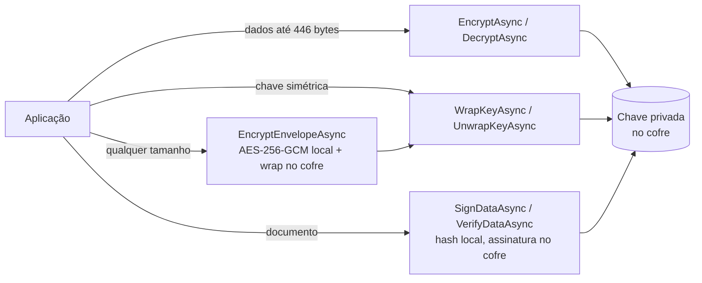
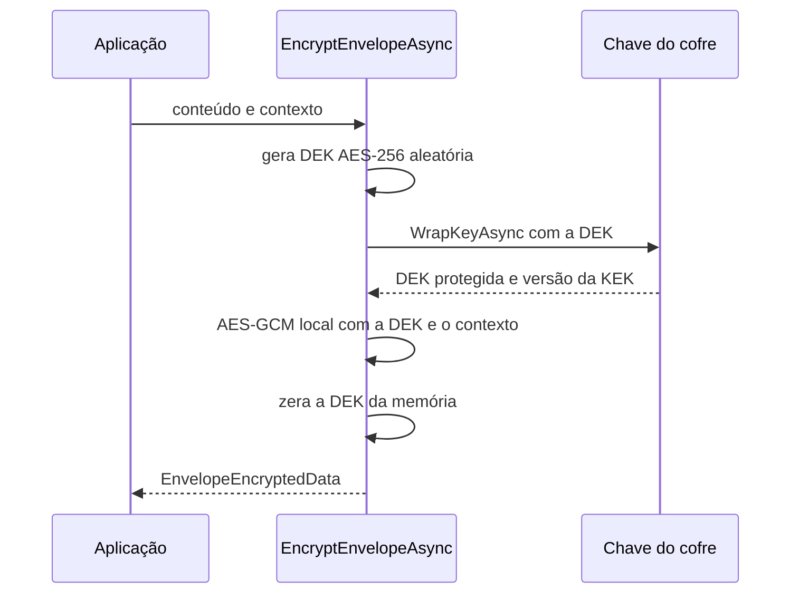

[🏠 TEC.Vault](../README.md) › [📚 Documentação](README.md) › 🔐 Chaves

# 🔐 Chaves

> Cria, rotaciona e usa chaves RSA e EC cuja parte privada nunca sai do cofre: criptografar, proteger chaves (wrap), assinar e cifrar dados de qualquer tamanho com criptografia envelope.

## 📑 Sumário

- [🎯 Visão geral](#-visão-geral)
- [🚀 Uso](#-uso)
  - [Gerenciar chaves](#gerenciar-chaves)
  - [Criptografar e assinar](#criptografar-e-assinar)
  - [Criptografia envelope](#criptografia-envelope)
  - [Envelope assinado (autenticidade da origem)](#envelope-assinado-autenticidade-da-origem)
  - [Lixeira e backup](#lixeira-e-backup)
- [📘 Referência da API](#-referência-da-api)
- [⚙️ Opções](#️-opções)
- [❌ Erros](#-erros)
- [🛡️ Segurança](#️-segurança)
- [❓ Perguntas frequentes](#-perguntas-frequentes)

---

## 🎯 Visão geral

| Preciso de... | Injete | Papel típico no Azure |
|---|---|---|
| Ler a parte pública e metadados | `IKeyReader` | Key Vault Crypto User |
| Criar, alterar, rotacionar, excluir | `IKeyStore` | Key Vault Crypto Officer |
| Criptografar, wrap, assinar, verificar | `IKeyCryptography` | Key Vault Crypto User |
| Lixeira / backup | `IKeyRecycleBin` / `IKeyBackup` | Key Vault Crypto Officer |



**O que cada provedor oferece:**

| Provedor | `IKeyStore` | `IKeyCryptography` | `IKeyRecycleBin` | `IKeyBackup` | HSM |
|---|:-:|:-:|:-:|:-:|:-:|
| [Azure Key Vault](provedor-azure-key-vault.md) | ✅ | ✅ | ✅ | ✅ | ✅ (SKU Premium) |
| [HashiCorp Vault](provedor-hashicorp-vault.md) (Transit) | ✅ | ✅ | — | — | — |
| [Em memória](provedor-em-memoria.md) | ✅ | ✅ | ✅ | ✅ | — |

Infisical e Synced só oferecem segredos.

**Limites comuns** (`VaultKeyRules`, iguais em todo provedor): RSA 2048, 3072 ou 4096 bits (padrão 3072); curvas P-256, P-384 e P-521; texto claro de criptografia/wrap até **446 bytes** (RSA-OAEP-256 com RSA 4096; 190 bytes com RSA 2048); texto cifrado e assinatura até **512 bytes**; dados a assinar até **64 MB**.

---

## 🚀 Uso

Os exemplos supõem `using TEC.Vault.Abstractions; using TEC.Vault.Common; using TEC.Vault.Keys; using TEC.Core.Common.Results;`.

### Gerenciar chaves

```csharp
// RSA só para wrap (KEK da criptografia envelope)
await keyStore.CreateKeyAsync("kek-dados-clientes", new CreateKeyOptions
{
    KeyType = VaultKeyType.Rsa,
    KeySize = 4096,
    Operations = VaultKeyOperations.WrapKey | VaultKeyOperations.UnwrapKey,   // menor privilégio
    ExpiresOn = DateTimeOffset.UtcNow.AddYears(3)
}, ct);

// EC P-384 para assinatura, protegida por HSM (o provedor precisa oferecer)
var ec = await keyStore.CreateKeyAsync("assinatura-docs", new CreateKeyOptions
{
    KeyType = VaultKeyType.Ec, Curve = VaultKeyCurve.P384, HardwareProtected = true
}, ct);
if (ec.IsFailure && ec.Error!.Code == VaultErrors.NotSupportedCode) { /* provedor sem HSM: nunca cai para software */ }

// Rotação e desabilitação de uma versão antiga
var nova = await keyStore.RotateKeyAsync("assinatura-docs", ct);
await keyStore.UpdateKeyPropertiesAsync("assinatura-docs", new KeyPropertiesUpdate { Enabled = false }, versaoAntiga, ct);
```

<details>
<summary>📄 Exemplo completo: criar ou rotacionar e publicar a chave pública</summary>

```csharp
using System.Security.Cryptography;
using TEC.Vault.Abstractions;
using TEC.Vault.Keys;
using TEC.Core.Common.Results;

public sealed class GestaoChaves(IKeyStore chaves)
{
    public async Task<Result<string>> CriarOuRotacionarAsync(string nome, CancellationToken ct)
    {
        var atual = await chaves.GetKeyAsync(nome, cancellationToken: ct);
        var resultado = atual.IsSuccess
            ? await chaves.RotateKeyAsync(nome, ct)                       // nova versão, mesmos parâmetros
            : await chaves.CreateKeyAsync(nome, new CreateKeyOptions
            {
                KeyType = VaultKeyType.Ec,
                Curve = VaultKeyCurve.P256,                               // EC só assina e verifica
                ExpiresOn = DateTimeOffset.UtcNow.AddYears(2),
                Tags = new Dictionary<string, string> { ["uso"] = "jwt" }
            }, ct);

        if (resultado.IsFailure)
            return resultado.ToFailure<string>();

        // Publica a chave pública (ex.: JWKS) sem acessar a privada
        using var ecdsa = ECDsa.Create();
        ecdsa.ImportSubjectPublicKeyInfo(resultado.Value.PublicKeySpki, out _);
        return resultado.Value.Version!;
    }

    public Task<Result<VaultKey>> RestringirAsync(string nome, CancellationToken ct) =>
        chaves.UpdateKeyPropertiesAsync(nome, new KeyPropertiesUpdate { Operations = VaultKeyOperations.Verify }, cancellationToken: ct);
}
```

</details>

> [!TIP]
> Uma chave rotacionada mantém as versões antigas habilitadas: o que foi cifrado ou assinado com elas continua legível/verificável. Desabilite a versão antiga só depois de recifrar o que depende dela.

> [!NOTE]
> **HashiCorp Vault (Transit):** não há validade, habilitar/desabilitar, tags nem restrição de operações (esses campos retornam `VAULT_ENTRADA_INVALIDA`), e a exclusão é definitiva. Detalhes em [Provedor HashiCorp Vault](provedor-hashicorp-vault.md).

### Criptografar e assinar

`IKeyCryptography` usa a chave sem permissão de gestão. Cifrar e assinar usam a versão atual por padrão; **decifrar, unwrap e verificar exigem a versão** usada na operação original — guarde `KeyVersion`.

```csharp
// Assinatura (PS256: RSA-PSS, recomendado para RSA)
var assinatura = await crypto.SignDataAsync("assinatura-notas", xml, VaultSignatureAlgorithm.PS256, cancellationToken: ct);
var valida = await crypto.VerifyDataAsync("assinatura-notas", assinatura.Value.KeyVersion, xml,
    assinatura.Value.Signature, VaultSignatureAlgorithm.PS256, ct);
bool ok = valida.IsSuccess && valida.Value;   // assinatura inválida = sucesso com false

// Wrap de uma chave AES gerada localmente
byte[] dek = RandomNumberGenerator.GetBytes(32);
var protegida = await crypto.WrapKeyAsync("kek-dados-clientes", dek, cancellationToken: ct);
CryptographicOperations.ZeroMemory(dek);
var recuperada = await crypto.UnwrapKeyAsync("kek-dados-clientes", protegida.Value.KeyVersion,
    protegida.Value.Ciphertext, cancellationToken: ct);

// Verificação local com a parte pública (sem chamar o cofre)
var chave = await keys.GetKeyAsync("assinatura-jwt", cancellationToken: ct);
using var rsa = RSA.Create();
rsa.ImportSubjectPublicKeyInfo(chave.Value.PublicKeySpki, out _);
```

<details>
<summary>📄 Exemplo completo: assinador de notas e cifragem de valores pequenos</summary>

```csharp
using TEC.Vault.Abstractions;
using TEC.Vault.Keys;
using TEC.Core.Common.Results;

public sealed class AssinadorNotas(IKeyCryptography crypto)
{
    private const string Chave = "assinatura-notas";

    public async Task<Result<NotaAssinada>> AssinarAsync(byte[] xml, CancellationToken ct)
    {
        var assinatura = await crypto.SignDataAsync(Chave, xml, VaultSignatureAlgorithm.PS256, cancellationToken: ct);
        if (assinatura.IsFailure)
            return assinatura.ToFailure<NotaAssinada>();   // ex.: VAULT_ITEM_DESABILITADO

        // Guarde a versão: a verificação exige a mesma
        return new NotaAssinada(xml, assinatura.Value.Signature, assinatura.Value.KeyVersion);
    }

    public Task<Result<bool>> VerificarAsync(NotaAssinada nota, CancellationToken ct) =>
        crypto.VerifyDataAsync(Chave, nota.VersaoChave, nota.Xml, nota.Assinatura, VaultSignatureAlgorithm.PS256, ct);

    public async Task<Result<byte[]>> CifrarEDecifrarAsync(byte[] valor, CancellationToken ct)
    {
        // RSA-OAEP-256: até 190 bytes com RSA 2048 (para mais, use envelope)
        var cifrado = await crypto.EncryptAsync("dados-sensiveis", valor, cancellationToken: ct);
        if (cifrado.IsFailure)
            return cifrado.ToFailure<byte[]>();
        return await crypto.DecryptAsync("dados-sensiveis", cifrado.Value.KeyVersion, cifrado.Value.Ciphertext, cancellationToken: ct);
    }
}

public sealed record NotaAssinada(byte[] Xml, byte[] Assinatura, string VersaoChave);
```

</details>

> [!NOTE]
> **Azure Key Vault:** com versão informada, o cliente de criptografia é reaproveitado por nome + versão (até 256) e recriado após `CryptographyClientLifetime` (padrão 10 min). Encrypt, wrap e verify são feitos localmente com a chave pública em cache: desabilitar a chave vale **na hora** para decrypt, unwrap e sign e em até esse prazo para encrypt, wrap e verify. Sem versão, o cliente é criado a cada chamada para sempre seguir a versão atual. Veja [Provedor Azure Key Vault](provedor-azure-key-vault.md).

### Criptografia envelope

`KeyCryptographyExtensions` (namespace `TEC.Vault.Keys`) cifra conteúdo de qualquer tamanho com qualquer `IKeyCryptography`: uma chave de dados AES-256 aleatória (DEK) cifra localmente com AES-GCM (TEC.Core); a DEK é protegida (wrap, RSA-OAEP-256) pela chave do cofre (KEK) e zerada da memória. O cofre recebe só 32 bytes por operação.



```csharp
using System.Text;
using TEC.Vault.Abstractions;
using TEC.Vault.Keys;
using TEC.Core.Common.Results;

public sealed class ProtecaoCpf(IKeyCryptography crypto)
{
    public async Task<Result<CpfProtegido>> ProtegerAsync(Guid idCliente, string cpf, CancellationToken ct)
    {
        // associatedData amarra o dado ao registro: copiar o CPF cifrado para outro cliente faz a decifragem falhar
        var envelope = await crypto.EncryptEnvelopeAsync("dados-clientes", Encoding.UTF8.GetBytes(cpf),
            associatedData: idCliente.ToByteArray(), cancellationToken: ct);
        if (envelope.IsFailure)
            return envelope.ToFailure<CpfProtegido>();

        var e = envelope.Value;   // guarde os quatro campos juntos: sem o cofre, nada é legível
        return new CpfProtegido(e.KeyName, e.KeyVersion, e.WrappedKey, e.Ciphertext);
    }

    public async Task<Result<string>> AbrirAsync(Guid idCliente, CpfProtegido p, CancellationToken ct)
    {
        var claro = await crypto.DecryptEnvelopeAsync(new EnvelopeEncryptedData(p.Chave, p.Versao, p.ChaveDados, p.Cifrado),
            associatedData: idCliente.ToByteArray(), cancellationToken: ct);
        // Adulterado ou de outro contexto: VAULT_ENTRADA_INVALIDA
        return claro.IsSuccess ? Encoding.UTF8.GetString(claro.Value) : claro.ToFailure<string>();
    }
}

public sealed record CpfProtegido(string Chave, string Versao, byte[] ChaveDados, byte[] Cifrado);
```

### Envelope assinado (autenticidade da origem)

O envelope garante **sigilo e vínculo ao contexto**, mas **não prova quem cifrou**: o wrap usa a chave **pública** da KEK, e quem a tem (qualquer identidade com `keys/get`, ou quem a copiou) monta um `EnvelopeEncryptedData` que `DecryptEnvelopeAsync` aceita (comportamento coberto pelo teste `Envelope_forged_with_public_key_is_accepted_known_behavior`). Quando a origem importa, assine com uma chave que só o emissor usa e confira **antes** de decifrar:

```csharp
// Escrita
var e = (await crypto.EncryptEnvelopeAsync("kek-documentos", pdf, contexto, cancellationToken: ct)).Value;
byte[] assinado = [.. contexto, .. e.WrappedKey, .. e.Ciphertext];   // WrappedKey tem tamanho fixo; contexto é conhecido de quem confere
var assinatura = (await crypto.SignDataAsync("assinatura-documentos", assinado, VaultSignatureAlgorithm.PS256, cancellationToken: ct)).Value;
// persista os quatro campos de e, assinatura.Signature e assinatura.KeyVersion

// Leitura
var valida = await crypto.VerifyDataAsync("assinatura-documentos", versaoAssinatura, assinado, assinaturaGuardada,
    VaultSignatureAlgorithm.PS256, ct);
if (valida.IsFailure || !valida.Value)
    return VaultErrors.InvalidInput("signature", "Assinatura inválida.");
var claro = await crypto.DecryptEnvelopeAsync(e, contexto, ct);
```

### Lixeira e backup

```csharp
var excluidas = await lixeira.ListDeletedKeysAsync(ct);
var recuperada = await lixeira.RecoverDeletedKeyAsync("kek-dados-clientes", ct);

var backup = await backups.BackupKeyAsync("kek-dados-clientes", ct);   // opaco, protegido pelo provedor
var restaurada = await backups.RestoreKeyBackupAsync(backup.Value, ct); // o nome não pode existir
```

---

## 📘 Referência da API

### `IKeyReader`

> `TEC.Vault.Abstractions` · `interface` — a parte privada nunca é retornada

| Membro | Retorno | Descrição |
|---|---|---|
| `ProviderName` | `string` | Nome do provedor |
| `GetKeyAsync(string name, string? version = null)` | `Task<Result<VaultKey>>` | Parte pública (SPKI) e metadados da versão atual ou da informada |
| `ListKeysAsync()` | `Task<Result<IReadOnlyList<KeyProperties>>>` | Metadados de todas as chaves |
| `ListKeyVersionsAsync(string name)` | `Task<Result<IReadOnlyList<KeyProperties>>>` | Metadados de todas as versões |

### `IKeyStore` (herda `IKeyReader`)

| Membro | Retorno | Descrição |
|---|---|---|
| `CreateKeyAsync(string name, CreateKeyOptions? options = null)` | `Task<Result<VaultKey>>` | Cria a chave ou uma nova versão (`null` = RSA 3072 com todas as operações) |
| `UpdateKeyPropertiesAsync(string name, KeyPropertiesUpdate update, string? version = null)` | `Task<Result<VaultKey>>` | Altera habilitado, validade, operações e tags |
| `RotateKeyAsync(string name)` | `Task<Result<VaultKey>>` | Nova versão com os mesmos parâmetros |
| `DeleteKeyAsync(string name)` | `Task<Result<DeletedVaultItem>>` | Exclui e aguarda a conclusão |

### `IKeyCryptography`

| Membro | Retorno | Descrição |
|---|---|---|
| `ProviderName` | `string` | Nome do provedor |
| `EncryptAsync(string name, byte[] plaintext, VaultEncryptionAlgorithm algorithm = RsaOaep256, string? version = null)` | `Task<Result<VaultEncryptResult>>` | Criptografa dados pequenos |
| `DecryptAsync(string name, string version, byte[] ciphertext, VaultEncryptionAlgorithm algorithm = RsaOaep256)` | `Task<Result<byte[]>>` | Descriptografa com a **mesma versão** |
| `WrapKeyAsync(string name, byte[] key, VaultEncryptionAlgorithm algorithm = RsaOaep256, string? version = null)` | `Task<Result<VaultEncryptResult>>` | Protege (wrap) uma chave simétrica |
| `UnwrapKeyAsync(string name, string version, byte[] wrappedKey, VaultEncryptionAlgorithm algorithm = RsaOaep256)` | `Task<Result<byte[]>>` | Recupera (unwrap) a chave simétrica |
| `SignDataAsync(string name, byte[] data, VaultSignatureAlgorithm algorithm, string? version = null)` | `Task<Result<VaultSignResult>>` | Assina: hash local, assinatura no cofre |
| `VerifyDataAsync(string name, string version, byte[] data, byte[] signature, VaultSignatureAlgorithm algorithm)` | `Task<Result<bool>>` | Verifica; assinatura inválida é **sucesso com `false`** |

### `IKeyRecycleBin` e `IKeyBackup` (capacidades opcionais)

| Membro | Retorno | Descrição |
|---|---|---|
| `ListDeletedKeysAsync()` | `Task<Result<IReadOnlyList<DeletedVaultItem>>>` | Chaves excluídas e recuperáveis |
| `RecoverDeletedKeyAsync(string name)` | `Task<Result<VaultKey>>` | Recupera e aguarda |
| `PurgeDeletedKeyAsync(string name)` | `Task<Result>` | Remove definitivamente. **Tudo o que foi cifrado com ela fica ilegível** |
| `BackupKeyAsync(string name)` | `Task<Result<byte[]>>` | Backup protegido (opaco) |
| `RestoreKeyBackupAsync(byte[] backup)` | `Task<Result<VaultKey>>` | Restaura um backup gerado por `BackupKeyAsync` |

### `KeyCryptographyExtensions`

> `TEC.Vault.Keys` · `static class`

| Membro | Retorno | Descrição |
|---|---|---|
| `EncryptEnvelopeAsync(this IKeyCryptography store, string keyName, byte[] plaintext, byte[]? associatedData = null, string? keyVersion = null)` | `Task<Result<EnvelopeEncryptedData>>` | Cifra conteúdo de qualquer tamanho |
| `DecryptEnvelopeAsync(this IKeyCryptography store, EnvelopeEncryptedData data, byte[]? associatedData = null)` | `Task<Result<byte[]>>` | Decifra; exige o mesmo `associatedData` |

<details>
<summary>📋 Modelos e enums de chave</summary>

#### `KeyProperties` (herda [`VaultItemProperties`](segredos.md#-referência-da-api))

| Membro | Tipo | Descrição |
|---|---|---|
| `Exportable` | `bool` | A chave pode ser exportada pelo provedor (`false` quando o provedor não oferece) |

#### `VaultKey`

| Membro | Tipo | Descrição |
|---|---|---|
| `Properties` | `KeyProperties` | Metadados |
| `KeyType` | `VaultKeyType` | `Rsa` ou `Ec` |
| `HardwareProtected` | `bool` | Protegida por HSM |
| `Curve` | `VaultKeyCurve?` | Só EC |
| `KeySize` | `int?` | Só RSA |
| `Operations` | `VaultKeyOperations` | Operações permitidas |
| `PublicKeySpki` | `byte[]?` | Chave pública SubjectPublicKeyInfo (DER) |
| `Name` / `Version` | `string` / `string?` | Atalhos de `Properties` |

#### Resultados

| Tipo | Campos | Observação |
|---|---|---|
| `VaultEncryptResult` | `KeyName`, `KeyVersion`, `Algorithm`, `Ciphertext` | Guarde `KeyVersion`: decrypt/unwrap exigem a mesma |
| `VaultSignResult` | `KeyName`, `KeyVersion`, `Algorithm`, `Signature` | Verifique com a mesma versão |
| `EnvelopeEncryptedData` | `KeyName`, `KeyVersion`, `WrappedKey`, `Ciphertext` | Armazene tudo junto; `Ciphertext` no formato versionado do AES-GCM do TEC.Core (`[versão][nonce][tag][dados]`) |

#### Enums

| Enum | Valores |
|---|---|
| `VaultKeyType` | `Rsa` (0), `Ec` (1) |
| `VaultKeyCurve` | `P256` (0, ES256), `P384` (1, ES384), `P521` (2, ES512) |
| `VaultKeyOperations` (`[Flags]`) | `None` (0), `Encrypt` (1), `Decrypt` (2), `Sign` (4), `Verify` (8), `WrapKey` (16), `UnwrapKey` (32) |
| `VaultEncryptionAlgorithm` | `RsaOaep256` (0). RSA1_5 e OAEP-SHA1 não são oferecidos de propósito |
| `VaultSignatureAlgorithm` | `RS256`, `RS384`, `RS512` (PKCS#1 v1.5), `PS256`, `PS384`, `PS512` (PSS, recomendado para RSA), `ES256`, `ES384`, `ES512` (ECDSA, formato IEEE P1363) |

</details>

---

## ⚙️ Opções

As chaves não têm opções globais; o comportamento vem de cada chamada. Opções do provedor (ex.: `CryptographyClientLifetime` do Azure) ficam na página do [provedor](README.md).

### `CreateKeyOptions`

| Opção | Padrão | Descrição |
|---|---|---|
| `KeyType` | `Rsa` | `Rsa` ou `Ec` |
| `KeySize` | `3072` | RSA: 2048, 3072 ou 4096 |
| `Curve` | `P256` | EC: `P256`, `P384` ou `P521` |
| `Operations` | `null` | `null` = todas as aplicáveis (RSA: todas; EC: `Sign` e `Verify`) |
| `HardwareProtected` | `false` | Exige HSM; sem suporte → `VAULT_OPERACAO_NAO_SUPORTADA` (nunca cai para software) |
| `Enabled` | `true` | Habilitada |
| `ExpiresOn` / `NotBefore` | `null` | Validade (expiração no futuro) |
| `Tags` | `null` | Metadados |

### `KeyPropertiesUpdate`

Propriedades `null` não são alteradas: `Enabled`, `ExpiresOn`, `NotBefore`, `Operations` (ao menos uma, todas conhecidas) e `Tags` (substituem as atuais).

### Parâmetros de uso

| Parâmetro | Padrão | Descrição |
|---|---|---|
| `algorithm` (criptografia/wrap) | `RsaOaep256` | Único algoritmo oferecido |
| `algorithm` (assinatura) | — | Obrigatório: `RS*`, `PS*` (recomendado para RSA) ou `ES*` (curva compatível com a chave) |
| `version` | `null` | Cifrar, wrap e assinar: `null` = atual. Decifrar, unwrap e verificar: **obrigatória** |
| `associatedData` (envelope) | `null` | Contexto autenticado (ex.: id do registro); o mesmo valor é exigido para decifrar |
| `keyVersion` (envelope) | `null` | Versão da KEK (`null` = atual); a usada fica em `EnvelopeEncryptedData.KeyVersion` |

---

## ❌ Erros

| Código | Quando ocorre | O que fazer |
|---|---|---|
| `VAULT_ENTRADA_INVALIDA` | Nome ou versão inválidos; versão ausente em decrypt/unwrap/verify; tipo, tamanho RSA, curva ou algoritmo inválidos; operações vazias, desconhecidas ou não aplicáveis (EC só `Sign`/`Verify`); conteúdo vazio ou acima do limite (446 / 512 bytes / 64 MB); tags; validade; envelope incompleto, adulterado, com contexto diferente ou chave de dados com tamanho errado; campos sem equivalente no Transit (HashiCorp) | Corrija a entrada |
| `VAULT_OPERACAO_NAO_SUPORTADA` | `HardwareProtected = true` num provedor sem HSM | Use um cofre com HSM ou desligue a exigência |
| `VAULT_REQUISICAO_RECUSADA` | Texto cifrado inválido; algoritmo incompatível com a chave (ex.: `PS256` em chave EC); operação não permitida na chave; chave fora da validade (em memória); backup inválido | Confira algoritmo, operações e versão |
| `VAULT_ITEM_DESABILITADO` | Chave ou versão desabilitada | Habilite ou use outra versão |
| `VAULT_ITEM_NAO_ENCONTRADO` | Chave ou versão inexistente; nome fora da lixeira | Confira nome e versão |
| `VAULT_CONFLITO` | Nome de chave excluída ainda na lixeira; restauração com nome existente; no HashiCorp, criar com tipo diferente do existente | Recupere/purgue a excluída ou use outro nome |
| `VAULT_ACESSO_NEGADO` | Sem permissão (ex.: purge com proteção ativa) | Revise o papel da identidade |
| Infraestrutura | Autenticação, limitação, indisponibilidade, listagem acima do limite | Veja [Erros](erros.md) |

---

## 🛡️ Segurança

> [!CAUTION]
> **Purgar uma chave é perda de dados:** nada cifrado com ela volta a ser legível. Ative a proteção contra purge no cofre de produção.

> [!WARNING]
> **Envelope não autentica a origem.** Decifrar com sucesso prova integridade e contexto, não quem cifrou. Quando a origem importa, use o [envelope assinado](#envelope-assinado-autenticidade-da-origem).

> [!WARNING]
> `EnvelopeEncryptedData.Ciphertext` usa o formato versionado do AES-GCM do TEC.Core. O byte de versão é autenticado: conteúdo sem byte de versão ou com versão desconhecida é recusado.

> [!TIP]
> Restrinja `Operations` ao uso real (uma chave de assinatura não deve decifrar) e injete `IKeyCryptography` em vez de `IKeyStore` quando a aplicação só usa chaves. Algoritmos fracos (RSA1_5, OAEP-SHA1, RSA < 2048) nem existem na API.

> [!WARNING]
> **HashiCorp Transit:** cifrar com um nome inexistente cria uma chave AES se o token puder criar (upsert). O provedor confere antes que a chave existe e é RSA, mas dê à aplicação só `update` em `transit/encrypt/*` (sem `create`). Veja [Provedor HashiCorp Vault](provedor-hashicorp-vault.md).

Modelo de ameaças completo: [Segurança](seguranca.md).

---

## ❓ Perguntas frequentes

<details>
<summary>Posso cifrar um arquivo grande com <code>EncryptAsync</code>?</summary>

Não: RSA-OAEP-256 cifra no máximo 190 bytes (RSA 2048) a 446 bytes (RSA 4096). Use `EncryptEnvelopeAsync`, que não tem limite de tamanho.
</details>

<details>
<summary>Por que <code>VerifyDataAsync</code> retornou sucesso com <code>false</code>?</summary>

Assinatura que não confere não é falha do cofre: é sucesso com `false`. Falha (`IsFailure`) indica problema de entrada, chave ou infraestrutura.
</details>

<details>
<summary>Perdi a versão usada para cifrar. Consigo decifrar?</summary>

`DecryptAsync`/`UnwrapKeyAsync` exigem a versão. Liste as versões com `ListKeyVersionsAsync` e tente as habilitadas; por isso guarde sempre `KeyVersion` junto do dado (o envelope já guarda).
</details>

<details>
<summary>Como uso ES256 para JWT?</summary>

Crie uma chave `Ec` com `Curve = P256` e assine com `VaultSignatureAlgorithm.ES256`; a assinatura sai no formato IEEE P1363 (r‖s), o exigido pelo JWS. Use `KeyVersion` como `kid`.
</details>

---
⬅️ [🔑 Segredos](segredos.md) · [📚 Índice](README.md) · [📜 Certificados](certificados.md) ➡️
