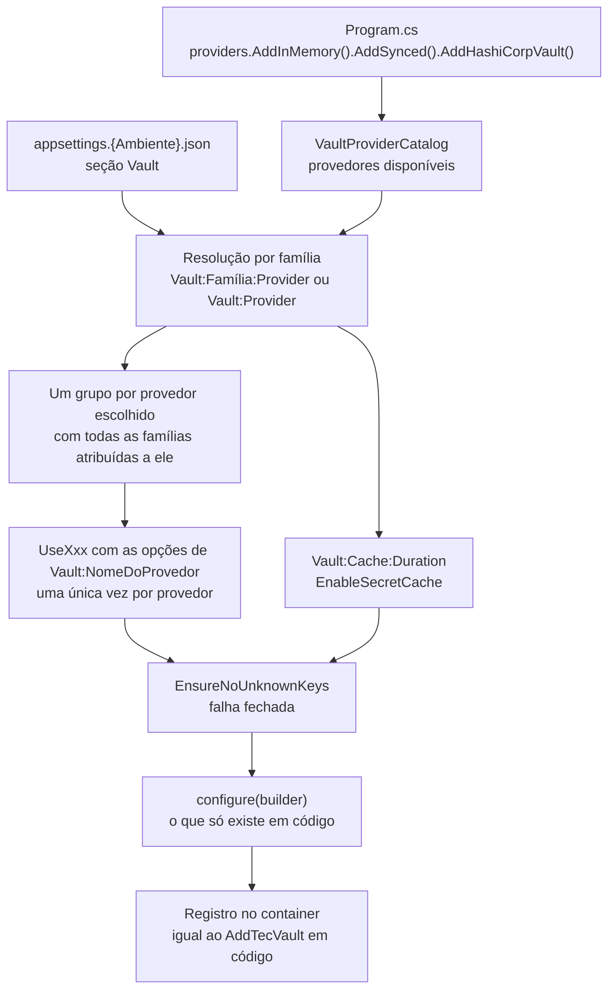
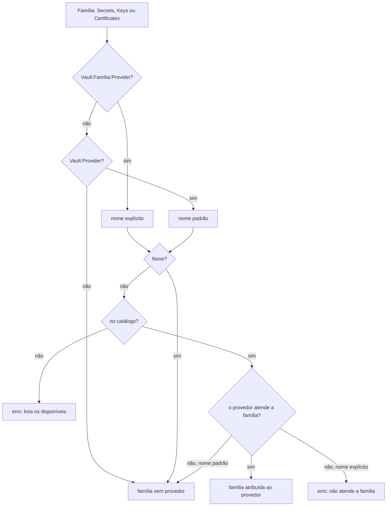

| `CircuitBreaker:Enabled` · `FailureRatio` · `MinimumThroughput` · `SamplingDuration` · `BreakDuration` | booleano · 0 a 1 · 2 a 10.000 · intervalo | `Http.CircuitBreaker.*` ([🔁 Resiliência](resiliencia.md)) |
| `CircuitBreaker:Enabled` · `FailureRatio` · `MinimumThroughput` · `SamplingDuration` · `BreakDuration` | booleano · 0 a 1 · 2 a 10.000 · intervalo | `Http.CircuitBreaker.*` ([🔁 Resiliência](resiliencia.md)) |
| `CircuitBreaker:Enabled` · `FailureRatio` · `MinimumThroughput` · `SamplingDuration` · `BreakDuration` | booleano · 0 a 1 · 2 a 10.000 · intervalo | `CircuitBreaker.*` ([🔁 Resiliência](resiliencia.md)) |
[🏠 TEC.Vault](../README.md) › [📚 Documentação](README.md) › ⚙️ Escolha do cofre pela configuração

# ⚙️ Escolha do cofre pela configuração

> O `appsettings` de cada ambiente escolhe o cofre de cada família (segredos, chaves, certificados); o código só declara quais provedores estão disponíveis — trocar de cofre não exige recompilar.

## 📑 Sumário

- [🎯 Visão geral](#-visão-geral)
- [🚀 Uso](#-uso)
- [📘 Referência da API](#-referência-da-api)
- [⚙️ Opções](#️-opções)
- [❌ Erros](#-erros)
- [🛡️ Segurança](#️-segurança)
- [❓ Perguntas frequentes](#-perguntas-frequentes)

---

## 🎯 Visão geral

| Registro em código (`UseXxx`) | Registro por configuração (`AddTecVault(section, providers)`) |
|---|---|
| Trocar de cofre exige alterar o `Program.cs` e recompilar | Trocar de cofre é trocar o `appsettings.{Ambiente}.json` (ou uma variável de ambiente) |
| `if (builder.Environment.IsDevelopment()) ... else ...` espalhado pelo código | Cada ambiente declara o seu cofre; o código só lista os provedores **disponíveis** |
| Endereços lidos à mão de `builder.Configuration["..."]`, sem validação de grafia | Leitura tipada e estrita: chave desconhecida, valor inválido ou provedor inexistente falham na subida, com o caminho da chave |
| Famílias em cofres diferentes exigem código extra | Segredos num provedor e chaves em outro, com uma linha por família |

Os dois modos registram exatamente o mesmo no container ([🧩 Injeção de dependências](injecao-de-dependencias.md)): o registro por configuração só decide **quais** `UseXxx` chamar e com quais opções.



### Regras de resolução

Para cada família, o provedor é `Vault:<Família>:Provider` (`Secrets`, `Keys`, `Certificates`) ou, sem ele, `Vault:Provider`.



| Situação | Resultado |
|---|---|
| `Vault:Provider` atende todas as famílias | Todas usam o provedor |
| Nome com outra grafia (`hashicorpvault`) | Aceito: o nome não diferencia maiúsculas |
| `Vault:Keys:Provider` definido | Tem precedência sobre `Vault:Provider` |
| Provedor padrão não atende a família (ex.: `Directory` em chaves) | A família fica **sem provedor**, sem erro |
| Família pedida **explicitamente** a quem não a atende (`Keys:Provider = Directory`) | `InvalidOperationException`: `Vault:Keys:Provider: o provedor 'Directory' não atende chaves.` |
| `Provider = None` | Família desligada |
| Provedor fora do catálogo (pacote não adicionado ou erro de digitação) | `InvalidOperationException` com a lista dos disponíveis |
| Nenhuma família com provedor | `InvalidOperationException`: `Nenhum provedor de cofre configurado...` |
| Mesmo provedor em várias famílias | Registrado **uma vez**, com todas as famílias (o HashiCorp Vault compartilha um login e um token) |
| Chave desconhecida na raiz, numa família ou na seção do provedor escolhido | `InvalidOperationException` com o caminho de cada chave |
| Seção de um provedor **disponível e não escolhido** (ex.: `Vault:HashiCorpVault` em Development) | Não é validada |
| `Vault:Cache:Duration` | Liga o cache de segredos (`EnableSecretCache`) |
| `configure` em código | Roda depois da configuração (o código vence) |
| `AddTecVault` chamado duas vezes | `InvalidOperationException` (de propósito: nunca ignora uma configuração em silêncio) |

Provedores e famílias que cada um atende:

| Nome na configuração | Pacote | Catálogo | Segredos | Chaves | Certificados | Fonte de `IConfiguration` |
|---|---|---|:---:|:---:|:---:|:---:|
| `AzureKeyVault` | `TEC.Vault.AzureKeyVault` | `AddAzureKeyVault()` | ✅ | ✅ | ✅ | ✅ |
| `HashiCorpVault` | `TEC.Vault.HashiCorpVault` | `AddHashiCorpVault()` | ✅ | ✅ | ✅ | ✅ |
| `Infisical` | `TEC.Vault.Infisical` | `AddInfisical()` | ✅ | — | — | ✅ |
| `Directory` | `TEC.Vault.Synced` | `AddSynced()` | ✅ (só leitura) | — | — | ✅ |
| `EnvironmentVariables` | `TEC.Vault.Synced` | `AddSynced()` | ✅ (só leitura) | — | — | ✅ |
| `SecretsFile` | `TEC.Vault.Synced` | `AddSynced()` | ✅ (só leitura) | — | — | ✅ |
| `InMemory` | `TEC.Vault.InMemory` | `AddInMemory()` | ✅ | ✅ | ✅ | ✅ |

> [!NOTE]
> Não há *binding* por reflexão: só os provedores adicionados explicitamente ao catálogo podem ser escolhidos, e só os pacotes referenciados entram no binário. Por isso o recurso é compatível com Native AOT e trimming.

---

## 🚀 Uso

### Container (DI)

```csharp
using TEC.Vault.AzureKeyVault;
using TEC.Vault.DependencyInjection;
using TEC.Vault.HashiCorpVault;
using TEC.Vault.HealthChecks;
using TEC.Vault.InMemory;
using TEC.Vault.Synced;

var builder = WebApplication.CreateBuilder(args);

// Provedores DISPONÍVEIS: a seção Vault escolhe qual usar em cada ambiente
builder.Services.AddTecVault(builder.Configuration.GetSection("Vault"), providers => providers
    .AddInMemory()          // Development
    .AddSynced()            // Directory, EnvironmentVariables, SecretsFile
    .AddHashiCorpVault()    // produção on-premises
    .AddAzureKeyVault());   // produção no Azure

builder.Services.AddHealthChecks().AddTecVault();
```

O que só existe em código (credencial própria, handler HTTP com CA interna, liberações de desenvolvimento) vai no `configure` do `AddXxx` do catálogo ou no `configure` final, que roda **depois** da configuração:

```csharp
builder.Services.AddTecVault(builder.Configuration.GetSection("Vault"),
    providers => providers
        .AddAzureKeyVault(o => o.Credential = myCredential)               // só em código
        .AddHashiCorpVault(o => o.Http.Handler = CreateInternalCaHandler()), // CA interna, proxy
    vault => vault.EnableSecretCache(TimeSpan.FromMinutes(5)));            // cache definido em código
```

### Fonte de `IConfiguration`

A mesma seção escolhe o provedor de segredos da fonte de configuração; as opções da fonte vêm de `Vault:Configuration` (detalhes em [🧾 Segredos no IConfiguration](configuracao.md)):

```csharp
using TEC.Vault.Configuration;
using TEC.Vault.DependencyInjection;

var vault = builder.Configuration.GetSection("Vault");

static void Providers(VaultProviderCatalog p) => p.AddInMemory().AddSynced().AddHashiCorpVault().AddAzureKeyVault();

// 1. Container primeiro: a escolha é feita com o appsettings, antes de qualquer segredo entrar na configuração
builder.Services.AddTecVault(vault, Providers);

// 2. Depois a fonte de IConfiguration (segredos "MinhaApi--*" viram chaves, ex.: ConnectionStrings:Db)
using var configLogs = LoggerFactory.Create(l => l.AddConsole());
builder.Configuration.AddTecVault(vault, Providers, loggerFactory: configLogs);
```

> [!WARNING]
> Chame o `services.AddTecVault(vault, ...)` **antes** do `Configuration.AddTecVault(vault, ...)`. A escolha é lida na hora da chamada; depois que a fonte de segredos é adicionada, um segredo como `MinhaApi--Vault--HashiCorpVault--Address` vira a chave `Vault:HashiCorpVault:Address` e passaria a influenciar a escolha do container (quem consegue gravar no cofre redirecionaria o login da aplicação). A fonte de configuração em si não tem esse problema: ela resolve a seção antes de carregar os segredos.

Exemplo executável com um `appsettings` por ambiente: [`samples/TEC.Vault.ConfigSelection`](../samples/README.md).

### `appsettings` por ambiente

**`appsettings.json`** (comum a todos os ambientes):

```json
{
  "Vault": {
    "Configuration": { "Prefix": "MinhaApi--", "ReloadInterval": "00:30:00" },
    "Cache": { "Duration": "00:05:00" }
  }
}
```

**`appsettings.Development.json`** — provedor em memória com segredos de desenvolvimento (bloqueado fora de Development):

```json
{
  "Vault": {
    "Provider": "InMemory",
    "InMemory": {
      "InitialSecrets": {
        "MinhaApi--ConnectionStrings--Db": "Server=localhost;Database=dev;Integrated Security=true",
        "parceiro-api-token": "token-local"
      }
    }
  }
}
```

**`appsettings.Production.json`** — HashiCorp Vault para as três famílias, com login Kubernetes (sem segredo na configuração):

```json
{
  "Vault": {
    "Provider": "HashiCorpVault",
    "HashiCorpVault": {
      "Address": "https://vault.interno:8200",
      "Auth": { "Method": "Kubernetes", "Role": "minha-api" },
      "Kv": { "Mount": "secret", "BasePath": "minha-api" },
      "Transit": { "Mount": "transit" },
      "Pki": { "Mount": "pki", "Role": "minha-api" },
      "MaxListItems": 20000
    }
  }
}
```

**Misto** — segredos em arquivos montados por um agente (ex.: External Secrets) e chaves no Azure Key Vault; certificados sem provedor:

```json
{
  "Vault": {
    "Secrets": { "Provider": "Directory" },
    "Keys": { "Provider": "AzureKeyVault" },
    "Directory": { "Path": "/mnt/secrets" },
    "AzureKeyVault": {
      "VaultUri": "https://<nome-do-cofre>.vault.azure.net/",
      "Authentication": "WorkloadIdentity"
    }
  }
}
```

**Azure Key Vault só para segredos e chaves** (certificados desligados explicitamente):

```json
{
  "Vault": {
    "Provider": "AzureKeyVault",
    "Certificates": { "Provider": "None" },
    "AzureKeyVault": {
      "VaultUri": "https://<nome-do-cofre>.vault.azure.net/",
      "ManagedIdentityClientId": "<client-id>",
      "CryptographyClientLifetime": "00:05:00"
    }
  }
}
```

> [!TIP]
> Como qualquer chave do `IConfiguration`, a escolha pode vir de variável de ambiente: `Vault__Provider=Directory` e `Vault__Directory__Path=/mnt/secrets`.

### Seu provedor no catálogo

```csharp
using Microsoft.Extensions.Logging;
using TEC.Vault.DependencyInjection;

public static class MyVaultCatalogExtensions
{
    public const string ProviderName = "MyVault";

    public static VaultProviderCatalog AddMyVault(this VaultProviderCatalog catalog, Action<MyVaultOptions>? configure = null)
    {
        ArgumentNullException.ThrowIfNull(catalog);
        return catalog.Add(new VaultProviderRegistration(ProviderName, VaultStores.Secrets,
            // DI: as famílias escolhidas chegam em "stores" (aqui só Secrets)
            (builder, settings, stores) => builder.UseMyVault(o =>
            {
                Read(settings, o);
                configure?.Invoke(o);          // código vence a configuração
            }),
            // Fonte de IConfiguration: leitor criado sem DI
            (settings, loggerFactory) =>
            {
                var options = new MyVaultOptions();
                Read(settings, options);
                configure?.Invoke(options);
                return new MyVaultSecretStore(options, loggerFactory?.CreateLogger<MyVaultSecretStore>());
            }));
    }

    private static void Read(VaultSettings settings, MyVaultOptions options)
    {
        settings.RejectInlineSecret("Token", "TokenFile", "TokenVariable");          // nunca segredo em texto
        settings.RejectKey("AllowInsecure", "só pode ser definido em código.");      // liberação de segurança
        options.Address = settings.GetUri("Address") ?? options.Address;
        options.TokenFile = settings.GetString("TokenFile") ?? options.TokenFile;
        options.TokenVariable = settings.GetString("TokenVariable") ?? options.TokenVariable;
        options.MaxRetries = settings.GetInt32("MaxRetries", 0, 10) ?? options.MaxRetries;
        options.Timeout = settings.GetTimeSpan("Timeout") ?? options.Timeout;
        settings.EnsureNoUnknownKeys();                                              // falha fechada
    }
}
```

Regras para o leitor do seu provedor:

- Leia **cada** chave aceita e termine com `EnsureNoUnknownKeys()`; use `GetSection` para subseções (a verificação é recursiva).
- Credenciais só por arquivo/variável (`VaultCredentialInput`); recuse a chave "em texto" com `RejectInlineSecret`.
- Liberações de segurança (`Allow*`) só em código: `RejectKey`.
- Não leia `Stores` da configuração: use o `VaultStores` recebido em `use` (com `UseStores`, quando o provedor atende mais de uma família).
- Valide as opções no `UseXxx` (falha na subida), como no registro em código.

Passo a passo completo: [🧱 Novo provedor](novo-provedor.md).

---

## 📘 Referência da API

### `ServiceCollectionExtensions.AddTecVault` (por configuração)

> `TEC.Vault.DependencyInjection` · pacote `TEC.Vault`

| Membro | Retorno | Descrição |
|---|---|---|
| `AddTecVault(this IServiceCollection services, IConfiguration configuration, Action<VaultProviderCatalog> providers, Action<VaultBuilder>? configure = null)` | `IServiceCollection` | Resolve a família de cada provedor pela seção, chama o `UseXxx` de cada provedor escolhido, aplica `Cache:Duration`, valida chaves desconhecidas e então roda `configure` |

A fonte de `IConfiguration` (`IConfigurationBuilder.AddTecVault(vaultSection, providers, ...)`) está em [🧾 Segredos no IConfiguration](configuracao.md).

### `VaultProviderCatalog`

> `TEC.Vault.DependencyInjection` · `sealed class` · pacote `TEC.Vault`

Provedores que a aplicação deixa disponíveis. Criado pelo `AddTecVault`; a aplicação só chama os `AddXxx()` dos pacotes.

| Membro | Retorno | Descrição |
|---|---|---|
| `None` *(const)* | `string` | `"None"`: valor de `Provider` que desliga a família |
| `Add(VaultProviderRegistration provider)` | `VaultProviderCatalog` | Adiciona um provedor (uso pelos pacotes); nome repetido → `InvalidOperationException` |
| `Names` | `IReadOnlyCollection<string>` | Nomes disponíveis |

Extensões dos pacotes:

| Extensão | Classe | Pacote | Nome(s) |
|---|---|---|---|
| `AddAzureKeyVault(Action<AzureKeyVaultOptions>? configure = null)` | `AzureKeyVaultCatalogExtensions` (`ProviderName`) | `TEC.Vault.AzureKeyVault` | `AzureKeyVault` |
| `AddHashiCorpVault(Action<HashiCorpVaultOptions>? configure = null)` | `HashiCorpVaultExtensions` (`ProviderName`) | `TEC.Vault.HashiCorpVault` | `HashiCorpVault` |
| `AddInfisical(Action<InfisicalOptions>? configure = null)` | `InfisicalExtensions` | `TEC.Vault.Infisical` | `Infisical` |
| `AddSynced()` | `SyncedVaultExtensions` | `TEC.Vault.Synced` | `Directory`, `EnvironmentVariables`, `SecretsFile` |
| `AddInMemory(Action<InMemoryVaultOptions>? configure = null)` | `InMemoryVaultCatalogExtensions` (`ProviderName`) | `TEC.Vault.InMemory` | `InMemory` |

Em todas, `configure` roda depois da leitura da seção (o valor em código vence o da configuração).

### `VaultProviderRegistration`

> `TEC.Vault.DependencyInjection` · `sealed class` · pacote `TEC.Vault`

| Membro | Tipo | Descrição |
|---|---|---|
| `VaultProviderRegistration(string name, VaultStores supportedStores, Action<VaultBuilder, VaultSettings, VaultStores> use, Func<VaultSettings, ILoggerFactory?, ISecretReader>? createSecretReader = null)` | — | Descrição do provedor |
| `Name` | `string` | Nome na configuração: letras, dígitos, `.`, `-` e `_`; nunca `None` |
| `SupportedStores` | `VaultStores` | Famílias que o provedor atende (ao menos uma) |
| `Use` | `Action<VaultBuilder, VaultSettings, VaultStores>` | Registra no `VaultBuilder` as famílias escolhidas (sempre um subconjunto de `SupportedStores`), lendo a seção `Vault:<Name>`. Chamado **uma vez** por aplicação |
| `CreateSecretReader` | `Func<VaultSettings, ILoggerFactory?, ISecretReader>?` | Cria o leitor sem DI para a fonte de `IConfiguration`; `null` = não pode ser fonte. Só para provedores de segredos |

Erros do construtor (`ArgumentException`): nome vazio, inválido ou `None`; nenhuma família ou família desconhecida; `createSecretReader` num provedor sem segredos.

### `VaultSettings`

> `TEC.Vault.DependencyInjection` · `sealed class` · pacote `TEC.Vault`

Leitor estrito de uma seção, usado pelos provedores. Cada valor é convertido explicitamente (sem binder por reflexão); chaves sem diferenciar maiúsculas, como no `IConfiguration`.

<details>
<summary>Membros de <code>VaultSettings</code></summary>

| Membro | Retorno | Descrição |
|---|---|---|
| `VaultSettings(IConfiguration section, string? path = null)` | — | Leitor sobre a seção; `path` aparece nas mensagens (padrão: `Path` da seção) |
| `Path` | `string` | Caminho da seção (ex.: `Vault:HashiCorpVault`) |
| `Exists()` | `bool` | A seção tem algum valor |
| `GetString(key)` / `GetRequiredString(key)` | `string?` / `string` | Texto (vazio = `null`); o obrigatório lança se ausente |
| `GetBoolean(key)` | `bool?` | `true`/`false` |
| `GetInt32(key, min, max)` | `int?` | Inteiro na faixa |
| `GetTimeSpan(key)` | `TimeSpan?` | `[d.]hh:mm:ss`, maior que zero |
| `GetUri(key)` | `Uri?` | Endereço absoluto |
| `GetEnum<TEnum>(key)` / `GetFlags<TEnum>(key)` | `TEnum?` | Nome do valor (números recusados); flags separadas por vírgula |
| `GetDictionary(key)` | `IReadOnlyDictionary<string, string>` | Filhas diretas da chave |
| `GetSection(key)` | `VaultSettings` | Subseção, com a verificação de chaves desconhecidas feita pelo pai |
| `Keys` | `IEnumerable<string>` | Chaves presentes |
| `Ignore(key)` | `void` | Marca a chave como conhecida sem validar o conteúdo |
| `RejectInlineSecret(key, params alternatives)` | `void` | Recusa uma chave que traria segredo em texto (a mensagem cita as alternativas) |
| `RejectKey(key, reason)` | `void` | Recusa uma chave que só pode ser definida em código |
| `EnsureNoUnknownKeys()` | `void` | Lança se alguma chave presente não foi lida (inclusive nas subseções) |

Todos os erros são `InvalidOperationException` com o caminho da chave e o formato esperado, **sem o valor**.

</details>

---

## ⚙️ Opções

### Seção `Vault`

| Chave | Tipo | Uso |
|---|---|---|
| `Vault:Provider` | texto | Provedor padrão de todas as famílias |
| `Vault:Secrets:Provider` · `Vault:Keys:Provider` · `Vault:Certificates:Provider` | texto | Provedor da família (precedência); `None` desliga |
| `Vault:Cache:Duration` | `[d.]hh:mm:ss` | Cache de leituras de segredos (maior que zero, até 1 hora) — [detalhes](cache-e-health-check.md) |
| `Vault:<NomeDoProvedor>` | seção | Opções do provedor (tabelas abaixo) |
| `Vault:Configuration` | seção | Opções da fonte de `IConfiguration` (`Prefix`, `SectionSeparator`, `ReloadInterval`, `Optional`, `MaxSecrets`, `LoadTimeout`, `MaxConcurrentReads`); usadas só por `IConfigurationBuilder.AddTecVault` ([detalhes](configuracao.md#️-opções)); o container não as valida |

Formatos aceitos pelos valores:

| Tipo | Formato | Exemplo |
|---|---|---|
| Texto | Vazio ou só espaços = ausente; espaços nas pontas são removidos | `"minha-api"` |
| Inteiro | Cultura invariante, dentro da faixa da opção | `"3"` |
| Booleano | `true` / `false` | `"true"` |
| Intervalo | `[d.]hh:mm:ss`, maior que zero | `"00:00:30"`, `"1.00:00:00"` |
| Endereço | URI absoluta | `"https://vault.interno:8200"` |
| Enum | Nome do valor, sem diferenciar maiúsculas; **números não são aceitos** | `"Kubernetes"` |
| Dicionário | Filhas diretas da seção (nome → valor) | `"InitialSecrets": { "a": "1" }` |

Só as chaves abaixo são aceitas em `Vault:<NomeDoProvedor>`. As famílias vêm da escolha (`Vault:Provider` e overrides), nunca de `Stores` (recusada como chave desconhecida). Padrões e descrição completa de cada opção estão na página do provedor.

### `Vault:AzureKeyVault`

| Chave | Faixa / valores | Equivale a |
|---|---|---|
| `VaultUri` | URI do cofre (obrigatório) | `AzureKeyVaultOptions.VaultUri` |
| `Authentication` | `ManagedIdentity`, `WorkloadIdentity`, `Developer` | `Authentication` |
| `ManagedIdentityClientId` | GUID | `ManagedIdentityClientId` |
| `TenantId` | GUID | `TenantId` |
| `MaxRetries` | 0 a 10 | `MaxRetries` |
| `MaxListItems` | 1 a 1.000.000 (padrão 10.000) | `MaxListItems`: teto de itens por listagem; acima dele a listagem falha com `VAULT_LISTAGEM_ACIMA_DO_LIMITE` |
| `NetworkTimeout` · `OperationTimeout` · `CryptographyClientLifetime` | intervalo | Mesmas opções |
| ~~`AllowDeveloperCredentialsOutsideDevelopment`~~ | **recusada** | Só em código (`configure`) |

Só em código: `Credential`, `HostEnvironment`, `TimeProvider`, `AllowDeveloperCredentialsOutsideDevelopment`. Detalhes: [🌐 Provedor Azure Key Vault](provedor-azure-key-vault.md).

### `Vault:HashiCorpVault`

| Chave | Faixa / valores | Equivale a |
|---|---|---|
| `Address` | URI (obrigatório) | `HashiCorpVaultOptions.Address` |
| `Namespace` | caminho | `Namespace` |
| `MaxRetries` · `NetworkTimeout` | 0 a 10 · intervalo | `Http.MaxRetries` · `Http.NetworkTimeout` |
| `MaxListItems` | 1 a 1.000.000 (padrão 10.000) | `MaxListItems`: teto de itens por listagem; acima dele a listagem falha com `VAULT_LISTAGEM_ACIMA_DO_LIMITE` |
| `Auth:Method` | `Kubernetes`, `Jwt`, `AppRole`, `Token` | `Auth.Method` |
| `Auth:Mount` · `Auth:Role` · `Auth:RoleId` | texto | Mesmas opções |
| `Auth:ServiceAccountTokenFile` · `Auth:JwtFile` · `Auth:JwtVariable` · `Auth:SecretIdFile` · `Auth:SecretIdVariable` · `Auth:TokenFile` · `Auth:TokenVariable` | caminho / nome de variável | Mesmas opções |
| `Kv:Mount` · `Kv:BasePath` · `Kv:ValueField` · `Kv:CertificatesPath` | texto | `Kv.*` |
| `Transit:Mount` | texto | `Transit.Mount` |
| `Pki:Mount` · `Pki:Role` | texto | `Pki.*` |
| ~~`Auth:Token`~~ · ~~`Auth:SecretId`~~ · ~~`Auth:Jwt`~~ | **recusadas** | Use o arquivo ou a variável |

Só em código: `Http.Handler`, `Http.MaxRetryDelay`, `Http.MaxResponseBytes`, `HostEnvironment`, `TimeProvider`. Detalhes: [🏛️ Provedor HashiCorp Vault](provedor-hashicorp-vault.md).

### `Vault:Infisical`

| Chave | Faixa / valores | Equivale a |
|---|---|---|
| `SiteUrl` | URI (padrão `https://app.infisical.com/`) | `InfisicalOptions.SiteUrl` |
| `ProjectId` · `Environment` | texto (obrigatórios) | Mesmas opções |
| `SecretPath` | `/` ou `/pasta` | `SecretPath` |
| `Authentication` | `UniversalAuth`, `Kubernetes`, `AccessToken` | `Authentication` |
| `ClientId` · `ClientSecretFile` · `ClientSecretVariable` | texto | Universal Auth |
| `IdentityId` · `ServiceAccountTokenFile` · `OrganizationSlug` | texto | Kubernetes Auth |
| `AccessTokenFile` · `AccessTokenVariable` | texto | Token pronto |
| `ExpandSecretReferences` · `IncludeImports` | booleano | Mesmas opções |
| `MaxRetries` · `NetworkTimeout` | 0 a 10 · intervalo | `Http.*` |
| ~~`ClientSecret`~~ · ~~`AccessToken`~~ | **recusadas** | Use o arquivo ou a variável |

Só em código: `Http.Handler`, `Http.MaxRetryDelay`, `Http.MaxResponseBytes`, `HostEnvironment`, `TimeProvider`. Detalhes: [🟣 Provedor Infisical](provedor-infisical.md).

### `Vault:Directory`, `Vault:EnvironmentVariables` e `Vault:SecretsFile`

| Provedor | Chaves |
|---|---|
| `Directory` | `Path` (obrigatório), `MaxFileBytes` (1 a 1.048.576), `MaxItems` (1 a 10.000), `TrimTrailingNewline` |
| `EnvironmentVariables` | `Prefix` (obrigatório), `MaxItems` (1 a 10.000), `MaxValueBytes` (1 a 1.048.576) |
| `SecretsFile` | `Path` (obrigatório), `Format` (`Auto`, `Json`, `DotEnv`), `MaxFileBytes` (1 a 16.777.216), `MaxItems` (1 a 10.000) |

Detalhes: [📂 Provedor Synced](provedor-synced.md).

### `Vault:InMemory`

| Chave | Faixa / valores | Equivale a |
|---|---|---|
| `MaxBackups` | ≥ 1 | `InMemoryVaultOptions.MaxBackups` |
| `InitialSecrets` | dicionário nome → valor | `InitialSecrets` |
| ~~`AllowOutsideDevelopment`~~ | **recusada** | Só em código (`configure`) |

Continua bloqueado fora de Development. `InitialSecrets` é a única exceção à regra "sem segredo em texto": o provedor só sobe em Development e os valores são de desenvolvimento. Detalhes: [🧠 Provedor em memória](provedor-em-memoria.md).

---

## ❌ Erros

Toda configuração inválida falha **na subida** com `InvalidOperationException`, e a mensagem traz o **caminho da chave** (nunca o valor).

| Exceção | Mensagem (exemplo) | Quando / o que fazer |
|---|---|---|
| `InvalidOperationException` | `Vault:Provider: o provedor 'HashiCorp' não está disponível. Disponíveis: AzureKeyVault, Directory, ... Adicione o pacote do provedor e chame providers.AddXxx() no AddTecVault.` | Provedor fora do catálogo: adicione o pacote e o `AddXxx()`, ou corrija o nome |
| `InvalidOperationException` | `Vault:Keys:Provider: o provedor 'Directory' não atende chaves.` | Família pedida explicitamente a quem não a atende |
| `InvalidOperationException` | `Configuração do cofre com chaves desconhecidas: Vault:HashiCorpVault:Adress. Confira a grafia na documentação do provedor.` | Chave desconhecida (provável erro de digitação) |
| `InvalidOperationException` | `Configuração inválida em Vault:HashiCorpVault:MaxListItems: esperado inteiro entre 1 e 1000000.` | Valor fora do formato ou da faixa |
| `InvalidOperationException` | `Vault:Infisical:ClientSecret: segredos não são aceitos em texto na configuração. Use Vault:Infisical:ClientSecretFile ou Vault:Infisical:ClientSecretVariable.` | Segredo em texto |
| `InvalidOperationException` | `Vault:InMemory:AllowOutsideDevelopment: só pode ser definido em código (InMemoryVaultOptions.AllowOutsideDevelopment).` | Liberação de desenvolvimento na configuração |
| `InvalidOperationException` | `Nenhum provedor disponível. Ex.: providers.AddAzureKeyVault().` | Catálogo vazio |
| `InvalidOperationException` | `O provedor '<nome>' já foi adicionado.` | Mesmo `AddXxx()` duas vezes no catálogo |
| `InvalidOperationException` | `Nenhum provedor de cofre configurado. Ex.: vault.UseAzureKeyVault(...) ou, por configuração, Vault:Provider.` | Nenhuma família com provedor |
| `InvalidOperationException` | `AddTecVault já foi chamado. Configure o cofre em uma única chamada.` | Segunda chamada (de propósito) |
| `InvalidOperationException` | Mensagem das opções do provedor (ex.: `HashiCorpVaultOptions.Address deve usar HTTPS...`) | Valor no formato certo, mas recusado pela validação do provedor |
| `InvalidOperationException` | `Configuração inválida em Vault:Cache:Duration: ...` | `Vault:Cache:Duration` acima de 1 hora |
| `ArgumentNullException` | — | `services`, `configuration` ou `providers` nulos |

---

## 🛡️ Segurança

| Regra | Como é aplicada |
|---|---|
| **Nenhum segredo em texto na configuração** | Chaves que trariam a credencial de login (`ClientSecret`, `AccessToken`, `Auth:Token`, `Auth:SecretId`, `Auth:Jwt`) são **recusadas** sempre que presentes, mesmo vazias (`VaultSettings.RejectInlineSecret`); a credencial vem só de `...File` ou `...Variable`, lida a cada login |
| **Liberações de desenvolvimento só em código** | `InMemory:AllowOutsideDevelopment` e `AzureKeyVault:AllowDeveloperCredentialsOutsideDevelopment` são recusadas (`VaultSettings.RejectKey`): um `appsettings` trocado ou uma variável de ambiente não liberam o cofre em memória nem a credencial de desenvolvedor em produção |
| **Leitura estrita** | Toda chave presente precisa ser lida; uma chave desconhecida (ex.: `Adress`) derruba a subida em vez de cair num padrão em silêncio |
| **Mensagens sem valores** | Os erros trazem o caminho da chave e o formato esperado, **nunca o valor** (uma chave digitada errado pode conter um segredo colado por engano) |
| **Sem provedor descoberto por reflexão** | Só os provedores adicionados ao catálogo em código podem ser escolhidos; o catálogo recusa nomes repetidos e o nome `None` |
| **Endereço validado** | As opções passam pela mesma validação do registro em código (HTTPS, sem caminho/usuário/query; HTTP só em `localhost` em Development) |
| **Listagens com teto** | `MaxListItems` (Azure e HashiCorp) limita quantos itens uma listagem lê; um cofre inflado não esgota a memória da aplicação |

> [!CAUTION]
> Mesmo com essas regras, quem consegue alterar o `appsettings` de produção (ou as variáveis de ambiente do host) escolhe o cofre da aplicação. Trate esses arquivos como configuração sensível: revisão em pull request, imagem imutável e variáveis de ambiente restritas.

> [!WARNING]
> Registre o container **antes** da fonte de `IConfiguration` (veja [Fonte de IConfiguration](#fonte-de-iconfiguration)): um segredo carregado pela fonte poderia redirecionar uma escolha lida depois.

---

## ❓ Perguntas frequentes

<details>
<summary><code>Vault:Provider: o provedor '...' não está disponível</code></summary>

O `appsettings` escolhe um provedor que não foi adicionado ao catálogo (pacote não referenciado ou `providers.AddXxx()` ausente), ou o nome tem erro de digitação. A mensagem lista os disponíveis.

</details>

<details>
<summary><code>Configuração do cofre com chaves desconhecidas</code></summary>

A leitura é estrita de propósito: corrija a chave indicada na mensagem conforme as tabelas de [⚙️ Opções](#️-opções). Lembre que `Stores` não é aceita na configuração (as famílias vêm de `Provider`).

</details>

<details>
<summary><code>segredos não são aceitos em texto na configuração</code></summary>

Entregue a credencial num arquivo (`...File`, ex.: um Secret do Kubernetes montado) ou numa variável de ambiente (`...Variable`); melhor ainda, use Kubernetes Auth/JWT, sem segredo.

</details>

<details>
<summary>Posso deixar a seção do HashiCorp Vault no <code>appsettings.json</code> comum e usar memória em Development?</summary>

Sim. A seção de um provedor disponível e **não escolhido** não é validada; só a do provedor escolhido passa pela leitura estrita.

</details>

<details>
<summary>Como ligar o cache só por configuração?</summary>

`"Vault": { "Cache": { "Duration": "00:05:00" } }`. Ou em código, no `configure` final: `vault => vault.EnableSecretCache(...)`.

</details>

<details>
<summary>Como ajusto <code>MaxListItems</code> quando o cofre tem mais de 10.000 itens?</summary>

`"Vault": { "HashiCorpVault": { "MaxListItems": 50000 } }` (ou `Vault:AzureKeyVault:MaxListItems`). Faixa de 1 a 1.000.000; valor fora da faixa falha na subida. Prefira organizar o cofre (um caminho/cofre por aplicação) a subir muito o teto.

</details>

---
⬅️ [🧩 Injeção de dependências](injecao-de-dependencias.md) · [📚 Índice](README.md) · [🧾 Segredos no IConfiguration](configuracao.md) ➡️
