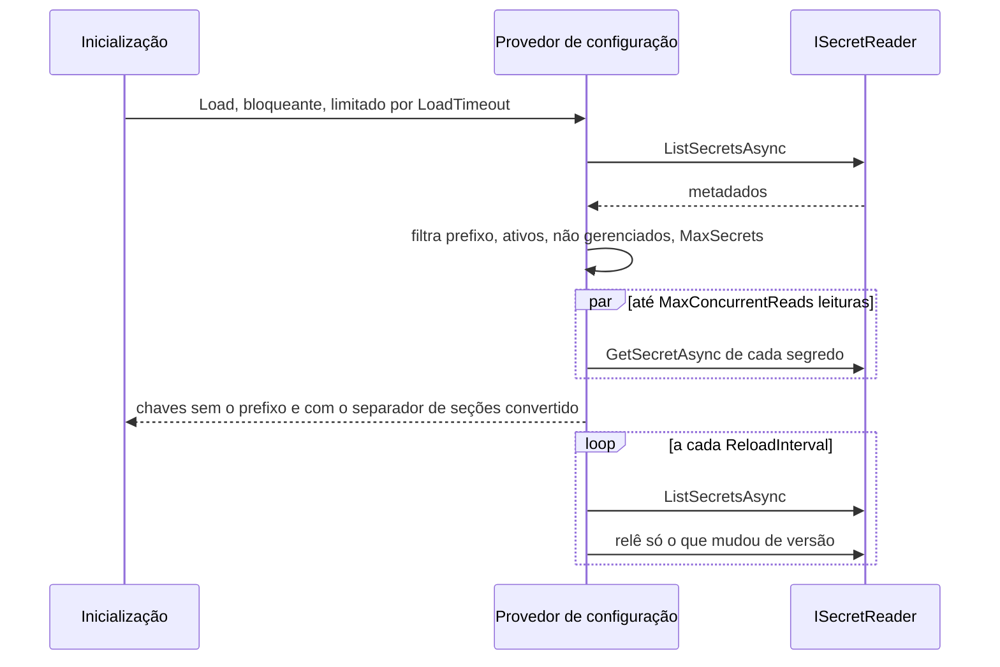

[🏠 TEC.Vault](../README.md) › [📚 Documentação](README.md) › 🧾 Segredos no IConfiguration

# 🧾 Segredos no IConfiguration

> Carrega segredos do cofre como chaves do `IConfiguration`, para bibliotecas que só sabem ler configuração (strings de conexão, opções de terceiros), com prefixo por aplicação, limites de segurança e recarga incremental.

## 📑 Sumário

- [🎯 Visão geral](#-visão-geral)
- [🚀 Uso](#-uso)
- [📘 Referência da API](#-referência-da-api)
- [⚙️ Opções](#️-opções)
- [❌ Erros](#-erros)
- [🛡️ Segurança](#️-segurança)
- [❓ Perguntas frequentes](#-perguntas-frequentes)

---

## 🎯 Visão geral



| Segredo no cofre | Chave no `IConfiguration` (com `Prefix = "MinhaApi--"`) |
|---|---|
| `MinhaApi--ConnectionStrings--Default` | `ConnectionStrings:Default` |
| `MinhaApi--Parceiro--ApiKey` | `Parceiro:ApiKey` |
| `OutraApi--Senha` | *(ignorado: outro prefixo)* |
| Segredo desabilitado, expirado ou gerenciado (de certificado) | *(ignorado)* |

- A fonte depende **só de `ISecretReader`**: funciona com qualquer provedor.
- Os segredos têm precedência sobre as fontes adicionadas antes (ex.: `appsettings.json`).
- Três formas de adicionar:

| Forma | Pacote | Quando usar |
|---|---|---|
| `Configuration.AddTecVault(ISecretReader store, ...)` | `TEC.Vault` | Você já tem um leitor (qualquer provedor) |
| `Configuration.AddTecVaultAzureKeyVault(...)` | `TEC.Vault.AzureKeyVault` | Atalho para o Azure Key Vault |
| `Configuration.AddTecVault(IConfiguration vaultSection, providers, ...)` | `TEC.Vault` | Provedor escolhido pela seção `Vault` ([⚙️ Escolha do cofre pela configuração](configuracao-por-appsettings.md)) |

---

## 🚀 Uso

### Com qualquer leitor

```csharp
using TEC.Vault.Configuration;

var builder = WebApplication.CreateBuilder(args);

// O IConfiguration é montado antes do DI: informe um ILoggerFactory para ter log das falhas
using var configLogs = LoggerFactory.Create(l => l.AddConsole());

builder.Configuration.AddTecVault(mySecretReader, o =>
{
    o.Prefix = "MinhaApi--";
    o.ReloadInterval = TimeSpan.FromMinutes(30);
}, loggerFactory: configLogs);

var connectionString = builder.Configuration.GetConnectionString("Default");   // segredo MinhaApi--ConnectionStrings--Default
```

### Azure Key Vault

```csharp
using TEC.Vault.AzureKeyVault;
using TEC.Vault.DependencyInjection;

using var configLogs = LoggerFactory.Create(l => l.AddConsole());

builder.Configuration.AddTecVaultAzureKeyVault(
    o =>
    {
        o.VaultUri = new Uri("https://<nome-do-cofre>.vault.azure.net/");
        o.Stores = VaultStores.Secrets;
    },
    c =>
    {
        c.Prefix = "MinhaApi--";
        c.ReloadInterval = TimeSpan.FromMinutes(30);
        c.MaxSecrets = 100;
    },
    configLogs);
```

### Provedor escolhido pela configuração

`appsettings.Production.json`:

```json
{
  "Vault": {
    "Provider": "HashiCorpVault",
    "HashiCorpVault": {
      "Address": "https://vault.interno:8200",
      "Auth": { "Method": "Kubernetes", "Role": "minha-api" },
      "Kv": { "BasePath": "minha-api" }
    },
    "Configuration": { "Prefix": "MinhaApi--", "ReloadInterval": "00:30:00" }
  }
}
```

```csharp
using TEC.Vault.Configuration;
using TEC.Vault.DependencyInjection;
using TEC.Vault.HashiCorpVault;
using TEC.Vault.InMemory;
using TEC.Vault.Synced;

var vault = builder.Configuration.GetSection("Vault");
static void Providers(VaultProviderCatalog p) => p.AddInMemory().AddSynced().AddHashiCorpVault();

builder.Services.AddTecVault(vault, Providers);    // container primeiro (veja o aviso em Segurança)

using var configLogs = LoggerFactory.Create(l => l.AddConsole());
builder.Configuration.AddTecVault(vault, Providers, loggerFactory: configLogs);

var connectionString = builder.Configuration.GetConnectionString("Db");   // segredo MinhaApi--ConnectionStrings--Db
```

| Regra | Comportamento |
|---|---|
| Seção usada na escolha | Lida na hora da chamada, das fontes **já adicionadas** (ex.: `appsettings.json`): os segredos carregados por esta fonte não influenciam a escolha dela |
| Provedor usado | O de **segredos**: `Vault:Secrets:Provider` ou `Vault:Provider` |
| Outras famílias e `Vault:Cache` | Aceitas sem validar (valem só no container) |
| Seção do provedor escolhido, `Vault:Configuration` e a raiz | Validadas como no container: chave desconhecida ou valor inválido → `InvalidOperationException` com o caminho, sem o valor |
| Instância do leitor | Própria da fonte (diferente da registrada no container): nos provedores com versão por HMAC ([📂 Synced](provedor-synced.md)) as versões das duas instâncias diferem |
| `configure` | Roda depois de `Vault:Configuration` (o código vence) |

### Em Development, com o provedor em memória

```csharp
using TEC.Vault.Configuration;
using TEC.Vault.InMemory;

// Qualquer ISecretReader serve como fonte
var local = new InMemorySecretStore(new InMemoryVaultOptions { HostEnvironment = builder.Environment });
await local.SetSecretAsync("MinhaApi--ConnectionStrings--Default", "Server=localhost;Database=dev;Integrated Security=true");
builder.Configuration.AddTecVault(local, c => c.Prefix = "MinhaApi--");
```

---

## 📘 Referência da API

### `VaultConfigurationBuilderExtensions`

> `TEC.Vault.Configuration` · `static class` · pacote `TEC.Vault`

| Membro | Retorno | Descrição |
|---|---|---|
| `AddTecVault(this IConfigurationBuilder builder, ISecretReader store, Action<VaultConfigurationOptions>? configure = null, TimeProvider? timeProvider = null, ILoggerFactory? loggerFactory = null)` | `IConfigurationBuilder` | Adiciona os segredos de `store` à configuração |

### `VaultConfigurationSelectionExtensions`

> `TEC.Vault.Configuration` · `static class` · pacote `TEC.Vault`

| Membro | Retorno | Descrição |
|---|---|---|
| `AddTecVault(this IConfigurationBuilder builder, IConfiguration vaultSection, Action<VaultProviderCatalog> providers, Action<VaultConfigurationOptions>? configure = null, ILoggerFactory? loggerFactory = null)` | `IConfigurationBuilder` | Cria o leitor do provedor de segredos escolhido, com as opções de `Vault:<NomeDoProvedor>`, e chama `AddTecVault(store, ...)` com as opções de `Vault:Configuration` |

### `AzureKeyVaultExtensions.AddTecVaultAzureKeyVault`

> `TEC.Vault.AzureKeyVault` · método de extensão · pacote `TEC.Vault.AzureKeyVault`

| Membro | Retorno | Descrição |
|---|---|---|
| `AddTecVaultAzureKeyVault(this IConfigurationBuilder builder, Action<AzureKeyVaultOptions> configure, Action<VaultConfigurationOptions>? configureConfiguration = null, ILoggerFactory? loggerFactory = null)` | `IConfigurationBuilder` | Cria o store de segredos do Azure Key Vault (opções validadas na hora) e chama `AddTecVault`; `loggerFactory` serve ao store (auditoria) e à fonte |

### `VaultConfigurationOptions`

> `TEC.Vault.Configuration` · `sealed class` · pacote `TEC.Vault`

Opções da fonte; tabela completa em [⚙️ Opções](#️-opções). A constante `FullReloadEvery` (`12`) define a cada quantas recargas incrementais é feita uma releitura completa.

---

## ⚙️ Opções

| Opção (`VaultConfigurationOptions`) | Chave em `Vault:Configuration` | Padrão | Descrição |
|---|---|---|---|
| `Prefix` | `Prefix` | `null` | Carrega só segredos com o prefixo (sem diferenciar maiúsculas), removendo-o da chave. Recomendado: um por aplicação |
| `SectionSeparator` | `SectionSeparator` | `"--"` | Separador de seções no nome (vazio → `ArgumentException`) |
| `ReloadInterval` | `ReloadInterval` | `null` | Recarga periódica, mínimo 1 minuto; `null` = só na subida |
| `Optional` | `Optional` | `false` | `true` = sobe com configuração vazia se a **primeira** carga falhar (erro do cofre, tempo limite, `MaxSecrets` ou exceção do leitor) |
| `MaxSecrets` | `MaxSecrets` | `500` | Máximo de segredos carregados (≥ 1); acima disso a carga falha fechada |
| `LoadTimeout` | `LoadTimeout` | `30 s` | Tempo máximo de cada carga (listagem + leituras), maior que zero e até 10 minutos |
| `MaxConcurrentReads` | `MaxConcurrentReads` | `4` | Leituras simultâneas durante a carga, de 1 a 16 |

### Carga e recarga

- **Carga inicial bloqueante:** o pipeline de configuração é síncrono; a subida espera a leitura do cofre, limitada por `LoadTimeout`.
- **Recarga incremental:** só relê os segredos cuja versão (ou, sem versão na listagem, `UpdatedOn`) mudou desde a última carga. A cada 12 recargas (`FullReloadEvery`), relê tudo.
- **Paralelismo limitado:** a primeira falha de leitura cancela as demais e a carga inteira falha (nunca publica uma configuração pela metade).
- **Sem mudança, sem notificação:** se os valores não mudaram, `OnReload` não é disparado.
- **Cargas simultâneas** (`IConfigurationRoot.Reload()` durante a recarga do timer): cada carga recebe um número de geração ao começar e só é aplicada se nenhuma carga iniciada depois já foi aplicada. Uma carga antiga e lenta é descartada (evento 2107 `Debug`).
- **Segredo removido do cofre** some da configuração na recarga seguinte.

---

## ❌ Erros

| Situação | Comportamento | Log (evento) |
|---|---|---|
| Carga concluída | Valores publicados no `IConfiguration` | 2104 `Information`: quantidade carregada e lida do cofre |
| Primeira carga falha, `Optional = false` | `InvalidOperationException`: `Não foi possível carregar a configuração do cofre (<código>). Verifique o log e as permissões da identidade da aplicação.` A aplicação não sobe | 2100 `Error` |
| Primeira carga falha, `Optional = true` | Sobe com configuração vazia | 2100 `Error` |
| Leitor **lança exceção** na carga, `Optional = false` | A exceção original é propagada | 2106 `Error` (com pilha) |
| Leitor lança exceção na carga, `Optional = true` | Sobe com configuração vazia (ou mantém os valores, se já houve carga); a recarga do timer continua agendada | 2106 `Error` + 2100 `Error` (`EXCECAO_NA_CARGA`); se já houve carga aplicada, 2101 `Warning` no lugar do 2100 |
| `IConfigurationRoot.Reload()` falha depois de uma carga bem-sucedida | Valores anteriores **mantidos**; sem `Optional`, o `Reload()` lança `InvalidOperationException` | 2101 `Warning` (2100 `Error` fica só para a carga inicial) |
| Recarga do **timer** falha | Valores anteriores **mantidos** | 2101 `Warning` |
| Mais segredos que `MaxSecrets` | Falha fechada, código lógico `LIMITE_MAX_SECRETS` | 2102 `Error` |
| Passou de `LoadTimeout` | Falha, código lógico `TEMPO_LIMITE` | 2103 `Error` |
| Exceção inesperada na recarga do timer (inclusive de um assinante de `OnReload`) | Valores mantidos | 2105 `Error` |

Erros de registro:

| Exceção | Quando |
|---|---|
| `InvalidOperationException` | `Nenhum provedor de segredos escolhido (Vault:Secrets:Provider ou Vault:Provider).` |
| `InvalidOperationException` | `O provedor '<nome>' não pode ser usado como fonte de configuração.` |
| `InvalidOperationException` | `Configuração inválida em Vault:Configuration:<chave>: ...` e demais [erros da escolha por configuração](configuracao-por-appsettings.md#-erros) |
| `InvalidOperationException` | Opções inválidas do Azure Key Vault em `AddTecVaultAzureKeyVault` (validadas na hora) |
| `ArgumentOutOfRangeException` / `ArgumentException` | Opção de `VaultConfigurationOptions` fora da faixa, definida em código |
| `ArgumentNullException` | `builder`, `store`, `vaultSection` ou `providers` nulos |

---

## 🛡️ Segurança

> [!IMPORTANT]
> Os valores ficam em memória no `IConfiguration` durante toda a vida da aplicação. Para segredos de alto valor, leia sob demanda com `ISecretReader`. Use sempre um `Prefix`: sem ele a aplicação tenta carregar o cofre inteiro (e falha acima de `MaxSecrets`).

> [!WARNING]
> Com o provedor escolhido pela configuração, registre o container (`services.AddTecVault(vault, ...)`) **antes** desta fonte. Depois que ela é adicionada, um segredo `MinhaApi--Vault--...` vira uma chave `Vault:...` e passaria a valer para uma escolha lida depois (ex.: trocar o `Address` do provedor usado pelo container).

- Os logs trazem só o provedor, o código de erro e contagens: nunca nomes de chave com valor, nunca valores.
- Falha fechada por padrão (`Optional = false`): a aplicação não sobe sem os segredos que espera. Use `Optional = true` só se ela funciona sem eles.
- Uma recarga com falha nunca apaga segredos já carregados: um cofre fora do ar não derruba a configuração em uso.

---

## ❓ Perguntas frequentes

<details>
<summary>A aplicação não sobe: <code>Não foi possível carregar a configuração do cofre (VAULT_...)</code></summary>

A carga inicial falhou (falha fechada por padrão). Códigos lógicos possíveis além dos de `VaultErrors`: `TEMPO_LIMITE` (passou de `LoadTimeout`) e `LIMITE_MAX_SECRETS` (mais segredos que `MaxSecrets`). Veja o log (eventos 2100–2103), corrija permissão/prefixo ou aumente os limites. Sem `loggerFactory`, só a exceção informa o motivo.

</details>

<details>
<summary>Atualizei o segredo no cofre e a configuração não mudou.</summary>

Sem `ReloadInterval`, a carga é só na subida. Com ele, a mudança aparece na próxima recarga (mínimo 1 minuto). Para ver na hora, leia com `ISecretReader` ou chame `IConfigurationRoot.Reload()`.

</details>

<details>
<summary>Por que o segredo do certificado não aparece na configuração?</summary>

Segredos gerenciados (criados pelo cofre para um certificado), desabilitados ou expirados são ignorados de propósito.

</details>

<details>
<summary>Uso <code>IOptions&lt;T&gt;</code> com segredos?</summary>

Sim: depois de carregados, os segredos são chaves comuns do `IConfiguration`, então `services.Configure<T>(builder.Configuration.GetSection("Parceiro"))` funciona. Com recarga, use `IOptionsMonitor<T>`.

</details>

---
⬅️ [⚙️ Escolha do cofre pela configuração](configuracao-por-appsettings.md) · [📚 Índice](README.md) · [💾 Cache e health check](cache-e-health-check.md) ➡️
