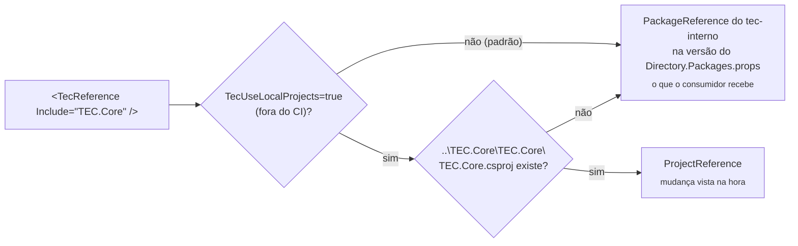

[🏠 TEC.Vault](../README.md) › [📚 Documentação](README.md) › 💻 Desenvolvimento local

# 💻 Desenvolvimento local

> Como compilar, testar e empacotar o TEC.Vault na sua máquina: por padrão com o TEC.Core do feed `tec-interno` (o que o
> consumidor recebe) e, sob demanda, com o repositório TEC.Core vizinho, sem publicar pacote.

## 📑 Sumário

- [🎯 Visão geral](#-visão-geral)
- [🚀 Uso](#-uso)
  - [Pré-requisitos](#pré-requisitos)
  - [Clonar lado a lado](#clonar-lado-a-lado)
  - [Compilar, testar e empacotar](#compilar-testar-e-empacotar)
  - [Lock files](#lock-files)
  - [HashiCorp Vault local](#hashicorp-vault-local)
  - [Arquivos canônicos](#arquivos-canônicos)
  - [Contribuição](#contribuição)
- [⚙️ Opções](#️-opções)
- [❌ Erros](#-erros)
- [🛡️ Segurança](#️-segurança)
- [❓ Perguntas frequentes](#-perguntas-frequentes)

---

## 🎯 Visão geral

O `TEC.Vault` depende do `TEC.Core`, declarado no csproj por `<TecReference Include="TEC.Core" />` (nunca por
`PackageReference`). O `build/Tec.Build.targets` decide como resolver essa referência:



| Modo | Quando | Referência | Lock file |
|---|---|---|---|
| Pacote | **Padrão**, na máquina e no CI (`CI=true` sempre usa pacote) | `PackageReference` na versão publicada declarada no `Directory.Packages.props` do feed `tec-interno` | `packages.lock.json` (versionado) |
| Local | Sob demanda: `-p:TecUseLocalProjects=true` fora do CI, com o repositório vizinho presente (sem ele, continua pacote) | `ProjectReference` para `..\TEC.Core\TEC.Core\TEC.Core.csproj` | `packages.local.lock.json` (fora do git) |

> [!IMPORTANT]
> Como o padrão é o pacote, compilar o TEC.Vault exige **leitura do feed `tec-interno`** na máquina (credencial
> configurada uma vez; veja [Pré-requisitos](#pré-requisitos)). O modo local serve para alterar o TEC.Core e testar a
> mudança aqui sem publicar pacote.

> [!TIP]
> **Versão do TEC.* consumido:** fica no `Directory.Packages.props` deste repositório
> (`<PackageVersion Include="TEC.Core" Version="0.0.1" />`); o csproj mantém só `<TecReference Include="TEC.Core" />`,
> sem versão. Para usar outra versão publicada, altere esse `PackageVersion` (o Dependabot abre o PR) e regenere os
> `packages.lock.json` ([Lock files](#lock-files)). Os componentes evoluem de forma independente: o TEC.Core pode ficar
> em `0.0.1` enquanto o TEC.Vault sobe a própria `<Version>`.

---

## 🚀 Uso

### Pré-requisitos

| Item | Detalhe |
|---|---|
| SDK | .NET 10 (`global.json`: `10.0.100`, `rollForward: latestFeature`) e o runtime 8.0 para rodar os testes em `net8.0` |
| Docker | Só para a integração com o HashiCorp Vault |
| Azure CLI | Só para a integração com o Key Vault de testes (`az login`) |
| Feed `tec-interno` | Leitura obrigatória no modo pacote, o padrão (PAT classic com `read:packages`; o GitHub Packages exige token mesmo para pacote público) |

```bash
# Credencial do feed (uma vez por máquina, fora do repositório; no Linux/macOS acrescente --store-password-in-clear-text)
dotnet nuget update source tec-interno -u <usuario-github> -p <PAT>
# ou, se a origem ainda não existir no NuGet.Config do usuário:
dotnet nuget add source https://nuget.pkg.github.com/tudoemcodigo/index.json -n tec-interno -u <usuario-github> -p <PAT>
```

### Clonar lado a lado

```text
D:\Projetos\Componentes\
├── tec-workflows\   CI/CD e arquivos canônicos
├── TEC.Core\        ⟵ dependência do TEC.Vault
├── TEC.Vault\       este repositório
└── ...              TEC.Cqrs, TEC.Security, TEC.Observability, TEC.ORM
```

Só é necessário para o modo local. A raiz dos componentes é a pasta acima do repositório (`TecComponentsRoot`); com o
`TEC.Core` ali e `-p:TecUseLocalProjects=true`, tudo compila junto e uma mudança no Core aparece no Vault na hora:

```bash
dotnet build TEC.Vault.slnx -p:TecUseLocalProjects=true
dotnet test --project TEC.Vault.Tests -p:TecUseLocalProjects=true --treenode-filter "/*/*/*/*[Category!=Integracao]"
```

### Compilar, testar e empacotar

```bash
dotnet build TEC.Vault.slnx -c Release
dotnet test --project TEC.Vault.Tests --treenode-filter "/*/*/*/*[Category!=Integracao]"
dotnet pack TEC.Vault.slnx -c Release -o ./pacotes      # só os 6 projetos de pacote (IsTecPackage)
```

> [!IMPORTANT]
> Nos pacotes **todo aviso é erro** (analisadores CA/IDE, nullable, XML doc, IL de AOT/trimming). Rode o build em Release
> antes do PR. Categorias, integração e carga: [🧪 Testes](testes.md).

### Lock files

O `packages.lock.json` versionado é sempre o do **modo pacote**, o padrão (o CI restaura com `--locked-mode`). No modo
local (`-p:TecUseLocalProjects=true`) o NuGet usa `packages.local.lock.json`, ignorado pelo git. Depois de mudar uma
dependência, regenere o lock versionado:

```bash
dotnet restore TEC.Vault.slnx --force-evaluate
```

> [!WARNING]
> Regenerar o lock versionado (e compilar no modo padrão) exige que as versões TEC.* referenciadas **já estejam publicadas** no feed (ordem: Core →
> Vault → Cqrs → Security → Observability → ORM). Enquanto o `TEC.Core` 0.0.1 não estiver no feed, esse restore falha.

### HashiCorp Vault local

Para os testes de integração do `TEC.Vault.HashiCorpVault`, suba um Vault **descartável na porta 18200** e prepare-o com o
mesmo script do CI:

```bash
docker run --rm -d --name tec-vault-testes --cap-add=IPC_LOCK \
  -e VAULT_DEV_ROOT_TOKEN_ID=tec-dev-root -p 127.0.0.1:18200:8200 hashicorp/vault:2.1.1
VAULT_ADDR=http://127.0.0.1:18200 VAULT_TOKEN=tec-dev-root bash .github/scripts/vault-dev.sh
```

As variáveis `TEC_TESTES_HASHICORP_*` e o comando dos testes estão em
[🧪 Testes](testes.md#integração-com-o-hashicorp-vault).

> [!CAUTION]
> **Nunca use a porta 8200 da máquina**: ela pode ser de outro Vault em uso, e o script usa o token root para montar
> Transit e PKI. No runner do CI o container é exclusivo do job, por isso lá ele ouve na 8200.

### Arquivos canônicos

`build/`, `Directory.Build.targets`, `.editorconfig`, `nuget.config`, `.gitignore`, `.gitattributes`, `global.json`,
`LICENSE`, `Images/Logo.png`, `.github/dependabot.yml` e `.github/zizmor.yml` vêm do
[tec-workflows](https://github.com/tudoemcodigo/tec-workflows) e **não são editados aqui**: altere no tec-workflows e
sincronize com `scripts/sync-template.sh TEC.Vault`. O job *Convenções* do CI falha se uma cópia divergir. O que é deste
repositório: `Directory.Build.props` (`TecComponent` e `Version`), `Directory.Packages.props` e os csproj.

### Contribuição

1. Crie uma branch a partir da `main` (push direto é bloqueado).
2. Código: identificadores em inglês; comentários, XML docs, mensagens e documentação em português.
3. Teste novo para todo comportamento novo ou corrigido; segurança com teste que prove o controle.
4. Atualize `docs/` e o [CHANGELOG](../CHANGELOG.md).
5. Abra o PR: o check obrigatório é **`ci / ci-ok`**.

---

## ⚙️ Opções

| Propriedade MSBuild | Padrão | Descrição |
|---|---|---|
| `TecUseLocalProjects` | `false` (sempre `false` com `CI=true`) | `true` liga a troca de `TecReference` por `ProjectReference` quando o repositório vizinho existe |
| `TecComponentsRoot` | Pasta acima do repositório | Onde procurar os repositórios vizinhos (`<raiz>\TEC.Core\TEC.Core\TEC.Core.csproj`) |
| `PackageVersion` dos TEC.* (`Directory.Packages.props`) | `0.0.1` | Versão publicada de cada TEC.* consumido no modo pacote (o Dependabot atualiza) |
| `Version` (`Directory.Build.props`) | `0.0.1` | Versão única dos 6 pacotes deste repositório; base das prévias do CI (`<Version>-preview.N` a cada push na `main`). Suba depois de publicar `X.Y.Z` |

---

## ❌ Erros

| Erro | Quando ocorre | O que fazer |
|---|---|---|
| `NU1100 Unable to resolve 'TEC.Core'` | Modo pacote sem a origem `tec-interno` (ou com outro nome) | Adicione a origem com o nome exato `tec-interno` (ou use o modo local com o `TEC.Core` clonado ao lado) |
| `401`/`403` no restore | PAT sem `read:packages` ou expirado | Gere outro PAT classic e refaça o `dotnet nuget update source tec-interno` |
| `NU1004` no restore | Lock file desatualizado | Regenere com `dotnet restore TEC.Vault.slnx --force-evaluate` |
| `NU1901`–`NU1904` | Vulnerabilidade conhecida em dependência (inclusive transitiva) | Atualize o pacote no `Directory.Packages.props` e regenere os locks |
| `Use <TecReference ...> em vez de PackageReference` | `PackageReference` para um TEC.* | Troque por `<TecReference Include="TEC.X" />` |
| `dotnet test` roda 0 testes (código 5) | `-nologo` no Microsoft.Testing.Platform | Remova `-nologo` |

---

## 🛡️ Segurança

> [!WARNING]
> Nunca coloque o PAT do feed no `nuget.config` do repositório: ele fica só no NuGet.Config do usuário (no Windows,
> criptografado).

- `packageSourceMapping`: `TEC.*` só do `tec-interno`, o resto só do nuget.org (contra *dependency confusion*).
- `appsettings.Local.json` dos projetos de teste e `packages.local.lock.json` ficam fora do git.

---

## ❓ Perguntas frequentes

<details>
<summary>Mudei o TEC.Core e o TEC.Vault não viu a mudança.</summary>

Por padrão o TEC.Vault usa o pacote publicado do TEC.Core. Compile com `-p:TecUseLocalProjects=true`, confira se o
`TEC.Core` está em `..\TEC.Core\TEC.Core\TEC.Core.csproj` em relação a este repositório e se a variável `CI` não está
definida como `true` no seu terminal (no CI a opção é ignorada).

</details>

<details>
<summary>Preciso commitar o <code>packages.local.lock.json</code>?</summary>

Não. Só o `packages.lock.json` (modo pacote) vai para o git.

</details>

---
⬅️ [🧪 Testes](testes.md) · [📚 Índice](README.md)
