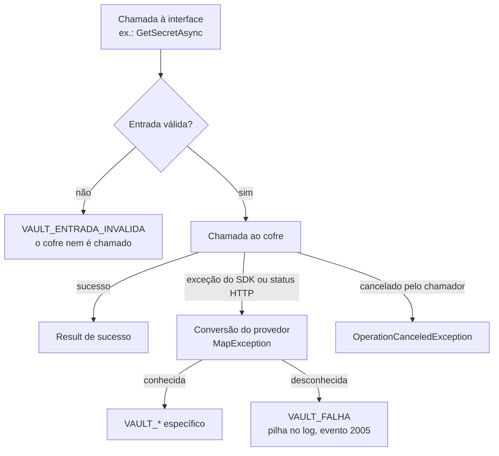
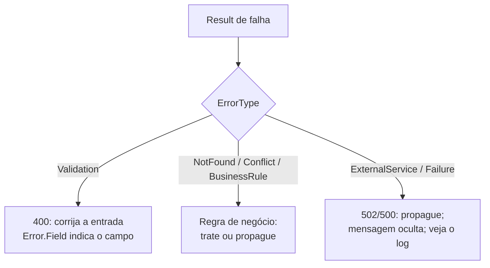

[🏠 TEC.Vault](../README.md) › [📚 Documentação](README.md) › ❌ Erros

# ❌ Erros

> Todo provedor converte as suas falhas para os mesmos códigos de `VaultErrors`: a aplicação trata o resultado do mesmo jeito, seja qual for o cofre.

## 📑 Sumário

- [🎯 Visão geral](#-visão-geral)
- [🚀 Uso](#-uso)
- [📘 Referência da API](#-referência-da-api)
- [🔁 Conversão por provedor](#-conversão-por-provedor)
- [⚙️ Opções](#️-opções)
- [❌ Erros](#-erros-1)
- [🛡️ Segurança](#️-segurança)
- [❓ Perguntas frequentes](#-perguntas-frequentes)

---

## 🎯 Visão geral

Toda operação assíncrona das interfaces devolve `Result`/`Result<T>` do [TEC.Core](https://github.com/tudoemcodigo/lib-tec-core). Uma falha carrega um `Error` com **código** (`VAULT_*`), **tipo** (`ErrorType`) e, em entrada inválida, o **campo** (`Error.Field`). O tipo decide o status HTTP quando o `Result` chega a uma API pelo TEC.Core.



| Princípio | Como funciona |
|---|---|
| Erro como valor | Falhas do cofre viram `Result` de falha; só o cancelamento pedido pelo chamador lança `OperationCanceledException` |
| Falha cedo na configuração | Erros de **configuração** lançam exceção na subida da aplicação (veja [Exceções de configuração](#exceções-de-configuração)) |
| Mensagens neutras | Nunca incluem nome de item, endereço do cofre, identidade ou resposta do provedor |
| Detalhe só no log | O código técnico do cofre (ex.: `403 ForbiddenByRbac`, `503 Retry-After acima do limite`) vai para o log, nunca para o cliente |

---

## 🚀 Uso

### Tratar pelo código

```csharp
using TEC.Core.Common.Results;
using TEC.Vault.Abstractions;
using TEC.Vault.Common;

public sealed class ConnectionStringProvider(ISecretReader vault)
{
    public async Task<Result<string>> GetAsync(CancellationToken cancellationToken)
    {
        var secret = await vault.GetSecretAsync("db-senha", cancellationToken: cancellationToken);
        if (secret.IsSuccess)
            return $"Server=db;Password={secret.Value.Value}";

        switch (secret.Error!.Code)
        {
            case VaultErrors.NotFoundCode:
                // segredo ainda não cadastrado: devolva um erro de negócio próprio
                return Error.NotFound("DB_SENHA_AUSENTE", "A senha do banco não foi cadastrada.");
            case VaultErrors.DisabledCode:
                // versão atual desabilitada: alguém revogou a senha
                return Error.BusinessRule("DB_SENHA_REVOGADA", "A senha do banco foi revogada.");
            default:
                // infraestrutura (permissão, rede, limite): propague; o TEC.Core oculta a mensagem do cliente
                return secret.ToFailure<string>();
        }
    }
}
```

### Tratar pelo tipo



```csharp
// Em um handler do TEC.Cqrs ou num endpoint: propague o Result; o TEC.Core escolhe o status HTTP pelo ErrorType
public async Task<Result<TokenDto>> Handle(GetToken request, CancellationToken cancellationToken)
{
    var secret = await vault.GetSecretAsync(request.Name, cancellationToken: cancellationToken);
    if (secret.IsFailure)
        return secret.ToFailure<TokenDto>();

    return new TokenDto(secret.Value.Name, secret.Value.Version);
}
```

> [!TIP]
> Não transforme falhas de infraestrutura em mensagens para o usuário: elas indicam problema de configuração
> (permissão, rede, limite) que só aparece no log, onde o código do cofre está registrado (eventos 2004 e 2005 em
> [Observabilidade](observabilidade.md)).

---

## 📘 Referência da API

### `VaultErrors`

> `TEC.Vault.Common` · `static class` · pacote `TEC.Vault`

| Membro | Retorno | Descrição |
|---|---|---|
| `InvalidInputCode` … `TooManyItemsCode` | `const string` | Os 14 códigos (tabela abaixo) |
| `InvalidInput(string field, string message)` | `Error` | Entrada inválida (`Validation`), com o campo |
| `NotFound()` | `Error` | Item não encontrado (`NotFound`) |
| `Conflict()` | `Error` | Estado que impede a operação (`Conflict`) |
| `Disabled()` | `Error` | Item desabilitado (`BusinessRule`) |
| `NotExportable()` | `Error` | Certificado sem chave exportável (`BusinessRule`) |
| `Rejected()` | `Error` | Dados recusados pelo cofre (`Validation`) |
| `AccessDenied()` | `Error` | Identidade sem permissão (`ExternalService`) |
| `AuthenticationFailed()` | `Error` | Falha de autenticação (`ExternalService`) |
| `Throttled()` | `Error` | Limite de requisições (`ExternalService`) |
| `Unavailable()` | `Error` | Cofre indisponível (`ExternalService`) |
| `NotSupported()` | `Error` | Operação não suportada pelo provedor (`Failure`) |
| `ProviderFailure()` | `Error` | Falha não classificada (`ExternalService`) |
| `Canceled()` | `Error` | Etapa cancelada depois de parte da operação já feita no cofre (`Failure`); usado em `SecretRotationResult.Errors` |
| `TooManyItems()` | `Error` | Listagem acima do limite de itens do provedor (`Failure`) |

### Tabela de códigos

| Constante | Código | ErrorType | HTTP | Quando ocorre | Como resolver |
|---|---|---|:---:|---|---|
| `InvalidInputCode` | `VAULT_ENTRADA_INVALIDA` | Validation | 400 | Entrada recusada **antes** de chamar o cofre (nome, versão, valor, tags, datas, opções); envelope adulterado ou de outro contexto. Mensagem específica do campo, nunca repete o valor | Corrija o campo indicado em `Error.Field` |
| `RejectedCode` | `VAULT_REQUISICAO_RECUSADA` | Validation | 400 | O cofre recusou os dados (texto cifrado inválido, algoritmo incompatível, operação não permitida na chave) | Confira algoritmo, versão e operações da chave |
| `NotFoundCode` | `VAULT_ITEM_NAO_ENCONTRADO` | NotFound | 404 | Item ou versão inexistente, ou excluído | Confira o nome; veja a lixeira |
| `ConflictCode` | `VAULT_CONFLITO` | Conflict | 409 | Nome excluído aguardando remoção definitiva; restaurar item que já existe | Recupere ou purgue o excluído; use outro nome |
| `DisabledCode` | `VAULT_ITEM_DESABILITADO` | BusinessRule | 422 | Versão, chave ou certificado desabilitado | Habilite ou use outra versão |
| `NotExportableCode` | `VAULT_CERTIFICADO_NAO_EXPORTAVEL` | BusinessRule | 422 | Download de certificado sem chave exportável | Assine com `IKeyCryptography` ou importe como exportável |
| `AccessDeniedCode` | `VAULT_ACESSO_NEGADO` | ExternalService | 502 🔒 | Identidade da **aplicação** sem papel; firewall/rede do cofre recusou | Conceda o papel mínimo; libere a rede |
| `AuthenticationFailedCode` | `VAULT_AUTENTICACAO_FALHOU` | ExternalService | 502 🔒 | Identidade indisponível, login recusado ou expirado, credencial ausente ou ilegível, tenant errado | Confira identidade, `TenantId`, arquivo/variável da credencial |
| `ThrottledCode` | `VAULT_LIMITE_EXCEDIDO` | ExternalService | 502 🔒 | Limite de requisições do cofre (429) | Ligue o cache; reduza leituras e concorrência |
| `UnavailableCode` | `VAULT_INDISPONIVEL` | ExternalService | 502 🔒 | Rede, DNS, tempo limite, 408/5xx, retentativas esgotadas, 503 com `Retry-After` acima do aceito | Verifique rede e status do cofre; ajuste tempos limite |
| `ProviderFailureCode` | `VAULT_FALHA` | ExternalService | 502 🔒 | Falha não classificada (pilha no log, evento 2005); resposta fora do formato ou acima do limite de tamanho | Veja o log |
| `NotSupportedCode` | `VAULT_OPERACAO_NAO_SUPORTADA` | Failure | 500 🔒 | Opção que o provedor não oferece (HSM, emissor, escrita pendente de aprovação no Infisical) | Remova a opção ou troque de provedor |
| `CanceledCode` | `VAULT_OPERACAO_CANCELADA` | Failure | 500 🔒 | Só em `SecretRotationResult.Errors`: rotação cancelada **depois** de gravar a nova versão | Conclua com `DisablePreviousSecretVersionsAsync` (idempotente) |
| `TooManyItemsCode` | `VAULT_LISTAGEM_ACIMA_DO_LIMITE` | Failure | 500 🔒 | A listagem passou do `MaxListItems` do provedor (Azure Key Vault, HashiCorp Vault); o restante não é lido | Use pasta/prefixo mais específico ou aumente `MaxListItems` |

🔒 = a mensagem nunca é exposta ao cliente da API (regra do TEC.Core para `ExternalService` e `Failure`). Um 403 do cofre é problema de configuração da aplicação, não do usuário.

> [!NOTE]
> Operações simples canceladas pelo chamador lançam `OperationCanceledException` e **não** usam
> `VAULT_OPERACAO_CANCELADA`: esse código existe só para operações compostas em que parte do trabalho já foi feita
> no cofre (hoje, a rotação de segredo).

### Exceções de configuração

Erros de **configuração** são detectados na subida e lançam exceção (falha cedo), em vez de virar `Result`. As mensagens citam o caminho da opção ou da chave (ex.: `HashiCorpVaultOptions.MaxListItems`, `Vault:HashiCorpVault:MaxListItems`) e nunca ecoam valores.

| Exceção | Origem |
|---|---|
| `InvalidOperationException` | `AddTecVault` chamado duas vezes (de propósito: uma segunda configuração nunca é ignorada em silêncio); nenhum provedor; dois provedores para a mesma família; classe de provedor já registrada no container; opções inválidas de qualquer provedor (`AzureKeyVaultOptions`, `HashiCorpVaultOptions`, `InfisicalOptions`, opções do Synced e do HTTP, inclusive `MaxListItems` fora de 1..1.000.000); `Developer` ou provedor em memória fora de Development; `Stores` inválido; endereço HTTP do cofre fora de localhost/Development; credencial com arquivo **e** variável (ou nenhum); carga inicial do `IConfiguration` com falha (sem `Optional`); na [escolha por configuração](configuracao-por-appsettings.md): provedor desconhecido, chave desconhecida, valor inválido, segredo em texto |
| `ArgumentOutOfRangeException` | `EnableSecretCache` com duração inválida; `VaultConfigurationOptions` fora da faixa (`ReloadInterval`, `LoadTimeout`...) |
| `ArgumentException` | `UseKeyStore<T>` com tipo que não implementa `IKeyReader` nem `IKeyCryptography`; segredo inicial inválido no provedor em memória; `SectionSeparator` vazio |
| `OperationCanceledException` | Cancelamento pedido pelo chamador em qualquer operação |

---

## 🔁 Conversão por provedor

| Origem | Azure Key Vault | Em memória |
|---|---|---|
| Validação de entrada | `VAULT_ENTRADA_INVALIDA` (regras comuns + limites do Azure) | `VAULT_ENTRADA_INVALIDA` (regras comuns + limites em memória) |
| Item inexistente | HTTP 404 → `VAULT_ITEM_NAO_ENCONTRADO` | `VAULT_ITEM_NAO_ENCONTRADO` |
| Item desabilitado | HTTP 403 com `SecretDisabled`/`KeyDisabled`/`CertificateDisabled` → `VAULT_ITEM_DESABILITADO` | `VAULT_ITEM_DESABILITADO` |
| Nome na lixeira | HTTP 409 → `VAULT_CONFLITO` | `VAULT_CONFLITO` |
| Dados recusados | HTTP 400 → `VAULT_REQUISICAO_RECUSADA` | `CryptographicException`, chave fora da validade, operação não permitida → `VAULT_REQUISICAO_RECUSADA` |
| Permissão / rede | Demais HTTP 403 → `VAULT_ACESSO_NEGADO` | — |
| Autenticação | HTTP 401, falha de credencial → `VAULT_AUTENTICACAO_FALHOU` | — |
| Limite | HTTP 429 → `VAULT_LIMITE_EXCEDIDO` | — |
| Indisponível | HTTP 0/5xx, tempo limite, rede, retentativas esgotadas → `VAULT_INDISPONIVEL` | — |
| Listagem grande | Acima de `MaxListItems` → `VAULT_LISTAGEM_ACIMA_DO_LIMITE` (para de paginar) | — |
| Sem suporte | `NotSupportedException` → `VAULT_OPERACAO_NAO_SUPORTADA` | HSM ou emissor → `VAULT_OPERACAO_NAO_SUPORTADA` |
| Desconhecida | `VAULT_FALHA` | `VAULT_FALHA` |

| Origem | HashiCorp Vault e Infisical (HTTP) | Synced |
|---|---|---|
| Validação de entrada | `VAULT_ENTRADA_INVALIDA` (regras comuns + limites do cofre; opções sem equivalente, como validade e desabilitar; versão do HashiCorp com mais de 9 dígitos) | `VAULT_ENTRADA_INVALIDA` |
| Item inexistente | HTTP 404 → `VAULT_ITEM_NAO_ENCONTRADO` | `VAULT_ITEM_NAO_ENCONTRADO` (inclusive versão diferente da atual) |
| Item desabilitado | Certificado desabilitado no download (HashiCorp) → `VAULT_ITEM_DESABILITADO` | — |
| Conflito | HTTP 409/412; nome na lixeira do KV; nomes que só diferem em maiúsculas → `VAULT_CONFLITO` | — |
| Dados recusados | HTTP 400/422; algoritmo que não combina com a chave → `VAULT_REQUISICAO_RECUSADA` | — |
| Permissão | HTTP 403 (após novo login); valor oculto no Infisical → `VAULT_ACESSO_NEGADO` | Sem permissão de leitura no arquivo → `VAULT_ACESSO_NEGADO` |
| Autenticação | HTTP 401 (após novo login), login recusado, credencial ausente, ilegível ou acima de 64 KB → `VAULT_AUTENTICACAO_FALHOU` | — |
| Limite | HTTP 429 → `VAULT_LIMITE_EXCEDIDO` | — |
| Indisponível | HTTP 408/5xx, rede, tempo limite, 503 com `Retry-After` longo → `VAULT_INDISPONIVEL` | Pasta ou arquivo ausente, E/S → `VAULT_INDISPONIVEL` |
| Listagem grande | HashiCorp: acima de `MaxListItems` → `VAULT_LISTAGEM_ACIMA_DO_LIMITE` (conferido logo após listar os nomes, antes de ler metadados; vale também para listagens de versões e para a busca de nome sem diferenciar maiúsculas). Qualquer provedor HTTP: resposta acima de `MaxResponseBytes` → `VAULT_FALHA` (de propósito; log `resposta acima de MaxResponseBytes (N bytes)`) | Acima de `MaxItems` → `VAULT_FALHA` |
| Sem suporte | HSM, emissão pelo PKI sem papel, escrita pendente de aprovação (Infisical) → `VAULT_OPERACAO_NAO_SUPORTADA` | — |
| Formato inesperado | Resposta fora do formato ou acima do limite, item do KV sem o campo do valor → `VAULT_FALHA` | Arquivo acima do limite, UTF-8 inválido, JSON/.env inválido, nomes repetidos → `VAULT_FALHA` |

Detalhes de cada provedor: [Azure Key Vault](provedor-azure-key-vault.md) · [HashiCorp Vault](provedor-hashicorp-vault.md) · [Infisical](provedor-infisical.md) · [Synced](provedor-synced.md) · [em memória](provedor-em-memoria.md). A conversão padrão dos provedores HTTP (status → código) está em [Novo provedor](novo-provedor.md).

---

## ⚙️ Opções

`VaultErrors` não tem opções. Os limites que geram erros ficam nas opções de cada provedor:

| Opção | Onde | Erro que gera |
|---|---|---|
| `MaxListItems` (padrão 10.000; 1..1.000.000) | `AzureKeyVaultOptions` (`Vault:AzureKeyVault:MaxListItems`), `HashiCorpVaultOptions` (`Vault:HashiCorpVault:MaxListItems`) | `VAULT_LISTAGEM_ACIMA_DO_LIMITE` |
| `Http.MaxResponseBytes` (padrão 4 MB) | Provedores HTTP (HashiCorp Vault, Infisical) | `VAULT_FALHA` |
| `Http.MaxRetryDelay` (padrão 30 s) | Provedores HTTP | `Retry-After` maior: `VAULT_LIMITE_EXCEDIDO` (429) ou `VAULT_INDISPONIVEL` (503) sem esperar |
| `MaxItems` | Opções do Synced (`DirectorySecretsOptions`...) | `VAULT_FALHA` |
| `MaxSecrets` / `LoadTimeout` | `VaultConfigurationOptions` | Falha da carga do `IConfiguration` (veja [Segredos no IConfiguration](configuracao.md)) |

---

## ❌ Erros

| Código / exceção | Quando ocorre | O que fazer |
|---|---|---|
| `VAULT_ACESSO_NEGADO` em toda chamada | Identidade sem papel ou rede recusada; o log (evento 2004) traz o código do cofre, ex.: `403 Forbidden ForbiddenByRbac` ou `ForbiddenByConnection` | Conceda o papel mínimo (a propagação leva minutos) ou libere a rede |
| `VAULT_CONFLITO` ao gravar/criar | Nome de um item excluído que ainda está na lixeira | `RecoverDeleted*` ou `PurgeDeleted*` antes de criar de novo |
| `VAULT_LISTAGEM_ACIMA_DO_LIMITE` | Cofre com mais itens que `MaxListItems` | Limite o escopo (pasta/prefixo) ou aumente `MaxListItems` conscientemente |
| `VAULT_FALHA` | Exceção não mapeada (evento 2005, com pilha) ou resposta inesperada | Veja o log; abra um chamado com o código e o detalhe |
| `InvalidOperationException` na subida | Configuração inválida (mensagem cita o caminho da chave) | Corrija a opção indicada |

---

## 🛡️ Segurança

> [!IMPORTANT]
> As mensagens de `VaultErrors` são fixas: nunca levam nome de item, endereço do cofre, identidade ou corpo da
> resposta. `VaultHttpException` também nunca leva o corpo; o detalhe técnico (`VaultFailure.Detail`) vai só para o log.

> [!WARNING]
> Não exponha `Error.Message` de erros `ExternalService`/`Failure` por conta própria (por exemplo, serializando o
> `Error` inteiro): o TEC.Core já os oculta do cliente. Um 403 do cofre revela a quem ataca que a aplicação usa aquele
> cofre e qual papel falta.

- A entrada recusada nunca é ecoada: a mensagem descreve a regra (ex.: "Nome inválido: use de 1 a 127..."), não o valor. No log, o nome recusado aparece só como tamanho + HMAC (veja [Observabilidade](observabilidade.md)).
- Um padrão de validação que estoura o tempo limite de regex conta como **entrada recusada** (`VAULT_ENTRADA_INVALIDA`), nunca como exceção.

---

## ❓ Perguntas frequentes

<details>
<summary><code>Unable to resolve service for type ISecretBackup</code> (ou outra interface)</summary>

O provedor não implementa a capacidade (ex.: Infisical não tem lixeira nem backup) ou a família não foi registrada
(`Stores`). A ausência da interface é intencional: os provedores não implementam interfaces para devolver
`VAULT_OPERACAO_NAO_SUPORTADA`. Veja a página do provedor e a [injeção de dependências](injecao-de-dependencias.md).

</details>

<details>
<summary>Por que <code>VAULT_LISTAGEM_ACIMA_DO_LIMITE</code> é 500 e não 400?</summary>

Porque não é culpa de quem chamou: é a aplicação que lista um cofre maior do que a configuração permite. O tipo
`Failure` oculta a mensagem do cliente e aparece no log como falha de infraestrutura (evento 2004).

</details>

<details>
<summary>Recebi <code>VAULT_INDISPONIVEL</code> com o cofre respondendo 503 e <code>Retry-After</code></summary>

O cliente HTTP espera o `Retry-After` só até `Http.MaxRetryDelay` (padrão 30 s). Um 503 com espera maior falha na
hora com `VAULT_INDISPONIVEL` (um 429 nas mesmas condições vira `VAULT_LIMITE_EXCEDIDO`), sem prender a requisição.

</details>

<details>
<summary>Como sei qual campo da entrada foi recusado?</summary>

`Error.Field` traz o campo (`name`, `version`, `value`, `tags`, `expiresOn`, `notBefore`, `keySize`, `operations`,
`algorithm`, `certificate`...).

</details>

---
⬅️ [📈 Observabilidade](observabilidade.md) · [📚 Índice](README.md) · [🛡️ Segurança](seguranca.md) ➡️
