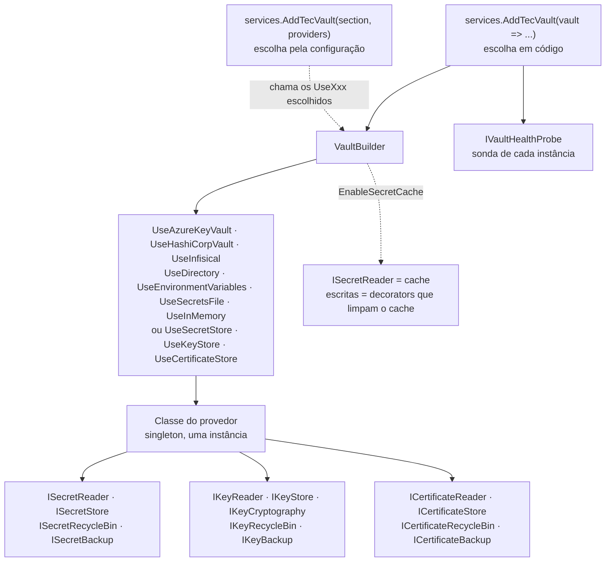

[🏠 TEC.Vault](../README.md) › [📚 Documentação](README.md) › 🧩 Injeção de dependências

# 🧩 Injeção de dependências

> Registra o cofre no container com uma única chamada: escolhe o provedor de cada família (segredos, chaves, certificados) e expõe só as interfaces que ele implementa.

## 📑 Sumário

- [🎯 Visão geral](#-visão-geral)
- [🚀 Uso](#-uso)
- [📘 Referência da API](#-referência-da-api)
- [⚙️ Opções](#️-opções)
- [❌ Erros](#-erros)
- [🛡️ Segurança](#️-segurança)
- [❓ Perguntas frequentes](#-perguntas-frequentes)

---

## 🎯 Visão geral



| Regra | Comportamento |
|---|---|
| **Uma instância por provedor** | Registrada como singleton (thread-safe). Cada interface que a classe implementa aponta para a mesma instância; a classe concreta também fica registrada |
| **Só o que é implementado** | Interfaces que o provedor não implementa não são registradas: pedir `ISecretBackup` a um provedor sem backup falha na resolução |
| **Um provedor por família** | Um cofre por aplicação: dois provedores diferentes para a mesma família lançam `InvalidOperationException` |
| **Mesmo provedor em várias famílias** | Registrado uma única vez (ex.: o HashiCorp Vault usa um login e um token para segredos, chaves e certificados) |
| **`AddTecVault` só uma vez** | A segunda chamada lança `InvalidOperationException` **de propósito**: uma configuração diferente nunca é ignorada em silêncio |
| **Registro que seria ignorado lança exceção** | Classe do provedor já registrada no container antes do `AddTecVault`, ou a mesma classe informada de novo com outra fábrica (ou com e sem fábrica). Repetir a mesma classe sem fábrica, ou com o mesmo delegate, é aceito |
| **`IVaultHealthProbe` sempre** | Registrado com `TryAdd`: uma sonda registrada antes pela aplicação é mantida ([Cache e health check](cache-e-health-check.md)) |
| **Falha na subida** | Toda validação acontece dentro do `AddTecVault`; nada fica para a primeira requisição |

Há duas formas de escolher o provedor, e as duas registram **exatamente o mesmo** no container:

| Forma | Quando usar | Detalhe |
|---|---|---|
| Em código: `AddTecVault(vault => vault.UseXxx(...))` | Um cofre fixo para a aplicação, opções montadas em código | Esta página |
| Pela configuração: `AddTecVault(section, providers)` | Um cofre por ambiente, trocado no `appsettings` sem recompilar | [⚙️ Escolha do cofre pela configuração](configuracao-por-appsettings.md) |

---

## 🚀 Uso

### Registro em código

```csharp
using TEC.Vault.AzureKeyVault;
using TEC.Vault.DependencyInjection;

var builder = WebApplication.CreateBuilder(args);

builder.Services.AddTecVault(vault => vault
    .UseAzureKeyVault(o =>
    {
        o.VaultUri = new Uri("https://<nome-do-cofre>.vault.azure.net/");
        o.Authentication = builder.Environment.IsDevelopment()
            ? AzureKeyVaultAuthentication.Developer
            : AzureKeyVaultAuthentication.ManagedIdentity;
        o.Stores = VaultStores.Secrets | VaultStores.Keys;   // menor privilégio: só o que a aplicação usa
    })
    .EnableSecretCache(TimeSpan.FromMinutes(5)));             // opcional

var app = builder.Build();
```

Na aplicação, injete só a interface de que precisa:

```csharp
using TEC.Vault.Abstractions;

// Leitura de segredos e assinatura com chave do cofre; nada de gestão
public sealed class TokenIssuer(ISecretReader secrets, IKeyCryptography crypto)
{
    public async Task<string?> ReadApiKeyAsync(CancellationToken ct)
    {
        var result = await secrets.GetSecretAsync("parceiro-api-key", cancellationToken: ct);
        return result.IsSuccess ? result.Value.Value : null;
    }
}
```

### Famílias em provedores diferentes

Cada família aceita o seu provedor, desde que seja **um** por família:

```csharp
using TEC.Vault.AzureKeyVault;
using TEC.Vault.DependencyInjection;
using TEC.Vault.Synced;

builder.Services.AddTecVault(vault => vault
    .UseDirectory(o => o.Path = "/mnt/secrets")              // segredos montados por um agente (só leitura)
    .UseAzureKeyVault(o =>
    {
        o.VaultUri = new Uri("https://<nome-do-cofre>.vault.azure.net/");
        o.Stores = VaultStores.Keys;                          // só chaves no Key Vault
    }));
```

### Provedor próprio

Os métodos `Use*Store` do `VaultBuilder` são para quem escreve provedores; prefira a fábrica (permite construtor interno e é seguro para Native AOT):

```csharp
using Microsoft.Extensions.DependencyInjection;
using Microsoft.Extensions.Logging;
using TEC.Vault.DependencyInjection;

builder.Services.AddTecVault(vault => vault
    .UseSecretStore(sp => new MyVaultSecretStore(sp.GetService<ILogger<MyVaultSecretStore>>()))
    .EnableSecretCache(TimeSpan.FromMinutes(5)));
```

Provedor com as três famílias e uma opção `Stores`:

```csharp
public static VaultBuilder UseMyVault(this VaultBuilder builder, Action<MyVaultOptions> configure)
{
    var options = new MyVaultOptions();
    configure(options);
    VaultBuilder.EnsureValidStores(options.Stores, "MyVaultOptions.Stores");   // falha na subida
    return builder.UseStores(options.Stores,
        sp => new MyVaultSecretStore(options),
        sp => new MyVaultKeyStore(options),
        sp => new MyVaultCertificateStore(options));
}
```

Passo a passo completo: [🧱 Novo provedor](novo-provedor.md).

---

## 📘 Referência da API

### `ServiceCollectionExtensions`

> `TEC.Vault.DependencyInjection` · `static class` · pacote `TEC.Vault`

| Membro | Retorno | Descrição |
|---|---|---|
| `AddTecVault(this IServiceCollection services, Action<VaultBuilder> configure)` | `IServiceCollection` | Registra o cofre com o provedor escolhido em código |
| `AddTecVault(this IServiceCollection services, IConfiguration configuration, Action<VaultProviderCatalog> providers, Action<VaultBuilder>? configure = null)` | `IServiceCollection` | Registra o cofre escolhendo o provedor de cada família pela seção `configuration` (ex.: `Vault`), entre os disponíveis em `providers`; `configure` roda depois da configuração ([detalhes](configuracao-por-appsettings.md)) |

O que é registrado (igual nas duas sobrecargas):

| Família | Interfaces (se implementadas) | Com `EnableSecretCache` |
|---|---|---|
| Segredos | `ISecretReader`, `ISecretStore`, `ISecretRecycleBin`, `ISecretBackup` | `ISecretReader` é o cache; as demais são decorators que limpam o cache após cada escrita |
| Chaves | `IKeyReader`, `IKeyStore`, `IKeyCryptography`, `IKeyRecycleBin`, `IKeyBackup` | — |
| Certificados | `ICertificateReader`, `ICertificateStore`, `ICertificateRecycleBin`, `ICertificateBackup` | — |
| Sempre | `IVaultHealthProbe` (com `TryAdd`), `VaultBuilder`, a classe concreta do provedor | — |

### `VaultBuilder`

> `TEC.Vault.DependencyInjection` · `sealed class` · pacote `TEC.Vault`

As aplicações usam as extensões dos pacotes de provedor (`UseAzureKeyVault`, `UseHashiCorpVault`, `UseInfisical`, `UseDirectory`, `UseEnvironmentVariables`, `UseSecretsFile`, `UseInMemory`) e `EnableSecretCache`. Os demais membros são para quem escreve provedores.

| Membro | Retorno | Descrição |
|---|---|---|
| `Services` | `IServiceCollection` | Container, para o provedor registrar as suas dependências |
| `UseSecretStore<T>()` | `VaultBuilder` | Provedor de segredos por tipo (`T : class, ISecretReader`; construtor público preservado para AOT) |
| `UseSecretStore<T>(Func<IServiceProvider, T> factory)` | `VaultBuilder` | Provedor de segredos por fábrica (permite construtor interno) |
| `UseKeyStore<T>()` / `UseKeyStore<T>(factory)` | `VaultBuilder` | Provedor de chaves; `T` precisa implementar `IKeyReader` e/ou `IKeyCryptography` |
| `UseCertificateStore<T>()` / `UseCertificateStore<T>(factory)` | `VaultBuilder` | Provedor de certificados (`T : class, ICertificateReader`) |
| `UseStores<TSecrets, TKeys, TCertificates>(VaultStores stores, secrets, keys, certificates)` | `VaultBuilder` | Registra de uma vez as famílias marcadas em `stores` (provedores com opção `Stores`) |
| `EnableSecretCache(TimeSpan duration)` | `VaultBuilder` | Liga o cache de leituras de segredos (maior que zero, no máximo 1 hora) — [detalhes](cache-e-health-check.md) |
| `EnsureValidStores(VaultStores stores, string optionName)` *(static)* | `void` | Confere a opção `Stores` de um provedor (ao menos um, nenhum valor desconhecido) |

### `VaultStores`

> `TEC.Vault.DependencyInjection` · `[Flags] enum` · pacote `TEC.Vault`

Stores que um provedor registra. O health check verifica exatamente os stores registrados.

| Valor | Descrição |
|---|---|
| `None` (0) | Nenhum (inválido: falha na subida) |
| `Secrets` (1) | `ISecretReader` e capacidades |
| `Keys` (2) | `IKeyReader`, `IKeyCryptography` e capacidades |
| `Certificates` (4) | `ICertificateReader` e capacidades |
| `All` (7) | Todos (padrão dos provedores com mais de uma família) |

---

## ⚙️ Opções

O `AddTecVault` em si não tem opções: cada provedor tem a sua classe de opções, validada dentro do `UseXxx` (falha na subida).

| Provedor | Extensão | Opções | Documentação |
|---|---|---|---|
| Azure Key Vault | `UseAzureKeyVault` | `AzureKeyVaultOptions` | [🌐 Provedor Azure Key Vault](provedor-azure-key-vault.md) |
| HashiCorp Vault / OpenBao | `UseHashiCorpVault` | `HashiCorpVaultOptions` | [🏛️ Provedor HashiCorp Vault](provedor-hashicorp-vault.md) |
| Infisical | `UseInfisical` | `InfisicalOptions` | [🟣 Provedor Infisical](provedor-infisical.md) |
| Synced | `UseDirectory` · `UseEnvironmentVariables` · `UseSecretsFile` | `DirectorySecretsOptions` · `EnvironmentSecretsOptions` · `SecretsFileOptions` | [📂 Provedor Synced](provedor-synced.md) |
| Em memória | `UseInMemory` | `InMemoryVaultOptions` | [🧠 Provedor em memória](provedor-em-memoria.md) |
| Cache | `EnableSecretCache(TimeSpan)` | duração | [💾 Cache e health check](cache-e-health-check.md) |

As mesmas opções, lidas do `appsettings`, estão em [⚙️ Escolha do cofre pela configuração](configuracao-por-appsettings.md#️-opções).

---

## ❌ Erros

Todos os erros de registro acontecem **na subida**, dentro do `AddTecVault`.

| Exceção | Mensagem (exemplo) | Quando / o que fazer |
|---|---|---|
| `InvalidOperationException` | `AddTecVault já foi chamado. Configure o cofre em uma única chamada.` | Segunda chamada (de propósito). Junte tudo numa chamada só |
| `InvalidOperationException` | `Nenhum provedor de cofre configurado. Ex.: vault.UseAzureKeyVault(...) ou, por configuração, Vault:Provider.` | Nenhuma família com provedor |
| `InvalidOperationException` | `Já existe um provedor configurado para segredos (...). Configure apenas um provedor (um cofre por aplicação).` | Dois provedores diferentes para a mesma família |
| `InvalidOperationException` | `<Classe> já está registrado no container...` | A classe do provedor foi registrada antes do `AddTecVault`; remova o registro anterior |
| `InvalidOperationException` | `<Classe> já foi configurado como provedor do cofre com outra forma de criação...` | Mesma classe com outra fábrica (ou com e sem fábrica); use uma única forma |
| `InvalidOperationException` | `<Opção>.Stores deve conter ao menos um store válido.` | `Stores` vazio ou com valor desconhecido |
| `InvalidOperationException` | Mensagem da opção do provedor (ex.: `HashiCorpVaultOptions.MaxListItems deve estar entre 1 e 1.000.000.`) | Opção inválida do provedor |
| `InvalidOperationException` | `Configuração inválida em Vault:...: esperado ...` | Só na sobrecarga por configuração: veja os [erros da escolha por configuração](configuracao-por-appsettings.md#-erros) |
| `ArgumentException` | `<Tipo> não implementa IKeyReader nem IKeyCryptography.` | `UseKeyStore<T>` com tipo errado |
| `ArgumentOutOfRangeException` | — | `EnableSecretCache` com duração ≤ 0 ou acima de 1 hora |
| `ArgumentNullException` | — | `services`, `configure`, `configuration` ou `providers` nulos |

Erros das **operações** (depois da subida) são `Result` com códigos de `VaultErrors`: veja [❌ Erros](erros.md).

---

## 🛡️ Segurança

> [!IMPORTANT]
> Registre só os stores que a aplicação usa (`Stores = VaultStores.Secrets`, por exemplo). A identidade da aplicação precisa de menos permissões, o health check só verifica o que está registrado e uma interface não registrada não pode ser injetada por engano.

> [!WARNING]
> Com o cache ligado, a classe concreta do provedor (ex.: `AzureKeyVaultSecretStore`) continua registrada e **não** passa pelo cache: uma escrita feita por ela não limpa o cache. Injete sempre as interfaces (`ISecretStore`, `ISecretRecycleBin`, `ISecretBackup`) para gravar.

- Os provedores são singletons thread-safe; não registre outra instância da mesma classe com `AddSingleton`/`AddScoped` (o `AddTecVault` recusa).
- Nenhum provedor é descoberto por reflexão: só entra no binário o que foi referenciado e registrado (compatível com Native AOT e trimming).

---

## ❓ Perguntas frequentes

<details>
<summary>Por que chamar <code>AddTecVault</code> duas vezes lança exceção, em vez de ignorar a segunda?</summary>

Porque ignorar seria perigoso: uma segunda chamada com outro cofre ou outras opções passaria despercebida e a aplicação usaria a configuração da primeira. A regra dos componentes TEC é "idempotente ou falha explícita, nunca ignora em silêncio"; aqui a escolha foi falhar. Configure o cofre inteiro numa única chamada.

</details>

<details>
<summary><code>Unable to resolve service for type ISecretBackup</code> (ou outra interface)</summary>

O provedor não implementa a capacidade (ex.: Synced é só leitura) ou a família não foi registrada (`Stores`). Confira a matriz de capacidades na documentação do provedor e a opção `Stores`.

</details>

<details>
<summary>Posso usar segredos de um provedor e chaves de outro?</summary>

Sim: um provedor por **família**. Ex.: `UseDirectory` para segredos e `UseAzureKeyVault` com `Stores = VaultStores.Keys`. Pela configuração, use `Vault:Secrets:Provider` e `Vault:Keys:Provider` ([detalhes](configuracao-por-appsettings.md)).

</details>

<details>
<summary>Quero trocar de cofre por ambiente sem <code>if</code> no <code>Program.cs</code>.</summary>

Use a sobrecarga por configuração: [⚙️ Escolha do cofre pela configuração](configuracao-por-appsettings.md).

</details>

<details>
<summary>Os testes precisam de um cofre?</summary>

Use o provedor em memória (`UseInMemory`) com `AllowOutsideDevelopment = true` no processo de teste: [🧠 Provedor em memória](provedor-em-memoria.md).

</details>

---
⬅️ [📜 Certificados](certificados.md) · [📚 Índice](README.md) · [⚙️ Escolha do cofre pela configuração](configuracao-por-appsettings.md) ➡️
