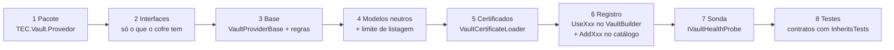
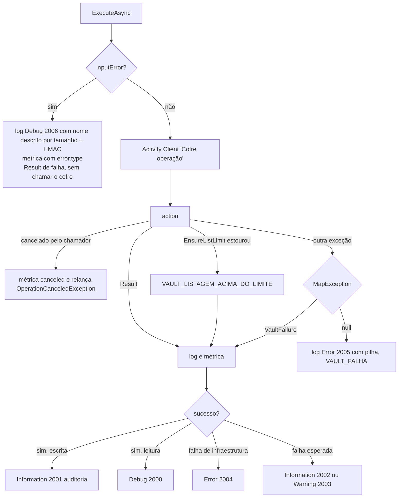
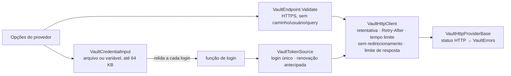

[🏠 TEC.Vault](../README.md) › [📚 Documentação](README.md) › 🧱 Novo provedor

# 🧱 Novo provedor

> Como implementar outro cofre (AWS Secrets Manager, GCP Secret Manager, Doppler, 1Password...) sobre a mesma base dos provedores existentes, herdando validação de entrada, `Result`, auditoria sem valores, limites de listagem, traces e métricas.

## 📑 Sumário

- [🎯 Visão geral](#-visão-geral)
- [🚀 Uso](#-uso)
  - [Passo a passo](#passo-a-passo)
  - [Exemplo completo (com SDK)](#exemplo-completo-com-sdk)
  - [Provedor HTTP sem SDK](#provedor-http-sem-sdk)
  - [Registro no catálogo de configuração](#registro-no-catálogo-de-configuração)
  - [Testes de contrato](#testes-de-contrato)
- [📘 Referência da API](#-referência-da-api)
- [⚙️ Opções](#️-opções)
- [❌ Erros](#-erros)
- [🛡️ Segurança](#️-segurança)
- [❓ Perguntas frequentes](#-perguntas-frequentes)

---

## 🎯 Visão geral

Tudo o que um provedor precisa fica no pacote `TEC.Vault`, nos namespaces `TEC.Vault.Providers` (base, regras, certificados, ambiente) e `TEC.Vault.Providers.Http` (base para cofres acessados por HTTP sem SDK, usada pelo HashiCorp Vault e pelo Infisical).



O que `ExecuteAsync` (o coração de `VaultProviderBase`) faz em cada operação:



### O que é neutro e o que é específico

| Item | Situação |
|---|---|
| `VaultItemProperties.ManagedBy` / `IsManaged` | **Neutro**: quem gerencia o item (`"certificate"` no Azure; serviço dono na AWS) |
| `VaultItemProperties.Id` | **Neutro**: `string` no formato nativo (URI, ARN, caminho) |
| `CreateCertificateOptions.Issuer` | **Neutro**: `null` = emissor padrão do provedor (autoassinado no Azure e no provedor em memória; **PKI** no HashiCorp Vault, onde o autoassinado é `"Self"`) |
| `VaultKeyType` (`Rsa`, `Ec`) + `HardwareProtected` | **Neutro**: proteção por hardware é uma opção, não um tipo de chave |
| `DeletedVaultItem` (`Name`, `DeletedOn`, `ScheduledPurgeDate`) | **Neutro**: a recuperação usa o nome, sem identificador específico de provedor |
| Limites (valor, tags, padrão de nome, versão, `MaxListItems`) | **Específicos do provedor**: ficam no `VaultProviderRules` e nas opções de cada um; as validações em si são comuns |
| `KeyProperties.Exportable`, `CertificateContentFormat`, `AutoRenewDaysBeforeExpiry`, `Thumbprint` | **Mantidos**: conceitos de X.509/política de chave; sem suporte, o provedor documenta (ex.: `Exportable = false`) |
| `VaultErrors.NotExportable`, `Disabled`, `Conflict` | **Mantidos**: semântica comum a cofres com versões e *soft delete* |
| Backup como `byte[]` opaco | **Mantido** na interface opcional `I*Backup`: só quem tem backup implementa |

---

## 🚀 Uso

### Passo a passo

1. **Pacote:** crie `TEC.Vault.<Provedor>` referenciando só `TEC.Vault` + o SDK do cofre (ou nenhum SDK, com a [base HTTP](#provedor-http-sem-sdk)). Alvos `net8.0;net10.0`, AOT, metadados e avisos como erro vêm do `build/Tec.Build.props`; no csproj ficam só `Description` e `PackageTags`, e um `README.md` próprio na pasta do projeto.
2. **Interfaces:** implemente só o que o cofre oferece de verdade. Todo provedor de segredos implementa `ISecretReader`; `ISecretStore` se aceita escrita; `ISecretRecycleBin`/`ISecretBackup` **só** se houver lixeira/backup (a ausência da interface já informa a aplicação na resolução do DI). Chaves: `IKeyReader`/`IKeyStore` para gestão e `IKeyCryptography` para uso. Referências:
   - **HashiCorp Vault** → KV v2: `ISecretStore` + `ISecretRecycleBin`; Transit: `IKeyStore` + `IKeyCryptography` (sem lixeira e sem backup);
   - **Infisical** → `ISecretStore`, sem lixeira e sem backup;
   - **Synced** → só `ISecretReader`.
3. **Base:** herde de `VaultProviderBase` (ou de `VaultHttpProviderBase`, sem SDK), implemente `MapException` (exceções do SDK → `VaultErrors`; desconhecidas → `null`) e passe cada operação por `ExecuteAsync`, validando a entrada antes com um `VaultProviderRules` do provedor (padrão de nome terminado em `\z`, tags, tamanhos).
4. **Modelos e listagens:** preencha `Id` com o identificador nativo, `ManagedBy` quando o item for gerenciado por outro recurso, `HardwareProtected` para chaves em HSM; copie tags com `CopyTags` (tolera tags malformadas do servidor). Opções sem suporte (`HardwareProtected`, `Issuer`) falham com `VaultErrors.NotSupported()`, nunca são ignoradas. Toda listagem chama `EnsureListLimit` com um `MaxListItems` configurável.
5. **Certificados:** carregue PFX com `VaultCertificateLoader.LoadPkcs12` e valide importações com `VaultProviderRules.ImportCertificate`. Se o cofre não gera certificados, gere par de chaves e CSR no processo com `VaultCertificateFactory`.
6. **Registro:** exponha `UseXxx(this VaultBuilder ...)` chamando `UseSecretStore`/`UseKeyStore`/`UseCertificateStore` com fábrica (permite construtor interno e é seguro para AOT) ou por tipo (construtor público). Com as três famílias e uma opção `Stores`, use `builder.UseStores(...)` com `VaultBuilder.EnsureValidStores`. Valide as opções no `UseXxx` (`InvalidOperationException` com o nome da opção). Recursos só de desenvolvimento usam `VaultEnvironment` para falhar fechados fora de Development. Exponha também `AddXxx(this VaultProviderCatalog ...)`.
7. *(Recomendado)* **Sonda:** implemente `IVaultHealthProbe` em cada store com uma verificação barata (uma página de metadados); sem ela, o health check usa a listagem completa. Leituras sensíveis que não são escrita (ex.: conteúdo com chave privada) chamam `AuditSensitiveRead`.
8. **Testes:** herde os [testes de contrato](#testes-de-contrato) com `[InheritsTests]`, teste a conversão de cada exceção do SDK ou status HTTP e, se possível, rode os mesmos contratos contra um servidor real (categoria `Integracao`).

### Exemplo completo (com SDK)

`MeuVaultClient`, `MeuVaultItem` e `MeuVaultException` representam o SDK fictício do cofre.

```csharp
using System.Text.RegularExpressions;
using Microsoft.Extensions.DependencyInjection;
using Microsoft.Extensions.Logging;
using Microsoft.Extensions.Logging.Abstractions;
using TEC.Core.Common.Results;
using TEC.Vault.Abstractions;
using TEC.Vault.Common;
using TEC.Vault.DependencyInjection;
using TEC.Vault.Providers;
using TEC.Vault.Secrets;

namespace TEC.Vault.MeuVault;

public sealed class MeuVaultOptions
{
    public Uri? Address { get; set; }

    /// <summary>Maior quantidade de itens numa listagem (1 a 1.000.000). Padrão: 10.000.</summary>
    public int MaxListItems { get; set; } = 10_000;

    public TimeProvider? TimeProvider { get; set; }

    internal void Validate()
    {
        if (Address is null)
            throw new InvalidOperationException("MeuVaultOptions.Address é obrigatório.");
        if (MaxListItems is < 1 or > 1_000_000)
            throw new InvalidOperationException("MeuVaultOptions.MaxListItems deve estar entre 1 e 1.000.000.");
    }
}

/// <summary>Segredos no "MeuVault": leitura, escrita e sonda (sem lixeira e sem backup, porque o cofre não tem).</summary>
public sealed partial class MeuVaultSecretStore : VaultProviderBase, ISecretStore, IVaultHealthProbe
{
    public const string Provider = "MeuVault";

    [GeneratedRegex(@"^[a-z0-9][a-z0-9-]{0,63}\z", RegexOptions.CultureInvariant, matchTimeoutMilliseconds: 100)]
    private static partial Regex NamePattern();

    private static readonly VaultProviderRules Rules = new(NamePattern(), "use de 1 a 64 letras minúsculas, números e hífen.")
    {
        MaxSecretValueBytes = 32 * 1024,
        MaxTags = 20,
        MaxTagKeyLength = 128,
        MaxTagValueLength = 256,
        MaxBackupBytes = 1                      // sem backup: valor mínimo
    };

    private readonly MeuVaultClient _client;
    private readonly MeuVaultOptions _options;
    private readonly TimeProvider _time;

    internal MeuVaultSecretStore(MeuVaultClient client, MeuVaultOptions options, ILogger<MeuVaultSecretStore>? logger)
        : base(Provider, logger ?? NullLogger<MeuVaultSecretStore>.Instance)
    {
        _client = client;
        _options = options;
        _time = options.TimeProvider ?? TimeProvider.System;
    }

    public Task<Result<VaultSecret>> GetSecretAsync(string name, string? version = null, CancellationToken cancellationToken = default) =>
        ExecuteAsync<VaultSecret>("secret.get", name, Rules.Item(name, version), isWrite: false, async ct =>
        {
            var item = await _client.ReadAsync(name, version, ct);
            if (!item.Enabled)
                return VaultErrors.Disabled();
            return new VaultSecret(ToModel(item), item.Value);
        }, cancellationToken);

    public Task<Result<bool>> ExistsAsync(string name, CancellationToken cancellationToken = default) =>
        ExecuteAsync<bool>("secret.exists", name, Rules.Name(name), isWrite: false,
            async ct => await _client.ExistsAsync(name, ct), cancellationToken);

    public Task<Result<IReadOnlyList<SecretProperties>>> ListSecretsAsync(CancellationToken cancellationToken = default) =>
        ExecuteAsync<IReadOnlyList<SecretProperties>>("secret.list", null, null, isWrite: false, async ct =>
        {
            var list = new List<SecretProperties>();
            await foreach (var item in _client.ListAsync(ct))
            {
                // Acima do limite: para de paginar e devolve VAULT_LISTAGEM_ACIMA_DO_LIMITE
                EnsureListLimit(list.Count + 1, _options.MaxListItems);
                list.Add(ToModel(item));
            }

            return list;
        }, cancellationToken);

    public Task<Result<IReadOnlyList<SecretProperties>>> ListSecretVersionsAsync(string name, CancellationToken cancellationToken = default) =>
        ExecuteAsync<IReadOnlyList<SecretProperties>>("secret.versions", name, Rules.Name(name), isWrite: false, async ct =>
        {
            var list = new List<SecretProperties>();
            await foreach (var item in _client.ListVersionsAsync(name, ct))
            {
                EnsureListLimit(list.Count + 1, _options.MaxListItems);
                list.Add(ToModel(item));
            }

            return list.Count == 0 ? VaultErrors.NotFound() : list;
        }, cancellationToken);

    public Task<Result<SecretProperties>> SetSecretAsync(string name, string value, SecretWriteOptions? options = null,
        CancellationToken cancellationToken = default)
    {
        options ??= new SecretWriteOptions();
        var inputError = Rules.SetSecret(name, value, options, _time.GetUtcNow());   // nome, valor, tags, validade
        return ExecuteAsync<SecretProperties>("secret.set", name, inputError, isWrite: true,
            async ct => ToModel(await _client.WriteAsync(name, value, options.Tags, options.ExpiresOn, ct)), cancellationToken);
    }

    public Task<Result<SecretProperties>> UpdateSecretPropertiesAsync(string name, SecretPropertiesUpdate update, string? version = null,
        CancellationToken cancellationToken = default) =>
        ExecuteAsync<SecretProperties>("secret.update", name, Rules.UpdateSecret(name, version, update, _time.GetUtcNow()), isWrite: true,
            async ct => ToModel(await _client.UpdateAsync(name, version, update.Enabled, update.Tags, ct)), cancellationToken);

    public Task<Result<DeletedVaultItem>> DeleteSecretAsync(string name, CancellationToken cancellationToken = default) =>
        ExecuteAsync<DeletedVaultItem>("secret.delete", name, Rules.Name(name), isWrite: true, async ct =>
        {
            await _client.DeleteAsync(name, ct);
            return new DeletedVaultItem(name, _time.GetUtcNow(), ScheduledPurgeDate: null);
        }, cancellationToken);

    public Task<Result> CheckAccessAsync(CancellationToken cancellationToken = default) =>
        ExecuteAsync("secret.health", null, null, isWrite: false, ct => _client.PingAsync(ct), cancellationToken);

    protected override VaultFailure? MapException(Exception exception) => exception switch
    {
        MeuVaultException { Status: 404 } => new VaultFailure(VaultErrors.NotFound(), "404"),
        MeuVaultException { Status: 403 } e => new VaultFailure(VaultErrors.AccessDenied(), $"403 {e.Code}"),   // código seguro, nunca o corpo
        MeuVaultException { Status: 429 } => new VaultFailure(VaultErrors.Throttled(), "429"),
        MeuVaultException { Status: >= 500 } e => new VaultFailure(VaultErrors.Unavailable(), e.Status.ToString()),
        HttpRequestException or TimeoutException => new VaultFailure(VaultErrors.Unavailable(), exception.GetType().Name),
        _ => null                                                                                               // VAULT_FALHA + pilha no log
    };

    private static SecretProperties ToModel(MeuVaultItem item) => new()
    {
        Name = item.Name,
        Version = item.Version,
        Id = item.Path,                                   // identificador nativo
        Enabled = item.Enabled,
        CreatedOn = item.CreatedOn,
        ExpiresOn = item.ExpiresOn,
        Tags = CopyTags(item.Tags)                        // cópia; ignora chave nula, valor nulo vira vazio
    };
}

public static class MeuVaultExtensions
{
    public static VaultBuilder UseMeuVault(this VaultBuilder builder, Action<MeuVaultOptions> configure)
    {
        ArgumentNullException.ThrowIfNull(builder);
        ArgumentNullException.ThrowIfNull(configure);

        var options = new MeuVaultOptions();
        configure(options);
        options.Validate();                               // configuração inválida falha na subida

        var client = new MeuVaultClient(options.Address!);
        return builder.UseSecretStore(sp => new MeuVaultSecretStore(client, options, sp.GetService<ILogger<MeuVaultSecretStore>>()));
    }
}
```

### Provedor HTTP sem SDK

Para cofres com API REST, a base `TEC.Vault.Providers.Http` dá login, token, retentativa e endereço validado prontos, sem dependência de SDK (menos pacotes e compatível com Native AOT).



`MeuVaultHttpOptions` e `MeuJsonContext` (contexto do *source generator* do `System.Text.Json`) são do provedor.

```csharp
using System.Net;
using System.Net.Http.Json;
using Microsoft.Extensions.Logging;
using Microsoft.Extensions.Logging.Abstractions;
using TEC.Core.Common.Results;
using TEC.Vault.Abstractions;
using TEC.Vault.Common;
using TEC.Vault.Providers;
using TEC.Vault.Providers.Http;
using TEC.Vault.Secrets;

public sealed partial class MeuVaultHttpSecretStore : VaultHttpProviderBase, ISecretReader, IDisposable
{
    private readonly VaultHttpClient _login;
    private readonly VaultTokenSource _tokens;
    private readonly VaultHttpClient _http;

    public MeuVaultHttpSecretStore(MeuVaultHttpOptions options, ILogger<MeuVaultHttpSecretStore>? logger = null)
        : base("MeuVault", logger ?? NullLogger<MeuVaultHttpSecretStore>.Instance)
    {
        // Tudo validado na subida: InvalidOperationException com o nome da opção
        var address = VaultEndpoint.Validate(options.Address, "MeuVaultHttpOptions.Address", options.HostEnvironment);
        options.Http.Validate("MeuVaultHttpOptions.Http");
        var credential = VaultCredentialInput.Create(options.TokenFile, options.TokenVariable,
            "MeuVaultHttpOptions.TokenFile", "MeuVaultHttpOptions.TokenVariable");

        _login = new VaultHttpClient(address, options.Http);                       // sem token: só para o login
        _tokens = new VaultTokenSource(ct => LoginAsync(credential, ct), options.Http.TimeProvider);
        _http = new VaultHttpClient(address, options.Http, _tokens);              // Authorization: Bearer
    }

    public Task<Result<VaultSecret>> GetSecretAsync(string name, string? version = null, CancellationToken cancellationToken = default) =>
        ExecuteAsync<VaultSecret>("secret.get", name, Rules.Item(name, version), isWrite: false, async ct =>
        {
            using var response = await _http.SendAsync(
                () => new HttpRequestMessage(HttpMethod.Get, $"api/secrets/{VaultEndpoint.Segment(name)}"), idempotent: true, ct);
            if (response.StatusCode == HttpStatusCode.NotFound)
                return VaultErrors.NotFound();
            VaultHttpClient.EnsureSuccess(response);                                // erro → VaultHttpException → MapStatus
            var item = await _http.ReadJsonAsync(response, MeuJsonContext.Default.MeuItem, ct);
            return new VaultSecret(ToProperties(item), item.Value);
        }, cancellationToken);

    private async Task<VaultToken> LoginAsync(VaultCredentialInput credential, CancellationToken ct)
    {
        string secret;
        try
        {
            secret = credential.Read();                                            // relida a cada login (rotação)
        }
        catch (InvalidOperationException exception)
        {
            throw new VaultLoginException(exception.Message, exception);           // vira VAULT_AUTENTICACAO_FALHOU
        }

        using var response = await _login.SendAsync(() => new HttpRequestMessage(HttpMethod.Post, "api/login")
        {
            Content = JsonContent.Create(new MeuLogin(secret), MeuJsonContext.Default.MeuLogin)
        }, idempotent: true, ct);
        VaultHttpClient.EnsureSuccess(response);
        var login = await _login.ReadJsonAsync(response, MeuJsonContext.Default.MeuLoginResult, ct);
        return new VaultToken(login.Token, login.ExpiresOn);
    }

    public void Dispose()
    {
        _http.Dispose();
        _tokens.Dispose();
        _login.Dispose();
    }

    // ... Rules, ToProperties, ExistsAsync, ListSecretsAsync (com EnsureListLimit), ListSecretVersionsAsync
}

// UseMeuVaultHttp(this VaultBuilder, Action<MeuVaultHttpOptions>) segue o mesmo modelo de UseMeuVault acima
```

> [!TIP]
> Se o cofre responde **403** a token vencido ou revogado (como o HashiCorp Vault), crie o cliente com
> `reauthenticateOnForbidden: true`. Nos demais, 403 é falta de permissão e refazer o login a cada negação seria
> desperdício. Cabeçalho diferente de `Authorization: Bearer` vai em `applyToken` (o HashiCorp usa `X-Vault-Token`).

### Registro no catálogo de configuração

Para o provedor poder ser escolhido no `appsettings` ([escolha do cofre pela configuração](configuracao-por-appsettings.md)), exponha um `AddXxx` em `VaultProviderCatalog` que cria um `VaultProviderRegistration` e lê as opções com `VaultSettings`:

```csharp
using Microsoft.Extensions.Logging;
using TEC.Vault.DependencyInjection;

public static class MeuVaultCatalogExtensions
{
    public static VaultProviderCatalog AddMeuVault(this VaultProviderCatalog catalog, Action<MeuVaultHttpOptions>? configure = null) =>
        catalog.Add(new VaultProviderRegistration("MeuVault", VaultStores.Secrets,
            (builder, settings, stores) => builder.UseMeuVaultHttp(options =>
            {
                Read(settings, options);
                configure?.Invoke(options);                 // código vence a configuração
            }),
            (settings, loggerFactory) =>                    // leitor para a fonte de IConfiguration (opcional)
            {
                var options = new MeuVaultHttpOptions();
                Read(settings, options);
                configure?.Invoke(options);
                return new MeuVaultHttpSecretStore(options, loggerFactory?.CreateLogger<MeuVaultHttpSecretStore>());
            }));

    private static void Read(VaultSettings settings, MeuVaultHttpOptions options)
    {
        settings.RejectInlineSecret("Token", "TokenFile", "TokenVariable");   // nada de segredo no appsettings
        options.Address = settings.GetUri("Address") ?? options.Address;
        options.TokenFile = settings.GetString("TokenFile") ?? options.TokenFile;
        options.TokenVariable = settings.GetString("TokenVariable") ?? options.TokenVariable;
        options.MaxListItems = settings.GetInt32("MaxListItems", 1, 1_000_000) ?? options.MaxListItems;
        options.Http.MaxRetries = settings.GetInt32("MaxRetries", 0, 10) ?? options.Http.MaxRetries;
        options.Http.NetworkTimeout = settings.GetTimeSpan("NetworkTimeout") ?? options.Http.NetworkTimeout;
        settings.EnsureNoUnknownKeys();                                     // erro de digitação falha na subida
    }
}
```

| Regra | Por quê |
|---|---|
| `use` é chamado **uma vez**, com todas as famílias atribuídas ao provedor | Um cliente/login compartilhado entre os stores (como no HashiCorp Vault) |
| Leia cada chave e termine com `EnsureNoUnknownKeys()` | Erro de digitação falha na subida, em vez de cair num padrão |
| Credencial só por `...File`/`...Variable`; `RejectInlineSecret` na chave "em texto" | Nenhum segredo no `appsettings` |
| Liberações de segurança (`Allow*`) com `RejectKey` | Só decisão em código libera recurso de desenvolvimento |
| `configure` depois da leitura | Código vence configuração (credencial própria, handler HTTP) |
| `createSecretReader` só para provedores de segredos | A fonte de `IConfiguration` lê só segredos (o construtor recusa o contrário) |

Referência de `VaultProviderCatalog`, `VaultProviderRegistration` e `VaultSettings`: [escolha do cofre pela configuração](configuracao-por-appsettings.md).

### Testes de contrato

O projeto `TEC.Vault.Tests` tem contratos abstratos em `Contracts/` com o comportamento que todo provedor cumpre (o provedor em memória é a referência). Um provedor novo herda o contrato com `[InheritsTests]` (TUnit) e só informa como criar o store:

| Contrato | Para | O que cobre |
|---|---|---|
| `SecretReaderContract` | `ISecretReader` | Leitura, nome sem diferenciar maiúsculas, `NotFound`, nome inválido sem consultar a fonte, `Exists`, listagem sem valores, versão listada legível e desconhecida `NotFound`, versão muda com o valor, fonte vazia, sonda |
| `SecretStoreContract` | `ISecretStore` (herda o anterior) | Nova versão mantendo a anterior, exclusão, exclusão de inexistente, valor vazio recusado antes do cofre |
| `KeyStoreContract` | `IKeyStore` + `IKeyCryptography` | RSA com chave pública, RSA-OAEP-256 conferido com a chave pública, wrap/unwrap, assinatura RSA e ECDSA em P1363 verificáveis localmente, algoritmo × chave, rotação, `NotFound`, listagem e exclusão, entrada inválida |
| `CertificateStoreContract` | `ICertificateStore` | Autoassinado (`SelfSignedIssuer`), download só se exportável, PFX com senha (e senha errada), desabilitado não baixa, versões e exclusão, `NotFound` |

| Membro a sobrescrever | Contrato | Para quê |
|---|---|---|
| `CreateReaderAsync(IReadOnlyDictionary<string, string> secrets)` *(abstract)* | `SecretReaderContract` | Cria o leitor já com os segredos |
| `ChangeValueAsync(reader, name, value)` *(virtual)* | `SecretReaderContract` | Troca um valor pela fonte; `false` = não suportado |
| `UnknownVersion(string existing)` *(virtual)* | `SecretReaderContract` | Versão inexistente no formato do cofre |
| `CreateStoreAsync()` *(abstract)* | `SecretStoreContract`, `KeyStoreContract`, `CertificateStoreContract` | Cria o store vazio |
| `SelfSignedIssuer` *(virtual)* | `CertificateStoreContract` | Emissor do autoassinado (`null` ou `"Self"`) |

```csharp
[InheritsTests]
public class MeuVaultSecretStoreContractTests : SecretStoreContract, IDisposable
{
    private readonly FakeMeuVault _fake = new();     // cofre simulado em HTTP
    private MeuVaultHttpSecretStore? _store;

    protected override Task<ISecretStore> CreateStoreAsync()
    {
        _store = new MeuVaultHttpSecretStore(new MeuVaultHttpOptions { Address = _fake.Address, Http = { Handler = _fake.Handler } });
        return Task.FromResult<ISecretStore>(_store);
    }

    protected override string UnknownVersion(string existing) => "999";   // formato de versão do cofre

    public void Dispose() => _store?.Dispose();
}
```

Os provedores existentes herdam assim: `InMemory*ContractTests`, `DirectorySecretStoreContractTests`, `EnvironmentSecretStoreContractTests`, `JsonFileSecretStoreContractTests`, `DotEnvFileSecretStoreContractTests`, `InfisicalSecretStoreContractTests`, `HashiCorpVault*ContractTests` (sobre `FakeHashiCorpVault`) e `HashiCorpVaultLive*ContractTests` (contra um Vault real, categoria `Integracao`). Como rodar: [Testes](testes.md).

---

## 📘 Referência da API

### `VaultProviderBase`

> `TEC.Vault.Providers` · `abstract class` · pacote `TEC.Vault`

| Membro | Retorno | Descrição |
|---|---|---|
| `VaultProviderBase(string providerName, ILogger logger)` *(protected)* | — | Nome do provedor (ex.: `"AzureKeyVault"`) e logger; vazio/nulo → `ArgumentException`/`ArgumentNullException` |
| `ProviderName` | `string` | Nome do provedor |
| `MapException(Exception exception)` *(protected abstract)* | `VaultFailure?` | Converte uma exceção do SDK; `null` = desconhecida (vira `VAULT_FALHA` com pilha no log) |
| `ExecuteAsync<T>(string operation, string? itemName, Error? inputError, bool isWrite, Func<CancellationToken, Task<Result<T>>> action, CancellationToken cancellationToken)` *(protected)* | `Task<Result<T>>` | Executa uma operação com retorno |
| `ExecuteAsync(string operation, string? itemName, Error? inputError, bool isWrite, Func<CancellationToken, Task> action, CancellationToken cancellationToken)` *(protected)* | `Task<Result>` | Executa uma operação sem retorno |
| `CopyTags(IEnumerable<KeyValuePair<string, string>>? tags)` *(protected static)* | `IReadOnlyDictionary<string, string>` | Cópia independente das tags; tolera dados fora do esperado (chave nula ignorada, valor nulo vira vazio, chave repetida fica com o último valor); sem tags, a instância vazia compartilhada |
| `AuditSensitiveRead(string operation, string itemName, string reason)` *(protected)* | `void` | Auditoria em `Information` de uma leitura sensível (evento 2008); `reason` é texto fixo, nunca valor |
| `EnsureListLimit(int count, int maxItems)` *(protected static)* | `void` | Chame antes de incluir cada item da listagem (`list.Count + 1`) ou com o total já conhecido. Acima de `maxItems` lança `VaultListLimitExceededException`, que interrompe a operação; `ExecuteAsync` devolve `VaultErrors.TooManyItems()` (`VAULT_LISTAGEM_ACIMA_DO_LIMITE`), sem ler o restante |

`VaultListLimitExceededException` (`sealed`, namespace `TEC.Vault.Providers`, propriedade `MaxItems`): para classes auxiliares que não derivam de `VaultProviderBase` (ex.: um resolvedor de nomes); lance-a dentro da operação e `ExecuteAsync` **sempre** a converte em `VAULT_LISTAGEM_ACIMA_DO_LIMITE`, mesmo que `MapException` não a conheça. Nunca chega ao consumidor.

`VaultFailure` (`readonly record struct`): `Error` (erro padronizado de `VaultErrors`) e `Detail` (texto técnico seguro para log, ex.: `"403 ForbiddenByRbac"`; nunca valores, tokens ou corpo de resposta).

### `VaultProviderRules`

> `TEC.Vault.Providers` · `sealed class` · pacote `TEC.Vault`

Limites do cofre e validações de cada operação, iguais em todos os provedores. Retornam o primeiro `Error` encontrado ou `null`.

| Membro | Retorno | Descrição |
|---|---|---|
| `VaultProviderRules(Regex namePattern, string nameRule)` | — | Padrão de nome (ancorado com `^` e `\z`) e descrição para a mensagem |
| `NamePattern` / `NameRule` | `Regex` / `string` | Padrão e descrição |
| `VersionPattern` *(init)* | `Regex` | Padrão: 32 hexadecimais (`VaultInputRules.HexVersionPattern()`) |
| `MaxSecretValueBytes`, `MaxTags`, `MaxTagKeyLength`, `MaxTagValueLength`, `MaxBackupBytes` | `int` (`required`) | Limites do cofre |
| `MaxContentTypeLength` *(init)* | `int` | Padrão: 255 |
| `Name`, `Version`, `RequiredVersion`, `Item(name, version)` | `Error?` | Nome e versão |
| `Tags`, `Backup`, `SecretValue` | `Error?` | Tags, backup, valor |
| `SetSecret(name, value, options, now)` / `UpdateSecret(name, version, update, now)` | `Error?` | Gravação (expiração no futuro) e alteração de segredo |
| `CreateKey(name, options, now)` / `UpdateKey(name, version, update, now)` | `Error?` | Criação e alteração de chave |
| `Encrypt(name, version, algorithm, data, field)` / `Decrypt(...)` | `Error?` | Cifragem/wrap (versão opcional) e decifragem/unwrap (versão obrigatória) |
| `Sign(name, version, algorithm, data)` / `Verify(name, version, algorithm, data, signature)` | `Error?` | Assinatura e verificação |
| `ImportCertificate(name, certificate, options, out format, out subject)` | `Error?` | Nome, tags e inspeção local do PFX/PEM |

### Regras comuns

> `TEC.Vault.Providers` · `static class` · pacote `TEC.Vault`

| Classe | Membros principais | Para quê |
|---|---|---|
| `VaultInputRules` | `MaxContentTypeLength` (255), `HexVersionPattern()`, `Name`, `Version`, `RequiredVersion`, `SecretValue`, `Bytes`, `OptionalText`, `Tags`, `Validity`, `First` | Validações básicas (sem caracteres de controle, tamanhos, `NotBefore < ExpiresOn`, expiração no futuro em gravações). Tempo limite do regex = entrada recusada, nunca exceção |
| `VaultKeyRules` | `AllowedRsaSizes` (2048, 3072, 4096), `AllOperations`, `EcOperations`, `MaxEncryptBytes` (446), `MaxCiphertextBytes` (512), `MaxSignDataBytes` (64 MB), `DefaultOperations`, `Shape`, `Operations`, `EncryptionAlgorithm`, `SignatureAlgorithm`, `ToECCurve`, `CurveHash`, `RsaSignature`, `EcSignature` | Forma da chave, operações e algoritmos; mapeamento para tipos do .NET |
| `VaultCertificateRules` | `MaxCertificateBytes` (1 MB), `MaxSubjectLength` (1024), `MaxDnsNames` (100), `Create`, `IsPem`, `DetectFormat`, `NormalizePem`, `InspectImport`, `LoadPem` | Criação (subject X.500, DNS, validade, renovação), detecção e normalização de PEM, inspeção da importação |
| `VaultVersionRules` | `Newest<T>(versions, createdOn)`, `BreakTie<T>(newest, updatedOn, version)` | Versão atual pela maior data de criação; desempate determinístico (maior `UpdatedOn`, depois maior versão ordinal) |
| `VaultEnvironment` | `IsDevelopment(IHostEnvironment? environment = null)`, `FindHostEnvironment(IServiceCollection)` | Trava de Development: o `IHostEnvironment` é a fonte de verdade; sem ele, `ASPNETCORE_ENVIRONMENT` e, só se vazia, `DOTNET_ENVIRONMENT` |

### `VaultCertificateLoader` e `VaultCertificateFactory`

> `TEC.Vault.Providers` · `static class` · pacote `TEC.Vault`

| Membro | Retorno | Descrição |
|---|---|---|
| `VaultCertificateLoader.SafeKeyStorageFlags` | `X509KeyStorageFlags` | `EphemeralKeySet` no Windows e no Linux; `DefaultKeySet` no macOS |
| `VaultCertificateLoader.LoadCertificate(byte[] data)` | `X509Certificate2` | Certificado sem chave (DER ou PEM); recusa PFX e PKCS#7 |
| `VaultCertificateLoader.LoadPkcs12(byte[] data, string? password, X509KeyStorageFlags? keyStorageFlags = null)` | `X509Certificate2` | PKCS#12 com chave privada; no .NET 9+ usa `X509CertificateLoader` (limites contra PFX malicioso), no .NET 8 o construtor depois de conferir o tipo |
| `VaultCertificateFactory.CreateRequest(CreateCertificateOptions options)` | `(CertificateRequest Request, AsymmetricAlgorithm Key)` | Par de chaves e CSR com subject, SAN, key usage e basic constraints; o chamador descarta a chave. As opções devem ter passado por `VaultCertificateRules.Create` |
| `VaultCertificateFactory.CreateSelfSigned(CreateCertificateOptions options, DateTimeOffset now)` | `X509Certificate2` | Autoassinado com chave privada, válido de 5 minutos antes de `now` até a validade pedida |
| `VaultCertificateFactory.WithPrivateKey(X509Certificate2 issued, AsymmetricAlgorithm key)` | `X509Certificate2` | Junta o certificado emitido por uma CA à chave de `CreateRequest`; `CryptographicException` se não corresponderem |

```csharp
// Emissão por uma CA externa: só o CSR sai do processo
var (request, key) = VaultCertificateFactory.CreateRequest(options);
using (key)
{
    var pem = await myCa.SignAsync(request.CreateSigningRequestPem(), cancellationToken);
    using var issued = X509Certificate2.CreateFromPem(pem);
    using var withKey = VaultCertificateFactory.WithPrivateKey(issued, key);
    // guarde withKey.Export(X509ContentType.Pkcs12) no cofre e zere o array depois
}
```

### Base HTTP (`TEC.Vault.Providers.Http`)

<details>
<summary><b><code>VaultHttpProviderBase</code></b>, <code>VaultHttpException</code> e <code>VaultLoginException</code></summary>

| Membro | Retorno | Descrição |
|---|---|---|
| `VaultHttpProviderBase(string providerName, ILogger logger)` *(protected)* | — | Como `VaultProviderBase` |
| `MapException(Exception)` *(protected sealed override)* | `VaultFailure?` | `MapProviderException` e, sem resultado, `MapHttpException` |
| `MapProviderException(Exception)` *(protected virtual)* | `VaultFailure?` | Conversões próprias do provedor, avaliadas antes das padrão (padrão: nenhuma) |
| `MapHttpException(Exception)` *(static)* | `VaultFailure?` | Conversão padrão (tabela abaixo) |
| `MapStatus(HttpStatusCode status, string? detail = null)` *(static)* | `VaultFailure` | Conversão de um status de erro |

| Origem | Código |
|---|---|
| 400, 422 | `VAULT_REQUISICAO_RECUSADA` |
| 401 | `VAULT_AUTENTICACAO_FALHOU` |
| 403 | `VAULT_ACESSO_NEGADO` |
| 404 | `VAULT_ITEM_NAO_ENCONTRADO` |
| 409, 412 | `VAULT_CONFLITO` |
| 429 | `VAULT_LIMITE_EXCEDIDO` |
| 408, ≥ 500 (inclusive 503 com `Retry-After` acima de `MaxRetryDelay`), `TimeoutException`, `HttpRequestException` | `VAULT_INDISPONIVEL` |
| `VaultLoginException` | `VAULT_AUTENTICACAO_FALHOU` |
| `JsonException` (resposta fora do formato) | `VAULT_FALHA` |
| `VaultResponseTooLargeException` (resposta acima de `MaxResponseBytes`) | `VAULT_FALHA`, de propósito (log: `resposta acima de MaxResponseBytes (N bytes)`) |
| Outro status | `VAULT_FALHA` |

- `VaultResponseTooLargeException` (`sealed`, propriedade `MaxBytes`): lançada por `ReadJsonAsync`/`ReadBytesAsync` quando o corpo passa de `MaxResponseBytes`; a leitura para no limite e o corpo não é mantido.
- `VaultHttpException` (`sealed`): resposta de erro, com `StatusCode` e `Detail` (detalhe seguro para log); a mensagem **nunca** contém o corpo.
- `VaultLoginException` (`sealed`, construtor `(string message, Exception? innerException = null)`): falha no login (credencial ausente, ilegível ou recusada); a mensagem nunca contém a credencial.

</details>

<details>
<summary><b><code>VaultHttpClient</code></b> e <code>VaultHttpSettings</code></summary>

`VaultHttpClient` (`sealed`, `IDisposable`, thread-safe, uma instância por provedor):

| Membro | Retorno | Descrição |
|---|---|---|
| `VaultHttpClient(Uri baseAddress, VaultHttpSettings settings, VaultTokenSource? tokens = null, Action<HttpRequestMessage, string>? applyToken = null, bool reauthenticateOnForbidden = false)` | — | `baseAddress` já validado por `VaultEndpoint`; sem `tokens`, requisições sem autenticação (ex.: o próprio login); `applyToken` padrão = `Authorization: Bearer`; `reauthenticateOnForbidden` refaz o login também em 403 |
| `BaseAddress` | `Uri` | Endereço do cofre |
| `SendAsync(Func<HttpRequestMessage> createRequest, bool idempotent, CancellationToken)` | `Task<HttpResponseMessage>` | Envia (a requisição é recriada a cada tentativa) e devolve a resposta em qualquer status; o chamador descarta |
| `EnsureSuccess(HttpResponseMessage response, string? detail = null)` *(static)* | `void` | Lança `VaultHttpException` (e descarta a resposta) se não for sucesso |
| `ReadJsonAsync<T>(response, JsonTypeInfo<T> typeInfo, ct)` | `Task<T>` | JSON por *source generator* (AOT), respeitando `MaxResponseBytes`; o buffer é zerado depois |
| `ReadBytesAsync(response, ct)` | `Task<byte[]>` | Corpo respeitando `MaxResponseBytes` (acima → `VaultResponseTooLargeException`) |

| Situação | Comportamento |
|---|---|
| Falha de rede, tempo limite, 408, 500, 502, 503, 504 | Repetida **só se `idempotent`**, com backoff exponencial e jitter (0,8 s, 1,6 s, 3,2 s... até 30 s) |
| 429 | Repetida sempre (a requisição foi recusada antes de ser processada), respeitando `Retry-After` |
| `Retry-After` maior que `MaxRetryDelay` | Não espera: `VaultHttpException` com o status **real** (429 → `VAULT_LIMITE_EXCEDIDO`; 503 → `VAULT_INDISPONIVEL`) |
| Operação não idempotente (criação, rotação, emissão) | **Nunca** repetida após falha de rede, tempo limite ou 5xx: uma criação nunca é aplicada duas vezes |
| 401 com token (e 403, com `reauthenticateOnForbidden: true`) | Token invalidado e novo login, **uma vez** por chamada (não conta como tentativa) |
| Redirecionamento | Não seguido |
| Tempo limite da última tentativa | `TimeoutException` |
| Cancelamento do chamador | `OperationCanceledException` |

**Conexões:** sem `Handler` próprio, cada cliente usa um `SocketsHttpHandler` de vida longa (`AllowAutoRedirect = false`, sem descompressão automática) com `PooledConnectionLifetime` de 5 minutos: as conexões são renovadas e acompanham mudança de DNS, sem `IHttpClientFactory` (compatível com Native AOT e sem dependência extra). O handler é descartado junto com o cliente.

`VaultHttpSettings` (`sealed`; os provedores expõem como `Opções.Http`):

| Membro | Tipo | Padrão | Validação (`Validate(optionPrefix)`) |
|---|---|---|---|
| `MaxRetries` | `int` | `3` | 0 a 10 |
| `NetworkTimeout` | `TimeSpan` | `30 s` | > 0 e ≤ 5 min (por tentativa) |
| `MaxRetryDelay` | `TimeSpan` | `30 s` | 0 a 5 min |
| `MaxResponseBytes` | `int` | `4 MB` | 1 KB a 64 MB |
| `Handler` | `HttpMessageHandler?` | `null` (handler padrão acima) | Com handler próprio, **desligue `AllowAutoRedirect`** |
| `TimeProvider` | `TimeProvider?` | `TimeProvider.System` | — |

</details>

<details>
<summary><b><code>VaultTokenSource</code></b>, <code>VaultToken</code>, <code>VaultEndpoint</code> e <code>VaultCredentialInput</code></summary>

`VaultTokenSource` (`sealed`, `IDisposable`, thread-safe):

| Membro | Retorno | Descrição |
|---|---|---|
| `VaultTokenSource(Func<CancellationToken, Task<VaultToken>> login, TimeProvider? timeProvider = null)` | — | `login` faz o login (relendo a credencial a cada chamada) |
| `GetAsync(CancellationToken)` | `ValueTask<string>` | Token do cache ou de um novo login |
| `Invalidate(string token)` | `void` | Descarta o token (ex.: 401/403); se outra chamada já o trocou, não faz nada |

- **Renovação antecipada:** faltando 10% da vida do token (entre 10 segundos e 5 minutos antes de `ExpiresOn`).
- **Login único:** várias chamadas simultâneas com o token vencido fazem um só login.
- **Falha não guardada:** um login que falha não fica em cache; token vazio → `VaultLoginException`.

`VaultToken(string Value, DateTimeOffset? ExpiresOn)` (`sealed record`): `ExpiresOn = null` = sem expiração conhecida (renovado só quando o cofre recusa). `ToString()` mascara o valor.

`VaultEndpoint` (`static`):

| Membro | Retorno | Descrição |
|---|---|---|
| `Validate(Uri? address, string optionName, IHostEnvironment? environment = null)` | `Uri` | Absoluto, **HTTPS** (HTTP só para loopback em Development), sem usuário, query, fragmento ou caminho; devolve o endereço terminado em `/`. Inválido → `InvalidOperationException` com `optionName` |
| `Segment(string value)` | `string` | Codifica um segmento de caminho; vazio, `.` ou `..` → `ArgumentException` |
| `Path(string value)` | `string` | Codifica um caminho com vários segmentos (`minha-api/db`), recusando vazios, `.` e `..` |

`VaultCredentialInput` (`sealed`): credencial de login lida de arquivo ou variável de ambiente, **nunca** de texto na configuração.

| Membro | Retorno | Descrição |
|---|---|---|
| `MaxFileBytes` *(const)* | `int` | 64 KB |
| `FromFile(path, description)` / `FromVariable(name, description)` | `VaultCredentialInput` | Credencial em arquivo / variável |
| `FromValue(Func<string> value, description)` | `VaultCredentialInput` | Obtida por código; a função é chamada a cada login |
| `Create(file, variable, fileOption, variableOption, defaultFile = null)` | `VaultCredentialInput` | Exatamente uma preenchida (ou nenhuma, com `defaultFile`); nenhuma ou as duas → `InvalidOperationException` |
| `Read()` | `string` | Valor atual, sem espaços nas pontas; ausente, vazio, acima de 64 KB ou fora de UTF-8 → `InvalidOperationException` sem o valor |
| `Description` | `string` | Nome da opção, para mensagens |

O arquivo é lido **a cada login** com `TEC.Core.IO.BoundedFileReader`: o limite de 64 KB vale mesmo quando o tamanho não é conhecido de antemão (pipe, `/proc`, arquivo especial), o UTF-8 é estrito e os buffers são zerados. Tokens projetados pelo Kubernetes e credenciais rotacionadas são renovados sem reiniciar a aplicação.

</details>

---

## ⚙️ Opções

A base não tem opções próprias; as que um provedor novo deve oferecer, seguindo os existentes:

| Opção | Padrão sugerido | Descrição |
|---|---|---|
| `MaxListItems` | `10_000` (faixa 1..1.000.000) | Teto das listagens, aplicado com `EnsureListLimit`; inválido → `InvalidOperationException` na subida |
| `Stores` | `VaultStores.All` (só as famílias que o cofre atende) | Famílias registradas; conferido com `VaultBuilder.EnsureValidStores` |
| `Http` | `new VaultHttpSettings()` | Transporte dos provedores HTTP (tabela em [Base HTTP](#base-http-tecvaultprovidershttp)) |
| `TimeProvider` | `TimeProvider.System` | Relógio injetável (validade, expiração, esperas) |
| `HostEnvironment` | `VaultEnvironment.FindHostEnvironment(services)` | Para a trava de Development e o HTTP local |

---

## ❌ Erros

| Situação | Resultado |
|---|---|
| `inputError` informado | `Result` com esse erro (o cofre não é chamado; evento 2006) |
| `EnsureListLimit` estourou ou `VaultListLimitExceededException` lançada | `VAULT_LISTAGEM_ACIMA_DO_LIMITE` (`Failure`, evento 2004) |
| Exceção mapeada por `MapException` | `Result` com `VaultFailure.Error`, `Detail` no log |
| Exceção não mapeada | `VAULT_FALHA` (evento 2005, com pilha) |
| Cancelamento pelo chamador | `OperationCanceledException` relançada (métrica `canceled`) |
| Construtor com `providerName` vazio ou `logger` nulo | `ArgumentException` / `ArgumentNullException` |
| Opções inválidas no `UseXxx` / `VaultEndpoint.Validate` / `VaultHttpSettings.Validate` / `VaultCredentialInput.Create` | `InvalidOperationException` na subida |
| `VaultProviderRegistration` com nome inválido, `None`, sem família ou leitor sem segredos | `ArgumentException` |

Todas as regras de entrada retornam `VAULT_ENTRADA_INVALIDA` com `Error.Field` indicando o campo; as mensagens nunca repetem o valor recebido. Tabela completa em [Erros](erros.md).

---

## 🛡️ Segurança

> [!WARNING]
> Termine todo padrão de nome em `\z` (não `$`, que aceita uma quebra de linha final que iria para a URL) e use
> `matchTimeoutMilliseconds` ou `RegexOptions.NonBacktracking`. Se o padrão estourar o tempo, a base trata como
> entrada recusada.

> [!CAUTION]
> Um endereço adulterado na configuração enviaria o token (ou a credencial de login) a outro servidor: valide-o na
> subida com `VaultEndpoint.Validate`, monte as URLs só com `Segment`/`Path` e, com `Handler` próprio, desligue
> `AllowAutoRedirect`.

- **`VaultFailure.Detail` e mensagens de exceção** nunca levam valores, tokens ou corpo de resposta: use status e códigos de erro do cofre.
- **Credenciais** só por arquivo/variável (`VaultCredentialInput`), lidas a cada login, com limite de 64 KB; na configuração, recuse a chave em texto com `RejectInlineSecret`.
- **Listagens** sempre com teto (`EnsureListLimit`); respostas com `MaxResponseBytes`. Um cofre comprometido ou enorme não pode esgotar a memória da aplicação.
- **Tags vindas do servidor** passam por `CopyTags`, que tolera chaves nulas e valores nulos sem derrubar a listagem.
- **Material sensível** (corpo de resposta, PFX, chaves) é zerado com `CryptographicOperations.ZeroMemory` assim que possível; `ReadJsonAsync` já faz isso.
- **Recursos de desenvolvimento** (credencial local, HTTP sem TLS, provedor em memória) falham fechados fora de Development via `VaultEnvironment`.

---

## ❓ Perguntas frequentes

<details>
<summary>Devo implementar <code>ISecretBackup</code> e devolver <code>VAULT_OPERACAO_NAO_SUPORTADA</code>?</summary>

Não. Implemente só as interfaces que o cofre oferece. A ausência da interface aparece na resolução do DI, antes de
qualquer chamada; `NotSupported` é para **opções** que o cofre não tem (HSM, emissor), não para capacidades inteiras.

</details>

<details>
<summary>Onde chamo <code>EnsureListLimit</code> quando o cofre devolve só nomes e preciso ler cada item?</summary>

Logo depois de listar os nomes, com o total (`EnsureListLimit(names.Count, max)`), **antes** de ler os metadados de
cada um — é o que o HashiCorp Vault faz. Em listagens paginadas, chame a cada item (`list.Count + 1`) para parar de
paginar assim que passar do limite, como no Azure Key Vault. Listagens de versões e buscas auxiliares (ex.: nome sem
diferenciar maiúsculas) também precisam de teto; fora da classe do provedor, lance `VaultListLimitExceededException`.

</details>

<details>
<summary>Preciso de <code>IHttpClientFactory</code> no meu provedor HTTP?</summary>

Não. `VaultHttpClient` usa um `SocketsHttpHandler` de vida longa com renovação de conexões a cada 5 minutos, que
resolve o problema de DNS sem a fábrica e continua compatível com Native AOT. Para proxy ou CA interna, passe um
`Handler` próprio em `VaultHttpSettings`.

</details>

<details>
<summary>Como o provedor aparece no <code>appsettings</code>?</summary>

Pelo `AddXxx` no `VaultProviderCatalog` (seção [Registro no catálogo](#registro-no-catálogo-de-configuração)); as
opções ficam em `Vault:<NomeDoProvedor>`.

</details>

---
⬅️ [🧠 Provedor em memória](provedor-em-memoria.md) · [📚 Índice](README.md) · [📈 Observabilidade](observabilidade.md) ➡️
