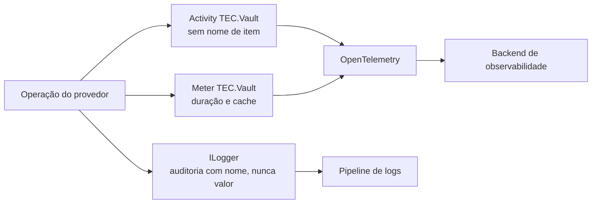

[🏠 TEC.Vault](../README.md) › [📚 Documentação](README.md) › 📈 Observabilidade

# 📈 Observabilidade

> Traces, métricas e logs de auditoria de cada operação do cofre, para acompanhar latência, falhas e quem fez o quê, sem nunca expor valores nem nomes de item na telemetria enviada a terceiros.

## 📑 Sumário

- [🎯 Visão geral](#-visão-geral)
- [🚀 Uso](#-uso)
- [📘 Referência da API](#-referência-da-api)
- [⚙️ Opções](#️-opções)
- [❌ Erros](#-erros)
- [🛡️ Segurança](#️-segurança)
- [❓ Perguntas frequentes](#-perguntas-frequentes)

---

## 🎯 Visão geral

Os sinais saem da base comum dos provedores (`VaultProviderBase`), então **todo** provedor (inclusive um que você escrever) emite a mesma telemetria. Seguindo o padrão TEC, o pacote usa só a BCL (`ActivitySource` e `Meter` com o nome `TEC.Vault`): não depende do TEC.Observability nem do OpenTelemetry.



| Sinal | Leva o nome do item? | Leva o valor? | Para quê |
|---|:---:|:---:|---|
| Traces | ❌ | ❌ | Latência e falhas por operação |
| Métricas | ❌ | ❌ | Volume, duração, taxa de erro, eficiência do cache |
| Logs | ✅ (auditoria) | ❌ | Quem fez o quê e quando; diagnóstico de falhas |

---

## 🚀 Uso

### Com o TEC.Observability

Nada a fazer: o `AddTecObservability` exporta as fontes `TEC.*` (inclusive `TEC.Vault`) e os logs seguem pelo pipeline com o escopo de correlação.

### OpenTelemetry direto

```csharp
using TEC.Vault.Diagnostics;

builder.Services.AddOpenTelemetry()
    .WithTracing(tracing => tracing.AddSource(VaultDiagnostics.ActivitySourceName))   // "TEC.Vault"
    .WithMetrics(metrics => metrics.AddMeter(VaultDiagnostics.MeterName));            // "TEC.Vault"
```

### Só logs de auditoria

Os eventos de escrita saem em `Information`; as leituras, em `Debug`. Para manter a trilha de auditoria sem o ruído das leituras:

```json
{
  "Logging": {
    "LogLevel": {
      "Default": "Information",
      "TEC.Vault": "Information"
    }
  }
}
```

### Consultas úteis (PromQL ilustrativo)

```text
# Taxa de erro por operação
sum by (vault_operation, error_type) (rate(vault_operation_duration_seconds_count{error_type!=""}[5m]))

# p95 de latência das leituras de segredo
histogram_quantile(0.95, sum by (le) (rate(vault_operation_duration_seconds_bucket{vault_operation="secret.get"}[5m])))

# Eficiência do cache
sum(rate(vault_cache_requests_total{vault_cache_result="hit"}[5m])) / sum(rate(vault_cache_requests_total[5m]))
```

> [!TIP]
> Crie alertas para: evento 2004 com `403` repetido (permissão ou rede), operações `*.purge` (2001), leituras
> sensíveis (2008), rotações incompletas (2009), `error.type = VAULT_LISTAGEM_ACIMA_DO_LIMITE` e falhas de carga de
> configuração (2100–2103, 2106).

---

## 📘 Referência da API

### `VaultDiagnostics`

> `TEC.Vault.Diagnostics` · `static class` · pacote `TEC.Vault`

| Membro | Tipo | Valor | Descrição |
|---|---|---|---|
| `ActivitySourceName` | `const string` | `"TEC.Vault"` | Nome do `ActivitySource` |
| `MeterName` | `const string` | `"TEC.Vault"` | Nome do `Meter` |
| `OperationDurationName` | `const string` | `"vault.operation.duration"` | Histograma de duração |
| `CacheRequestsName` | `const string` | `"vault.cache.requests"` | Contador do cache de segredos |

### Traces

Cada operação que passa da validação de entrada gera uma `Activity`:

| Propriedade | Valor |
|---|---|
| Fonte | `TEC.Vault` |
| Nome | `Cofre <operação>` (ex.: `Cofre secret.get`, `Cofre key.sign`) |
| Tipo | `Client` |
| `vault.provider` | `AzureKeyVault`, `HashiCorpVault`, `Infisical`, `InMemory`... |
| `vault.operation` | Ex.: `secret.get` (veja [nomes de operação](#nomes-de-operação)) |
| `vault.success` | `true` / `false` |
| `vault.error_code` | Código de `VaultErrors` (só em falha) |
| `error.type` | O mesmo valor da métrica: código de `VaultErrors` ou `canceled` (só em falha) |
| Status | `Error` em falha ou cancelamento |

Entradas recusadas na validação **não** geram `Activity` (só a métrica, com duração 0, e o log 2006).

### Métricas

| Instrumento | Tipo | Unidade | Dimensões | Quando |
|---|---|---|---|---|
| `vault.operation.duration` | Histograma (`double`) | `s` | `vault.provider`, `vault.operation`, `error.type` (só em falha) | Toda operação de provedor, inclusive entradas recusadas (duração 0) e cancelamentos (`canceled`) |
| `vault.cache.requests` | Contador (`long`) | `{request}` | `vault.provider`, `vault.cache.result` = `hit`, `miss` ou `coalesced` | Toda leitura com o cache ligado (`coalesced` = aguardou uma leitura simultânea da mesma chave) |

A contagem de operações por tipo e resultado vem do próprio histograma (convenção do OpenTelemetry). Todas as dimensões são de baixa cardinalidade.

### Logs e auditoria

Mensagens geradas por *source generator* (`LoggerMessage`: sem alocação com o nível desligado). Categoria: a classe do provedor (ex.: `TEC.Vault.AzureKeyVault.AzureKeyVaultSecretStore`), o health check ou o provedor de configuração.

| Evento | Nível | Mensagem (resumo) | Quando |
|:---:|---|---|---|
| 2000 | Debug | `Cofre {Provider}: {Operation} de '{ItemName}' concluída em {ElapsedMilliseconds} ms.` | Leitura concluída |
| 2001 | Information | `Auditoria do cofre {Provider}: {Operation} de '{ItemName}' concluída...` | Escrita concluída (inclui download de certificado) |
| 2002 | Information | `Cofre {Provider}: {Operation} de '{ItemName}' retornou {ErrorCode} ({Detail}).` | Falha esperada em leitura (ex.: não encontrado) |
| 2003 | Warning | `Auditoria do cofre ... retornou {ErrorCode} ({Detail}).` | Falha esperada em escrita |
| 2004 | Error | `... falhou por infraestrutura: {ErrorCode} ({Detail}).` | Falha `ExternalService` ou `Failure` (inclui listagem acima do limite) |
| 2005 | Error | `... lançou {ExceptionType} inesperada; convertida em {ErrorCode}.` | Exceção não mapeada (com pilha) |
| 2006 | Debug | `... de '{ItemName}' recusada na validação de entrada ({Field}).` | Entrada inválida; `{ItemName}` vem como `<N caracteres, hmac:xxxxxxxxxxxx>` |
| 2007 | Warning | `Health check do cofre falhou: {ErrorCode}.` | Health check com falha |
| 2008 | Information | `Auditoria do cofre {Provider}: {Operation} de '{ItemName}': {Reason}.` | Leitura sensível (ex.: segredo gerenciado com chave privada) |
| 2009 | Warning | `... rotação de '{ItemName}' gravou a versão {Version}, mas {Pending} versões anteriores podem continuar habilitadas ({ErrorCode})...` | `RotateSecretAsync` (sobrecarga com `ILogger`) incompleta |
| 2010 | Warning | `Health check do cofre sem nenhuma verificação...` | Nenhum store registrado oferece verificação (ex.: só `IKeyCryptography` sem `IVaultHealthProbe`); registrado uma vez |
| 2100 | Error | `Configuração do cofre ({Provider}): falha na carga inicial: {ErrorCode}.` | Carga **inicial** do `IConfiguration` falhou (só ela) |
| 2101 | Warning | `... falha na recarga, valores anteriores mantidos: {ErrorCode}.` | Recarga falhou depois de uma carga aplicada (timer ou `Reload()` manual) |
| 2102 | Error | `... {Count} segredos correspondem ao filtro, acima do limite MaxSecrets ({MaxSecrets})...` | Estouro de `MaxSecrets` |
| 2103 | Error | `... tempo limite de {TimeoutSeconds} s excedido ao carregar os segredos.` | `LoadTimeout` |
| 2104 | Information | `... {Count} segredos carregados ({Read} lidos do cofre) em {ElapsedMilliseconds} ms.` | Carga concluída |
| 2105 | Error | `... recarga lançou {ExceptionType} inesperada; valores anteriores mantidos.` | Exceção na recarga |
| 2106 | Error | `... a carga lançou {ExceptionType} inesperada.` | Exceção do leitor na carga inicial ou no `Reload()` (com pilha) |
| 2107 | Debug | `... carga descartada, uma carga iniciada depois já foi aplicada.` | Cargas simultâneas: a mais antiga não sobrescreve a mais nova |

- `{Detail}` é um texto técnico seguro (ex.: `403 Forbidden ForbiddenByConnection`, `tempo limite`, `rede: ConnectionError`, `503 Retry-After acima do limite`, `listagem acima de 10000 itens`); nunca corpo de resposta, valor ou token.
- Operações sem item (listagens, sonda) registram `'*'` como nome.

### Nomes de operação

| Família | Operações |
|---|---|
| Segredos | `secret.get`, `secret.exists`, `secret.list`, `secret.versions`, `secret.set`, `secret.update`, `secret.delete`, `secret.list-deleted`, `secret.recover`, `secret.purge`, `secret.backup`, `secret.restore`, `secret.health` |
| Chaves | `key.get`, `key.list`, `key.versions`, `key.create`, `key.update`, `key.rotate`, `key.delete`, `key.list-deleted`, `key.recover`, `key.purge`, `key.backup`, `key.restore`, `key.encrypt`, `key.decrypt`, `key.wrap`, `key.unwrap`, `key.sign`, `key.verify`, `key.health` |
| Certificados | `certificate.get`, `certificate.download`, `certificate.list`, `certificate.versions`, `certificate.create`, `certificate.import`, `certificate.update`, `certificate.delete`, `certificate.list-deleted`, `certificate.recover`, `certificate.purge`, `certificate.backup`, `certificate.restore`, `certificate.health` |

Operações de escrita (auditadas em `Information`): `set`, `update`, `delete`, `recover`, `purge`, `backup`, `restore`, `create`, `rotate`, `import` e `certificate.download`. As operações criptográficas (`encrypt`, `decrypt`, `wrap`, `unwrap`, `sign`, `verify`) são leituras (`Debug`).

---

## ⚙️ Opções

Não há opções próprias: a telemetria é sempre emitida e só é coletada se alguém assinar a fonte, o medidor ou a categoria de log.

| Cenário | O que fazer |
|---|---|
| Com o TEC.Observability | Nada: `AddTecObservability` exporta as fontes `TEC.*` |
| OpenTelemetry direto | `AddSource(VaultDiagnostics.ActivitySourceName)` e `AddMeter(VaultDiagnostics.MeterName)` |
| Só logs | Nível da categoria `TEC.Vault` (`Information` = auditoria de escritas; `Debug` = também leituras) |

---

## ❌ Erros

Não se aplica: a telemetria nunca altera o resultado da operação. O código de erro da operação aparece em `vault.error_code`/`error.type` e nos eventos 2002–2005 (tabela de códigos em [Erros](erros.md)).

---

## 🛡️ Segurança

> [!IMPORTANT]
> Nenhum trace ou métrica leva o nome do item (traces e métricas costumam ir para terceiros); o nome fica só no log
> de auditoria. Valores de segredo, textos claros, chaves e certificados nunca são registrados em lugar nenhum.

> [!WARNING]
> Os spans do SDK do Azure são desligados pelo provedor (`IsDistributedTracingEnabled = false`): levariam o endereço
> do cofre e o nome/versão do item. Já a instrumentação genérica de `HttpClient` grava `url.full` com esses dados. O
> [TEC.Observability](https://github.com/tudoemcodigo/lib-tec-observability) não rastreia requisições para hosts de
> cofre (`*.vault.azure.net`, `*.vault.azure.cn`, `*.vault.usgovcloudapi.net`); em outra pilha de observabilidade,
> filtre esses hosts e o endereço do seu HashiCorp Vault/Infisical.

- **Nome recusado no log:** uma entrada recusada pode ser lixo, texto de ataque ou até um segredo colado no campo errado. Por isso o evento 2006 não registra o nome como veio: usa `SensitiveDataMasker.DescribeUntrusted` do TEC.Core, que grava só o tamanho e um prefixo de HMAC-SHA256 com chave aleatória do processo (`<12 caracteres, hmac:3fa0c19b7e21>`; `<nulo>` e `<vazio>` nos casos triviais). Permite correlacionar ocorrências no mesmo processo sem permitir conferir palpites fora dele (a chave muda a cada reinício).
- **Detalhe seguro:** o `{Detail}` dos eventos vem de `VaultFailure.Detail`, escrito pelo provedor com códigos e status, nunca com corpo de resposta.

---

## ❓ Perguntas frequentes

<details>
<summary>Por que não vejo o nome do segredo no trace?</summary>

De propósito: traces e métricas costumam ir para serviços de terceiros, e nomes de segredo revelam a arquitetura
(ex.: `pagamentos-chave-api-banco-x`). Correlacione pelo `TraceId`: o log de auditoria da mesma operação tem o nome.

</details>

<details>
<summary>Como auditar quem apagou ou purgou um item?</summary>

Filtre os eventos 2001 (sucesso) e 2003 (falha) com `{Operation}` `*.delete` ou `*.purge`. A identidade que fez a
operação é a da aplicação; combine com o escopo de correlação (usuário da requisição) do pipeline de logs.

</details>

<details>
<summary>O que significa <code>coalesced</code> no contador do cache?</summary>

A leitura encontrou outra leitura da mesma chave em andamento e esperou o resultado dela, sem ir ao cofre (proteção
contra *stampede*). Veja [Cache e health check](cache-e-health-check.md).

</details>

---
⬅️ [🧱 Novo provedor](novo-provedor.md) · [📚 Índice](README.md) · [❌ Erros](erros.md) ➡️
