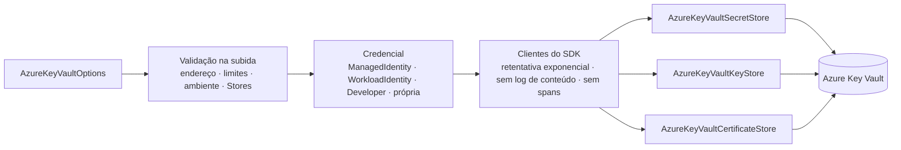
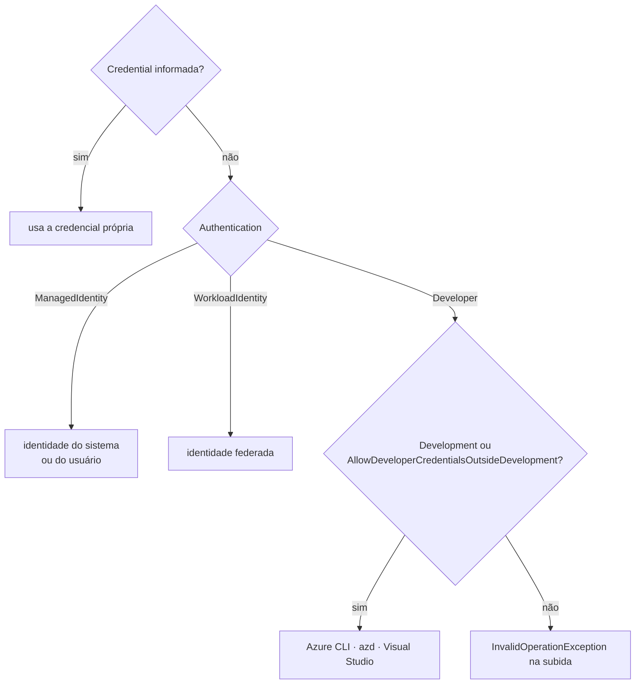

[🏠 TEC.Vault](../README.md) › [📚 Documentação](README.md) › 🌐 Provedor Azure Key Vault

# 🌐 Provedor Azure Key Vault

> Conecta o TEC.Vault ao Azure Key Vault (segredos, chaves e certificados) com autenticação sem segredo, endereço do cofre validado na subida e falhas do SDK convertidas em `VaultErrors`.

## 📑 Sumário

- [🎯 Visão geral](#-visão-geral)
- [🚀 Uso](#-uso)
- [📘 Referência da API](#-referência-da-api)
- [🔑 Permissões RBAC](#-permissões-rbac)
- [⚙️ Opções](#️-opções)
- [❌ Erros](#-erros)
- [🛡️ Segurança](#️-segurança)
- [❓ Perguntas frequentes](#-perguntas-frequentes)

---

## 🎯 Visão geral

| Item | Valor |
|---|---|
| Pacote | `TEC.Vault.AzureKeyVault` (depende de `TEC.Vault`, `Azure.Identity` e dos SDKs `Azure.Security.KeyVault.*`) |
| Namespace | `TEC.Vault.AzureKeyVault` |
| Nome do provedor | `AzureKeyVault` (`AzureKeyVaultStoreBase.Provider` e `AzureKeyVaultCatalogExtensions.ProviderName`) |
| Famílias | Segredos, chaves e certificados, com lixeira e backup nas três |
| Quando usar | Aplicações no Azure (App Service, Functions, Container Apps, VMs, AKS) ou com identidade federada para ele |



Os três stores compartilham o mesmo conjunto de clientes do SDK (thread-safe; um conjunto por chamada de `UseAzureKeyVault`) e herdam de `AzureKeyVaultStoreBase` → `VaultProviderBase`, que faz validação de entrada, auditoria, spans e métricas (veja [Observabilidade](observabilidade.md)).



---

## 🚀 Uso

### Registro no container

```csharp
using TEC.Vault.AzureKeyVault;
using TEC.Vault.DependencyInjection;

var builder = WebApplication.CreateBuilder(args);

builder.Services.AddTecVault(vault => vault.UseAzureKeyVault(o =>
{
    o.VaultUri = new Uri(builder.Configuration["Cofre:VaultUri"]!);
    o.Authentication = builder.Environment.IsDevelopment()
        ? AzureKeyVaultAuthentication.Developer
        : AzureKeyVaultAuthentication.ManagedIdentity;
    o.Stores = VaultStores.Secrets | VaultStores.Keys;   // registre só o que a aplicação usa
}));
```

<details>
<summary>📄 Exemplo com todas as opções comuns</summary>

```csharp
builder.Services.AddTecVault(vault => vault.UseAzureKeyVault(o =>
{
    o.VaultUri = new Uri(builder.Configuration["Cofre:VaultUri"]!);
    o.Authentication = AzureKeyVaultAuthentication.ManagedIdentity;
    o.ManagedIdentityClientId = builder.Configuration["Cofre:ClientId"];   // identidade atribuída pelo usuário (GUID) ou null
    o.TenantId = builder.Configuration["Cofre:TenantId"];                  // recomendado com Developer
    o.MaxRetries = 3;
    o.NetworkTimeout = TimeSpan.FromSeconds(20);
    o.OperationTimeout = TimeSpan.FromMinutes(5);
    o.MaxListItems = 5_000;                                                // teto de cada listagem
    o.CryptographyClientLifetime = TimeSpan.FromMinutes(5);                // revogação mais rápida em encrypt/wrap/verify
    o.Stores = VaultStores.All;
}));
```

</details>

### Outros modos de autenticação

```csharp
// AKS ou GitHub Actions com identidade federada (lê AZURE_TENANT_ID, AZURE_CLIENT_ID e AZURE_FEDERATED_TOKEN_FILE)
builder.Services.AddTecVault(vault => vault.UseAzureKeyVault(o =>
{
    o.VaultUri = new Uri("https://<nome-do-cofre>.vault.azure.net/");
    o.Authentication = AzureKeyVaultAuthentication.WorkloadIdentity;
}));

// Fora do Azure, com certificado da máquina (evite ClientSecretCredential)
builder.Services.AddTecVault(vault => vault.UseAzureKeyVault(o =>
{
    o.VaultUri = new Uri("https://<nome-do-cofre>.vault.azure.net/");
    o.Credential = new ClientCertificateCredential("<tenant-id>", "<client-id>", certificadoDaMaquina);
}));
```

### Escolha pela configuração (`appsettings.json`)

```csharp
builder.Services.AddTecVault(builder.Configuration.GetSection("Vault"),
    providers => providers.AddAzureKeyVault());
```

```json
{
  "Vault": {
    "Provider": "AzureKeyVault",
    "AzureKeyVault": {
      "VaultUri": "https://<nome-do-cofre>.vault.azure.net/",
      "Authentication": "ManagedIdentity",
      "MaxListItems": 10000
    }
  }
}
```

As regras da seção `Vault` (provedor por família, `None`, cache) estão em [Escolha do cofre pela configuração](configuracao-por-appsettings.md). `Credential`, `HostEnvironment` e `AllowDeveloperCredentialsOutsideDevelopment` só existem em código, no `configure` de `AddAzureKeyVault`.

### Segredos como `IConfiguration`

```csharp
builder.Configuration.AddTecVaultAzureKeyVault(
    o => o.VaultUri = new Uri("https://<nome-do-cofre>.vault.azure.net/"),
    c => c.Prefix = "MinhaApi--",
    LoggerFactory.Create(l => l.AddConsole()));
```

Detalhes (prefixo, recarga, limites) em [Segredos no IConfiguration](configuracao.md).

### Sem injeção de dependências

```csharp
// Ferramenta de linha de comando: lista segredos que vencem em 30 dias
using var logs = LoggerFactory.Create(l => l.AddConsole());
var segredos = AzureKeyVaultStores.CreateSecretStore(o =>
{
    o.VaultUri = new Uri(args[0]);
    o.Authentication = AzureKeyVaultAuthentication.Developer;
    o.AllowDeveloperCredentialsOutsideDevelopment = true;   // ferramenta fora de Development
}, logs);

var lista = await segredos.ListSecretsAsync();
if (lista.IsSuccess)
{
    foreach (var s in lista.Value.Where(s => s.ExpiresOn < DateTimeOffset.UtcNow.AddDays(30)))
        Console.WriteLine($"{s.Name} → {s.ExpiresOn:d}");
}
```

---

## 📘 Referência da API

### `AzureKeyVaultExtensions` · `AzureKeyVaultCatalogExtensions` · `AzureKeyVaultStores`

| Membro | Retorno | Descrição |
|---|---|---|
| `UseAzureKeyVault(this VaultBuilder builder, Action<AzureKeyVaultOptions> configure)` | `VaultBuilder` | Usa o Key Vault para as famílias de `Stores` (padrão: todas). Opções validadas aqui, na subida |
| `AddTecVaultAzureKeyVault(this IConfigurationBuilder builder, Action<AzureKeyVaultOptions> configure, Action<VaultConfigurationOptions>? configureConfiguration = null, ILoggerFactory? loggerFactory = null)` | `IConfigurationBuilder` | Segredos do cofre como configuração |
| `AddAzureKeyVault(this VaultProviderCatalog catalog, Action<AzureKeyVaultOptions>? configure = null)` | `VaultProviderCatalog` | Disponibiliza o provedor `AzureKeyVault` para a escolha por configuração (seção `Vault:AzureKeyVault`); `configure` roda depois da leitura da seção |
| `AzureKeyVaultCatalogExtensions.ProviderName` *(const)* | `string` | `"AzureKeyVault"` |
| `AzureKeyVaultStores.CreateSecretStore(configure, loggerFactory = null)` | `AzureKeyVaultSecretStore` | Store de segredos sem DI |
| `AzureKeyVaultStores.CreateKeyStore(configure, loggerFactory = null)` | `AzureKeyVaultKeyStore` | Store de chaves sem DI |
| `AzureKeyVaultStores.CreateCertificateStore(configure, loggerFactory = null)` | `AzureKeyVaultCertificateStore` | Store de certificados sem DI |

### Classes do provedor

Classes `sealed` com construtores internos (crie por `UseAzureKeyVault` ou `AzureKeyVaultStores`).

| Classe | Implementa |
|---|---|
| `AzureKeyVaultSecretStore` | `ISecretStore`, `ISecretRecycleBin`, `ISecretBackup`, `IVaultHealthProbe` |
| `AzureKeyVaultKeyStore` | `IKeyStore`, `IKeyCryptography`, `IKeyRecycleBin`, `IKeyBackup`, `IVaultHealthProbe` |
| `AzureKeyVaultCertificateStore` | `ICertificateStore`, `ICertificateRecycleBin`, `ICertificateBackup`, `IVaultHealthProbe` |
| `AzureKeyVaultStoreBase` *(abstract)* | Base com as regras de entrada e a conversão de exceções; não pode ser derivada fora do pacote. `Provider` = `"AzureKeyVault"` |

### `AzureKeyVaultAuthentication`

| Valor | Credencial usada | Quando usar |
|---|---|---|
| `ManagedIdentity` (0) | Identidade gerenciada do sistema ou, com `ManagedIdentityClientId`, atribuída pelo usuário | **Padrão e recomendado em produção** |
| `WorkloadIdentity` (1) | Identidade federada: token do provedor de identidade trocado por token do Entra ID; lê `AZURE_TENANT_ID` (ou `TenantId`), `AZURE_CLIENT_ID` e `AZURE_FEDERATED_TOKEN_FILE` | AKS com Workload Identity, pipelines com OIDC |
| `Developer` (2) | Azure CLI (`az login`), Azure Developer CLI (`azd auth login`) e Visual Studio, nessa ordem, restritos a `TenantId` | **Só desenvolvimento**: falha fechada fora de Development |

### Comportamentos de cada família

| Item | Comportamento |
|---|---|
| Segredos gerenciados | O segredo que guarda o conteúdo de um certificado (`ManagedBy = "certificate"`) **pode** ser lido por `GetSecretAsync`, mas a leitura é auditada em `Information`, como o download do certificado |
| `ExistsAsync` | Consulta uma página de versões (só metadados); 404 vira `false` |
| `UpdateKeyPropertiesAsync` / `UpdateSecretPropertiesAsync` | Os metadados vêm da listagem de versões (o Key Vault recusa o GET de item desabilitado): dá para reabilitar um item desabilitado |
| Certificados | `Issuer = null` vira o emissor `Self` (autoassinado). Excluir um certificado exclui também a chave e o segredo gerenciados. `DownloadCertificateAsync` é auditado como escrita e usa `VaultCertificateLoader.SafeKeyStorageFlags` |
| Listagens | Paginadas pelo SDK, com teto de `MaxListItems`: ao passar do limite a paginação **para** e a operação devolve `VAULT_LISTAGEM_ACIMA_DO_LIMITE` |
| Tags vindas do servidor | Copiadas com tolerância: chave nula é descartada e valor nulo vira texto vazio (resposta malformada não derruba a leitura) |
| Sondas de saúde | Uma página de um item de metadados por store registrado |
| SDK | Retentativa exponencial; `IsLoggingContentEnabled = false` (corpo nunca vai ao log do SDK); `IsDistributedTracingEnabled = false` (spans do SDK levariam endereço e nome do item); `DisableChallengeResourceVerification = false` (fixo) |

### Clientes de criptografia

O SDK busca a chave pública na primeira operação de cada cliente de criptografia e, a partir daí, faz **localmente** as operações que só precisam dela (encrypt, wrap, verify).

| Situação | Comportamento |
|---|---|
| Operação **com** versão | Cliente reaproveitado por nome + versão (até 256; acima disso o cache é esvaziado) |
| Operação **sem** versão | Cliente criado a cada chamada, para sempre seguir a versão atual depois de uma rotação |
| Cliente com mais de `CryptographyClientLifetime` | Recriado: o estado da chave é lido de novo |
| Chave desabilitada, expirada ou excluída | Decrypt, unwrap e sign falham **na hora** (sempre remotos); encrypt, wrap e verify, em até `CryptographyClientLifetime` |

### Limites e regras de entrada

| Regra | Valor no Azure Key Vault |
|---|---|
| Nome de item | `^[0-9a-zA-Z-]{1,127}\z` (letras, números e hífen) |
| Versão | 32 caracteres hexadecimais |
| Valor de segredo | Até 25 KB (UTF-8) |
| Tags | Até 15; chave e valor com até 256 caracteres, sem caracteres de controle |
| Backup | Até 10 MB |
| `ContentType` | Até 255 caracteres |
| Emissor de certificado (`Issuer`) | `^[0-9a-zA-Z-]{1,127}\z` |
| Itens por listagem | `MaxListItems` (padrão 10.000) |

As demais validações (datas, chaves, certificados) são comuns a todos os provedores: veja [Novo provedor](novo-provedor.md).

### Native AOT

O código do pacote é verificado com os analisadores de AOT/trimming como erro. A dependência `Azure.Core` gera dois avisos (`IL2026`, `IL2075`) no decodificador interno de PKCS#8 EC, usado só ao carregar chaves EC em PEM de credenciais por certificado. `ManagedIdentity`, `WorkloadIdentity` e `Developer` não passam por esse caminho; com credencial por certificado EC em AOT, teste a aplicação publicada.

---

## 🔑 Permissões RBAC

| Uso | Papel mínimo |
|---|---|
| Ler segredos (`ISecretReader`) e `IConfiguration` | Key Vault Secrets User |
| Health check | Listar cada store registrado: Secrets User, Crypto User, Certificate User |
| Gravar, excluir, rotacionar segredos (`ISecretStore`, lixeira, backup) | Key Vault Secrets Officer |
| Criptografar, assinar, wrap (`IKeyCryptography`) | Key Vault Crypto User |
| Gerenciar chaves (`IKeyStore`) | Key Vault Crypto Officer |
| Ler certificados (`ICertificateReader`) | Key Vault Certificate User (+ Secrets User para o download com chave privada) |
| Gerenciar certificados (`ICertificateStore`) | Key Vault Certificates Officer |

```bash
# Exemplo: identidade da aplicação só lendo segredos de um cofre
az role assignment create --role "Key Vault Secrets User" \
  --assignee <client-id> \
  --scope /subscriptions/<subscription-id>/resourceGroups/<grupo-de-recursos>/providers/Microsoft.KeyVault/vaults/<nome-do-cofre>
```

> [!TIP]
> Registre em `Stores` só as famílias que a aplicação usa: o health check verifica cada store registrado, então uma aplicação que só usa chaves não precisa de permissão de segredos para ficar saudável.

O checklist de configuração do cofre (RBAC, soft delete, proteção contra purge, rede, diagnóstico) está em [Segurança](seguranca.md).

---

## ⚙️ Opções

`AzureKeyVaultOptions` (`sealed class`). A coluna **Configuração** é a chave lida por `AddAzureKeyVault` na seção `Vault:AzureKeyVault`; "—" = só em código.

| Opção | Tipo | Padrão | Configuração | Descrição e validação |
|---|---|---|---|---|
| `VaultUri` | `Uri?` | — | `VaultUri` | **Obrigatório.** HTTPS, porta padrão, sem usuário, query, fragmento ou caminho; host `<nome>` + `.vault.azure.net`, `.vault.azure.cn` ou `.vault.usgovcloudapi.net`; nome com 3 a 24 caracteres, começando por letra |
| `Authentication` | `AzureKeyVaultAuthentication` | `ManagedIdentity` | `Authentication` | Modo de autenticação (valor definido no enum) |
| `ManagedIdentityClientId` | `string?` | `null` | `ManagedIdentityClientId` | Client ID da identidade atribuída pelo usuário (GUID); `null` = do sistema |
| `TenantId` | `string?` | `null` | `TenantId` | Tenant do Entra ID (GUID); recomendado com `Developer` |
| `Credential` | `TokenCredential?` | `null` | — | Credencial própria; tem precedência sobre `Authentication` |
| `AllowDeveloperCredentialsOutsideDevelopment` | `bool` | `false` | — (recusada na configuração) | Libera `Developer` fora de Development (CI, ferramentas) |
| `MaxRetries` | `int` | `3` | `MaxRetries` | Retentativas em falhas transitórias (backoff exponencial), 0 a 10 |
| `NetworkTimeout` | `TimeSpan` | `30 s` | `NetworkTimeout` | Tempo limite de cada tentativa; > 0 e ≤ 5 min |
| `OperationTimeout` | `TimeSpan` | `5 min` | `OperationTimeout` | Espera por operações longas (exclusão, recuperação, emissão de certificado); > 0 e ≤ 30 min |
| `MaxListItems` | `int` | `10.000` | `MaxListItems` | Máximo de itens de uma listagem (itens, versões e excluídos), de 1 a 1.000.000. Acima disso a paginação para e a operação devolve `VAULT_LISTAGEM_ACIMA_DO_LIMITE` |
| `CryptographyClientLifetime` | `TimeSpan` | `10 min` | `CryptographyClientLifetime` | Vida de cada cliente de criptografia reaproveitado; de `MinCryptographyClientLifetime` (1 min) a `MaxCryptographyClientLifetime` (24 h) |
| `Stores` | `VaultStores` | `All` | — (vem de `Vault:Provider` e das escolhas por família) | Stores registrados por `UseAzureKeyVault`; ignorado em `AzureKeyVaultStores` |
| `HostEnvironment` | `IHostEnvironment?` | `null` | — | Ambiente da trava do `Developer`; sem valor, o `IHostEnvironment` do container e, sem ele, `ASPNETCORE_ENVIRONMENT` (ou, se vazia, `DOTNET_ENVIRONMENT`) |
| `TimeProvider` | `TimeProvider?` | `TimeProvider.System` | — | Relógio injetável: validação das datas de expiração na gravação e vida dos clientes de criptografia |

> [!NOTE]
> Toda opção inválida falha **na subida** com `InvalidOperationException` que cita a opção (ex.: `AzureKeyVaultOptions.MaxListItems deve estar entre 1 e 1.000.000.`); pela configuração, a mensagem cita o caminho da chave (`Vault:AzureKeyVault:MaxListItems`). Chave desconhecida na seção também falha.

---

## ❌ Erros

### Na subida (`InvalidOperationException`)

| Mensagem (início) | Causa | O que fazer |
|---|---|---|
| `Informe AzureKeyVaultOptions.VaultUri.` | Endereço ausente | Defina `VaultUri` |
| `AzureKeyVaultOptions.VaultUri inválido` | Porta, caminho, query, usuário ou domínio fora do Key Vault | Use só `https://<nome-do-cofre>.vault.azure.net/` (ou o domínio da nuvem soberana) |
| `AzureKeyVaultOptions.MaxListItems deve estar entre 1 e 1.000.000.` | Limite fora da faixa | Ajuste o valor |
| `AzureKeyVaultOptions.MaxRetries`, `NetworkTimeout`, `OperationTimeout`, `CryptographyClientLifetime` | Valor fora da faixa da tabela de opções | Ajuste o valor |
| `AzureKeyVaultAuthentication.Developer só é permitido no ambiente Development` | `Developer` fora de Development | Em servidores use `ManagedIdentity`/`WorkloadIdentity`; em CI e ferramentas, `AllowDeveloperCredentialsOutsideDevelopment = true` |
| `AzureKeyVaultOptions.TenantId deve ser um GUID.` / `ManagedIdentityClientId deve ser um GUID.` | Formato inválido | Informe o GUID |
| `AzureKeyVaultOptions.Stores` | Nenhuma família válida | Informe ao menos uma família de `VaultStores` |

### Nas operações (`Result` com `VaultErrors`)

| Origem | Código |
|---|---|
| Entrada fora das regras (nome, versão, tamanho, tags) | `VAULT_ENTRADA_INVALIDA` (antes de qualquer chamada) |
| Listagem acima de `MaxListItems` | `VAULT_LISTAGEM_ACIMA_DO_LIMITE` (tipo `Failure`, HTTP 500) |
| HTTP 400 | `VAULT_REQUISICAO_RECUSADA` |
| HTTP 401, `AuthenticationFailedException`, `CredentialUnavailableException` | `VAULT_AUTENTICACAO_FALHOU` |
| HTTP 403 com `SecretDisabled`, `KeyDisabled` ou `CertificateDisabled` (código estruturado, nunca o texto) | `VAULT_ITEM_DESABILITADO` |
| Demais HTTP 403 (papel ausente, `ForbiddenByConnection`, `ForbiddenByFirewall`, rede pública desabilitada) | `VAULT_ACESSO_NEGADO` |
| HTTP 404 | `VAULT_ITEM_NAO_ENCONTRADO` |
| HTTP 409 | `VAULT_CONFLITO` |
| HTTP 429 | `VAULT_LIMITE_EXCEDIDO` |
| HTTP 0 ou ≥ 500, `TimeoutException`, cancelamento interno (`OperationTimeout`), `IOException`, `HttpRequestException`, `SocketException` | `VAULT_INDISPONIVEL` |
| `AggregateException` (retentativas esgotadas) | Conversão da última exceção; se desconhecida, `VAULT_INDISPONIVEL` |
| `NotSupportedException` | `VAULT_OPERACAO_NAO_SUPORTADA` |
| Outro status ou exceção | `VAULT_FALHA` (com pilha no log) |

No log vai só `status error.code innererror.code` (ex.: `403 Forbidden ForbiddenByRbac`). Os dois códigos passam por uma conferência de formato (identificador ASCII de até 64 caracteres); fora disso vai o marcador `codigo-invalido`. A lista completa de códigos está em [Erros](erros.md).

---

## 🛡️ Segurança

> [!IMPORTANT]
> A validação de `VaultUri` impede que um valor de configuração adulterado (ex.: `https://kv.vault.azure.net.evil.com`) envie o token de acesso da aplicação para outro servidor. O SDK também recusa desafio de autenticação de outro domínio.

> [!WARNING]
> `Developer` (Azure CLI, azd, Visual Studio) só é aceito em Development: um servidor com o `az login` de um administrador nunca passa a usar essa identidade por engano de configuração. `AllowDeveloperCredentialsOutsideDevelopment` não pode vir do `appsettings`: liberar isso é decisão em código.

> [!CAUTION]
> Evite `ClientSecretCredential` em `Credential`: é um segredo para proteger o cofre de segredos. Fora do Azure, prefira `ClientCertificateCredential` ou identidade federada.

> [!TIP]
> Onde a revogação rápida de chaves importa, reduza `CryptographyClientLifetime` (mínimo 1 minuto). Dados cifrados nesse intervalo continuam protegidos: só quem tem decrypt os lê.

- `MaxListItems` protege memória, chamadas e cota de requisições contra um cofre inflado (por erro ou por ataque).
- Corpo de requisição e resposta nunca vai ao log do SDK; spans do SDK ficam desligados (levariam endereço do cofre e nome do item).

---

## ❓ Perguntas frequentes

<details>
<summary><code>AzureKeyVaultOptions.VaultUri inválido</code> na subida</summary>

O endereço não segue `https://<nome-do-cofre>.vault.azure.net/` (tem porta, caminho, query, usuário ou domínio diferente). Use só o endereço base do cofre, com HTTPS; a barra final é opcional. Nuvens soberanas: `.vault.azure.cn` e `.vault.usgovcloudapi.net`.

</details>

<details>
<summary><code>AzureKeyVaultAuthentication.Developer só é permitido no ambiente Development</code></summary>

A aplicação usa `Developer` fora de Development (trava de segurança). Em servidores use `ManagedIdentity` ou `WorkloadIdentity`. Em CI e ferramentas de linha de comando, defina `AllowDeveloperCredentialsOutsideDevelopment = true` em código. Localmente, confira se `IHostEnvironment`/`ASPNETCORE_ENVIRONMENT` é mesmo `Development`.

</details>

<details>
<summary><code>VAULT_LISTAGEM_ACIMA_DO_LIMITE</code> ao listar</summary>

O cofre tem mais itens (ou versões, ou itens excluídos) que `MaxListItems`. Use um cofre por aplicação ou aumente `MaxListItems` (até 1.000.000) com consciência do custo de memória e de requisições.

</details>

<details>
<summary><code>VAULT_ACESSO_NEGADO</code> com a permissão aparentemente certa</summary>

Confira no log o `innererror.code`: `ForbiddenByRbac` é papel ausente (veja [Permissões RBAC](#-permissões-rbac)); `ForbiddenByFirewall`/`ForbiddenByConnection` é rede (firewall do cofre ou endpoint privado). Atribuições de papel podem levar alguns minutos para valer.

</details>

<details>
<summary>Como testar código que usa o Key Vault sem um cofre?</summary>

Use o [provedor em memória](provedor-em-memoria.md) nos testes de unidade; ele segue o mesmo contrato. Os testes de integração contra um cofre real estão em [Testes](testes.md).

</details>

---

⬅️ [💾 Cache e health check](cache-e-health-check.md) · [📚 Índice](README.md) · [🏛️ Provedor HashiCorp Vault](provedor-hashicorp-vault.md) ➡️
