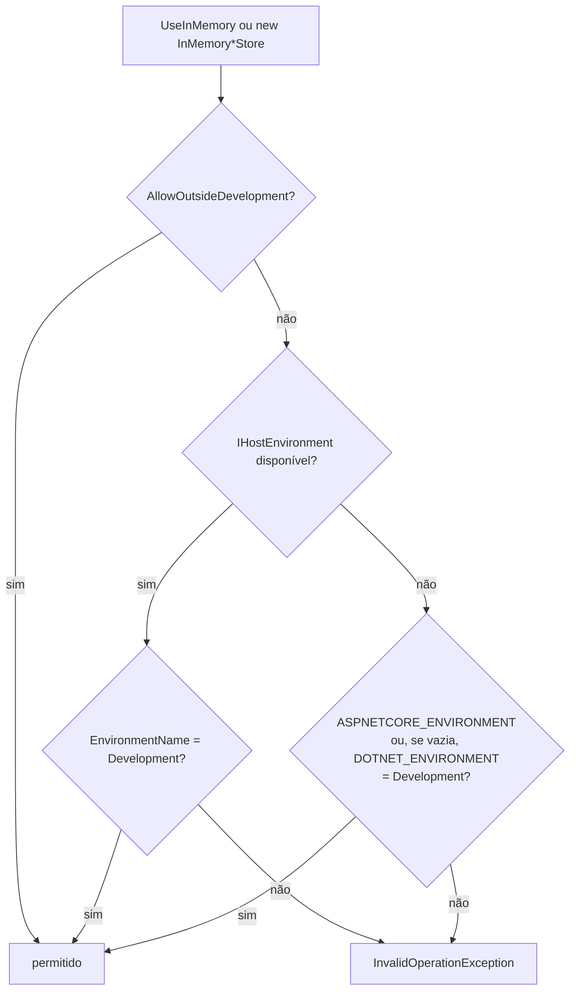

[🏠 TEC.Vault](../README.md) › [📚 Documentação](README.md) › 🧠 Provedor em memória

# 🧠 Provedor em memória

> Cofre completo em memória (segredos, chaves e certificados, com criptografia real) e o mesmo contrato dos provedores reais, para rodar a aplicação localmente sem infraestrutura e para testes automatizados — bloqueado fora do ambiente Development.

## 📑 Sumário

- [🎯 Visão geral](#-visão-geral)
- [🚀 Uso](#-uso)
- [📘 Referência da API](#-referência-da-api)
- [⚙️ Opções](#️-opções)
- [❌ Erros](#-erros)
- [🛡️ Segurança](#️-segurança)
- [❓ Perguntas frequentes](#-perguntas-frequentes)

---

## 🎯 Visão geral

| Cenário | Use |
|---|---|
| Rodar a API localmente sem acesso ao cofre | `UseInMemory` com `InitialSecrets` (ou `Vault:Provider = InMemory` no `appsettings.Development.json`) |
| Teste de unidade/integração da aplicação | `new InMemorySecretStore(new() { AllowOutsideDevelopment = true })` |
| Teste de contrato de um novo provedor | Comportamento de referência (códigos de erro em cada situação) — veja [Novo provedor](novo-provedor.md) |
| Produção, homologação, dados reais | **Nunca** |

Os stores passam pela mesma `VaultProviderBase` dos provedores reais: validação de entrada, `Result`, auditoria, `Activity` e métricas iguais. `ProviderName` = `"InMemory"`. Cada instância tem os próprios dados e o conteúdo some quando o processo termina.

### Trava de ambiente



---

## 🚀 Uso

### Desenvolvimento local

```csharp
using TEC.Vault.AzureKeyVault;
using TEC.Vault.InMemory;

builder.Services.AddTecVault(vault =>
{
    if (builder.Environment.IsDevelopment())
        vault.UseInMemory(o =>
        {
            o.InitialSecrets["db-senha"] = "senha-local";
            o.InitialSecrets["parceiro-api-token"] = "token-local";
        });
    else
        vault.UseAzureKeyVault(o => o.VaultUri = new Uri(builder.Configuration["Cofre:VaultUri"]!));
});
```

Sem `if` no código, pela [escolha do cofre pela configuração](configuracao-por-appsettings.md):

```csharp
builder.Services.AddTecVault(builder.Configuration.GetSection("Vault"), p => p.AddInMemory().AddAzureKeyVault());
```

```jsonc
// appsettings.Development.json
{
  "Vault": {
    "Provider": "InMemory",
    "InMemory": { "InitialSecrets": { "parceiro-api-token": "token-local" } }
  }
}
```

### Testes automatizados

```csharp
using Microsoft.Extensions.Time.Testing;   // pacote Microsoft.Extensions.TimeProvider.Testing
using TEC.Vault.InMemory;
using TEC.Vault.Keys;
using TEC.Vault.Secrets;

public class CofreTests
{
    [Test]
    public async Task Rotation_disables_previous_versions()
    {
        var relogio = new FakeTimeProvider(DateTimeOffset.Parse("2026-01-01T00:00:00Z"));
        var cofre = new InMemorySecretStore(new InMemoryVaultOptions { AllowOutsideDevelopment = true, TimeProvider = relogio });
        await cofre.SetSecretAsync("token", "v1");

        relogio.Advance(TimeSpan.FromSeconds(1));
        var rotacao = await cofre.RotateSecretAsync("token", disablePreviousVersions: true, timeProvider: relogio);

        await Assert.That(rotacao.Value.IsComplete).IsTrue();
        await Assert.That(rotacao.Value.DisabledVersions.Count).IsEqualTo(1);
    }

    [Test]
    public async Task Signature_with_in_memory_key_is_real()
    {
        var chaves = new InMemoryKeyStore(new InMemoryVaultOptions { AllowOutsideDevelopment = true });
        await chaves.CreateKeyAsync("doc", new CreateKeyOptions { KeyType = VaultKeyType.Ec });

        var assinado = await chaves.SignDataAsync("doc", "conteúdo"u8.ToArray(), VaultSignatureAlgorithm.ES256);
        var valida = await chaves.VerifyDataAsync("doc", assinado.Value.KeyVersion, "conteúdo"u8.ToArray(),
            assinado.Value.Signature, VaultSignatureAlgorithm.ES256);

        await Assert.That(valida.Value).IsTrue();
    }
}
```

```csharp
// Teste de integração com WebApplicationFactory: o appsettings.Development.json escolhe o cofre em memória
public sealed class ApiFactory : WebApplicationFactory<Program>
{
    protected override void ConfigureWebHost(IWebHostBuilder builder) =>
        builder.UseEnvironment("Development");   // ou AllowOutsideDevelopment = true no UseInMemory
}
```

### Diferenças de um cofre real

| Aspecto | Comportamento em memória |
|---|---|
| Nomes | `^[0-9a-zA-Z][0-9a-zA-Z._/-]{0,126}\z`: 1 a 127 caracteres, letras, números, `-`, `_`, `.` e `/`, começando por letra ou número; sem diferenciar maiúsculas |
| Versões | 32 hexadecimais (mesmo formato do Azure Key Vault) |
| Valor de segredo | Até 64 KB (`InMemorySecretStore.MaxSecretValueBytes`); tags até 50, chave e valor com até 256 caracteres |
| Validade na leitura | Informativa: segredo expirado ainda é lido (como no Azure) |
| Chaves | RSA 2048/3072/4096 e EC P-256/384/521 geradas localmente; RSA-OAEP-256, wrap e assinatura **reais**; chave privada só na memória do processo (PKCS#8), nunca retornada |
| Chave fora da validade, operação não permitida, algoritmo incompatível, dado recusado pela criptografia | `VAULT_REQUISICAO_RECUSADA` |
| HSM (`HardwareProtected = true`) | `VAULT_OPERACAO_NAO_SUPORTADA` (nunca cai para software em silêncio) |
| Emissor de certificado (`Issuer`) | Só autoassinado; emissor informado → `VAULT_OPERACAO_NAO_SUPORTADA` |
| Renovação automática (`AutoRenewDaysBeforeExpiry`) | `VAULT_OPERACAO_NAO_SUPORTADA`, como no HashiCorp Vault |
| Certificado | Não cria chave nem segredo associados; download só se exportável |
| Importação PFX/PEM | Mesmas verificações locais dos provedores reais (`VaultCertificateRules`) |
| Lixeira | `ScheduledPurgeDate` = exclusão + 90 dias, sem remoção automática |
| Backup | Identificador opaco (até 64 bytes), válido só na mesma instância; desconhecido ou descartado (acima de `MaxBackups`) → `VAULT_REQUISICAO_RECUSADA`. Restaurar não consome o backup: o item restaurado recebe uma cópia independente |
| Gravar em nome excluído não purgado | `VAULT_CONFLITO` (como num cofre com soft delete) |
| Listagens | Sem teto (os dados já estão na memória do processo) |
| Persistência | Nenhuma |

---

## 📘 Referência da API

### Registro

> `TEC.Vault.InMemory` · `static class`

| Membro | Retorno | Descrição |
|---|---|---|
| `InMemoryVaultExtensions.UseInMemory(this VaultBuilder builder, Action<InMemoryVaultOptions>? configure = null)` | `VaultBuilder` | Usa o provedor em memória para as famílias de `Stores` (aplica a trava de ambiente na subida) |
| `InMemoryVaultCatalogExtensions.AddInMemory(this VaultProviderCatalog catalog, Action<InMemoryVaultOptions>? configure = null)` | `VaultProviderCatalog` | Disponibiliza o provedor `InMemory` para a escolha por configuração. Continua bloqueado fora de Development |
| `InMemoryVaultCatalogExtensions.ProviderName` *(const)* | `string` | `"InMemory"` |

### Stores

> `TEC.Vault.InMemory` · `sealed class` (construtores públicos)

| Classe | Construtor | Interfaces |
|---|---|---|
| `InMemorySecretStore` | `(InMemoryVaultOptions? options = null, ILogger<InMemorySecretStore>? logger = null)` | `ISecretStore`, `ISecretRecycleBin`, `ISecretBackup`, `IVaultHealthProbe` |
| `InMemoryKeyStore` | `(InMemoryVaultOptions? options = null, ILogger<InMemoryKeyStore>? logger = null)` | `IKeyStore`, `IKeyCryptography`, `IKeyRecycleBin`, `IKeyBackup`, `IVaultHealthProbe` |
| `InMemoryCertificateStore` | `(InMemoryVaultOptions? options = null, ILogger<InMemoryCertificateStore>? logger = null)` | `ICertificateStore`, `ICertificateRecycleBin`, `ICertificateBackup`, `IVaultHealthProbe` |
| `InMemoryStoreBase` *(abstract)* | — | Base comum; `Provider` *(const)* = `"InMemory"`; não pode ser derivada fora do pacote |

Os métodos são os das interfaces: [Segredos](segredos.md), [Chaves](chaves.md), [Certificados](certificados.md).

---

## ⚙️ Opções

`InMemoryVaultOptions` (`TEC.Vault.InMemory`, `sealed class`). Na configuração, a seção é `Vault:InMemory`.

| Opção | Chave | Padrão | Descrição |
|---|:---:|---|---|
| `AllowOutsideDevelopment` | ❌ (recusada) | `false` | Libera o uso fora de Development (testes automatizados, cujo processo normalmente não tem ambiente). **Só em código**: na configuração, a chave é recusada na subida |
| `HostEnvironment` | — | `null` | Ambiente da trava; sem valor, o `IHostEnvironment` do container e, sem ele, `ASPNETCORE_ENVIRONMENT` (ou, se vazia, `DOTNET_ENVIRONMENT`) |
| `TimeProvider` | — | `TimeProvider.System` | Relógio (criação, validade, exclusão) |
| `Stores` | — | `VaultStores.All` | Famílias registradas por `UseInMemory` (na configuração, vem de `Vault:Secrets:Provider`, `Vault:Keys:Provider` e `Vault:Certificates:Provider`) |
| `InitialSecrets` | ✅ | vazio | Segredos gravados na criação do store de segredos (nome → valor; sem diferenciar maiúsculas). Só valores de desenvolvimento |
| `MaxBackups` | ✅ | `100` | Backups guardados por store (cada um é cópia completa, inclusive chaves privadas); mínimo 1. Acima do limite o mais antigo é descartado, com os bytes das chaves privadas zerados, e passa a ser recusado na restauração |

---

## ❌ Erros

| Exceção / código | Quando | O que fazer |
|---|---|---|
| `InvalidOperationException` | Ambiente diferente de Development sem `AllowOutsideDevelopment` (em `UseInMemory`, `AddInMemory` ou no construtor do store); `Stores` inválido; `AllowOutsideDevelopment` na configuração | Use um cofre real fora de Development; em testes, `AllowOutsideDevelopment = true` em código |
| `ArgumentException` | Segredo inicial com nome ou valor inválido (na criação do store de segredos) | Corrija `InitialSecrets` |
| `ArgumentOutOfRangeException` | `MaxBackups` menor que 1 | Informe ao menos 1 |
| Códigos de `VaultErrors` | Os mesmos das interfaces, com as regras de [Diferenças de um cofre real](#diferenças-de-um-cofre-real) | Veja [Erros](erros.md) |

---

## 🛡️ Segurança

> [!WARNING]
> **Falha fechada fora de Development**, como a credencial `Developer` do Azure: um servidor nunca passa a guardar segredos em memória por engano de configuração. A liberação (`AllowOutsideDevelopment`) só existe em código, nunca no `appsettings`.

> [!CAUTION]
> Nunca coloque segredos reais em `InitialSecrets` nem em `appsettings.Development.json`: são arquivos versionados. Use valores de desenvolvimento.

- O pacote é separado: a aplicação de produção nem precisa referenciá-lo.
- Sem `IHostEnvironment`, vale a precedência do ASP.NET Core: `ASPNETCORE_ENVIRONMENT` e, só se estiver vazia, `DOTNET_ENVIRONMENT` (evita liberar o provedor com `DOTNET_ENVIRONMENT=Development` e `ASPNETCORE_ENVIRONMENT=Production`).
- Backups descartados têm os bytes das chaves privadas zerados.

---

## ❓ Perguntas frequentes

<details>
<summary><code>InvalidOperationException</code> ao usar o provedor em memória nos testes.</summary>

O processo de teste normalmente não tem ambiente definido. Use `new InMemoryVaultOptions { AllowOutsideDevelopment = true }` (ou `UseInMemory(o => o.AllowOutsideDevelopment = true)`).
</details>

<details>
<summary>Os dados somem entre execuções. Dá para persistir?</summary>

Não, de propósito. Para um ambiente local persistente, use o [Synced](provedor-synced.md) com um arquivo `.env`/JSON fora do repositório, ou um HashiCorp Vault em container (veja [Provedor HashiCorp Vault](provedor-hashicorp-vault.md)).
</details>

<details>
<summary>Um backup feito em uma instância não restaura em outra.</summary>

O backup em memória é um identificador opaco válido só na instância que o criou (o container e a fonte de `IConfiguration` são instâncias diferentes).
</details>

---
⬅️ [📂 Provedor Synced](provedor-synced.md) · [📚 Índice](README.md) · [🧱 Novo provedor](novo-provedor.md) ➡️
