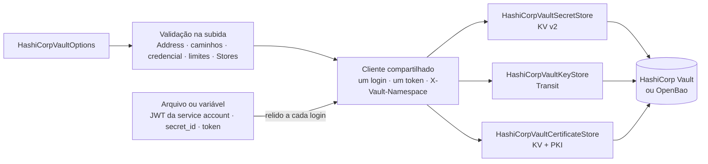
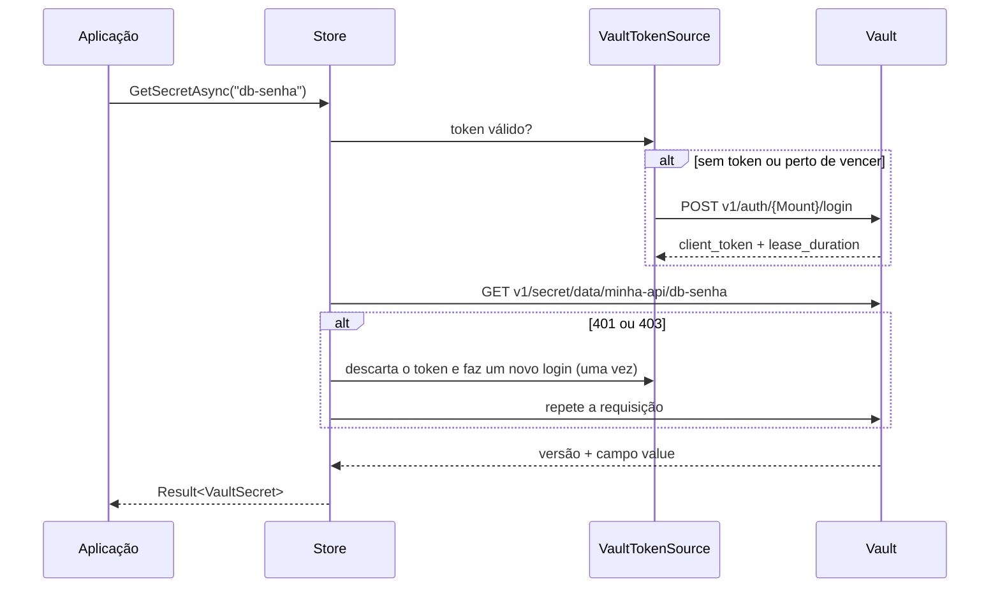

[🏠 TEC.Vault](../README.md) › [📚 Documentação](README.md) › 🏛️ Provedor HashiCorp Vault

# 🏛️ Provedor HashiCorp Vault

> Conecta o TEC.Vault ao HashiCorp Vault (e ao OpenBao) pela API HTTP, sem SDK: segredos no KV v2, chaves no Transit e certificados guardados no KV e emitidos pelo PKI.

## 📑 Sumário

- [🎯 Visão geral](#-visão-geral)
- [🚀 Uso](#-uso)
- [📘 Referência da API](#-referência-da-api)
- [🔒 Política de menor privilégio](#-política-de-menor-privilégio)
- [💻 Desenvolvimento local](#-desenvolvimento-local)
- [⚙️ Opções](#️-opções)
- [❌ Erros](#-erros)
- [🛡️ Segurança](#️-segurança)
- [❓ Perguntas frequentes](#-perguntas-frequentes)

---

## 🎯 Visão geral

| Item | Valor |
|---|---|
| Pacote | `TEC.Vault.HashiCorpVault` (depende só de `TEC.Vault`; sem SDK de terceiros) |
| Namespace | `TEC.Vault.HashiCorpVault` |
| Nome do provedor | `HashiCorpVault` (`HashiCorpVaultExtensions.ProviderName`, `HashiCorpVaultStoreBase.Provider`) |
| Famílias | Segredos (KV v2, com lixeira), chaves (Transit) e certificados (KV + PKI) |
| Login | Kubernetes, JWT/OIDC, AppRole ou token pronto, sempre com a credencial lida de arquivo ou variável |
| Compatível com | HashiCorp Vault (CI testa a 2.1.1), HCP Vault, Vault Enterprise (namespaces) e OpenBao |



Os três stores herdam de `HashiCorpVaultStoreBase` → `VaultHttpProviderBase` → `VaultProviderBase` (base HTTP descrita em [Novo provedor](novo-provedor.md)). Com `UseHashiCorpVault` (ou a escolha por configuração) eles **compartilham o mesmo cliente**: um login e um token para segredos, chaves e certificados, descartados junto com o container.

O transporte é o `VaultHttpClient` do núcleo: um `SocketsHttpHandler` de vida longa, **sem redirecionamento automático** e com conexões renovadas a cada 5 minutos (acompanha mudança de DNS). Não usa `IHttpClientFactory`: funciona igual com e sem DI e é compatível com Native AOT.



---

## 🚀 Uso

### Registro no container

```csharp
using TEC.Vault.DependencyInjection;
using TEC.Vault.HashiCorpVault;

builder.Services.AddTecVault(vault => vault.UseHashiCorpVault(o =>
{
    o.Address = new Uri("https://vault.interno:8200");
    o.Auth.Method = HashiCorpVaultAuthMethod.Kubernetes;   // token da service account: nenhum segredo guardado
    o.Auth.Role = "minha-api";
    o.Kv.BasePath = "minha-api";                           // uma pasta por aplicação
    o.Pki.Role = "minha-api";                              // emissão de certificados pelo PKI
    o.Stores = VaultStores.Secrets | VaultStores.Keys;     // registre só o que usa
}));
```

<details>
<summary>📄 Exemplo com AppRole, namespace e todas as subseções</summary>

```csharp
builder.Services.AddTecVault(vault => vault.UseHashiCorpVault(o =>
{
    o.Address = new Uri("https://vault.interno:8200");
    o.Namespace = "time-a";                                 // Vault Enterprise / HCP
    o.Auth.Method = HashiCorpVaultAuthMethod.AppRole;
    o.Auth.RoleId = "<role-id>";                            // não é segredo
    o.Auth.SecretIdFile = "/run/secrets/vault-secret-id";   // relido a cada login
    o.Kv.Mount = "secret";
    o.Kv.BasePath = "minha-api";
    o.Transit.Mount = "transit";
    o.Pki.Role = "minha-api";                               // Issuer null → PKI; "Self" → autoassinado
    o.MaxListItems = 2_000;                                 // teto de cada listagem
    o.Http.MaxRetries = 3;
    o.Http.NetworkTimeout = TimeSpan.FromSeconds(20);
    o.Stores = VaultStores.All;
}));
```

</details>

### Escolha pela configuração (`appsettings.json`)

```csharp
builder.Services.AddTecVault(builder.Configuration.GetSection("Vault"),
    providers => providers.AddHashiCorpVault());
```

```json
{
  "Vault": {
    "Provider": "HashiCorpVault",
    "Certificates": { "Provider": "None" },
    "HashiCorpVault": {
      "Address": "https://vault.interno:8200",
      "Namespace": "time-a",
      "MaxListItems": 10000,
      "NetworkTimeout": "00:00:30",
      "Auth": { "Method": "Kubernetes", "Role": "minha-api" },
      "Kv": { "Mount": "secret", "BasePath": "minha-api" },
      "Transit": { "Mount": "transit" }
    }
  }
}
```

O que só existe em código (ex.: handler com a CA interna) vai no `configure`, que roda depois da leitura da seção:

```csharp
builder.Services.AddTecVault(builder.Configuration.GetSection("Vault"),
    providers => providers.AddHashiCorpVault(o => o.Http.Handler = new SocketsHttpHandler
    {
        AllowAutoRedirect = false,                    // obrigatório: um redirecionamento levaria o token para outro endereço
        PooledConnectionLifetime = TimeSpan.FromMinutes(5),
        SslOptions = { RemoteCertificateValidationCallback = ValidarComCaInterna }
    }));
```

As regras da seção `Vault` estão em [Escolha do cofre pela configuração](configuracao-por-appsettings.md).

### Sem injeção de dependências

Cada store tem um construtor público com as opções; ele abre a **própria** conexão e faz o próprio login (descarte com `using`).

```csharp
var opcoes = new HashiCorpVaultOptions { Address = new Uri("https://vault.interno:8200") };
opcoes.Auth.Method = HashiCorpVaultAuthMethod.Token;
opcoes.Auth.TokenVariable = "VAULT_TOKEN";
opcoes.Kv.BasePath = "minha-api";

using var segredos = new HashiCorpVaultSecretStore(opcoes);
var senha = await segredos.GetSecretAsync("db-senha");
```

---

## 📘 Referência da API

### `HashiCorpVaultExtensions`

| Membro | Retorno | Descrição |
|---|---|---|
| `ProviderName` *(const)* | `string` | `"HashiCorpVault"` |
| `UseHashiCorpVault(this VaultBuilder builder, Action<HashiCorpVaultOptions> configure)` | `VaultBuilder` | Usa o Vault para as famílias de `Stores` (padrão: todas), com um cliente compartilhado. Opções validadas aqui, na subida |
| `AddHashiCorpVault(this VaultProviderCatalog catalog, Action<HashiCorpVaultOptions>? configure = null)` | `VaultProviderCatalog` | Disponibiliza o provedor para a escolha por configuração (seção `Vault:HashiCorpVault`) |

### Stores

| Classe | Implementa | Construtor público |
|---|---|---|
| `HashiCorpVaultSecretStore` | `ISecretStore`, `ISecretRecycleBin`, `IVaultHealthProbe`, `IDisposable` | `(HashiCorpVaultOptions options, ILogger<HashiCorpVaultSecretStore>? logger = null)` |
| `HashiCorpVaultKeyStore` | `IKeyStore`, `IKeyCryptography`, `IVaultHealthProbe`, `IDisposable` | `(HashiCorpVaultOptions options, ILogger<HashiCorpVaultKeyStore>? logger = null)` |
| `HashiCorpVaultCertificateStore` | `ICertificateStore`, `ICertificateRecycleBin`, `IVaultHealthProbe`, `IDisposable` | `(HashiCorpVaultOptions options, ILogger<HashiCorpVaultCertificateStore>? logger = null)` |
| `HashiCorpVaultStoreBase` *(abstract)* | Base; não pode ser derivada fora do pacote. `Provider` = `"HashiCorpVault"`, `MaxSecretValueBytes` = 512 KB | — |

`HashiCorpVaultCertificateStore.SelfIssuer` = `"Self"`. Não há backup (`ISecretBackup`, `IKeyBackup`, `ICertificateBackup`) nem lixeira de chaves (`IKeyRecycleBin`).

### Autenticação (`HashiCorpVaultAuthOptions`, `HashiCorpVaultAuthMethod`)

| `Method` | Mount padrão | Obrigatório | Credencial (arquivo **ou** variável) | Quando usar |
|---|---|---|---|---|
| `Kubernetes` (0, **padrão**) | `kubernetes` | `Role` | `ServiceAccountTokenFile` (padrão `DefaultServiceAccountTokenFile` = `/var/run/secrets/kubernetes.io/serviceaccount/token`) | **Recomendado no Kubernetes**: nenhum segredo guardado |
| `Jwt` (1) | `jwt` | `Role` | `JwtFile` ou `JwtVariable` | JWT/OIDC federado (GitHub Actions, workload identity de nuvem) |
| `AppRole` (2) | `approle` | `RoleId` (não é segredo) | `SecretIdFile` ou `SecretIdVariable` | Fora do Kubernetes, com o `secret_id` entregue por um orquestrador |
| `Token` (3) | — | — | `TokenFile` ou `TokenVariable` (ex.: `VAULT_TOKEN`) | Sink do Vault Agent (que renova o token), CI, desenvolvimento |

| Item | Comportamento |
|---|---|
| Login | `POST v1/auth/{Mount}/login` (`role` + `jwt`, ou `role_id` + `secret_id`); `Auth.Mount` sobrepõe o padrão |
| Validade | `auth.lease_duration`; o token é renovado com um **novo login** faltando 10% da vida (entre 10 segundos e 5 minutos antes) |
| Concorrência | Várias requisições com o token vencido fazem um único login; login com falha não é guardado |
| 401/403 | O token é descartado e é feito um novo login, uma vez por chamada (cobre token revogado no servidor) |
| Credencial | Relida **a cada login** (token projetado do Kubernetes, `secret_id` rotacionado); até 64 KB **mesmo em pipe ou arquivo especial**, UTF-8 estrito, sem espaços nas pontas |
| `Token` | Sem expiração conhecida; relido do arquivo ou da variável depois de cada 401/403 |
| Credencial ausente, vazia, grande demais, ilegível ou recusada | `VAULT_AUTENTICACAO_FALHOU` (a mensagem nunca traz a credencial) |

### Segredos (KV v2)

Um item do KV por segredo, em `{Kv.Mount}/data/{Kv.BasePath}/{nome}`, com o valor no campo `Kv.ValueField`.

| Conceito do TEC.Vault | KV v2 |
|---|---|
| Versão | Versão do KV: inteiro de **1 a 9 dígitos** (`^[1-9][0-9]{0,8}\z`); fora disso → `VAULT_ENTRADA_INVALIDA` antes da chamada |
| `SetSecretAsync` | `POST data/...` (nova versão); com `Tags`, depois `POST metadata/...` (`custom_metadata`). Sem `Tags`, as existentes são mantidas |
| Tags | `custom_metadata`: valem para o **segredo**, não por versão |
| `ContentType`, `Enabled = false`, `ExpiresOn`, `NotBefore` | Não existem no KV → `VAULT_ENTRADA_INVALIDA` antes da chamada |
| `UpdateSecretPropertiesAsync` | Só `Tags` |
| `ListSecretVersionsAsync` | Versões excluídas com `Enabled = false`; destruídas não aparecem |
| Nomes | O KV diferencia maiúsculas; o TEC.Vault não: vale o nome exato e, sem ele, o **único** igual sem diferenciar maiúsculas; dois candidatos → `VAULT_CONFLITO`. Essa busca lista a pasta e respeita `MaxListItems` (acima → `VAULT_LISTAGEM_ACIMA_DO_LIMITE`); o mesmo vale para os nomes de chave no Transit |
| Item sem o campo do valor (gravado por outra ferramenta) | `VAULT_FALHA` (formato inesperado) |
| `ListSecretsAsync` | Lista os nomes da pasta, confere `MaxListItems` e **só então** lê os metadados de cada segredo (até 8 em paralelo). Acima do limite → `VAULT_LISTAGEM_ACIMA_DO_LIMITE` sem ler nenhum item. Subpastas (inclusive `_certificates`) não aparecem |

**Lixeira**

| Operação | No KV v2 |
|---|---|
| `DeleteSecretAsync` | Exclusão lógica (`POST delete/...`) de **todas** as versões ativas |
| `ListDeletedSecretsAsync` | Itens sem versão ativa e com ao menos uma versão excluída e não destruída (mesmo teto de `MaxListItems`) |
| `RecoverDeletedSecretAsync` | `POST undelete/...` de todas as versões excluídas (inclusive as excluídas antes, individualmente, por outra ferramenta) |
| `PurgeDeletedSecretAsync` | `DELETE metadata/...`: remove o item e **todas** as versões, definitivamente. Só para itens na lixeira; segredo ativo → `VAULT_ITEM_NAO_ENCONTRADO` |
| Gravar com o nome de um item na lixeira | `VAULT_CONFLITO` (recupere ou remova antes) |
| `ScheduledPurgeDate` | Sempre `null` (o KV não agenda remoção, salvo `delete_version_after` configurado no Vault) |

### Chaves (Transit)

Criptografar, decifrar, wrap/unwrap e assinar são executados **no Vault**: a chave privada nunca sai dele.

| Tipo do TEC.Vault | Tipo no Transit |
|---|---|
| RSA 2048 / 3072 / 4096 | `rsa-2048` / `rsa-3072` / `rsa-4096` |
| EC P-256 / P-384 / P-521 | `ecdsa-p256` / `ecdsa-p384` / `ecdsa-p521` |
| AES, Ed25519, HMAC... | Não representados: não aparecem em `ListKeysAsync` |

| Operação | Comportamento |
|---|---|
| `CreateKeyAsync` | Cria com `exportable = false` e `allow_plaintext_backup = false`. Chave que já existe **com o mesmo tipo** ganha uma versão nova (como `RotateKeyAsync`); com outro tipo → `VAULT_CONFLITO` |
| Opções sem equivalente | `HardwareProtected` → `VAULT_OPERACAO_NAO_SUPORTADA`; validade, `Enabled = false`, tags e restrição de `Operations` → `VAULT_ENTRADA_INVALIDA` |
| `UpdateKeyPropertiesAsync` | O Transit não tem metadados equivalentes: só uma alteração vazia é aceita (devolve a chave) |
| `ListKeysAsync` | Lista os nomes, confere `MaxListItems` antes de ler cada chave |
| `GetKeyAsync` / `ListKeyVersionsAsync` | Parte pública (SPKI) por versão; versões abaixo de `min_decryption_version` não aparecem (`VAULT_ITEM_NAO_ENCONTRADO`) |
| `EncryptAsync` / `WrapKeyAsync` | RSA-OAEP com SHA-256. Antes, o provedor confere **sem cache** que a chave existe e é RSA (chave EC → `VAULT_REQUISICAO_RECUSADA`) |
| `DecryptAsync` / `UnwrapKeyAsync` | Versão obrigatória (`vault:v{versão}:...` montado pelo provedor) |
| `SignDataAsync` / `VerifyDataAsync` | `prehashed = false`, hash no caminho (`sha2-256`, `sha2-384`, `sha2-512`). RSA: `pkcs1v15` (`RS*`) ou `pss` com **salt do tamanho do hash** (`PS*`). ECDSA: assinatura em **IEEE P1363** (`r‖s`), o mesmo formato dos demais provedores e do .NET |
| Algoritmo × chave | O tipo de cada chave fica em cache por 5 minutos para conferir o algoritmo antes de assinar: combinação errada → `VAULT_REQUISICAO_RECUSADA` |
| `DeleteKeyAsync` | **Definitivo**: liga `deletion_allowed` (`POST keys/{nome}/config`) e exclui. Sem lixeira; dados cifrados com a chave ficam **irrecuperáveis**. Auditado como escrita |
| Backup | **Não oferecido**: o backup do Transit exporta a chave em texto aberto e exige `allow_plaintext_backup` |

### Certificados (KV + PKI)

| Item | Comportamento |
|---|---|
| Armazenamento | KV v2, em `{Kv.BasePath}/{Kv.CertificatesPath}/{nome}` (padrão `minha-api/_certificates/<nome>`): uma versão do KV por versão do certificado, com `cer` (DER em Base64), `pkcs12` (PKCS#12 com a chave privada, em Base64) e `exportable` |
| `Issuer = null` | Emitido pelo **PKI** com o emissor padrão do mount: `POST {Pki.Mount}/sign/{Pki.Role}` |
| `Issuer = "Self"` (sem diferenciar maiúsculas) | Autoassinado, gerado no processo (`VaultCertificateFactory`) |
| Outro `Issuer` | PKI com esse emissor: `POST {Pki.Mount}/issuer/{Issuer}/sign/{Pki.Role}` |
| Emissão pelo PKI | O par de chaves é gerado **no processo** e **só o CSR** vai ao Vault; o certificado emitido é juntado à chave. Exige CN no subject ou ao menos um nome DNS; TTL = validade pedida |
| Sem `Pki.Role` | Emissão pelo PKI → `VAULT_OPERACAO_NAO_SUPORTADA` (autoassinado e importação continuam funcionando) |
| `HardwareProtected`, `AutoRenewDaysBeforeExpiry` | `VAULT_OPERACAO_NAO_SUPORTADA` |
| Importação | PFX ou PEM, conferidos localmente e guardados como PKCS#12 |
| `Enabled` e tags | Valem para o **certificado** (todas as versões), em `custom_metadata`; desabilitado = chave reservada `tec.disabled` |
| Prefixo `tec.` | Chaves de tag começando por `tec.` são **reservadas** → `VAULT_ENTRADA_INVALIDA` |
| `GetCertificateAsync` | Só a parte pública (o PKCS#12 lido é zerado); desabilitado volta com `Enabled = false` |
| `DownloadCertificateAsync` | Auditado como escrita; desabilitado → `VAULT_ITEM_DESABILITADO`; `exportable = false` → `VAULT_CERTIFICADO_NAO_EXPORTAVEL` |
| Listagens e lixeira | Como nos segredos (mesmo teto `MaxListItems`, exclusão lógica, recuperação, remoção definitiva) |

### Limites e regras de entrada

| Regra | Valor no HashiCorp Vault |
|---|---|
| Nome (segredo, chave, certificado) | `^[0-9a-zA-Z][0-9a-zA-Z._-]{0,254}\z` (letras, números, `-`, `_` e `.`, começando por letra ou número; sem `/`: o nome nunca vira caminho) |
| Versão | `^[1-9][0-9]{0,8}\z` (até 9 dígitos) |
| Valor de segredo | Até 512 KB (UTF-8) |
| Tags | Até 60 (o KV aceita 64 em `custom_metadata`; o restante fica para as chaves reservadas); chave até 128 e valor até 512 caracteres |
| Itens por listagem | `MaxListItems` (padrão 10.000), inclusive versões e busca de nome sem diferenciar maiúsculas |
| Resposta | Até `Http.MaxResponseBytes` (padrão 4 MB) |

### OpenBao e Native AOT

- **OpenBao:** mantém a API do Vault para KV v2, Transit, PKI e os métodos de login usados aqui: aponte `Address` para o servidor, sem outra mudança. `Namespace` só funciona se o servidor suportar namespaces. Rode os testes de integração contra o seu servidor ([Testes](testes.md)).
- **AOT:** requisições montadas com `Utf8JsonWriter` e respostas lidas com `JsonDocument`, sem serialização por reflexão. O pacote não gera avisos de trimming/AOT.

---

## 🔒 Política de menor privilégio

Exemplo para a aplicação `minha-api` (KV em `secret`, pasta `minha-api`; Transit com chaves `minha-api-*`; PKI com o papel `minha-api`). Remova os blocos das famílias que a aplicação não usa e confira com `vault token capabilities <token> <caminho>`.

<details>
<summary>📄 Política HCL completa</summary>

```hcl
# ---------- Segredos (KV v2) ----------
# Ler segredos e certificados (a leitura consulta os metadados antes dos dados)
path "secret/data/minha-api/*" {
  capabilities = ["read"]
}
path "secret/metadata/minha-api/*" {
  capabilities = ["read", "list"]
}

# Gravar (nova versão e custom_metadata) — só se a aplicação usa ISecretStore
path "secret/data/minha-api/*" {
  capabilities = ["read", "create", "update"]
}
path "secret/metadata/minha-api/*" {
  capabilities = ["read", "list", "update"]
}

# Lixeira — só se a aplicação usa ISecretRecycleBin
path "secret/delete/minha-api/*"   { capabilities = ["update"] }
path "secret/undelete/minha-api/*" { capabilities = ["update"] }
path "secret/metadata/minha-api/*" { capabilities = ["read", "list", "update", "delete"] }   # delete = remoção definitiva

# ---------- Chaves (Transit) ----------
path "transit/keys/*" {
  capabilities = ["read", "list"]          # GetKey, ListKeys e conferência do tipo antes de cifrar/assinar
}
path "transit/encrypt/minha-api-*" { capabilities = ["update"] }   # NUNCA "create": evita o upsert de chave AES
path "transit/decrypt/minha-api-*" { capabilities = ["update"] }
path "transit/sign/minha-api-*"    { capabilities = ["update"] }
path "transit/verify/minha-api-*"  { capabilities = ["update"] }

# Gestão de chaves (IKeyStore) — normalmente só para a identidade de administração
path "transit/keys/minha-api-*"        { capabilities = ["create", "read", "update", "delete"] }
path "transit/keys/minha-api-*/rotate" { capabilities = ["update"] }
path "transit/keys/minha-api-*/config" { capabilities = ["update"] }   # deletion_allowed antes de excluir

# ---------- Certificados (PKI) ----------
path "pki/sign/minha-api" {
  capabilities = ["update"]
}
# Com Issuer explícito:
# path "pki/issuer/<emissor>/sign/minha-api" { capabilities = ["update"] }
```

</details>

> [!NOTE]
> Blocos repetidos para o mesmo caminho estão aí só para separar os cenários; numa política real, mantenha **um** bloco por caminho com a união das capacidades necessárias. O health check lista cada store registrado: `list` em `secret/metadata/minha-api/*` (segredos e certificados) e em `transit/keys/*` (chaves).

- Papel do Kubernetes Auth (`vault write auth/kubernetes/role/minha-api ...`) restrito ao namespace e à service account da aplicação, com TTL curto.
- Uma pasta do KV por aplicação (`Kv.BasePath`) e prefixo próprio nas chaves do Transit.
- Restrinja `secret/data/minha-api/_certificates/*` a quem precisa da chave privada.
- Audit device do Vault habilitado, com alertas para `delete` em `metadata/` e em `transit/keys/`.

---

## 💻 Desenvolvimento local

Suba um Vault **descartável** em modo dev na porta **18200** e prepare-o com o script do repositório:

```bash
# Vault em modo dev num container descartável, só em localhost, na porta 18200
docker run --rm -d --name tec-vault-dev --cap-add=IPC_LOCK \
  -e VAULT_DEV_ROOT_TOKEN_ID=dev-root -p 127.0.0.1:18200:8200 hashicorp/vault:2.1.1

# Monta o Transit e o PKI (CA raiz e papel tec-testes); o KV v2 em "secret" já vem no modo dev
VAULT_ADDR=http://127.0.0.1:18200 VAULT_TOKEN=dev-root .github/scripts/vault-dev.sh

# Ao terminar
docker rm -f tec-vault-dev
```

> [!CAUTION]
> Use **sempre** a porta 18200 para o Vault descartável. A porta 8200 pode estar ocupada por um Vault de verdade na sua máquina, e o [`vault-dev.sh`](../.github/scripts/vault-dev.sh) usa o token root para montar engines: rodá-lo contra um servidor real altera esse servidor.

```json
// appsettings.Development.json
{
  "Vault": {
    "Provider": "HashiCorpVault",
    "HashiCorpVault": {
      "Address": "http://127.0.0.1:18200",
      "Auth": { "Method": "Token", "TokenVariable": "VAULT_TOKEN" },
      "Kv": { "BasePath": "minha-api" },
      "Pki": { "Role": "tec-testes" }
    }
  }
}
```

HTTP só é aceito para `localhost`/loopback **em Development**; em qualquer outro ambiente a subida falha. Para rodar os testes de integração contra esse servidor, defina `TEC_TESTES_HASHICORP_ADDR=http://127.0.0.1:18200`, `TEC_TESTES_HASHICORP_TOKEN=dev-root` e, para o PKI, `TEC_TESTES_HASHICORP_PKI_ROLE=tec-testes` (detalhes em [Testes](testes.md)).

---

## ⚙️ Opções

`HashiCorpVaultOptions` (`sealed class`). A coluna **Configuração** é a chave lida por `AddHashiCorpVault` na seção `Vault:HashiCorpVault`; "—" = só em código.

| Opção | Tipo | Padrão | Configuração | Descrição e validação |
|---|---|---|---|---|
| `Address` | `Uri?` | — | `Address` | **Obrigatório.** HTTPS (HTTP só em `localhost` em Development); sem caminho, usuário, query ou fragmento |
| `Namespace` | `string?` | `null` | `Namespace` | Namespace (Vault Enterprise, HCP), enviado em `X-Vault-Namespace` em todas as requisições, inclusive no login. Caminho válido¹ |
| `Auth.Method` | `HashiCorpVaultAuthMethod` | `Kubernetes` | `Auth:Method` | Método de login |
| `Auth.Mount` | `string?` | por método | `Auth:Mount` | Caminho do método de autenticação. Caminho válido¹ |
| `Auth.Role` / `Auth.RoleId` | `string?` | `null` | `Auth:Role` / `Auth:RoleId` | Papel (Kubernetes, Jwt) / role_id (AppRole) |
| `Auth.ServiceAccountTokenFile` | `string?` | `/var/run/secrets/kubernetes.io/serviceaccount/token` | `Auth:ServiceAccountTokenFile` | Token da service account (Kubernetes) |
| `Auth.JwtFile` / `Auth.JwtVariable` | `string?` | `null` | `Auth:JwtFile` / `Auth:JwtVariable` | JWT (Jwt) |
| `Auth.SecretIdFile` / `Auth.SecretIdVariable` | `string?` | `null` | `Auth:SecretIdFile` / `Auth:SecretIdVariable` | secret_id (AppRole) |
| `Auth.TokenFile` / `Auth.TokenVariable` | `string?` | `null` | `Auth:TokenFile` / `Auth:TokenVariable` | Token pronto (Token) |
| `Kv.Mount` | `string` | `secret` | `Kv:Mount` | Caminho do KV v2 |
| `Kv.BasePath` | `string?` | `null` (raiz) | `Kv:BasePath` | Pasta da aplicação. **Recomendado: uma por aplicação** |
| `Kv.ValueField` | `string` | `value` | `Kv:ValueField` | Campo do item que guarda o valor (até 128 caracteres) |
| `Kv.CertificatesPath` | `string` | `_certificates` | `Kv:CertificatesPath` | Pasta dos certificados, relativa a `BasePath` (começa com `_`: nunca colide com nome de segredo) |
| `Transit.Mount` | `string` | `transit` | `Transit:Mount` | Caminho do Transit |
| `Pki.Mount` | `string` | `pki` | `Pki:Mount` | Caminho do PKI |
| `Pki.Role` | `string?` | `null` | `Pki:Role` | Papel da emissão; `null` = só autoassinados (`Issuer = "Self"`) e importados |
| `MaxListItems` | `int` | `10.000` | `MaxListItems` | Máximo de itens de uma listagem (segredos, certificados, chaves, excluídos e versões: `ListSecretVersionsAsync`, `ListCertificateVersionsAsync`, `ListKeyVersionsAsync`), de 1 a 1.000.000. Conferido logo após listar os nomes, **antes** de ler os metadados de cada item. Vale também para a busca de nome sem diferenciar maiúsculas (KV e Transit), feita só quando o nome exato não existe |
| `Http.MaxRetries` | `int` | `3` | `MaxRetries` | Retentativas em falhas transitórias, 0 a 10 |
| `Http.NetworkTimeout` | `TimeSpan` | `30 s` | `NetworkTimeout` | Tempo limite de cada tentativa; > 0 e ≤ 5 min (na configuração, `[d.]hh:mm:ss`) |
| `Http.MaxRetryDelay` | `TimeSpan` | `30 s` | — | Maior espera aceita de um `Retry-After`; de 0 a 5 min |
| `Http.MaxResponseBytes` | `int` | `4 MB` | — | Tamanho máximo de uma resposta lida; de 1 KB a 64 MB |
| `Http.Handler` | `HttpMessageHandler?` | `null` | — | Handler próprio (CA interna, proxy). Sem valor: `SocketsHttpHandler` sem redirecionamento, conexões renovadas a cada 5 min |
| `Http.TimeProvider` | `TimeProvider?` | `TimeProvider.System` | — | Relógio das esperas entre tentativas |
| `Stores` | `VaultStores` | `All` | — (vem de `Vault:Provider` e das escolhas por família) | Stores registrados por `UseHashiCorpVault` |
| `HostEnvironment` | `IHostEnvironment?` | `null` | — | Ambiente (libera HTTP em `localhost` só em Development); sem valor, o do container ou as variáveis de ambiente |
| `TimeProvider` | `TimeProvider?` | `TimeProvider.System` | — | Relógio (validade do token) |

¹ Caminhos (`Namespace`, mounts, `BasePath`, `CertificatesPath`, `Pki.Role`, `Auth.Mount`): segmentos com letras, números, `-`, `_` e `.`, separados por `/`, sem `/` nas pontas, sem `.`/`..` e com até 512 caracteres.

> [!NOTE]
> Toda opção inválida falha **na subida** com `InvalidOperationException` que cita a opção (ex.: `HashiCorpVaultOptions.MaxListItems deve estar entre 1 e 1.000.000.`); pela configuração, a mensagem cita o caminho da chave (`Vault:HashiCorpVault:MaxListItems`). `Auth:Token`, `Auth:SecretId` e `Auth:Jwt` em texto são **recusados**: a credencial vem de arquivo ou variável. Chave desconhecida na seção também falha.

---

## ❌ Erros

### Na subida (`InvalidOperationException`)

| Mensagem (início) | Causa | O que fazer |
|---|---|---|
| `HashiCorpVaultOptions.Address é obrigatório.` | Endereço ausente | Defina `Address` |
| `HashiCorpVaultOptions.Address deve usar HTTPS (HTTP só em localhost no ambiente Development).` | HTTP fora de localhost ou fora de Development | Use HTTPS; localmente, rode em Development |
| `HashiCorpVaultOptions.Address não pode ter usuário, query ou fragmento.` / `deve ser só o endereço do servidor, sem caminho.` | Endereço com partes extras | Use só `https://<servidor>:<porta>` |
| `HashiCorpVaultOptions.Auth.Role é obrigatório no método ...` / `Auth.RoleId é obrigatório no AppRole.` | Papel ausente | Informe `Role`/`RoleId` |
| `HashiCorpVaultOptions.<caminho> inválido: use segmentos com letras...` | Mount, pasta, namespace ou papel fora do formato | Corrija o caminho¹ |
| `HashiCorpVaultOptions.Kv.ValueField é obrigatório (até 128 caracteres).` | Campo vazio ou longo | Ajuste `Kv.ValueField` |
| `HashiCorpVaultOptions.MaxListItems deve estar entre 1 e 1.000.000.` | Limite fora da faixa | Ajuste o valor |
| `HashiCorpVaultOptions.Http.MaxRetries`, `NetworkTimeout`, `MaxRetryDelay`, `MaxResponseBytes` | Valor fora da faixa | Ajuste o valor |
| `HashiCorpVaultOptions.Stores` | Nenhuma família válida | Informe ao menos uma família |

### Nas operações (`Result` com `VaultErrors`)

Conversão padrão dos provedores HTTP:

| Origem | Código |
|---|---|
| Entrada fora das regras (nome, versão com mais de 9 dígitos, tamanho, tags, opção sem equivalente) | `VAULT_ENTRADA_INVALIDA` (antes de qualquer chamada) |
| Listagem acima de `MaxListItems` | `VAULT_LISTAGEM_ACIMA_DO_LIMITE` (tipo `Failure`, HTTP 500) |
| HTTP 400, 422 | `VAULT_REQUISICAO_RECUSADA` |
| HTTP 401 (depois do novo login), login recusado, credencial ausente, grande demais ou ilegível | `VAULT_AUTENTICACAO_FALHOU` |
| HTTP 403 (depois do novo login: falta de capacidade na política) | `VAULT_ACESSO_NEGADO` |
| HTTP 404 | `VAULT_ITEM_NAO_ENCONTRADO` |
| HTTP 409, 412; nome ambíguo sem diferenciar maiúsculas; gravar sobre item na lixeira | `VAULT_CONFLITO` |
| HTTP 429 | `VAULT_LIMITE_EXCEDIDO` |
| HTTP 408, 5xx (inclusive 503 de Vault selado, **mesmo com `Retry-After` acima de `MaxRetryDelay`**), falha de rede, tempo limite | `VAULT_INDISPONIVEL` |
| Resposta fora do formato | `VAULT_FALHA` |

O `Retry-After` é respeitado em 429 e 503 até `Http.MaxRetryDelay`; acima disso a retentativa é abandonada e vale o status real (um 503 continua sendo indisponibilidade, não limite de requisições). No log vai só o status e um detalhe técnico fixo; o corpo das respostas nunca é registrado. A lista completa de códigos está em [Erros](erros.md).

---

## 🛡️ Segurança

> [!IMPORTANT]
> O `Address` validado e o cliente HTTP **sem redirecionamento automático** impedem que um endereço adulterado (ou um redirecionamento do servidor) leve o JWT da service account, o `secret_id` ou o token do Vault para outro servidor. Com `Http.Handler` próprio, mantenha `AllowAutoRedirect = false`.

> [!CAUTION]
> **Upsert do Transit:** cifrar com um nome inexistente **cria uma chave AES** se o token tiver a capacidade `create` em `transit/encrypt/<nome>`. O provedor confere que a chave existe e é RSA antes de cifrar ou fazer wrap, mas uma chave excluída por outra instância entre a conferência e a chamada ainda criaria a chave. Na política, dê à aplicação **só `update`** em `transit/encrypt/*`.

> [!WARNING]
> `Exportable = false` em certificados é aplicado **pela biblioteca**, não pelo Vault: o PKCS#12 com a chave privada fica no KV, e qualquer identidade com `read` em `secret/data/<pasta>/_certificates/*` consegue lê-lo direto pela API. Restrinja essa pasta na política e, para assinar, prefira uma chave do Transit (`IKeyCryptography`), que nunca sai do Vault.

> [!CAUTION]
> `DeleteKeyAsync` é **definitivo** no Transit: dados cifrados com a chave ficam irrecuperáveis. Dê a capacidade `delete` em `transit/keys/*` só à identidade de administração.

- A credencial é lida com teto de 64 KB mesmo em pipe ou arquivo especial; nunca aparece em mensagem de erro ou log.
- `MaxListItems` é conferido **antes** das leituras por item: um KV inflado não vira milhares de chamadas.
- Nomes recusados aparecem no log só como tamanho + HMAC com chave do processo (`<N caracteres, hmac:xxxxxxxxxxxx>`), nunca o texto.

---

## ❓ Perguntas frequentes

<details>
<summary><code>HashiCorpVaultOptions.Address deve usar HTTPS</code> com um Vault local</summary>

HTTP só é aceito para `localhost` no ambiente Development. Rode a aplicação em Development (`ASPNETCORE_ENVIRONMENT=Development`) com `http://127.0.0.1:18200`; em qualquer outro ambiente use HTTPS.

</details>

<details>
<summary><code>VAULT_LISTAGEM_ACIMA_DO_LIMITE</code> ao listar segredos</summary>

A pasta do KV (`Kv.BasePath`) tem mais itens que `MaxListItems`. Use uma pasta por aplicação ou aumente `MaxListItems` (até 1.000.000), lembrando que cada item listado custa uma leitura de metadados.

</details>

<details>
<summary><code>VAULT_ENTRADA_INVALIDA</code> ao ler uma versão</summary>

A versão do KV precisa ser um inteiro de 1 a 9 dígitos, sem zero à esquerda. Versões vindas de outro provedor (ex.: hexadecimais do Key Vault) não valem aqui.

</details>

<details>
<summary><code>VAULT_ACESSO_NEGADO</code> com o token certo</summary>

O Vault responde 403 quando falta capacidade na política. O provedor já tentou um novo login; confira as capacidades com `vault token capabilities <token> <caminho>` e a [política de menor privilégio](#-política-de-menor-privilégio). Lembre que `ListSecretsAsync` precisa de `list` em `metadata/` e de `read` em cada item.

</details>

<details>
<summary>Posso usar <code>ContentType</code>, validade ou desabilitar um segredo?</summary>

Não no KV v2: esses campos não existem lá e a gravação é recusada com `VAULT_ENTRADA_INVALIDA` antes da chamada. Use tags (`custom_metadata`) para metadados próprios.

</details>

<details>
<summary>Como faço backup de chaves do Transit?</summary>

Pela biblioteca, não: o backup do Transit exporta a chave em texto aberto. Use os snapshots do próprio Vault (Raft) com a proteção do servidor.

</details>

---

⬅️ [🌐 Provedor Azure Key Vault](provedor-azure-key-vault.md) · [📚 Índice](README.md) · [🟣 Provedor Infisical](provedor-infisical.md) ➡️
