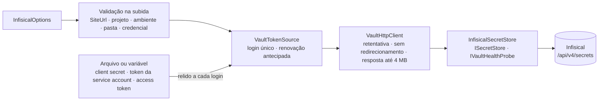
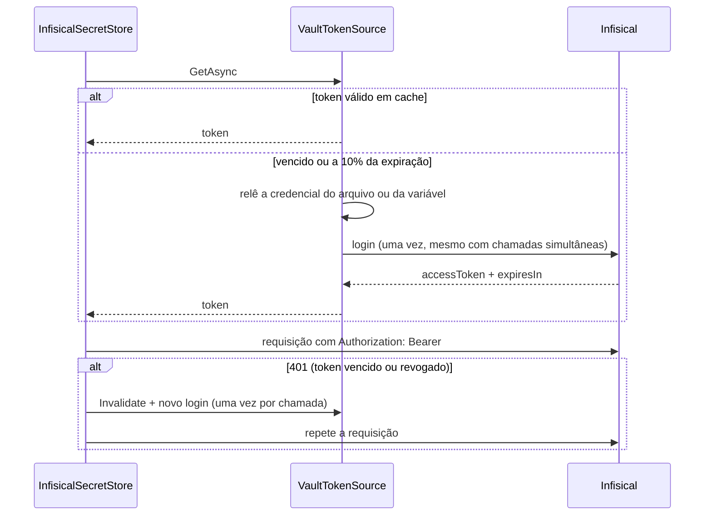

| `Http.CircuitBreaker` | ✅ `CircuitBreaker:*` | ligado | Circuit breaker do cofre ([🔁 Resiliência](resiliencia.md)) |
[🏠 TEC.Vault](../README.md) › [📚 Documentação](README.md) › 🟣 Provedor Infisical

# 🟣 Provedor Infisical

> Lê, grava e exclui segredos do [Infisical](https://infisical.com) (nuvem ou self-hosted) pela API REST v4, sem SDK, com login de identidade de máquina e credencial vinda de arquivo ou variável, nunca do `appsettings`.

## 📑 Sumário

- [🎯 Visão geral](#-visão-geral)
- [🚀 Uso](#-uso)
- [📘 Referência da API](#-referência-da-api)
- [🔒 Permissões](#-permissões)
- [⚙️ Opções](#️-opções)
- [❌ Erros](#-erros)
- [🛡️ Segurança](#️-segurança)
- [❓ Perguntas frequentes](#-perguntas-frequentes)

---

## 🎯 Visão geral

| Item | Valor |
|---|---|
| Pacote | `TEC.Vault.Infisical` (depende só de `TEC.Vault`) |
| Famílias atendidas | **Só segredos**: `ISecretStore` (e `ISecretReader`) e `IVaultHealthProbe` |
| Sem suporte | Lixeira (`ISecretRecycleBin`), backup (`ISecretBackup`), chaves e certificados — pedir essas interfaces ao container falha na resolução |
| Nome do provedor | `Infisical` (`InfisicalSecretStore.Provider`) |
| Login | Universal Auth, Kubernetes Auth ou token pronto |
| Native AOT | Sim: JSON por *source generator* (`InfisicalJsonContext`), sem avisos de trimming/AOT |



`InfisicalSecretStore` herda de `VaultHttpProviderBase` → `VaultProviderBase` (veja [Novo provedor](novo-provedor.md)): validação de entrada, `Result`, auditoria, `Activity` e métricas iguais às dos demais provedores.

### Login



- **Credencial relida a cada login**: client secret, token da service account (projetado e rotacionado pelo Kubernetes) e token de acesso podem ser trocados no arquivo sem reiniciar a aplicação.
- **Renovação antecipada**: faltando 10% da vida do token (entre 10 segundos e 5 minutos antes de expirar).
- **Login único**: chamadas simultâneas com o token vencido fazem um só login; um login que falha não fica guardado.
- **403 não refaz o login** no Infisical: é falta de permissão (`VAULT_ACESSO_NEGADO`).
- **`AccessToken`**: sem expiração conhecida e sem renovação pela biblioteca; depois de um 401 o token é relido do arquivo ou da variável.

---

## 🚀 Uso

### Kubernetes (recomendado): Kubernetes Auth

O token da service account do pod é trocado por um token do Infisical: a aplicação não guarda segredo nenhum.

```csharp
using TEC.Vault.Infisical;

builder.Services.AddTecVault(vault => vault.UseInfisical(o =>
{
    o.ProjectId = "<project-id>";
    o.Environment = "prod";
    o.SecretPath = "/minha-api";
    o.Authentication = InfisicalAuthentication.Kubernetes;
    o.IdentityId = "<identity-id>";
    // o.ServiceAccountTokenFile = InfisicalOptions.DefaultServiceAccountTokenFile;   // padrão
}));
```

### Fora do Kubernetes: Universal Auth

```csharp
builder.Services.AddTecVault(vault => vault.UseInfisical(o =>
{
    o.SiteUrl = new Uri("https://eu.infisical.com/");          // nuvem europeia ou a sua instância
    o.ProjectId = "<project-id>";
    o.Environment = "prod";
    o.ClientId = "<client-id>";
    o.ClientSecretFile = "/run/secrets/infisical-client-secret"; // ou ClientSecretVariable
}));
```

### Pela configuração (`appsettings.json`)

```csharp
builder.Services.AddTecVault(builder.Configuration.GetSection("Vault"), p => p.AddInfisical());
```

```json
{
  "Vault": {
    "Secrets": { "Provider": "Infisical" },
    "Infisical": {
      "ProjectId": "<project-id>",
      "Environment": "prod",
      "SecretPath": "/minha-api",
      "Authentication": "Kubernetes",
      "IdentityId": "<identity-id>"
    }
  }
}
```

> [!NOTE]
> `ClientSecret` e `AccessToken` em texto na seção são **recusados** na subida: a credencial vem sempre de arquivo ou variável. O `configure` de `AddInfisical(o => ...)` roda depois da leitura da seção (útil para `Http.Handler` com proxy). Regras gerais da seção `Vault` em [Escolha do cofre pela configuração](configuracao-por-appsettings.md).

### Sem injeção de dependências (ferramenta de linha de comando)

```csharp
using TEC.Vault.Infisical;

using var segredos = new InfisicalSecretStore(new InfisicalOptions
{
    ProjectId = "<project-id>",
    Environment = "dev",
    Authentication = InfisicalAuthentication.AccessToken,
    AccessTokenVariable = "INFISICAL_TOKEN"
});

var token = await segredos.GetSecretAsync("PARCEIRO_API_TOKEN");
if (token.IsSuccess)
    UsarToken(token.Value.Value);
```

### Comportamento

| Item | Comportamento |
|---|---|
| **Nomes** | O Infisical diferencia maiúsculas; o TEC.Vault não. Leitura, gravação e exclusão tentam o nome exato e, sem ele, procuram na pasta **um único** nome igual sem diferenciar maiúsculas. Dois nomes que só diferem em maiúsculas → `VAULT_CONFLITO` |
| **Versões** | Inteiros sequenciais por segredo; ler com `version` busca aquela versão |
| **`ListSecretVersionsAsync`** | A API não lista o histórico: devolve as versões de `max(1, atual − 99)` até a atual (**no máximo 100**). Só a atual tem datas e tags; versões removidas pela retenção do Infisical aparecem na lista mas retornam `VAULT_ITEM_NAO_ENCONTRADO` na leitura |
| **`ListSecretsAsync`** | Uma requisição, limitada por `Http.MaxResponseBytes` (padrão 4 MB); acima disso a operação falha com `VAULT_FALHA` em vez de alocar sem limite |
| **Tags** | Gravadas como `secretMetadata` (até 50; chave até 255 e valor até 1.020 caracteres). Metadados cifrados (`isEncrypted`) e entradas malformadas não viram tags e não derrubam a leitura |
| **Campos sem equivalente** | Tipo de conteúdo, `Enabled = false`, `ExpiresOn` e `NotBefore` → `VAULT_ENTRADA_INVALIDA` **antes** da chamada |
| **`UpdateSecretPropertiesAsync`** | Só `Tags` e só na versão atual (o Infisical cria uma versão nova); outros campos ou outra versão → `VAULT_ENTRADA_INVALIDA` |
| **Gravação** | Segredo existente → `PATCH` (nova versão, repetível); inexistente → `POST`, que **não** é repetido após 5xx ou tempo limite (só após 429): a criação nunca é aplicada duas vezes. Se outra instância criou o mesmo nome entre a busca e o `POST` (o Infisical responde 400), a gravação vira `PATCH` |
| **Política de aprovação** | Com aprovação de mudanças no ambiente, a escrita fica **pendente** e a operação retorna `VAULT_OPERACAO_NAO_SUPORTADA`: não assuma que o valor mudou |
| **Exclusão** | Exclui todas as versões; **definitiva** (sem lixeira) |
| **Valor oculto** | Identidade sem permissão de ver valores (`secretValueHidden`) → `VAULT_ACESSO_NEGADO` |
| **Tipo** | Só segredos `shared` (overrides pessoais não são lidos nem gravados) |
| **`Id`** | `<ambiente>:<pasta>/<nome>` |
| **`Enabled`** | Sempre `true` (o Infisical não desabilita segredos) |
| **Sonda de saúde** | Lista a pasta configurada sem ler valores |
| **Corpos em memória** | Requisições e respostas com valores são zeradas após o uso; o valor nunca vai ao log |

### Limites e regras de entrada

| Regra | Valor |
|---|---|
| Nome | `^[0-9a-zA-Z_][0-9a-zA-Z._-]{0,254}\z` (1 a 255; letras, números, `-`, `_` e `.`, começando por letra, número ou `_`) |
| Versão | `^[1-9][0-9]{0,9}\z` |
| Valor | Até 1 MB em UTF-8 (`InfisicalSecretStore.MaxSecretValueBytes`); vazio é recusado |
| Tags | Até 50; chave até 255 e valor até 1.020 caracteres |
| Resposta | Até `Http.MaxResponseBytes` (padrão 4 MB) |
| Versões listadas | Até 100 |
| Arquivo de credencial | Até 64 KB (`VaultCredentialInput.MaxFileBytes`), lido com limite mesmo em pipe ou arquivo especial |

---

## 📘 Referência da API

### `InfisicalExtensions`

> `TEC.Vault.Infisical` · `static class`

| Membro | Retorno | Descrição |
|---|---|---|
| `UseInfisical(this VaultBuilder builder, Action<InfisicalOptions> configure)` | `VaultBuilder` | Usa o Infisical como provedor de segredos. Opções validadas aqui (falha na subida) |
| `AddInfisical(this VaultProviderCatalog catalog, Action<InfisicalOptions>? configure = null)` | `VaultProviderCatalog` | Disponibiliza o provedor `Infisical` para a escolha por configuração; `configure` roda depois da leitura de `Vault:Infisical` |

### `InfisicalSecretStore`

> `TEC.Vault.Infisical` · `sealed class` · `ISecretStore`, `IVaultHealthProbe`, `IDisposable`

| Membro | Descrição |
|---|---|
| `InfisicalSecretStore(InfisicalOptions options, ILogger<InfisicalSecretStore>? logger = null)` | Cria o store sem DI; opções validadas aqui (`InvalidOperationException`) |
| `Provider` *(const)* | `"Infisical"` |
| `MaxSecretValueBytes` *(const)* | `1048576` (1 MB) |
| Métodos | Os de `ISecretReader`/`ISecretStore` ([Segredos](segredos.md)) e `CheckAccessAsync` ([Cache e health check](cache-e-health-check.md)) |

### `InfisicalAuthentication`

> `TEC.Vault.Infisical` · `enum`

| Valor | Login | Credencial | Quando usar |
|---|---|---|---|
| `UniversalAuth` (0) | `POST api/v1/auth/universal-auth/login` | `ClientId` + client secret de `ClientSecretFile` ou `ClientSecretVariable` | Fora do Kubernetes (VMs, App Service, CI) |
| `Kubernetes` (1) | `POST api/v1/auth/kubernetes-auth/login` | `IdentityId` + token da service account (`ServiceAccountTokenFile`) | **Recomendado no Kubernetes**: nenhum segredo guardado pela aplicação |
| `AccessToken` (2) | — | Token de `AccessTokenFile` ou `AccessTokenVariable` | CI e ferramentas; o token não é renovado pela biblioteca |

---

## 🔒 Permissões

| Uso | Permissão mínima da identidade de máquina |
|---|---|
| Ler segredos (`ISecretReader`), `IConfiguration`, health check | Leitura de segredos (inclusive dos **valores**) no ambiente e na pasta configurados |
| Gravar e excluir (`ISecretStore`) | Criação, edição e exclusão de segredos no mesmo escopo |

- Uma identidade por aplicação e ambiente, com papel restrito ao projeto, ao ambiente e à pasta (`/minha-api`).
- No Kubernetes, Kubernetes Auth limitado ao namespace e à service account da aplicação; fora dele, Universal Auth com o client secret num arquivo de permissão restrita, TTL curto do token e *trusted IPs* quando possível.
- Quem só lê configuração não precisa de escrita: injete `ISecretReader`.

---

## ⚙️ Opções

`InfisicalOptions` (`TEC.Vault.Infisical`, `sealed class`). Na configuração, a seção é `Vault:Infisical`; a coluna **Chave** indica o que pode ser lido de lá (o resto só em código).

| Opção | Chave | Padrão | Descrição e validação |
|---|:---:|---|---|
| `SiteUrl` | ✅ | `https://app.infisical.com/` | Endereço do Infisical (nuvem US, `https://eu.infisical.com` ou self-hosted). HTTPS obrigatório (HTTP só em `localhost` em Development), sem caminho, usuário, query ou fragmento |
| `ProjectId` | ✅ | — | **Obrigatório**; letras, números e hífen |
| `Environment` | ✅ | — | **Obrigatório**; slug do ambiente (`prod`, `dev`): letras, números, `-` e `_` |
| `SecretPath` | ✅ | `/` | Pasta dos segredos (ex.: `/minha-api`). Começa com `/`; segmentos com letras, números, `-`, `_` e `.`; sem `//`, `.` ou `..` |
| `Authentication` | ✅ | `UniversalAuth` | `UniversalAuth`, `Kubernetes` ou `AccessToken` |
| `ClientId` | ✅ | — | Obrigatório no Universal Auth |
| `ClientSecretFile` / `ClientSecretVariable` | ✅ | — | Exatamente um dos dois no Universal Auth |
| `IdentityId` | ✅ | — | Obrigatório no Kubernetes Auth |
| `ServiceAccountTokenFile` | ✅ | `/var/run/secrets/kubernetes.io/serviceaccount/token` (`DefaultServiceAccountTokenFile`) | Token da service account (Kubernetes Auth) |
| `OrganizationSlug` | ✅ | `null` | Organização do login (Kubernetes Auth, opcional) |
| `AccessTokenFile` / `AccessTokenVariable` | ✅ | — | Exatamente um dos dois no modo `AccessToken` |
| `ExpandSecretReferences` | ✅ | `false` | Expande referências `${...}` ao ler (com expansão, gravar e ler o mesmo segredo pode dar valores diferentes) |
| `IncludeImports` | ✅ | `false` | Inclui segredos importados de outras pastas na leitura e na listagem |
| `Http.MaxRetries` | ✅ `MaxRetries` | `3` | Tentativas extras em falhas transitórias (0 a 10) |
| `Http.NetworkTimeout` | ✅ `NetworkTimeout` | `00:00:30` | Tempo limite de cada tentativa (até 5 minutos) |
| `Http.MaxRetryDelay` | — | `00:00:30` | Maior `Retry-After` aceito antes de desistir (0 a 5 minutos) |
| `Http.MaxResponseBytes` | — | `4194304` (4 MB) | Tamanho máximo de uma resposta (1 KB a 64 MB) |
| `Http.Handler` | — | `null` | Handler próprio (proxy, CA interna). Sem ele: `SocketsHttpHandler` sem redirecionamento e com conexões renovadas a cada 5 minutos |
| `HostEnvironment` | — | `null` | Ambiente (libera HTTP em `localhost` só em Development); sem valor, o do container ou as variáveis de ambiente |
| `TimeProvider` | — | `TimeProvider.System` | Relógio (expiração do token) |

---

## ❌ Erros

### Na subida

| Exceção | Quando | O que fazer |
|---|---|---|
| `InvalidOperationException` | Opção inválida (a mensagem cita a opção, ex.: `InfisicalOptions.ProjectId`); arquivo **e** variável informados; nenhum dos dois; na configuração, `ClientSecret`/`AccessToken` em texto ou chave desconhecida | Corrija a opção citada; mova a credencial para arquivo ou variável |
| `ArgumentNullException` | `builder`, `configure`, `catalog` ou `options` nulos | — |

### Nas operações (`Result`)

| Origem | Código | O que fazer |
|---|---|---|
| HTTP 400, 422 | `VAULT_REQUISICAO_RECUSADA` | Confira nome, valor e tags |
| HTTP 401 (depois do novo login); login recusado; credencial ausente, vazia, ilegível ou acima de 64 KB | `VAULT_AUTENTICACAO_FALHOU` | Confira a identidade e o arquivo/variável da credencial |
| HTTP 403; valor oculto para a identidade | `VAULT_ACESSO_NEGADO` | Dê permissão de leitura de valores no escopo |
| HTTP 404 | `VAULT_ITEM_NAO_ENCONTRADO` | — |
| HTTP 409, 412; nomes ambíguos (só diferem em maiúsculas) | `VAULT_CONFLITO` | Remova a duplicidade no Infisical |
| HTTP 429 com retentativas esgotadas ou `Retry-After` acima de `MaxRetryDelay` | `VAULT_LIMITE_EXCEDIDO` | Reduza a taxa ou ligue o cache |
| HTTP 408, 5xx (inclusive 503 com `Retry-After` longo), rede, tempo limite | `VAULT_INDISPONIVEL` | Tente mais tarde |
| Resposta fora do formato ou acima de `MaxResponseBytes` | `VAULT_FALHA` | Pasta grande demais: divida em pastas ou aumente `Http.MaxResponseBytes` |
| Escrita pendente de aprovação | `VAULT_OPERACAO_NAO_SUPORTADA` | Aprove a mudança no Infisical |
| Campo sem equivalente (tipo, habilitado, validade) | `VAULT_ENTRADA_INVALIDA` | Informe só valor e tags |

No log vão só o status e um detalhe técnico fixo (ex.: `503`, `login: o Infisical recusou o login (401)`); o corpo da resposta nunca é registrado. Tabela completa em [Erros](erros.md).

---

## 🛡️ Segurança

> [!IMPORTANT]
> O `SiteUrl` validado e o cliente HTTP **sem redirecionamento automático** impedem que um endereço adulterado (ou um 302 do servidor) leve o client secret, o token da service account ou o token de acesso para outro servidor.

> [!WARNING]
> Com `Http.Handler` próprio, desligue `AllowAutoRedirect`: um redirecionamento levaria o token para outro endereço.

> [!CAUTION]
> Nunca coloque `ClientSecret` ou `AccessToken` no `appsettings`: a configuração recusa esses campos. Use um arquivo montado com permissão restrita ou uma variável de ambiente.

- Arquivo de credencial lido com teto de 64 KB, UTF-8 estrito e buffers zerados (`BoundedFileReader` do TEC.Core), mesmo que o caminho aponte para um pipe ou arquivo especial.
- Valores e corpos de requisição/resposta zerados da memória após o uso; nada disso vai para log, trace ou métrica.
- Nomes recusados aparecem no log só como tamanho + HMAC (detalhe em [Segurança](seguranca.md)).

---

## ❓ Perguntas frequentes

<details>
<summary>Por que <code>ISecretRecycleBin</code> e <code>ISecretBackup</code> não resolvem com o Infisical?</summary>

A API do Infisical não tem lixeira recuperável nem backup exportável. O provedor não finge suportar: a exclusão é definitiva e o container não registra essas interfaces.
</details>

<details>
<summary>Gravei um segredo e o valor não mudou.</summary>

Se o ambiente tem política de aprovação, a escrita ficou pendente e a operação retornou `VAULT_OPERACAO_NAO_SUPORTADA`. Aprove no Infisical ou grave num ambiente sem aprovação.
</details>

<details>
<summary><code>VAULT_CONFLITO</code> ao ler um segredo que existe.</summary>

Existem dois nomes na pasta que só diferem em maiúsculas (ex.: `Token` e `TOKEN`) e o nome pedido não bate exatamente com nenhum. Leia com o nome exato ou remova a duplicidade.
</details>

<details>
<summary>Preciso só ler segredos no Kubernetes. Uso este provedor ou o Synced?</summary>

Os dois funcionam. Com o [Synced](provedor-synced.md) (via External Secrets Operator ou `infisical run`), a aplicação não fala com o Infisical nem tem identidade lá. Use este provedor quando precisar gravar, ler versões ou não quiser um agente extra.
</details>

---
⬅️ [🏛️ Provedor HashiCorp Vault](provedor-hashicorp-vault.md) · [📚 Índice](README.md) · [📂 Provedor Synced](provedor-synced.md) ➡️
