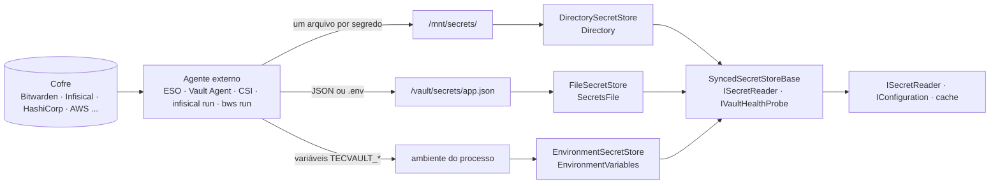

[🏠 TEC.Vault](../README.md) › [📚 Documentação](README.md) › 📂 Provedor Synced

# 📂 Provedor Synced

> Lê segredos que **um agente externo já entregou** à aplicação (pasta montada, variáveis de ambiente ou arquivo JSON/.env): funciona com qualquer cofre sincronizado por External Secrets Operator, Vault Agent, Secrets Store CSI driver, `infisical run` ou `bws run` — inclusive o **Bitwarden Secrets Manager** — sem SDK e sem credencial do cofre na aplicação.

## 📑 Sumário

- [🎯 Visão geral](#-visão-geral)
- [🚀 Uso](#-uso)
- [📘 Referência da API](#-referência-da-api)
- [📋 Receitas](#-receitas)
- [⚙️ Opções](#️-opções)
- [❌ Erros](#-erros)
- [🛡️ Segurança](#️-segurança)
- [❓ Perguntas frequentes](#-perguntas-frequentes)

---

## 🎯 Visão geral

| Cenário | Use |
|---|---|
| O cluster já sincroniza o cofre para um `Secret` do Kubernetes (External Secrets, CSI driver) | `Directory` sobre o volume montado |
| Vault Agent / Infisical Agent renderizando templates em arquivos | `Directory` (um arquivo por segredo) ou `SecretsFile` (um JSON/.env) |
| Processo iniciado por `infisical run`, `bws run`, `op run` ou `envFrom` | `EnvironmentVariables` (prefixo obrigatório) |
| Cofre sem provedor nativo no TEC.Vault (Bitwarden, 1Password, Doppler...) | Qualquer um dos três, conforme o que o agente grava |
| A aplicação precisa **gravar**, rotacionar ou usar chaves/certificados | Um provedor nativo: [Azure Key Vault](provedor-azure-key-vault.md), [HashiCorp Vault](provedor-hashicorp-vault.md), [Infisical](provedor-infisical.md) |

Vantagem de segurança: a aplicação não guarda **nenhuma** credencial do cofre; o acesso fica no agente, com a identidade dele. Só leitura: quem grava é o agente.



Os três herdam de `SyncedSecretStoreBase` → `VaultProviderBase` (validação, `Result`, auditoria, `Activity` e métricas iguais às dos demais provedores) e implementam só `ISecretReader` e `IVaultHealthProbe`.

> [!TIP]
> Prefira `Directory` a `EnvironmentVariables` quando o agente puder gravar arquivos: variáveis de ambiente são herdadas por processos filhos, aparecem em dumps e em `/proc/<pid>/environ`, e não acompanham a rotação sem reiniciar o processo.

---

## 🚀 Uso

### Em código

```csharp
using TEC.Vault.Synced;

builder.Services.AddTecVault(vault => vault
    .UseDirectory(o => o.Path = "/mnt/secrets")
    .EnableSecretCache(TimeSpan.FromMinutes(1)));   // evita E/S a cada leitura

// Alternativas:
// vault.UseEnvironmentVariables(o => o.Prefix = "TECVAULT_");
// vault.UseSecretsFile(o => o.Path = "/vault/secrets/app.json");
```

### Pela configuração

```csharp
// Segredos em arquivos, chaves no Azure Key Vault
builder.Services.AddTecVault(builder.Configuration.GetSection("Vault"), p => p.AddSynced().AddAzureKeyVault());
```

```json
{
  "Vault": {
    "Secrets": { "Provider": "Directory" },
    "Keys": { "Provider": "AzureKeyVault" },
    "Directory": { "Path": "/mnt/secrets" },
    "AzureKeyVault": { "VaultUri": "https://<nome-do-cofre>.vault.azure.net/" }
  }
}
```

Os três provedores também servem de fonte de `IConfiguration` (veja [Segredos no IConfiguration](configuracao.md)); a recarga incremental usa a versão HMAC.

### `Directory`: um arquivo por segredo

O nome do arquivo é o nome do segredo e o conteúdo é o valor. Formato do volume de `Secret` do Kubernetes, do CSI driver, do External Secrets Operator e dos templates do Vault Agent / Infisical Agent. O kubelet grava o volume assim (troca atômica do `..data` a cada atualização):

```text
/mnt/secrets/
├── ..2026_10_07_12_00_00.123456789/   ← pasta real da versão atual (ignorada: começa com ".")
│   ├── db-senha
│   └── api-key
├── ..data -> ..2026_10_07_12_00_00.123456789   ← ignorado (começa com ".")
├── db-senha -> ..data/db-senha        ← lido
└── api-key -> ..data/api-key          ← lido
```

| Entrada | Tratamento |
|---|---|
| Nome começando por `.` (inclusive `..data` e `..<data>`) | Ignorada |
| Subpasta | Ignorada (só arquivos diretamente na pasta) |
| Nome fora da regra do provedor (ex.: com espaço) | Ignorada |
| Link simbólico cujo **destino final** fica dentro da pasta | Lido (resolvido a cada leitura: acompanha a troca do `..data`) |
| Link simbólico para **fora** da pasta (ex.: `/etc/passwd`) | Ignorado, com log `Warning` (evento 3001, só o nome) |
| Link quebrado ou para pasta | Ignorado |
| Dois nomes iguais sem diferenciar maiúsculas (possível no Linux) | A leitura **falha** (`VAULT_FALHA`), em vez de escolher um |
| Mais arquivos válidos que `MaxItems` | A leitura **falha** (`VAULT_FALHA`) |

O nome pedido **nunca vira caminho**: a pasta é listada e o arquivo é escolhido pelo nome. `../etc/passwd` nem passa pela regra de nome. Se `Path` for ele próprio um link simbólico, o confinamento é conferido contra a pasta real.

> [!IMPORTANT]
> Monte o volume na pasta inteira (`mountPath: /mnt/secrets`), não arquivo a arquivo com `subPath`: montagens com `subPath` não recebem as atualizações do Kubernetes.

### `EnvironmentVariables`: variáveis com prefixo

| Variável | Segredo |
|---|---|
| `TECVAULT_db-senha` | `db-senha` |
| `TECVAULT_ConnectionStrings__Db` | `ConnectionStrings--Db` (`__` → `--`, separador de seção do `IConfiguration`) |
| `tecvault_api_key` | `api_key` (prefixo sem diferenciar maiúsculas) |
| `PATH`, `HOME`, `TECVAULT_` (só o prefixo) | *(ignoradas)* |
| `TECVAULT_nome com espaço` | *(ignorada: fora da regra de nome)* |

As variáveis são lidas do processo a cada chamada; como o ambiente de um processo em execução raramente muda, a rotação normalmente exige reiniciar.

### `SecretsFile`: um arquivo JSON ou .env

O arquivo é **relido só quando muda** (tamanho ou data de modificação). Diferente do `Directory`, um nome fora da regra ou repetido (sem diferenciar maiúsculas) faz a leitura **falhar**: é erro de geração do arquivo, e ignorá-lo esconderia o problema. A mensagem traz só a posição (`item N`, linha), nunca o valor. Cada valor tem no máximo 1 MB.

**JSON**

```json
{
  "db-senha": "s3nh@",
  "ConnectionStrings": { "Db": "Server=db;Password=x" },
  "Porta": 5432,
  "Ativo": true
}
```

| Regra | Comportamento |
|---|---|
| Raiz | Precisa ser um objeto |
| Objetos aninhados | Viram nomes com `--`: `ConnectionStrings--Db` (até 16 níveis) |
| Número e booleano | Viram texto (`"5432"`, `"true"`) |
| `null` e listas | Recusados (falha citando a chave) |
| Comentários e vírgula final | Aceitos |
| JSON inválido | Falha com o número da linha |

**.env**

```dotenv
# comentário
export DB_SENHA=s3nh@                      # "export " opcional; comentário depois de espaço
API_KEY = abc123                           # espaços nas pontas removidos
ConnectionStrings__Db="Server=db;Password=x"
CERT_PEM="-----BEGIN CERTIFICATE-----
MIIB...
-----END CERTIFICATE-----"
LITERAL='sem \n escape e $SEM_EXPANSAO'
COM_ESCAPES="linha1\nlinha2\t\"aspas\" \\ barra"
```

| Regra | Comportamento |
|---|---|
| Linha | `CHAVE=valor`; linhas vazias e iniciadas por `#` são ignoradas; `export ` opcional |
| Nome da chave | Letras, números, `_`, `.` e `-`; `__` vira `--` |
| Sem aspas | Até o fim da linha ou até ` #` (espaço/tab + `#`), sem espaços nas pontas. Espaço + `#` logo após o `=` também inicia comentário: `CHAVE= # texto` → vazio; `CHAVE=#texto` → `#texto`; `CHAVE=x #y` → `x`. Entre aspas o `#` é mantido |
| Aspas duplas | Escapes `\n`, `\r`, `\t`, `\"` e `\\` (outro escape é erro); pode ocupar **várias linhas** |
| Aspas simples | Literal, sem escapes; pode ocupar várias linhas |
| Depois das aspas | Só espaços e comentário; outro conteúdo é erro |
| Expansão de variáveis | **Nenhuma**: `$OUTRA` e `${OUTRA}` ficam como estão |
| Erro de formato | Falha com o número da linha, nunca o conteúdo |

### Comportamento comum

| Item | Comportamento |
|---|---|
| Nome | `^[0-9a-zA-Z][0-9a-zA-Z._-]{0,254}\z`: 1 a 255 caracteres, letras, números, `-`, `_` e `.`, começando por letra ou número; sem barra |
| Busca | Sem diferenciar maiúsculas |
| Leitura | A fonte é lida **a cada chamada**: a rotação feita pelo agente vale na hora. Para evitar E/S, ligue o cache (`EnableSecretCache` ou `Vault:Cache:Duration`) |
| Texto | UTF-8 **estrito** (byte inválido → falha, nunca caractere de substituição); BOM removido; leitura com teto de tamanho mesmo em pipe/arquivo especial; buffers zerados |
| Versão | HMAC do valor com chave por instância ([abaixo](#versão-por-hmac)); só a versão atual existe: `ListSecretVersionsAsync` devolve um item e outra versão retorna `VAULT_ITEM_NAO_ENCONTRADO` |
| `UpdatedOn` | Data de modificação do arquivo (`Directory`: do destino do link; `SecretsFile`: do arquivo); `null` em `EnvironmentVariables` |
| `Id` | `file:<nome>` (`Directory`), `file:<arquivo>#<nome>` (`SecretsFile`), `env:<nome>` (`EnvironmentVariables`); nunca o valor |
| Metadados | Sempre habilitado; sem validade, tags nem tipo de conteúdo |
| Sonda de saúde | Lista a fonte: pasta ou arquivo ausente/ilegível → não saudável |
| `ProviderName` | `Directory`, `EnvironmentVariables`, `SecretsFile` |

### Versão por HMAC

`Version` = 16 primeiros bytes de **HMAC-SHA256(valor)** com uma chave aleatória de 32 bytes **por instância** do store, em 32 hexadecimais minúsculos.

| Por que ter versão | Por que não um hash simples (SHA-256 do valor) |
|---|---|
| Muda quando o valor muda: a recarga incremental do `IConfiguration` relê só o que mudou, e a aplicação detecta rotação | A versão aparece em listagens, auditoria e telemetria. Com hash sem chave, quem visse a versão de um segredo de baixa entropia (PIN, senha curta) poderia **confirmar palpites fora do processo**, e o mesmo valor teria a mesma versão em todos os ambientes |

> [!NOTE]
> A versão **não se repete entre processos** nem entre instâncias (o container e a fonte de `IConfiguration` criam instâncias diferentes): não persista nem compartilhe a versão; leia sempre a atual (`version: null`). Uma versão lida em outra instância retorna `VAULT_ITEM_NAO_ENCONTRADO`.

---

## 📘 Referência da API

### `SyncedVaultExtensions`

> `TEC.Vault.Synced` · `static class`

| Membro | Retorno | Descrição |
|---|---|---|
| `UseDirectory(this VaultBuilder builder, Action<DirectorySecretsOptions> configure)` | `VaultBuilder` | Segredos = arquivos de uma pasta |
| `UseEnvironmentVariables(this VaultBuilder builder, Action<EnvironmentSecretsOptions> configure)` | `VaultBuilder` | Segredos = variáveis de ambiente com prefixo |
| `UseSecretsFile(this VaultBuilder builder, Action<SecretsFileOptions> configure)` | `VaultBuilder` | Segredos = um arquivo JSON ou .env |
| `AddSynced(this VaultProviderCatalog catalog)` | `VaultProviderCatalog` | Disponibiliza `Directory`, `EnvironmentVariables` e `SecretsFile` para a [escolha por configuração](configuracao-por-appsettings.md) |

### Stores

> `TEC.Vault.Synced` · `sealed class` (construtores públicos, opções validadas no construtor)

| Classe | Construtor | Provedor |
|---|---|---|
| `DirectorySecretStore` | `(DirectorySecretsOptions options, ILogger<DirectorySecretStore>? logger = null)` | `Directory` |
| `EnvironmentSecretStore` | `(EnvironmentSecretsOptions options, ILogger<EnvironmentSecretStore>? logger = null)` | `EnvironmentVariables` |
| `FileSecretStore` | `(SecretsFileOptions options, ILogger<FileSecretStore>? logger = null)` | `SecretsFile` |
| `SyncedSecretStoreBase` *(abstract)* | — | Base comum; não pode ser derivada fora do pacote. Constantes `DefaultMaxValueBytes` (64 KB) e `MaxValueBytesLimit` (1 MB) |

Cada classe expõe `Provider` *(const)* com o nome do provedor. `SecretsFileFormat` (enum): `Auto` (0, pela extensão), `Json` (1), `DotEnv` (2).

---

## 📋 Receitas

Os YAMLs e comandos abaixo são **exemplos**: confira a versão da API e os campos na documentação do agente que você usa.

<details>
<summary><b>External Secrets Operator + Bitwarden Secrets Manager</b></summary>

O ESO sincroniza o Bitwarden Secrets Manager para um `Secret` do Kubernetes; a aplicação lê o volume com `Directory`.

```yaml
# Exemplo: SecretStore do provedor Bitwarden Secrets Manager (exige o bitwarden-sdk-server do ESO)
apiVersion: external-secrets.io/v1
kind: SecretStore
metadata:
  name: bitwarden
  namespace: minha-api
spec:
  provider:
    bitwardensecretsmanager:
      apiURL: https://api.bitwarden.com
      identityURL: https://identity.bitwarden.com
      bitwardenServerSDKURL: https://bitwarden-sdk-server.external-secrets.svc.cluster.local:9998
      caBundle: <ca-do-sdk-server-em-base64>
      organizationID: <organization-id>
      projectID: <project-id>
      auth:
        secretRef:
          credentials:
            name: bitwarden-access-token   # token da conta de máquina, só no namespace do ESO/aplicação
            key: token
---
apiVersion: external-secrets.io/v1
kind: ExternalSecret
metadata:
  name: minha-api
  namespace: minha-api
spec:
  refreshInterval: 15m
  secretStoreRef:
    kind: SecretStore
    name: bitwarden
  target:
    name: minha-api-segredos
  data:
    - secretKey: db-senha                       # nome do arquivo = nome do segredo no TEC.Vault
      remoteRef:
        key: <id-do-segredo-no-bitwarden>
    - secretKey: MinhaApi--ConnectionStrings--Db
      remoteRef:
        key: <id-de-outro-segredo>
```

```yaml
# Exemplo: trecho do Deployment
spec:
  template:
    spec:
      volumes:
        - name: segredos
          secret:
            secretName: minha-api-segredos
      containers:
        - name: minha-api
          volumeMounts:
            - name: segredos
              mountPath: /mnt/secrets
              readOnly: true
          env:
            - name: Vault__Provider
              value: Directory
            - name: Vault__Directory__Path
              value: /mnt/secrets
```

</details>

<details>
<summary><b>External Secrets Operator + Infisical</b></summary>

```yaml
# Exemplo: SecretStore do provedor Infisical (Universal Auth da identidade de máquina do ESO)
apiVersion: external-secrets.io/v1
kind: SecretStore
metadata:
  name: infisical
  namespace: minha-api
spec:
  provider:
    infisical:
      hostAPI: https://app.infisical.com
      auth:
        universalAuthCredentials:
          clientId:
            name: infisical-credencial
            key: clientId
          clientSecret:
            name: infisical-credencial
            key: clientSecret
      secretsScope:
        projectSlug: <slug-do-projeto>
        environmentSlug: prod
        secretsPath: /minha-api
---
apiVersion: external-secrets.io/v1
kind: ExternalSecret
metadata:
  name: minha-api
  namespace: minha-api
spec:
  refreshInterval: 15m
  secretStoreRef:
    kind: SecretStore
    name: infisical
  target:
    name: minha-api-segredos
  dataFrom:
    - find:
        name:
          regexp: ".*"     # todos os segredos da pasta viram arquivos
```

O volume e a seção `Vault` são os mesmos da receita anterior. Para gravar no Infisical, use o [provedor nativo](provedor-infisical.md).

</details>

<details>
<summary><b>Vault Agent (arquivos e JSON)</b></summary>

Com o injetor do Vault Agent, cada anotação `agent-inject-secret-<arquivo>` gera um arquivo em `/vault/secrets/`.

```yaml
# Exemplo: um arquivo por segredo → provedor Directory (Path = /vault/secrets)
metadata:
  annotations:
    vault.hashicorp.com/agent-inject: "true"
    vault.hashicorp.com/role: "minha-api"
    vault.hashicorp.com/agent-inject-secret-db-senha: "secret/data/minha-api/db-senha"
    vault.hashicorp.com/agent-inject-template-db-senha: |
      {{- with secret "secret/data/minha-api/db-senha" -}}{{ .Data.data.value }}{{- end -}}
```

```yaml
# Exemplo: um JSON com todos os campos de um item do KV → provedor SecretsFile (Path = /vault/secrets/app.json)
metadata:
  annotations:
    vault.hashicorp.com/agent-inject: "true"
    vault.hashicorp.com/role: "minha-api"
    vault.hashicorp.com/agent-inject-secret-app.json: "secret/data/minha-api/config"
    vault.hashicorp.com/agent-inject-template-app.json: |
      {{- with secret "secret/data/minha-api/config" -}}{{ .Data.data | toJSON }}{{- end -}}
```

```json
{ "Vault": { "Provider": "SecretsFile", "SecretsFile": { "Path": "/vault/secrets/app.json" } } }
```

> [!NOTE]
> Com `Directory` em `/vault/secrets`, o `app.json` também seria lido como um segredo chamado `app.json`. Escolha um formato por pasta. Para também usar chaves (Transit) e gravar segredos, use o [provedor HashiCorp Vault](provedor-hashicorp-vault.md).

</details>

<details>
<summary><b>Secrets Store CSI driver</b></summary>

```yaml
# Exemplo: SecretProviderClass com o provedor do HashiCorp Vault (há provedores para Azure, AWS, GCP...)
apiVersion: secrets-store.csi.x-k8s.io/v1
kind: SecretProviderClass
metadata:
  name: minha-api
  namespace: minha-api
spec:
  provider: vault
  parameters:
    vaultAddress: https://vault.interno:8200
    roleName: minha-api
    objects: |
      - objectName: "db-senha"
        secretPath: "secret/data/minha-api/db-senha"
        secretKey: "value"
---
# Trecho do Deployment
spec:
  template:
    spec:
      volumes:
        - name: segredos
          csi:
            driver: secrets-store.csi.k8s.io
            readOnly: true
            volumeAttributes:
              secretProviderClass: minha-api
      containers:
        - name: minha-api
          volumeMounts:
            - name: segredos
              mountPath: /mnt/secrets-store
              readOnly: true
```

```json
{ "Vault": { "Provider": "Directory", "Directory": { "Path": "/mnt/secrets-store" } } }
```

A rotação depende da opção do driver (`enableSecretRotation`); sem ela, os arquivos só mudam quando o pod é recriado.

</details>

<details>
<summary><b>infisical run</b></summary>

O `infisical run` injeta os segredos como variáveis de ambiente. Como o provedor exige prefixo, nomeie os segredos no Infisical com ele (ex.: `TECVAULT_db-senha`, `TECVAULT_ConnectionStrings__Db`):

```bash
# Exemplo
export INFISICAL_TOKEN=<token-da-identidade-de-maquina>   # fora do código e do appsettings
infisical run --env=prod --path=/minha-api -- \
  env Vault__Provider=EnvironmentVariables Vault__EnvironmentVariables__Prefix=TECVAULT_ dotnet MinhaApi.dll
```

Alternativa sem variáveis de ambiente: exportar para um `.env` num volume em memória e usar `SecretsFile` (proteja e apague o arquivo):

```bash
# Exemplo
infisical export --env=prod --path=/minha-api --format=dotenv > /run/minha-api/segredos.env
```

</details>

<details>
<summary><b>bws run (Bitwarden Secrets Manager)</b></summary>

O `bws run` injeta os segredos de um projeto como variáveis de ambiente, com o **nome** do segredo como nome da variável. Use o prefixo nos nomes no Bitwarden (ex.: `TECVAULT_db-senha`):

```bash
# Exemplo
export BWS_ACCESS_TOKEN=<token-da-conta-de-maquina>       # fora do código e do appsettings
bws run --project-id <project-id> -- \
  env Vault__Provider=EnvironmentVariables Vault__EnvironmentVariables__Prefix=TECVAULT_ dotnet MinhaApi.dll
```

No Kubernetes, prefira a receita com o External Secrets Operator e o provedor `Directory`.

</details>

---

## ⚙️ Opções

Na configuração, cada provedor tem a sua seção (`Vault:Directory`, `Vault:EnvironmentVariables`, `Vault:SecretsFile`) com as mesmas chaves das opções abaixo; chave desconhecida falha na subida.

### `DirectorySecretsOptions` (`Vault:Directory`)

| Opção | Padrão | Descrição e validação |
|---|---|---|
| `Path` | — | **Obrigatório**; pasta (ex.: `/mnt/secrets`), convertida para caminho absoluto |
| `MaxFileBytes` | `65536` (64 KB) | Tamanho máximo de cada arquivo (1 byte a 1 MB); maior → a leitura **falha** (não trunca) |
| `MaxItems` | `1000` | Arquivos válidos na pasta (1 a 10.000); acima disso a listagem falha |
| `TrimTrailingNewline` | `true` | Remove `\r` e `\n` do final do valor (`echo` e vários agentes gravam com `\n`) |

### `EnvironmentSecretsOptions` (`Vault:EnvironmentVariables`)

| Opção | Padrão | Descrição e validação |
|---|---|---|
| `Prefix` | — | **Obrigatório**; ao menos 2 caracteres, só letras, números e `_` (ex.: `TECVAULT_`); removido do nome |
| `MaxItems` | `1000` | Variáveis com o prefixo (1 a 10.000); acima disso a leitura falha |
| `MaxValueBytes` | `65536` (64 KB) | Tamanho máximo de cada valor em UTF-8 (1 byte a 1 MB) |

### `SecretsFileOptions` (`Vault:SecretsFile`)

| Opção | Padrão | Descrição e validação |
|---|---|---|
| `Path` | — | **Obrigatório**; arquivo (ex.: `/vault/secrets/app.json`) |
| `Format` | `Auto` | `Auto` (pela extensão), `Json` ou `DotEnv`. Com `Auto`, a extensão precisa ser `.json` ou `.env` (ou o arquivo se chamar `.env`) |
| `MaxFileBytes` | `1048576` (1 MB) | Tamanho máximo do arquivo (1 byte a 16 MB) |
| `MaxItems` | `1000` | Segredos no arquivo (1 a 10.000); acima disso a leitura falha |

---

## ❌ Erros

### Na subida

| Exceção | Quando | O que fazer |
|---|---|---|
| `InvalidOperationException` | Opção inválida (a mensagem cita a opção, ex.: `EnvironmentSecretsOptions.Prefix é obrigatório`), validada no `UseXxx` e no construtor; na configuração, chave desconhecida ou valor fora da faixa | Corrija a opção citada |
| `ArgumentNullException` | `builder`, `configure`, `catalog` ou `options` nulos | — |

### Nas operações (`Result`)

| Situação | Código | O que fazer |
|---|---|---|
| Nome inválido | `VAULT_ENTRADA_INVALIDA` (sem consultar a fonte) | Use a regra de nome do provedor |
| Segredo inexistente ou versão diferente da atual | `VAULT_ITEM_NAO_ENCONTRADO` | Leia a versão atual (`version: null`) |
| Pasta ou arquivo ausente | `VAULT_INDISPONIVEL` | Confira o volume/arquivo e o agente |
| Sem permissão de leitura | `VAULT_ACESSO_NEGADO` | Ajuste permissões do volume para o usuário do processo |
| Outra falha de E/S | `VAULT_INDISPONIVEL` | Tente mais tarde |
| Conteúdo fora do formato: arquivo acima do limite, UTF-8 inválido, JSON/.env inválido, nomes repetidos, acima de `MaxItems` | `VAULT_FALHA` | Corrija o que o agente gera; o log traz só a posição (linha, item ou nome do arquivo), nunca o valor |

Tabela completa em [Erros](erros.md).

---

## 🛡️ Segurança

> [!WARNING]
> O prefixo de `EnvironmentVariables` é obrigatório de propósito: sem ele, qualquer variável do processo (`PATH`, `HOME`, credenciais de outras ferramentas) seria exposta como segredo por `ListSecretsAsync` e pela fonte de `IConfiguration`.

> [!CAUTION]
> Monte o volume de segredos só no container da aplicação e com `readOnly: true`. Quem consegue gravar na pasta consegue trocar os segredos que a aplicação lê.

- Links simbólicos confinados à pasta (o destino final é conferido a cada leitura); link para fora é ignorado e registrado só com o nome.
- O nome pedido nunca vira caminho de arquivo.
- Teto de tamanho e de quantidade em todas as fontes (`MaxFileBytes`, `MaxValueBytes`, `MaxItems`), leitura limitada mesmo em pipe ou arquivo especial, UTF-8 estrito e buffers zerados.
- Versão por HMAC com chave por instância: não permite confirmar palpites do valor.
- Mensagens de erro de formato trazem só a posição, nunca o conteúdo.

---

## ❓ Perguntas frequentes

<details>
<summary>O agente atualizou o segredo; a aplicação vê na hora?</summary>

Sim: a fonte é lida a cada chamada. Com o cache ligado, a mudança aparece quando a entrada expira. Na fonte de `IConfiguration`, aparece na próxima recarga. `EnvironmentVariables` é a exceção: o ambiente de um processo em execução normalmente não muda.
</details>

<details>
<summary>Por que a versão do segredo muda quando a aplicação reinicia?</summary>

A versão é um HMAC com chave aleatória por instância, justamente para não revelar o valor. Não persista a versão; leia sempre a atual.
</details>

<details>
<summary>Usei <code>subPath</code> no Deployment e a rotação não chega.</summary>

Montagens com `subPath` não recebem as atualizações do Kubernetes. Monte a pasta inteira e aponte `Path` para ela.
</details>

<details>
<summary>Um arquivo da pasta não aparece na listagem.</summary>

Ele é ignorado se o nome começa com `.`, tem caractere fora da regra (espaço, por exemplo), é subpasta, ou é link para fora da pasta (procure o evento 3001 no log).
</details>

---
⬅️ [🟣 Provedor Infisical](provedor-infisical.md) · [📚 Índice](README.md) · [🧠 Provedor em memória](provedor-em-memoria.md) ➡️
