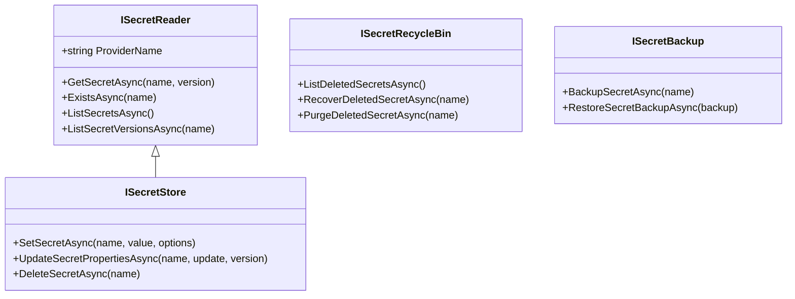
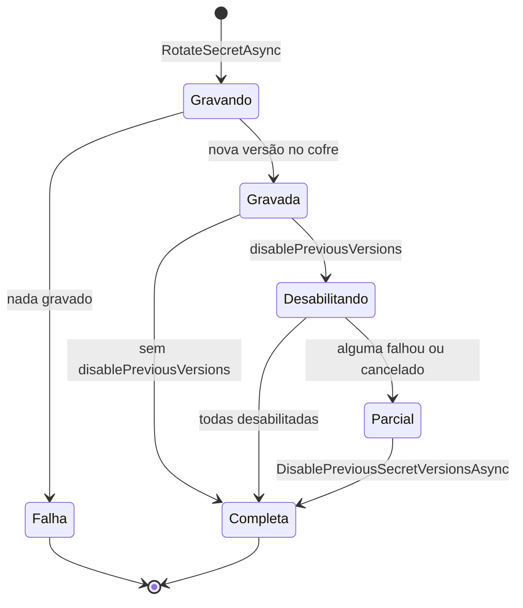

[🏠 TEC.Vault](../README.md) › [📚 Documentação](README.md) › 🔑 Segredos

# 🔑 Segredos

> Lê, grava, versiona, gera, rotaciona, recupera e faz backup de senhas, strings de conexão, tokens e chaves de API com a mesma API em qualquer cofre, sem que o valor vá para log.

## 📑 Sumário

- [🎯 Visão geral](#-visão-geral)
- [🚀 Uso](#-uso)
  - [Ler segredos](#ler-segredos)
  - [Gravar e gerenciar](#gravar-e-gerenciar)
  - [Gerar e rotacionar](#gerar-e-rotacionar)
  - [Lixeira e backup](#lixeira-e-backup)
- [📘 Referência da API](#-referência-da-api)
- [⚙️ Opções](#️-opções)
- [❌ Erros](#-erros)
- [🛡️ Segurança](#️-segurança)
- [❓ Perguntas frequentes](#-perguntas-frequentes)

---

## 🎯 Visão geral

As operações de segredos ficam em quatro interfaces do namespace `TEC.Vault.Abstractions` (pacote `TEC.Vault`). A aplicação injeta **só a que precisa** (menor privilégio); todas apontam para a mesma instância do provedor no container. Uma interface que o provedor não implementa simplesmente não é registrada.



| Preciso de... | Injete | Papel típico no Azure |
|---|---|---|
| Só ler valores (o caso mais comum) | `ISecretReader` | Key Vault Secrets User |
| Gravar, alterar metadados, excluir | `ISecretStore` | Key Vault Secrets Officer |
| Recuperar ou purgar excluídos | `ISecretRecycleBin` | Key Vault Secrets Officer |
| Backup e restauração | `ISecretBackup` | Key Vault Secrets Officer |

**O que cada provedor oferece:**

| Provedor | `ISecretReader` | `ISecretStore` | `ISecretRecycleBin` | `ISecretBackup` |
|---|:-:|:-:|:-:|:-:|
| [Azure Key Vault](provedor-azure-key-vault.md) | ✅ | ✅ | ✅ | ✅ |
| [HashiCorp Vault](provedor-hashicorp-vault.md) (KV v2) | ✅ | ✅ | ✅ | — |
| [Infisical](provedor-infisical.md) | ✅ | ✅ | — | — |
| [Synced](provedor-synced.md) (arquivos, variáveis, JSON/.env) | ✅ | — | — | — |
| [Em memória](provedor-em-memoria.md) | ✅ | ✅ | ✅ | ✅ |

> [!NOTE]
> Todo método assíncrono retorna `Result`/`Result<T>` do [TEC.Core](https://github.com/tudoemcodigo/lib-tec-core): falha do cofre **nunca** vira exceção, vira um código de [`VaultErrors`](erros.md). Só o cancelamento pedido pelo chamador lança `OperationCanceledException`.

---

## 🚀 Uso

Os exemplos supõem `using TEC.Vault.Abstractions; using TEC.Vault.Common; using TEC.Vault.Secrets; using TEC.Core.Common.Results;` e um provedor registrado com [`AddTecVault`](injecao-de-dependencias.md).

### Ler segredos

```csharp
var segredo = await vault.GetSecretAsync("db-senha", cancellationToken: ct);
if (segredo.IsFailure)
    return segredo.ToFailure();

string senha = segredo.Value.Value;                              // valor
string? versao = segredo.Value.Version;                          // versão lida
bool existe = (await vault.ExistsAsync("db-senha", ct)).Value;   // só metadados, o valor não é lido
```

<details>
<summary>📄 Exemplo completo: cliente HTTP que busca o token no cofre</summary>

```csharp
using System.Net.Http.Headers;
using Microsoft.Extensions.Logging;
using TEC.Vault.Abstractions;
using TEC.Vault.Common;
using TEC.Core.Common.Results;

public sealed class ParceiroClient(HttpClient http, ISecretReader vault, ILogger<ParceiroClient> logger)
{
    public async Task<Result<string>> ConsultarEmpresaAsync(string cnpj, CancellationToken ct)
    {
        var token = await vault.GetSecretAsync("parceiro-api-token", cancellationToken: ct);
        if (token.IsFailure)
        {
            // Código padronizado, igual em qualquer provedor
            if (token.Error!.Code == VaultErrors.NotFoundCode)
                logger.LogError("Token do parceiro não cadastrado no cofre.");
            return token.ToFailure<string>();   // falhas de infraestrutura saem ocultas do cliente (502)
        }

        using var request = new HttpRequestMessage(HttpMethod.Get, $"empresas/{cnpj}");
        request.Headers.Authorization = new AuthenticationHeaderValue("Bearer", token.Value.Value);
        using var response = await http.SendAsync(request, ct);
        return await response.Content.ReadAsStringAsync(ct);
    }
}
```

</details>

```csharp
// Versão específica (ex.: a usada para assinar um registro antigo)
var antiga = await vault.GetSecretAsync("webhook-assinatura", "0b4a1c2d3e4f5061728394a5b6c7d8e9", ct);

// Segredos que expiram nos próximos 15 dias (a listagem nunca traz valores)
var todos = await vault.ListSecretsAsync(ct);
var vencendo = todos.Value.Where(s => s.ExpiresOn < DateTimeOffset.UtcNow.AddDays(15)).Select(s => s.Name);
```

> [!NOTE]
> As datas de validade são **informativas na leitura** (como no Azure Key Vault): um segredo expirado ainda é lido. Para recusar vencidos, use `segredo.Value.Properties.IsActive(agora)`. O provedor de [`IConfiguration`](configuracao.md) já ignora segredos inativos.

### Gravar e gerenciar

```csharp
var gravado = await vault.SetSecretAsync("smtp-senha", senha, new SecretWriteOptions
{
    ContentType = "text/plain",
    ExpiresOn = DateTimeOffset.UtcNow.AddDays(90),   // todo segredo deve expirar
    Tags = new Dictionary<string, string> { ["sistema"] = "notificacoes" }
}, ct);

// Desabilitar a versão atual (o valor não muda)
await vault.UpdateSecretPropertiesAsync("smtp-senha", new SecretPropertiesUpdate { Enabled = false }, cancellationToken: ct);

// Prorrogar uma versão específica
await vault.UpdateSecretPropertiesAsync("smtp-senha",
    new SecretPropertiesUpdate { ExpiresOn = DateTimeOffset.UtcNow.AddDays(30) }, gravado.Value.Version, ct);

// Excluir (todas as versões); com lixeira, recuperável até ScheduledPurgeDate
var excluido = await vault.DeleteSecretAsync("smtp-senha", ct);
```

<details>
<summary>📄 Exemplo completo: provisionamento de credencial de parceiro</summary>

```csharp
using TEC.Vault.Abstractions;
using TEC.Vault.Secrets;
using TEC.Core.Common.Results;

public sealed class ProvisionamentoParceiro(ISecretStore vault)
{
    public async Task<Result> CadastrarAsync(string parceiro, string apiKey, CancellationToken ct)
    {
        var nome = $"parceiro-{parceiro}-api-key";

        var gravado = await vault.SetSecretAsync(nome, apiKey, new SecretWriteOptions
        {
            ExpiresOn = DateTimeOffset.UtcNow.AddDays(180),
            Tags = new Dictionary<string, string> { ["parceiro"] = parceiro }   // nada sensível em tags
        }, ct);

        if (gravado.IsFailure)
            return gravado.ToFailure();   // VAULT_CONFLITO: o nome está na lixeira; recupere ou purgue antes

        // Desabilita as versões antigas sem tocar no valor
        var versoes = await vault.ListSecretVersionsAsync(nome, ct);
        foreach (var antiga in versoes.Value.Where(v => v.Version != gravado.Value.Version && v.Enabled))
            await vault.UpdateSecretPropertiesAsync(nome, new SecretPropertiesUpdate { Enabled = false }, antiga.Version, ct);

        return Result.Success();
    }
}
```

</details>

> [!NOTE]
> `UpdateSecretPropertiesAsync` sem versão altera a **versão atual**: a de maior `CreatedOn`. Em empate no mesmo segundo, o provedor é consultado (leitura sem versão); se a atual estiver desabilitada, desempata por `UpdatedOn` e pelo identificador da versão.

### Gerar e rotacionar

`SecretStoreExtensions` (namespace `TEC.Vault.Secrets`) funciona com qualquer `ISecretStore`. O valor é gerado pelo gerador criptográfico do TEC.Core, gravado no cofre e **não volta** para a aplicação.

```csharp
// Senha de 40 caracteres sem símbolos, válida por 60 dias
await vault.GenerateSecretAsync("servico-legado-senha",
    new SecretGenerationOptions { Kind = SecretGenerationKind.Password, Length = 40, IncludeSpecialCharacters = false },
    new SecretWriteOptions { ExpiresOn = DateTimeOffset.UtcNow.AddDays(60) }, ct);

// Rotação: nova versão gerada, mantendo ContentType e tags da atual
var rotacao = await vault.RotateSecretAsync("webhook-assinatura",
    new SecretGenerationOptions { Kind = SecretGenerationKind.Hex, Length = 32 },
    validity: TimeSpan.FromDays(90), disablePreviousVersions: true, cancellationToken: ct);

if (rotacao.IsSuccess && !rotacao.Value.IsComplete)
    await vault.DisablePreviousSecretVersionsAsync("webhook-assinatura", rotacao.Value.Current.Version!, ct);
```

A rotação tem duas etapas no cofre (gravar a nova versão e desabilitar as anteriores) e **não é atômica**:



- **Falha** só quando nada foi gravado.
- Se a nova versão foi gravada, é **sucesso** com a versão criada em `Current`; `IsComplete`, `FailedVersions` e `Errors` dizem o que faltou. Nesse caso **não rotacione de novo** (criaria outra versão): chame `DisablePreviousSecretVersionsAsync`, que é idempotente.
- Cancelamento **depois** da gravação não lança: as versões pendentes vão para `FailedVersions` com `VAULT_OPERACAO_CANCELADA`. Antes da gravação, o cancelamento lança `OperationCanceledException` e nada muda.
- A sobrecarga com `ILogger` registra a rotação incompleta (evento **2009**, `Warning`) com nome, versões e código de erro — nunca o valor.

<details>
<summary>📄 Exemplo completo: rotação agendada com conclusão idempotente</summary>

```csharp
using Microsoft.Extensions.Logging;
using TEC.Vault.Abstractions;
using TEC.Vault.Secrets;
using TEC.Core.Common.Results;

public sealed class RotacaoWebhook(ISecretStore vault, TimeProvider relogio, ILogger<RotacaoWebhook> logger)
{
    public async Task<Result> RotacionarAsync(CancellationToken ct)
    {
        var rotacao = await vault.RotateSecretAsync("webhook-assinatura",
            new SecretGenerationOptions { Kind = SecretGenerationKind.Token, Length = 48 },
            validity: TimeSpan.FromDays(90),
            disablePreviousVersions: true,
            timeProvider: relogio,
            logger: logger,
            cancellationToken: ct);

        if (rotacao.IsFailure)
            return rotacao.ToFailure();   // nada foi gravado

        if (!rotacao.Value.IsComplete)
        {
            // A nova versão JÁ foi gravada; só faltou desabilitar alguma anterior
            var conclusao = await vault.DisablePreviousSecretVersionsAsync("webhook-assinatura",
                rotacao.Value.Current.Version!, ct);
            if (conclusao.IsFailure || !conclusao.Value.IsComplete)
                logger.LogWarning("Rotação ainda parcial; nova tentativa no próximo ciclo.");
        }

        return Result.Success();
    }
}
```

</details>

> [!TIP]
> Em testes, passe um relógio controlado: com `FakeTimeProvider` em 01/01/2026 e `validity: TimeSpan.FromDays(30)`, a nova versão sai com `ExpiresOn` em 31/01/2026.

### Lixeira e backup

```csharp
// Lixeira (ISecretRecycleBin)
var excluidos = await lixeira.ListDeletedSecretsAsync(ct);
foreach (var item in excluidos.Value)
    Console.WriteLine($"{item.Name}: excluído em {item.DeletedOn:g}, remoção em {item.ScheduledPurgeDate:d}");

await lixeira.RecoverDeletedSecretAsync("smtp-senha", ct);      // volta com todas as versões
await lixeira.PurgeDeletedSecretAsync("segredo-obsoleto", ct);  // sem volta

// Backup (ISecretBackup): conteúdo opaco, já protegido pelo provedor
var backup = await backups.BackupSecretAsync("db-conexao", ct);
await File.WriteAllBytesAsync("db-conexao.bak", backup.Value, ct);

// ... em outro cofre compatível (no Azure: mesma geografia e assinatura). O nome não pode existir no destino.
var restaurado = await backups.RestoreSecretBackupAsync(await File.ReadAllBytesAsync("db-conexao.bak", ct), ct);
```

> [!NOTE]
> No provedor em memória o backup é um identificador opaco, válido só na mesma instância (não contém o segredo).

---

## 📘 Referência da API

### `ISecretReader`

> `TEC.Vault.Abstractions` · `interface` · todo provedor de segredos implementa

| Membro | Retorno | Descrição |
|---|---|---|
| `ProviderName` | `string` | Nome do provedor (ex.: `"AzureKeyVault"`, `"InMemory"`) |
| `GetSecretAsync(string name, string? version = null)` | `Task<Result<VaultSecret>>` | Valor e metadados da versão atual ou da informada |
| `ExistsAsync(string name)` | `Task<Result<bool>>` | Se o segredo existe (não excluído), consultando só metadados |
| `ListSecretsAsync()` | `Task<Result<IReadOnlyList<SecretProperties>>>` | Metadados de todos os segredos (sem valores) |
| `ListSecretVersionsAsync(string name)` | `Task<Result<IReadOnlyList<SecretProperties>>>` | Metadados de todas as versões de um segredo |

### `ISecretStore` (herda `ISecretReader`)

| Membro | Retorno | Descrição |
|---|---|---|
| `SetSecretAsync(string name, string value, SecretWriteOptions? options = null)` | `Task<Result<SecretProperties>>` | Cria o segredo ou grava uma **nova versão** |
| `UpdateSecretPropertiesAsync(string name, SecretPropertiesUpdate update, string? version = null)` | `Task<Result<SecretProperties>>` | Altera habilitado, validade, tipo e tags sem mudar o valor |
| `DeleteSecretAsync(string name)` | `Task<Result<DeletedVaultItem>>` | Exclui (todas as versões) e aguarda a conclusão. Com lixeira, a exclusão é lógica; sem lixeira, vale a semântica do provedor |

### `ISecretRecycleBin` (capacidade opcional)

| Membro | Retorno | Descrição |
|---|---|---|
| `ListDeletedSecretsAsync()` | `Task<Result<IReadOnlyList<DeletedVaultItem>>>` | Segredos excluídos e ainda recuperáveis |
| `RecoverDeletedSecretAsync(string name)` | `Task<Result<SecretProperties>>` | Recupera e aguarda a conclusão |
| `PurgeDeletedSecretAsync(string name)` | `Task<Result>` | Remove definitivamente. **Irreversível** |

### `ISecretBackup` (capacidade opcional)

| Membro | Retorno | Descrição |
|---|---|---|
| `BackupSecretAsync(string name)` | `Task<Result<byte[]>>` | Backup opaco, criptografado pelo provedor, com todas as versões |
| `RestoreSecretBackupAsync(byte[] backup)` | `Task<Result<SecretProperties>>` | Restaura; o nome não pode existir no cofre |

### `SecretStoreExtensions`

> `TEC.Vault.Secrets` · `static class`

| Membro | Retorno | Descrição |
|---|---|---|
| `GenerateSecretAsync(this ISecretStore store, string name, SecretGenerationOptions? generation = null, SecretWriteOptions? options = null)` | `Task<Result<SecretProperties>>` | Gera um segredo forte e grava. O valor **não** é retornado |
| `RotateSecretAsync(this ISecretStore store, string name, SecretGenerationOptions? generation = null, TimeSpan? validity = null, bool disablePreviousVersions = false, TimeProvider? timeProvider = null)` | `Task<Result<SecretRotationResult>>` | Nova versão gerada, mantendo `ContentType` e tags da atual; opcionalmente desabilita as anteriores |
| `RotateSecretAsync(..., TimeProvider? timeProvider, ILogger logger)` | `Task<Result<SecretRotationResult>>` | Igual, registrando a rotação incompleta no `logger` (evento 2009) |
| `DisablePreviousSecretVersionsAsync(this ISecretStore store, string name, string currentVersion)` | `Task<Result<SecretRotationResult>>` | Desabilita todas as versões habilitadas exceto `currentVersion`. Idempotente |

### `VaultSecret`

> `TEC.Vault.Secrets` · `sealed class` — não é `record` de propósito: `ToString()` e o depurador mascaram o valor

| Membro | Retorno | Descrição |
|---|---|---|
| `VaultSecret(SecretProperties properties, string value)` | — | Construtor (provedores e testes). Lança `ArgumentNullException` com argumento `null` |
| `Properties` | `SecretProperties` | Metadados |
| `Value` | `string` | Valor. Nunca registre em log |
| `Name` / `Version` | `string` / `string?` | Atalhos de `Properties` |
| `ToString()` | `string` | `VaultSecret { Name = ..., Version = ..., Value = *** }` |

<details>
<summary>📋 Modelos de segredo e modelos comuns</summary>

#### `SecretProperties` (herda `VaultItemProperties`)

| Membro | Tipo | Descrição |
|---|---|---|
| `ContentType` | `string?` | Tipo do conteúdo (informativo) |

#### `SecretRotationResult`

| Membro | Tipo | Descrição |
|---|---|---|
| `Current` | `SecretProperties` | Versão atual: a gravada pela rotação (ou a informada, ao só desabilitar) |
| `DisabledVersions` | `IReadOnlyList<string>` | Versões desabilitadas nesta chamada |
| `FailedVersions` | `IReadOnlyList<string>` | Versões que podem continuar habilitadas (falha do cofre ou cancelamento após a gravação) |
| `Errors` | `IReadOnlyList<Error>` | Erros de `FailedVersions`, na mesma ordem |
| `IsComplete` | `bool` | `true` se todas as etapas pedidas foram concluídas |

#### `SecretGenerationKind`

| Valor | Descrição |
|---|---|
| `Password` (0) | Letras, dígitos e símbolos, sem caracteres ambíguos |
| `Token` (1) | Aleatório em Base64Url (seguro para URLs e cabeçalhos) |
| `Hex` (2) | Aleatório em hexadecimal minúsculo |

#### `VaultItemProperties`

> `TEC.Vault.Common` · `abstract record` — base de `SecretProperties`, `KeyProperties` e `CertificateProperties`. Nunca contém o valor.

| Membro | Tipo | Descrição |
|---|---|---|
| `Name` | `string` (obrigatório) | Nome do item |
| `Version` | `string?` | Versão (formato do provedor) |
| `Id` | `string?` | Identificador nativo (URI, caminho...). Informativo: as operações usam `Name` e `Version` |
| `Enabled` | `bool` | Habilitado |
| `CreatedOn` / `UpdatedOn` | `DateTimeOffset?` | Criação / última atualização |
| `ExpiresOn` / `NotBefore` | `DateTimeOffset?` | Fim / início da validade |
| `ManagedBy` | `string?` | Quem gerencia o item quando não é a aplicação (ex.: `"certificate"` no Azure). `null` = item comum |
| `IsManaged` | `bool` | `ManagedBy` preenchido |
| `Tags` | `IReadOnlyDictionary<string,string>` | Metadados livres (nunca `null`) |
| `IsActive(DateTimeOffset now)` | `bool` | Habilitado e dentro da validade no instante informado |

#### `DeletedVaultItem`

> `TEC.Vault.Common` · `sealed record DeletedVaultItem(string Name, DateTimeOffset? DeletedOn, DateTimeOffset? ScheduledPurgeDate)`

`ScheduledPurgeDate = null` significa que o provedor não informa a data de remoção definitiva.

</details>

---

## ⚙️ Opções

Os segredos não têm opções globais: o comportamento vem dos parâmetros de cada chamada. As opções do provedor (endereço, autenticação, limites) ficam na página de cada [provedor](README.md).

### `SecretWriteOptions` (gravação)

| Opção | Padrão | Descrição |
|---|---|---|
| `ContentType` | `null` | Tipo do conteúdo; até 255 caracteres, sem caracteres de controle |
| `Enabled` | `true` | Versão habilitada |
| `ExpiresOn` | `null` | Validade; precisa estar no futuro. Recomendado: todo segredo expira |
| `NotBefore` | `null` | Início da validade; anterior a `ExpiresOn` |
| `Tags` | `null` | Metadados livres; nunca dados sensíveis |

### `SecretPropertiesUpdate` (alteração de metadados)

Propriedades `null` não são alteradas: `Enabled`, `ExpiresOn`, `NotBefore`, `ContentType` e `Tags` (substituem as atuais).

### `SecretGenerationOptions` e parâmetros da rotação

| Opção | Padrão | Descrição |
|---|---|---|
| `Kind` | `Password` | `Password`, `Token` ou `Hex` |
| `Length` | `32` | Caracteres (senha) ou bytes aleatórios (token/hex), de 16 a 1024 |
| `IncludeSpecialCharacters` | `true` | Símbolos na senha |
| `validity` | `null` | Validade da nova versão (`null` = sem expiração; recomendado informar) |
| `disablePreviousVersions` | `false` | Desabilita as versões anteriores depois de gravar a nova |
| `timeProvider` | `TimeProvider.System` | Relógio usado para calcular a expiração |

### Limites por provedor

| Limite | Azure Key Vault | HashiCorp Vault | Infisical | Em memória |
|---|---|---|---|---|
| Tamanho do valor (UTF-8) | 25 KB | 512 KB | 1 MB | 64 KB |
| Tags (quantidade · chave · valor) | 15 · 256 · 256 | 60 · 128 · 512 | 50 · 255 · 1.020 | 50 · 256 · 256 |
| Backup | até 10 MB | — | — | identificador de 64 bytes |

---

## ❌ Erros

| Código | Quando ocorre | O que fazer |
|---|---|---|
| `VAULT_ENTRADA_INVALIDA` | Nome vazio ou fora do padrão do provedor; versão em formato inválido; valor vazio ou acima do limite; `ContentType` longo ou com caracteres de controle; tags acima do limite; `NotBefore >= ExpiresOn`; `ExpiresOn` no passado; `Length` fora de 16 a 1024; `validity <= 0`; `currentVersion` vazia; rotação de segredo gerenciado (de certificado); backup vazio ou acima do limite | Corrija a entrada; a mensagem nunca repete o valor recebido |
| `VAULT_ITEM_NAO_ENCONTRADO` | Segredo ou versão inexistente ou excluído; nome fora da lixeira; segredo sem versões na rotação | Cadastre o segredo ou confira o nome |
| `VAULT_ITEM_DESABILITADO` | A versão lida está desabilitada | Habilite a versão ou leia outra |
| `VAULT_CONFLITO` | O nome pertence a um segredo excluído ainda na lixeira; restauração de backup com nome existente; operação em andamento | Recupere ou purgue o excluído; restaure com o nome livre |
| `VAULT_REQUISICAO_RECUSADA` | Backup corrompido ou de cofre incompatível | Gere o backup de novo no cofre de origem |
| `VAULT_OPERACAO_CANCELADA` | Em `SecretRotationResult.Errors`: cancelamento depois da gravação da nova versão | Conclua com `DisablePreviousSecretVersionsAsync` |
| `VAULT_ACESSO_NEGADO`, `VAULT_AUTENTICACAO_FALHOU`, `VAULT_LIMITE_EXCEDIDO`, `VAULT_INDISPONIVEL`, `VAULT_LISTAGEM_ACIMA_DO_LIMITE`, `VAULT_FALHA` | Infraestrutura (permissão, credencial, limitação, indisponibilidade, listagem acima do teto do provedor) | Veja [Erros](erros.md); o cliente recebe a falha oculta |

---

## 🛡️ Segurança

> [!WARNING]
> **Nunca** coloque dados pessoais ou sensíveis em **nomes** ou **tags**: eles aparecem em logs, listagens, métricas e no portal do cofre. O valor é a única parte protegida.

> [!WARNING]
> `VaultSecret.ToString()` e o depurador mostram `Value = ***`, mas o valor continua em `Value`. Não guarde a instância além do uso nem passe o valor para logs, exceções ou respostas HTTP.

> [!CAUTION]
> `PurgeDeletedSecretAsync` é **irreversível** e está liberado na API por decisão de projeto. Ative a **proteção contra purge** no cofre de produção, conceda papéis de gestão só a quem precisa e monitore o evento de auditoria `secret.purge` ([Observabilidade](observabilidade.md)).

> [!TIP]
> Só use `disablePreviousVersions: true` quando nenhum consumidor depende mais das versões antigas; caso contrário, deixe-as expirar.

Modelo de ameaças e controles completos: [Segurança](seguranca.md).

---

## ❓ Perguntas frequentes

<details>
<summary>Por que a aplicação recebe a interface de leitura e não o store completo?</summary>

Menor privilégio: com `ISecretReader` a identidade da aplicação precisa só de permissão de leitura (no Azure, *Key Vault Secrets User*). Gravação, lixeira e backup ficam para ferramentas administrativas.
</details>

<details>
<summary>Injetei <code>ISecretRecycleBin</code> e o container não resolve. Por quê?</summary>

O provedor não oferece lixeira (Infisical, Synced). Interfaces de capacidades que o provedor não implementa não são registradas. Confira a tabela da [Visão geral](#-visão-geral).
</details>

<details>
<summary>A rotação retornou sucesso, mas <code>IsComplete</code> é <code>false</code>. Rotaciono de novo?</summary>

Não: a nova versão já foi gravada e está em uso. Chame `DisablePreviousSecretVersionsAsync(nome, resultado.Current.Version)`, que é idempotente e pode ser repetido até concluir.
</details>

<details>
<summary>Um segredo expirado ainda é lido. É bug?</summary>

Não. A validade é informativa na leitura, como no Azure Key Vault. Use `Properties.IsActive(agora)` para recusar vencidos.
</details>

<details>
<summary>Como ler segredos como <code>IConfiguration</code>?</summary>

Veja [Segredos no IConfiguration](configuracao.md). Para reduzir chamadas ao cofre, veja o [cache de segredos](cache-e-health-check.md).
</details>

---
[📚 Índice](README.md) · [🔐 Chaves](chaves.md) ➡️
