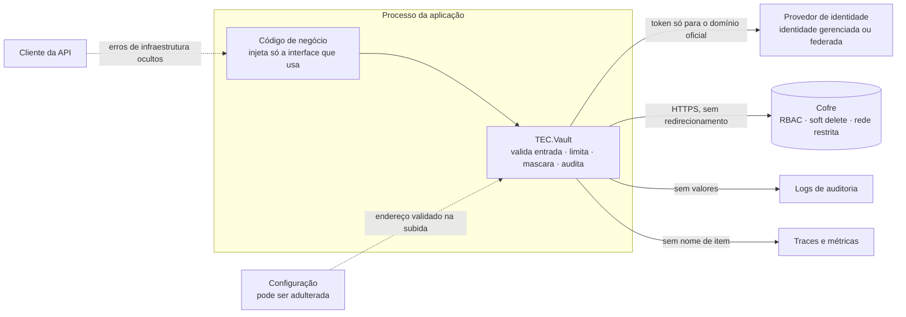

[🏠 TEC.Vault](../README.md) › [📚 Documentação](README.md) › 🛡️ Segurança

# 🛡️ Segurança

> Modelo de ameaças do TEC.Vault, os controles aplicados (com a suíte de testes que prova cada um), os limites, os riscos
> residuais assumidos e o que configurar no cofre para operar em modelo **Zero Trust**.

## 📑 Sumário

- [🎯 Visão geral](#-visão-geral)
- [🚀 Uso](#-uso)
  - [Garantias e responsabilidades](#garantias-e-responsabilidades)
  - [Checklist do cofre](#checklist-do-cofre)
- [🧱 Ameaças e controles](#-ameaças-e-controles)
- [⚠️ Riscos residuais](#️-riscos-residuais)
- [⚙️ Opções](#️-opções)
- [❌ Erros](#-erros)
- [🛡️ Segurança](#️-segurança-1)
  - [Decisões de arquitetura](#decisões-de-arquitetura)
  - [Cadeia de suprimentos](#cadeia-de-suprimentos)
  - [Como reportar uma vulnerabilidade](#como-reportar-uma-vulnerabilidade)
- [❓ Perguntas frequentes](#-perguntas-frequentes)

---

## 🎯 Visão geral

| Princípio | Como o componente aplica |
|---|---|
| **Nunca confiar, sempre verificar** | `VaultUri` do Azure só aceita `https://<nome-do-cofre>.vault.azure.net/` (e nuvens soberanas), sem porta, caminho, query ou subdomínio extra; o SDK recusa desafio de autenticação de outro domínio. Nos provedores HTTP (HashiCorp Vault, Infisical) o endereço passa por `VaultEndpoint` (HTTPS, sem caminho/usuário/query) e o cliente não segue redirecionamentos |
| **Sem segredo para abrir o cofre** | Identidade gerenciada (padrão) ou federada; Kubernetes Auth/JWT no HashiCorp Vault e no Infisical; nenhuma credencial na aplicação com o provedor Synced. Credencial de login só de arquivo ou variável (`VaultCredentialInput`), nunca do `appsettings`. `Developer` e o provedor em memória só em Development (falha fechada) |
| **Menor privilégio** | Interfaces separadas (leitor × gestão × criptografia × lixeira × backup), papéis por tipo de item, operações de chave restringíveis, certificados não exportáveis por padrão, `IConfiguration` só com o prefixo da aplicação, health check só dos stores registrados |
| **Assumir violação** | Valores nunca em log, `ToString` mascarado, corpo HTTP nunca registrado, erros sem detalhes de infraestrutura, algoritmos fracos inexistentes na API, envelope com contexto autenticado |
| **Limites explícitos** | Tamanho de valores, certificados (1 MB), respostas HTTP (4 MB), arquivos de credencial (64 KB), listagens (`MaxListItems`, `MaxItems`, `MaxSecrets`), cache (1.024 entradas), regex com timeout |
| **Auditoria** | Escritas, downloads de chave privada e leituras de segredos gerenciados em `Information`; falhas de infraestrutura em `Error` com o código do cofre; nomes recusados só como tamanho + HMAC; traces e métricas sem nome de item |

---

## 🚀 Uso

### Garantias e responsabilidades

| O componente garante | Quem usa é responsável por |
|---|---|
| Endereço do cofre validado e token restrito ao domínio oficial | Uma identidade por aplicação, com o papel mínimo, no menor escopo |
| Autenticação sem segredo por padrão | Não usar `ClientSecretCredential`; não liberar `Developer` em servidores |
| Entrada validada antes da chamada | Nunca colocar dados pessoais ou sensíveis em **nomes** ou **tags** (aparecem em logs, listagens e no portal) |
| Valores fora de logs, exceções e `ToString` | Não registrar `VaultSecret.Value`; não guardar o valor além do uso |
| Erros de infraestrutura ocultos do cliente | Monitorar os logs `Error` (403, indisponibilidade) |
| Algoritmos fortes; chaves de dados zeradas | Restringir `Operations`; preferir `IKeyCryptography` ao download de certificado |
| Limites de tamanho e de quantidade | Limitar a **taxa** de chamadas quando a entrada vier de fora (importação de certificado, nomes vindos do cliente) |
| Trilha de auditoria sem valores | Reter os logs e alertar sobre `*.purge`, leituras sensíveis e 403 repetidos |
| Purge disponível na API | Ativar proteção contra purge e soft delete no cofre de produção |

### Checklist do cofre

Recomendado no cofre de testes e **obrigatório** nos cofres de produção:

- [ ] **Modelo de permissão RBAC** (não *access policies*), papéis por identidade no menor escopo.
- [ ] **Soft delete** com retenção de 90 dias e **proteção contra purge** (produção).
- [ ] **Acesso de rede restrito**: *private endpoint* ou firewall; acesso público desabilitado em produção.
- [ ] **Diagnóstico** enviando `AuditEvent` a um workspace de logs, com alertas para `SecretPurge`, `KeyPurge`,
      `CertificatePurge` e 403 repetidos.
- [ ] **Proteção contra ameaças** do provedor de nuvem (ex.: Microsoft Defender for Key Vault).
- [ ] Um cofre por aplicação e ambiente (nunca compartilhar produção com testes).
- [ ] Expiração e rotação: segredos com `ExpiresOn`; chaves com rotação; certificados com `AutoRenewDaysBeforeExpiry`.
- [ ] Identidade do CI (OIDC) com acesso **somente** ao cofre de testes.
- [ ] **HashiCorp Vault / OpenBao**: TLS, *audit device*, Kubernetes Auth ou JWT, política de menor privilégio por aplicação
      (sem `create` em `transit/encrypt/*`; ver [🏛️ Provedor HashiCorp Vault](provedor-hashicorp-vault.md)), uma pasta do KV
      por aplicação.
- [ ] **Infisical**: uma identidade de máquina por aplicação e ambiente, acesso só à pasta da aplicação, TTL curto.
- [ ] **Synced**: volume de segredos montado só no container da aplicação, somente leitura; preferir arquivos a variáveis.

---

## 🧱 Ameaças e controles

A coluna **Prova** cita a suíte de `TEC.Vault.Tests` (ou `TEC.Vault.LoadTests`) que demonstra o controle
([🧪 Testes](testes.md)).

Endereço, identidade e entrada

| # | Ameaça | Controle | Prova |
|:-:|---|---|---|
| 1 | **Exfiltração do token** por `VaultUri` adulterado (`https://kv.vault.azure.net.evil.com`) | `VaultUri` validado na subida: HTTPS, host = `<nome>` + sufixo oficial, sem porta/caminho/query/usuário/subdomínio | `SecurityTests`, `ReviewFixesTests` |
| 2 | **Desafio de autenticação** apontando para outro recurso | Verificação do recurso do desafio sempre ligada: o token não é emitido | `SecurityTests` |
| 3 | Token com escopo excessivo | Escopo único `https://vault.azure.net/.default` | `SecurityTests` |
| 4 | **Segredo para proteger o cofre** (client secret no appsettings) | Managed Identity por padrão; Workload Identity federada; chaves em texto (`ClientSecret`, `AccessToken`, `Auth:Token`, `Auth:SecretId`, `Auth:Jwt`) **recusadas** na configuração; credencial só de `...File`/`...Variable`, relida a cada login | `InfisicalProviderTests`, `HashiCorpVaultProviderTests`, `ReviewFixesTests` |
| 5 | Credencial de desenvolvedor usada em servidor | `Developer` só em Development (`IHostEnvironment`; sem ele, `ASPNETCORE_ENVIRONMENT` e só então `DOTNET_ENVIRONMENT`); liberação só por código, recusada na configuração | `SecurityTests`, `ProviderSelectionTests`, `ReviewFixesTests` |
| 6 | **Provedor em memória em produção** | `TEC.Vault.InMemory` falha fechado fora de Development; `AllowOutsideDevelopment` só por código | `InMemoryProviderTests`, `ProviderSelectionTests` |
| 7 | **Injeção de caminho** no nome/versão (`../keys/x`, `a?b`, `"nome\n"`) | Regex por provedor antes de qualquer chamada, todas terminadas em `\z`; caminhos HTTP montados só com `VaultEndpoint.Segment`/`Path` | `SecurityTests`, `FuzzTests`, `HashiCorpVaultProviderTests` |
| 8 | **ReDoS** ou regex lenta derrubando o chamador | `[GeneratedRegex]` com timeout ou `NonBacktracking` (nomes DNS, até 253 caracteres); **timeout de regex vira entrada recusada** (`VAULT_ENTRADA_INVALIDA`), nunca exceção | `SecurityTests`, `HardeningRegressionTests` |
| 9 | Versão gigante virando falha do provedor | Versão do HashiCorp Vault com no máximo **9 dígitos**; acima disso, `VAULT_ENTRADA_INVALIDA` antes da chamada | `HardeningRegressionTests` |
| 10 | Mensagem de validação ecoando o valor | Mensagens nunca repetem a entrada; configuração inválida informa o **caminho da chave**, nunca o valor | `SecurityTests`, `ProviderSelectionTests` |
| 11 | **Configuração digitada errado caindo num padrão** | Leitura estrita: chave desconhecida, valor fora do formato e provedor desconhecido falham na subida (`InvalidOperationException` com o caminho da chave); só provedores adicionados ao catálogo, sem reflexão | `ProviderSelectionTests` |
| 12 | **Configuração ignorada em silêncio** por um segundo `AddTecVault` | Chamar `AddTecVault` duas vezes lança `InvalidOperationException` (de propósito) | `AbstractionTests` |
| 13 | **Endereço adulterado ou redirecionamento** levando a credencial a outro servidor | `VaultEndpoint.Validate` (HTTPS; HTTP só em `localhost` em Development); `SocketsHttpHandler` com `AllowAutoRedirect = false` | `HashiCorpVaultProviderTests`, `InfisicalProviderTests` |
| 14 | **Path traversal e link simbólico** no provedor `Directory` | O nome nunca vira caminho (a pasta é listada); link só é seguido se o destino final ficar dentro da pasta; entradas com `.` inicial e subpastas ignoradas | `SyncedProviderTests`, `ReviewFixesTests` |
| 15 | **Variáveis do processo expostas como segredos** | `EnvironmentVariables` exige prefixo (≥ 2 caracteres) | `SyncedProviderTests` |

Vazamento de valores e de infraestrutura

| # | Ameaça | Controle | Prova |
|:-:|---|---|---|
| 16 | **Valor vazando em log** | `VaultSecret` mascara `ToString`/depurador; `ImportCertificateOptions` mascara `Password`; logs só com provedor/operação/nome/código; corpo HTTP nunca registrado; códigos de erro do cofre validados (`SafeCode`) | `SecurityTests`, `LeakUnderLoadTests` |
| 17 | **Nome recusado que é um valor colado por engano** | O nome recusado vai ao log só como tamanho + **HMAC-SHA256 com chave aleatória do processo** (`SensitiveDataMasker.DescribeUntrusted` do TEC.Core, formato `<N caracteres, hmac:xxxxxxxxxxxx>`): correlaciona ocorrências no processo sem permitir confirmar palpites fora dele | `SecurityTests` |
| 18 | **Vazamento de infraestrutura** ao cliente da API | Mensagens fixas sem nome/endereço; 401/403/429/5xx viram erros de serviço externo (ocultos pelo TEC.Core) | `SecurityTests` |
| 19 | **403 de firewall** confundido com item desabilitado | Classificação pelo código estruturado (`innererror.code`), nunca pelo texto; demais 403 viram `VAULT_ACESSO_NEGADO` com log `Error` | `SecurityTests` |
| 20 | **Nome de item em métricas/traces** | Meter e `Activity` `TEC.Vault` só com provedor, operação, sucesso e código; spans do SDK do Azure desligados | `DiagnosticsTests`, `SecurityTests` |
| 21 | **Valor vazando sob carga e falhas** (429, 5xx, 403 ecoando o valor, rede caindo) | Mesmos controles, verificados com todos os canais coletados ao mesmo tempo | `LeakUnderLoadTests`, `FuzzTests` |
| 22 | **Corpo da resposta ou credencial** em `VaultHttpException`/`VaultLoginException` | Só status e detalhe fixo; buffers zerados após o uso | `InfisicalProviderTests` |
| 23 | **Versão revelando o valor** no Synced | Versão = HMAC-SHA256 com chave aleatória por instância | `SyncedProviderTests` |
| 24 | Cópias da chave privada PEM em memória | Buffers da biblioteca zerados (`CryptographicOperations.ZeroMemory`); PEM carregado de `char[]`; array do chamador nunca alterado | `CertificatePemTests` |

Criptografia e certificados

| # | Ameaça | Controle | Prova |
|:-:|---|---|---|
| 25 | **Algoritmo fraco** (RSA1_5, OAEP-SHA1, RSA 1024) | Não representável na API; RSA 2048/3072/4096; importação recusa RSA < 2048 | `SecurityTests` |
| 26 | Chave com privilégio demais | `Operations` restringível; EC só assina/verifica | `SecurityTests` |
| 27 | **Chave privada de certificado** saindo do cofre | `Exportable = false` por padrão; download auditado; `EphemeralKeySet` fora do macOS | `SecurityTests`, `DiagnosticsTests` |
| 28 | **PFX/PEM malicioso** (tamanho, iterações, chave trocada) | Limite de **1 MB** (`VaultCertificateRules.MaxCertificateBytes`) antes de qualquer parse; chave privada obrigatória e casando com o certificado; no .NET 9+ `X509CertificateLoader` com limites | `ResourceAbuseTests`, `CertificatePemTests`, `FuzzTests` |
| 29 | **Troca de campo cifrado** entre registros | Envelope AES-GCM com `associatedData` | `ExtensionsTests`, `FuzzTests` |
| 30 | **Chave desabilitada continuando em uso** (operações públicas locais do SDK do Azure) | `CryptographyClientLifetime` (padrão 10 min, de 1 min a 24 h); decrypt, unwrap e sign sempre remotos | `AzureKeyVaultProviderTests` |
| 31 | **Upsert do Transit** criando chave AES por nome errado | Conferência sem cache de que a chave existe e é RSA antes de cifrar; política com só `update` em `transit/encrypt/*` | `HashiCorpVaultLiveKeyTests` (integração) |
| 32 | **Opção de segurança ignorada** (HSM, validade, restrição de operações) | Opções sem equivalente falham (`VAULT_OPERACAO_NAO_SUPORTADA` / `VAULT_ENTRADA_INVALIDA`); tags `tec.` reservadas | `HashiCorpVaultProviderTests`, `InfisicalProviderTests`, `InMemoryProviderTests` |

Disponibilidade e esgotamento de recursos

| # | Ameaça | Controle | Prova |
|:-:|---|---|---|
| 33 | **Listagem gigante** (cofre inflado lido inteiro, memória e chamadas sem fim) | `MaxListItems` (padrão 10.000; 1..1.000.000) no HashiCorp Vault e no Azure: acima dele, `VAULT_LISTAGEM_ACIMA_DO_LIMITE` **sem ler o resto** (HashiCorp confere logo após listar os nomes, antes dos metadados, também nas listagens de versões e na busca de nome sem diferenciar maiúsculas; Azure para de paginar). Respostas HTTP acima de 4 MB: `VaultResponseTooLargeException` → `VAULT_FALHA`. Infisical: respostas limitadas a 4 MB e versões a 100; Synced: `MaxItems`; `IConfiguration`: `MaxSecrets` | `HardeningRegressionTests`, `ResourceAbuseTests`, `SyncedProviderTests` |
| 34 | **Payload gigante** processado antes de recusar | Tamanhos conferidos antes de cópia, parse ou regex; respostas HTTP limitadas (`MaxResponseBytes`, 4 MB) | `ResourceAbuseTests`, `PerformanceTests` (carga) |
| 35 | **Arquivo de credencial gigante** (pipe, `/dev/zero`, arquivo especial) | `VaultCredentialInput` lê no máximo **64 KB** com `TEC.Core.IO.BoundedFileReader`, mesmo em pipe/arquivo especial; BOM UTF-8 removido | `HardeningRegressionTests` |
| 36 | **Tag malformada** vinda do servidor derrubando a leitura | `CopyTags` tolera chave nula (ignorada), valor nulo (vazio) e chave repetida (último valor) | `HardeningRegressionTests`, `FuzzTests` |
| 37 | Cofre fora do ar classificado como falha desconhecida | Transporte e `AggregateException` do Azure.Core viram `VAULT_INDISPONIVEL`; **503 com `Retry-After` longo** (acima de `MaxRetryDelay`) continua `VAULT_INDISPONIVEL`, não vira limite excedido | `AzureKeyVaultProviderTests`, `HardeningRegressionTests` |
| 38 | **Stampede** de leituras ou de logins | Cache coalesce leituras (uma chamada por chave); `VaultTokenSource` faz login único e renova antes de vencer | `CacheConcurrencyTests`, `LoadTests` (carga), `InfisicalProviderTests` |
| 39 | **Escrita duplicada por retentativa** | `VaultHttpClient` só repete operações idempotentes após 5xx/tempo limite; as demais só após 429 | `InfisicalProviderTests` |
| 40 | Conexões presas a um DNS antigo | `SocketsHttpHandler` de vida longa com `PooledConnectionLifetime` de 5 min (sem `IHttpClientFactory`, compatível com AOT) | Código em `VaultHttpClient` |
| 41 | Aplicação subindo sem segredos ou travada por cofre lento | `IConfiguration` falha na subida por padrão (`Optional = false`); `LoadTimeout` 30 s; `Reload()` com falha mantém os valores anteriores | `ConfigurationProviderTests` |
| 42 | Cache lido por outro componente ou com valor antigo após escrita | `MemoryCache` privado (1.024 entradas), contador de geração, decorators de escrita limpam o cache | `CacheConcurrencyTests`, `AbstractionTests` |
| 43 | Conteúdo hostil na fonte sincronizada | `MaxFileBytes` sem truncar, `MaxItems`, UTF-8 estrito, JSON com profundidade 16, nomes repetidos falham | `SyncedProviderTests` |

---

## ⚠️ Riscos residuais

| Risco | Motivo | Mitigação recomendada |
|---|---|---|
| **PEM criptografado com PBKDF2 hostil** | O .NET não limita o número de iterações PBKDF2 declarado pela chave `ENCRYPTED PRIVATE KEY` (diferente do PKCS#12 no `X509CertificateLoader`): um conteúdo hostil consome CPU por bastante tempo. A única defesa da biblioteca é o limite de 1 MB | **Não exponha a importação de certificados a entradas não confiáveis sem limitar a taxa** de chamadas (por usuário/cliente) |
| **Purge liberado na API** | Decisão de projeto | *Purge protection* no cofre de produção; papéis *Officer* só para quem precisa; alertas para `*.purge` |
| Valor como `string` na memória gerenciada | SDKs e `HttpClient` expõem `string`; não é possível zerar | Não guardar `VaultSecret` além do uso; preferir `IKeyCryptography` |
| `IConfiguration` mantém valores a vida toda | Natureza do `IConfiguration` | Ler segredos de alto valor sob demanda |
| Cache serve valor sem auditoria e após revogação | Troca consciente por latência | Deixar desligado (padrão) ou duração curta |
| Escrita pela classe concreta do provedor não limpa o cache | A classe concreta continua no container e não passa pelos decorators | Gravar sempre por `ISecretStore`/`ISecretRecycleBin`/`ISecretBackup` |
| Revogação de chave não é imediata para encrypt/wrap/verify no Azure | Operações locais com a chave pública em cache | Reduzir `CryptographyClientLifetime` (mínimo 1 min) |
| Instrumentação HTTP de terceiros grava `url.full` | Fora do controle do componente | O TEC.Observability exclui os hosts de Key Vault; em outra pilha, filtrar `*.vault.azure.net` e similares |
| `DefaultKeySet` no macOS | `EphemeralKeySet` não existe no macOS | Preferir `IKeyCryptography` ao download do certificado |
| PFX no .NET 8 sem os `Pkcs12LoaderLimits` | `X509CertificateLoader` só no .NET 9+ | Tipo e tamanho conferidos antes; runtime atualizado ou .NET 10 |
| **Envelope não autentica a origem** | Quem tem a chave pública monta um envelope válido | Assinar o envelope (`SignDataAsync`) e conferir antes de decifrar ([🔐 Chaves](chaves.md)) |
| Rotação de segredo não é atômica | Gravar e desabilitar versões são chamadas separadas | Concluir com `DisablePreviousSecretVersionsAsync` (idempotente) |
| Chave privada dos certificados do HashiCorp Vault no KV | O KV não tem certificados nativos | Restringir `secret/data/<pasta>/_certificates/*`; assinar com o Transit |
| Exclusões definitivas no Transit e no Infisical | Sem lixeira pela API | Gestão só para a identidade de administração; auditoria do cofre |
| Variáveis de ambiente herdadas por processos filhos | Natureza de `infisical run`/`bws run`/`envFrom` | Preferir o provedor `Directory` |
| Tokens prontos (`Token`, `AccessToken`) sem renovação | Renovados por quem os gerou | Login por Kubernetes/JWT; token pronto só em CI e ferramentas |
| Segredos carregados na configuração influenciando uma escolha feita depois | A fonte do cofre sobrepõe chaves `Vault:...` | Registrar o container antes de `Configuration.AddTecVault(...)`; restringir quem grava no cofre |

---

## ⚙️ Opções

Limites com efeito de segurança (detalhes em cada provedor):

| Opção | Padrão | Faixa | Efeito |
|---|---|---|---|
| `HashiCorpVaultOptions.MaxListItems` (`Vault:HashiCorpVault:MaxListItems`) | `10000` | 1..1.000.000 | Teto de itens por listagem; inválido falha na subida (`InvalidOperationException`) |
| `AzureKeyVaultOptions.MaxListItems` (`Vault:AzureKeyVault:MaxListItems`) | `10000` | 1..1.000.000 | Idem; a paginação para no limite |
| `VaultHttpSettings.MaxResponseBytes` (HashiCorp, Infisical) | 4 MB | 1 KB..64 MB | Teto do corpo das respostas HTTP |
| `VaultCredentialInput.MaxFileBytes` | 64 KB | fixo | Teto do arquivo de credencial (token, JWT, `secret_id`, client secret) |
| `VaultCertificateRules.MaxCertificateBytes` | 1 MB | fixo | Teto do PFX/PEM importado |
| `DirectorySecretsOptions.MaxItems` / `EnvironmentSecretsOptions.MaxItems` / `SecretsFileOptions.MaxItems` | `1000` | 1..10.000 | Teto de segredos da fonte sincronizada |
| `DirectorySecretsOptions.MaxFileBytes` / `SecretsFileOptions.MaxFileBytes` | 64 KB / 1 MB | até 1 MB / 16 MB | Teto do arquivo lido, sem truncar |
| `VaultConfigurationOptions.MaxSecrets` | `500` | > 0 | Teto de segredos carregados no `IConfiguration` (falha fechada) |
| `VaultConfigurationOptions.LoadTimeout` | 30 s | até 10 min | Tempo máximo da carga |
| `AzureKeyVaultOptions.CryptographyClientLifetime` | 10 min | 1 min..24 h | Vida máxima dos clientes de criptografia (revogação) |

Quem escreve um provedor aplica o mesmo teto com `VaultProviderBase.EnsureListLimit(int count, int maxItems)`
([🧱 Novo provedor](novo-provedor.md)).

---

## ❌ Erros

| Código / exceção | Quando ocorre | O que fazer |
|---|---|---|
| `InvalidOperationException` na subida | Configuração inválida (com o caminho da chave), `MaxListItems` fora da faixa, `Developer`/em memória fora de Development, `AddTecVault` chamado duas vezes | Corrija a configuração; configure o cofre numa única chamada |
| `VAULT_LISTAGEM_ACIMA_DO_LIMITE` | Listagem passou de `MaxListItems` | Use pasta/prefixo mais específico ou aumente o limite |
| `VAULT_ENTRADA_INVALIDA` | Nome/versão fora do formato, timeout de regex, tamanho acima do limite, opção sem equivalente | Corrija a entrada; não repita sem mudar |
| `VAULT_ACESSO_NEGADO` | 403 do cofre (RBAC, firewall, política) | Veja o log `Error`; ajuste papéis/rede |
| `VAULT_INDISPONIVEL` | Cofre fora do ar, 5xx, 503 com `Retry-After` longo | Tente mais tarde; monitore |
| `VAULT_AUTENTICACAO_FALHOU` | Credencial ausente, recusada ou arquivo acima de 64 KB | Confira a identidade e o arquivo de credencial |

Tabela completa: [❌ Erros](erros.md).

---

## 🛡️ Segurança

### Decisões de arquitetura

| Decisão | Motivo |
|---|---|
| `AddTecVault` chamado duas vezes **lança exceção** | Nunca ignorar em silêncio uma configuração diferente |
| Erros de configuração são `InvalidOperationException` na subida, com o caminho da chave | Falhar antes da primeira requisição, sem ecoar valores |
| `VaultHttpClient` usa um `SocketsHttpHandler` de vida longa com renovação de conexões (5 min), sem `IHttpClientFactory` | Compatível com Native AOT, sem dependência extra, renova DNS |
| Importação de PEM criptografado limitada só por tamanho (1 MB) | O .NET não oferece limite de iterações PBKDF2; a taxa de chamadas é responsabilidade de quem expõe a importação |
| Segredo gerenciado de certificado legível por `ISecretReader` | Um cofre por aplicação; leitura auditada em `Information` |

> [!CAUTION]
> Não exponha `ImportCertificateAsync` a conteúdo enviado por usuários sem **limitar a taxa** de chamadas: uma chave PEM
> criptografada pode declarar um número enorme de iterações PBKDF2 e prender a CPU.

> [!WARNING]
> Nomes e tags aparecem em logs, listagens e no portal do cofre. Nunca coloque dados pessoais neles.

### Cadeia de suprimentos

| Controle | Como é aplicado |
|---|---|
| Analisadores | Regras CA de segurança, IL de AOT/trimming, nullable e XML doc como **erro** nos pacotes |
| Consistência entre alvos | `EnablePackageValidation`: mesma API pública em `net8.0` e `net10.0` |
| Vulnerabilidades | `NuGetAudit` (inclusive transitivos) quebra o build; auditoria de pacotes vulneráveis/descontinuados no CI central |
| Dependências travadas | `packages.lock.json` versionado, restore `--locked-mode` no CI |
| *Dependency confusion* | `packageSourceMapping`: `TEC.*` só do feed `tec-interno` |
| SAST | CodeQL `security-extended` em todo PR, no CI central (alerta ≥ 7,0 bloqueia) |
| GitHub Actions | Actions de terceiros fixadas por SHA, workflows centrais por tag `v1`; `zizmor` audita; Dependabot com cooldown de 7 dias |
| Isolamento de dependências | `TEC.Vault` sem SDK de nuvem; HashiCorp, Infisical e Synced sem SDK de terceiros; provedor em memória fora da produção |
| Integração no CI | HashiCorp Vault em container fixado por **digest**, só em `127.0.0.1` do runner, token aleatório mascarado; Azure só na `main` via OIDC |

Pipeline: [.github/workflows/README.md](../.github/workflows/README.md).

### Como reportar uma vulnerabilidade

Não abra issue pública. Envie os detalhes (versão, cenário, impacto e, se possível, um teste que reproduza) para **Roberto
Oliveira** · equipe **Tudo em Código** · [roberto@roberto.inf.br](mailto:roberto@roberto.inf.br).

---

## ❓ Perguntas frequentes

Por que a minha listagem falha com <code>VAULT_LISTAGEM_ACIMA_DO_LIMITE</code>?

O cofre (ou a pasta) tem mais itens que `MaxListItems` (padrão 10.000). A biblioteca para sem ler o resto para não
esgotar memória e chamadas. Use uma pasta mais específica (`Kv:BasePath` no HashiCorp) ou aumente o limite até 1.000.000.

Como correlaciono um nome recusado no log se ele aparece só como HMAC?

Dentro do mesmo processo, o mesmo nome gera o mesmo `hmac:xxxxxxxxxxxx`: basta comparar as ocorrências. A chave é
aleatória por processo, então o valor não é reproduzível fora dele (de propósito).

Posso chamar <code>AddTecVault</code> em dois módulos da aplicação?

Não: a segunda chamada lança `InvalidOperationException`. Configure todos os provedores numa única chamada (ou pela
configuração, ver [⚙️ Escolha do cofre pela configuração](configuracao-por-appsettings.md)).

---
⬅️ [❌ Erros](erros.md) · [📚 Índice](README.md) · [🧪 Testes](testes.md) ➡️
