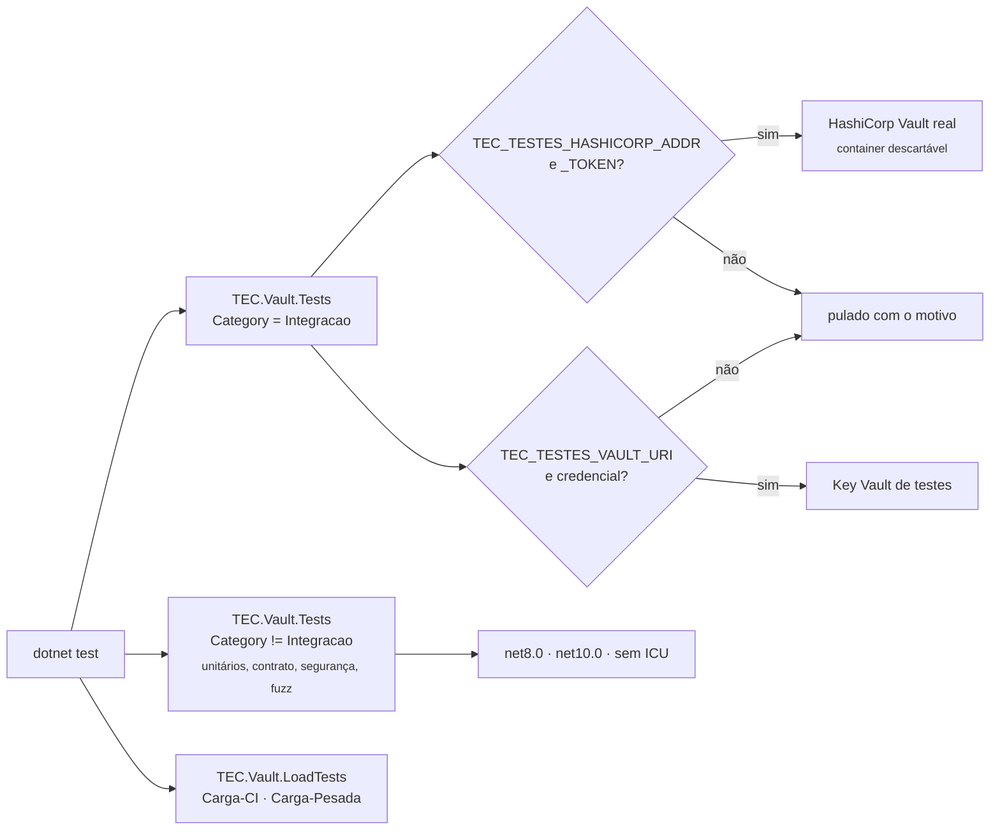
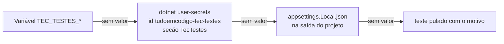

[🏠 TEC.Vault](../README.md) › [📚 Documentação](README.md) › 🧪 Testes

# 🧪 Testes

> Como o TEC.Vault é testado: categorias, suítes, testes de contrato, integração com cofres reais, carga e as variáveis
> `TEC_TESTES_*`/`TEC_CARGA_*` para rodar tudo localmente e no CI.

## 📑 Sumário

- [🎯 Visão geral](#-visão-geral)
- [🚀 Uso](#-uso)
  - [Rodar localmente](#rodar-localmente)
  - [Suítes](#suítes)
  - [Testes de contrato](#testes-de-contrato)
  - [Integração com o Key Vault de testes](#integração-com-o-key-vault-de-testes)
  - [Integração com o HashiCorp Vault](#integração-com-o-hashicorp-vault)
  - [Carga e performance](#carga-e-performance)
  - [No CI](#no-ci)
  - [Cobertura](#cobertura)
  - [Testando a sua aplicação](#testando-a-sua-aplicação)
- [⚙️ Opções](#️-opções)
- [❌ Erros](#-erros)
- [🛡️ Segurança](#️-segurança)
- [❓ Perguntas frequentes](#-perguntas-frequentes)

---

## 🎯 Visão geral



| Projeto | Categorias | Conteúdo | Quantidade |
|---|---|---|---:|
| `TEC.Vault.Tests` | *(sem categoria)* | Unitários, contrato, segurança, regressão, fuzz, vazamento sob carga, abuso de recursos | 595 por TFM |
| `TEC.Vault.Tests` | `Integracao` | HashiCorp Vault real (contratos, Transit, PKI, lixeira) e Key Vault de testes | 37 |
| `TEC.Vault.LoadTests` | `Carga-CI` | Concorrência e fumaça de carga (segundos) | 7 |
| `TEC.Vault.LoadTests` | `Carga-Pesada` | Carga sustentada (~3 min por cenário), cenário com Key Vault real e 5 medições de performance | 13 |

- Framework: **TUnit** sobre o Microsoft.Testing.Platform (`global.json` → `"test": { "runner": "Microsoft.Testing.Platform" }`).
  Os dois projetos são `Exe`, `net8.0` e `net10.0`, `IsPackable=false`.
- As categorias ficam numa classe `TestCategories` por projeto (`Integration = "Integracao"` em `TEC.Vault.Tests`;
  `LoadCi = "Carga-CI"` e `LoadHeavy = "Carga-Pesada"` em `TEC.Vault.LoadTests`). A seleção é **sempre por categoria**:
  não há variável liga/desliga.
- Os nomes dos testes estão em inglês e descrevem o comportamento (`Firewall_forbidden_becomes_access_denied_with_error_log`).
- O provedor Azure é testado sem rede com o **SDK real** sobre um cofre simulado em HTTP (`Fakes/FakeKeyVault.cs`);
  HashiCorp Vault e Infisical sobre servidores simulados (`Fakes/FakeHashiCorpVault.cs`, `Fakes/FakeInfisical.cs`); o
  Synced sobre pastas e arquivos temporários.

---

## 🚀 Uso

### Rodar localmente

```bash
# Unitários (os dois alvos), como no CI
dotnet test --project TEC.Vault.Tests --treenode-filter "/*/*/*/*[Category!=Integracao]"

# Um alvo só
dotnet test --project TEC.Vault.Tests -f net8.0 --treenode-filter "/*/*/*/*[Category!=Integracao]"

# Sem ICU (como em containers mínimos)
DOTNET_SYSTEM_GLOBALIZATION_INVARIANT=1 dotnet test --project TEC.Vault.Tests -f net10.0 --treenode-filter "/*/*/*/*[Category!=Integracao]"

# Integração (se pula sem os serviços configurados)
dotnet test --project TEC.Vault.Tests -f net10.0 --treenode-filter "/*/*/*/*[Category=Integracao]"

# Carga rápida
dotnet test --project TEC.Vault.LoadTests -c Release -f net10.0 --treenode-filter "/*/*/*/*[Category=Carga-CI]"
```

```powershell
# PowerShell
$env:DOTNET_SYSTEM_GLOBALIZATION_INVARIANT = "1"; dotnet test --project TEC.Vault.Tests -f net10.0 --treenode-filter "/*/*/*/*[Category!=Integracao]"
```

> [!WARNING]
> Não use `-nologo` com `dotnet test` no Microsoft.Testing.Platform: a opção é repassada ao executável de testes, que roda
> **0 testes** e sai com código 5.

> [!NOTE]
> Os outros componentes TEC.* (como o `TEC.Core`) vêm do feed `tec-interno` por padrão; entram como projeto só com
> `-p:TecUseLocalProjects=true` e o repositório vizinho presente. Veja [💻 Desenvolvimento local](desenvolvimento.md).

### Suítes

<details>
<summary>Tabela das suítes de <code>TEC.Vault.Tests</code></summary>

| Suíte | Rede | O que cobre |
|---|:---:|---|
| `SecurityTests` | ❌ | Endereço do cofre, desafio de outro domínio, escopo do token, validação de entrada (inclusive quebra de linha final), mascaramento, logs sem valores (HMAC do nome recusado, códigos de erro validados), spans do SDK desligados, 403 de firewall × item desabilitado, auditoria de segredo gerenciado |
| `HardeningRegressionTests` | ❌ | Regressões da revisão de robustez: versão do HashiCorp acima de 9 dígitos, assinatura malformada, `MaxListItems` (HashiCorp e Azure, faixa inválida), metadados malformados do Infisical, relógio injetado no Azure, geração de chave em memória sem bloquear, cache sem colisão nome × versão, timeout de regex, `Retry-After` longo em 503, arquivo de credencial limitado e sem BOM |
| `ReviewFixesTests` | ❌ | Azure escolhido por configuração (três famílias, endereço fora do domínio, `Developer` recusado), limite do cache, credencial em texto, renovação automática no HashiCorp, pasta de segredos que é link simbólico |
| `AzureKeyVaultProviderTests` | ❌ | SDK real sobre cofre simulado: desafio, paginação, cofre fora do ar com e sem retentativas, desempate de versão, tempo de vida dos clientes de criptografia, `IHostEnvironment` |
| `AzureKeyVaultOperationsTests` | ❌ | Criptografia real no cofre simulado: decrypt, wrap/unwrap, sign/verify, envelope, certificados, lixeira e backup, `OperationTimeout` |
| `HashiCorpVaultProviderTests` | ❌ | Kubernetes, AppRole e token, namespace, retentativa, lixeira do KV, `custom_metadata`, nomes ambíguos, Transit, PKI por CSR, tag reservada, endereço inválido, um login para os três stores |
| `InfisicalProviderTests` | ❌ | Login único e renovação, token revogado, credencial relida, Kubernetes Auth, retentativa só idempotente, corpo fora do log, nomes ambíguos, aprovação pendente, segredo em texto recusado |
| `SyncedProviderTests` | ❌ | `DirectorySecretStoreTests`, `EnvironmentSecretStoreTests`, `FileSecretStoreTests`, `SyncedConfigurationTests`: layout `..data`, link simbólico para fora, limites, UTF-8 estrito, versão HMAC, prefixo obrigatório, JSON e .env |
| `InMemoryProviderTests` | ❌ | Trava de Development, segredos, chaves e certificados em memória, escritas paralelas |
| `DependencyInjectionTests` · `ProviderSelectionTests` | ❌ | Registro no container (inclusive `AddTecVault` chamado duas vezes), escolha por configuração, chave desconhecida, valor inválido sem eco |
| `ConfigurationProviderTests` | ❌ | Fonte de `IConfiguration`: falhas, tempo limite, recarga incremental, paralelismo, `Reload()` com cofre fora do ar |
| `CacheConcurrencyTests` | ❌ | Corrida leitura × escrita, coalescência, cancelamento, descarte com leitura em andamento, `MaxEntries` |
| `HealthProbeTests` · `DiagnosticsTests` | ❌ | Sonda por combinação de stores; métricas e `Activity` sem nome de item |
| `CertificatePemTests` · `ExtensionsTests` · `ProviderRulesTests` · `AbstractionTests` | ❌ | PEM, rotação e envelope, regras comuns dos provedores, abstrações |
| `FuzzTests` | ❌ | Entradas hostis, respostas corrompidas, backups/PFX/PEM/envelopes adulterados (semente fixa) |
| `LeakUnderLoadTests` | ❌ | Nenhum valor em log, eventos do SDK, traces, métricas ou erros sob carga com falhas |
| `ResourceAbuseTests` | ❌ | Payloads gigantes, PEM de 2 MB, cancelamentos em massa, cofre inflado, paginação sem fim |
| `*ContractTests` | ❌ | [Testes de contrato](#testes-de-contrato) herdados por cada provedor |
| `Integration/*` | ✅ | `HashiCorpVaultLive*` e `KeyVaultIntegrationTests` (categoria `Integracao`) |

</details>

### Testes de contrato

Comportamento que todo provedor cumpre, escrito uma vez em `TEC.Vault.Tests/Contracts/` e herdado com `[InheritsTests]`.
Cada classe concreta só informa como criar o store.

```mermaid
classDiagram
    class SecretReaderContract
    class SecretStoreContract
    class KeyStoreContract
    class CertificateStoreContract
    SecretReaderContract <|-- SecretStoreContract
    SecretReaderContract <|-- DirectorySecretStoreContractTests
    SecretReaderContract <|-- EnvironmentSecretStoreContractTests
    SecretReaderContract <|-- JsonFileSecretStoreContractTests
    SecretReaderContract <|-- DotEnvFileSecretStoreContractTests
    SecretStoreContract <|-- InMemorySecretStoreContractTests
    SecretStoreContract <|-- InfisicalSecretStoreContractTests
    SecretStoreContract <|-- HashiCorpVaultSecretStoreContractTests
    SecretStoreContract <|-- HashiCorpVaultLiveSecretContractTests
    KeyStoreContract <|-- InMemoryKeyStoreContractTests
    KeyStoreContract <|-- HashiCorpVaultKeyStoreContractTests
    CertificateStoreContract <|-- InMemoryCertificateStoreContractTests
    CertificateStoreContract <|-- HashiCorpVaultCertificateStoreContractTests
    CertificateStoreContract <|-- HashiCorpVaultLiveCertificateContractTests
```



| Contrato | O que cobre |
|---|---|
| `SecretReaderContract` | Leitura, nome sem diferenciar maiúsculas, inexistente → `NotFound`, nome inválido sem consultar a fonte, `Exists`, listagem sem valores, versões, sonda saudável |
| `SecretStoreContract` | O anterior + nova versão mantendo a anterior, exclusão, valor vazio recusado antes do cofre |
| `KeyStoreContract` | RSA-OAEP-256, wrap/unwrap, assinatura RSA e ECDSA (P1363) verificáveis localmente, rotação, `NotFound`, listagem e exclusão |
| `CertificateStoreContract` | Autoassinado, download só se exportável, PFX com senha certa e errada, desabilitado não é baixado, versões e exclusão |

Um provedor novo herda os contratos do mesmo jeito ([🧱 Novo provedor](novo-provedor.md)).

### Integração com o Key Vault de testes

`Integration/KeyVaultIntegrationTests.cs` roda o ciclo completo num **Key Vault exclusivo de testes**: segredos (CRUD,
versões, exclusão, recuperação, geração e rotação), configuração e health check, item inexistente, chave RSA
(criptografia, assinatura, envelope, rotação), chave EC, certificado autoassinado e certificado importado não exportável.

Cada valor é procurado nesta ordem; a primeira fonte com valor vence (`Integration/TestSettings.cs`):



Configuração do desenvolvedor (uma vez por máquina; vale para todos os `lib-tec-*`):

```bash
az login --tenant <tenant-id>
dotnet user-secrets set TecTestes:VaultUri https://<cofre-de-testes>.vault.azure.net/ --id tudoemcodigo-tec-testes
dotnet user-secrets set TecTestes:TenantId <tenant-id> --id tudoemcodigo-tec-testes
```

| Item | Comportamento |
|---|---|
| Credencial | Azure CLI, Azure Developer CLI e Visual Studio, nessa ordem (até 30 s). No CI, o `az login` via OIDC feito pelo workflow central |
| Sem cofre ou sem credencial | Todos os testes de Azure **se pulam** com o motivo (ex.: `Key Vault de testes não configurado: defina TEC_TESTES_VAULT_URI ...`) |
| Papéis | Key Vault Secrets Officer, Crypto Officer e Certificates Officer (ou Administrator) **somente** no cofre de testes |
| Isolamento | Itens com nome único `tec-teste-<tipo>-<guid>`, excluídos e purgados no fim do teste |
| Sobras | Antes do primeiro teste, itens `tec-teste-*` criados ou excluídos há **mais de 1 hora** são removidos (até 50 por tipo, no máximo 3 minutos, sem nunca falhar os testes). Itens mais novos podem ser de outra execução |

```bash
# (uma vez) Papéis da identidade no cofre de testes
az role assignment create --role "Key Vault Secrets Officer"      --assignee <id-da-identidade> --scope <id-do-recurso-do-cofre-de-testes>
az role assignment create --role "Key Vault Crypto Officer"       --assignee <id-da-identidade> --scope <id-do-recurso-do-cofre-de-testes>
az role assignment create --role "Key Vault Certificates Officer" --assignee <id-da-identidade> --scope <id-do-recurso-do-cofre-de-testes>
```

### Integração com o HashiCorp Vault

`Integration/HashiCorpVaultIntegrationTests.cs` roda os contratos de segredos e certificados
(`HashiCorpVaultLiveSecretContractTests`, `HashiCorpVaultLiveCertificateContractTests`) e testes próprios de Transit, PKI e
lixeira (`HashiCorpVaultLiveKeyTests`, `HashiCorpVaultLivePkiAndRecycleBinTests`) contra um **HashiCorp Vault real em modo
dev**.

| Item | Comportamento |
|---|---|
| Ativação | Sem `TEC_TESTES_HASHICORP_ADDR` **ou** `TEC_TESTES_HASHICORP_TOKEN` os testes se pulam com o motivo |
| PKI | O teste de emissão exige também `TEC_TESTES_HASHICORP_PKI_ROLE` (no script, `tec-testes`); sem ela, só ele se pula |
| Login | Método `Token`, lido da variável `TEC_TESTES_HASHICORP_TOKEN` |
| HTTP | O servidor dev fala HTTP em `localhost`: a fixture informa um `IHostEnvironment` de Development (única situação em que o provedor aceita HTTP) |
| Isolamento | Pasta própria do KV por teste (`tec-testes/<guid>`), itens removidos no fim (inclusive da lixeira) |

Localmente, use **um container descartável na porta 18200**:

```bash
# 1. Vault em modo dev (18200: nunca use a 8200, que pode ser de outro Vault da máquina)
docker run --rm -d --name tec-vault-testes --cap-add=IPC_LOCK \
  -e VAULT_DEV_ROOT_TOKEN_ID=tec-dev-root -p 127.0.0.1:18200:8200 hashicorp/vault:2.1.1

# 2. Transit, PKI com CA raiz e papel tec-testes (o KV v2 em "secret" já vem no modo dev)
VAULT_ADDR=http://127.0.0.1:18200 VAULT_TOKEN=tec-dev-root bash .github/scripts/vault-dev.sh

# 3. Testes de integração
TEC_TESTES_HASHICORP_ADDR=http://127.0.0.1:18200 \
TEC_TESTES_HASHICORP_TOKEN=tec-dev-root \
TEC_TESTES_HASHICORP_PKI_ROLE=tec-testes \
  dotnet test --project TEC.Vault.Tests -f net10.0 --treenode-filter "/*/*/*/*[Category=Integracao]"

# 4. Fim (o --rm descarta tudo)
docker stop tec-vault-testes
```

```bash
# Alternativa às variáveis: user-secrets (mesmo id dos demais testes)
dotnet user-secrets set TecTestes:HashiCorpAddr http://127.0.0.1:18200 --id tudoemcodigo-tec-testes
dotnet user-secrets set TecTestes:HashiCorpToken tec-dev-root --id tudoemcodigo-tec-testes
dotnet user-secrets set TecTestes:HashiCorpPkiRole tec-testes --id tudoemcodigo-tec-testes
```

> [!CAUTION]
> Aponte só para um Vault **descartável**: os testes criam e removem itens e o script de preparo usa o token root.

### Carga e performance

Projeto `TEC.Vault.LoadTests`, com o gerador de carga próprio [`samples/TEC.Vault.LoadGenerator`](../samples/README.md) em
processo (malha fechada, sem ferramenta externa).

```bash
# Carga rápida (segundos), como no job rapida do performance.yml
dotnet test --project TEC.Vault.LoadTests -c Release -f net10.0 --treenode-filter "/*/*/*/*[Category=Carga-CI]"

# Carga pesada (~3 min por cenário com fator 1), com relatório Markdown
TEC_CARGA_FATOR=1 TEC_CARGA_RELATORIOS=./relatorios \
  dotnet test --project TEC.Vault.LoadTests -c Release -f net10.0 --treenode-filter "/*/*/*/*[Category=Carga-Pesada]"
```

| Teste | Categoria | O que garante |
|---|---|---|
| `InMemory_full_mix_has_no_errors` · `Simulated_azure_full_mix_has_no_errors` | Carga-CI | Mistura completa (leitura, escrita, envelope, assinatura, entrada hostil, listagem) sem erro nem conteúdo divergente |
| `Cache_absorbs_read_burst_with_one_call_per_secret` | Carga-CI | Rajada de leituras com cache: no máximo uma chamada ao cofre por segredo |
| `Throughput_scales_with_concurrency_when_vault_is_slow` | Carga-CI | Vazão escala com a concorrência (sem serialização escondida) |
| `Concurrent_cryptography_does_not_corrupt_and_reuses_key_client` | Carga-CI | Criptografia concorrente correta, chave pública lida só na criação dos clientes |
| `Vault_failures_under_load_become_known_codes_without_exceptions` (429 e 503) | Carga-CI | 429/503 viram `VAULT_LIMITE_EXCEDIDO`/`VAULT_INDISPONIVEL` sem exceção |
| `*_sustained` (6 execuções) | Carga-Pesada | As mesmas medições por mais tempo, com limites de vazão e latência (p99) |
| `Real_test_vault_with_rate_limit` | Carga-Pesada | **Key Vault de testes real**: 4 workers, até 20 ops/s, erro < 1%, p95 da leitura < 2 s; itens `tec-teste-carga-*` removidos no fim. Pula sem `TEC_TESTES_VAULT_URI` |
| `PerformanceTests` (5) | Carga-Pesada | Leitura em cache síncrona (< 50 µs, < 1 KB alocado), recusa de entrada hostil em < 20 ms sem chamar o cofre, envelope lendo a chave pública uma vez, carga paralela do `IConfiguration`, memória estável (< 16 MB de crescimento) |

Cada execução acrescenta o seu relatório em `$TEC_CARGA_RELATORIOS/TEC.Vault.LoadTests.md`; o CI publica os `*.md` dessa pasta
no resumo da execução. Os limites ficam folgados de propósito: pegam regressões (cache que deixou de acertar, cliente de
criptografia recriado a cada chamada), não o ruído do runner.

### No CI

| Evento | Testes | Onde |
|---|---|---|
| Pull request / merge queue | Unitários (`net10.0` com cobertura, `net8.0`, sem ICU) e `Integracao` (HashiCorp em container; Azure se pula) | `ci.yml` |
| `main` (push, agendado/manual) | Os mesmos, com o Key Vault de testes via OIDC; no push, depois do `ci-ok`, a prévia é publicada | `ci.yml` |
| Publicar versão | Só os unitários (matriz + cobertura) | `release.yml` |
| Manual (**Performance**) | `Carga-CI` (`suite` = `rapida`), `Carga-Pesada` (`pesadas`, padrão) ou ambos (`todas`) | `performance.yml` |

Os testes de carga não rodam no PR nem na publicação: tempo de parede em runner compartilhado é ruidoso e não pode
bloquear PR nem versão.

Detalhes, Variables e scripts: [.github/workflows/README.md](../.github/workflows/README.md).

### Cobertura

```bash
dotnet test --project TEC.Vault.Tests -c Release -f net10.0 --treenode-filter "/*/*/*/*[Category!=Integracao]" \
  --coverage --coverage-output-format cobertura --results-directory ./coverage
```

No CI a cobertura vem do job unitário `net10.0` somada à da integração.

### Testando a sua aplicação

Para testar código que **consome** o TEC.Vault, use o provedor em memória: sem rede, com criptografia real e os mesmos
códigos de erro.

```csharp
using TEC.Vault.Common;
using TEC.Vault.InMemory;
using TEC.Vault.Secrets;

// Liberação explícita: o provedor em memória falha fechado fora de Development
var secrets = new InMemorySecretStore(new InMemoryVaultOptions { AllowOutsideDevelopment = true });
await secrets.SetSecretAsync("api-key", "valor-de-teste");

var service = new MyService(secrets);
var result = await service.RunAsync();
await Assert.That(result.IsSuccess).IsTrue();

// Simular segredo desabilitado
await secrets.UpdateSecretPropertiesAsync("api-key", new SecretPropertiesUpdate { Enabled = false });
var failure = await service.RunAsync();
await Assert.That(failure.Error!.Code).IsEqualTo(VaultErrors.DisabledCode);
```

Detalhes: [🧠 Provedor em memória](provedor-em-memoria.md).

---

## ⚙️ Opções

| Variável | Chave (user-secrets / `appsettings.Local.json`) | Padrão | Uso |
|---|---|---|---|
| `TEC_TESTES_VAULT_URI` | `TecTestes:VaultUri` | nenhum (pula) | URI do Key Vault exclusivo de testes (compartilhada pelos componentes) |
| `TEC_TESTES_TENANT_ID` | `TecTestes:TenantId` | nenhum | Tenant do Entra ID do cofre de testes |
| `TEC_TESTES_HASHICORP_ADDR` | `TecTestes:HashiCorpAddr` | nenhum (pula) | Endereço do HashiCorp Vault de testes |
| `TEC_TESTES_HASHICORP_TOKEN` | `TecTestes:HashiCorpToken` | nenhum (pula) | Token do Vault de testes (lido pelo provedor no modo `Token`) |
| `TEC_TESTES_HASHICORP_PKI_ROLE` | `TecTestes:HashiCorpPkiRole` | nenhum (pula o PKI) | Papel do PKI para a emissão de certificados |
| `TEC_TESTES_FUZZ_SEMENTE` | — | `20261005` | Semente do `FuzzTests` (para reproduzir uma falha) |
| `TEC_TESTES_FUZZ_ITERACOES` | — | `2000` | Iterações por teste de fuzz |
| `TEC_CARGA_FATOR` | — | `1` | Multiplica a duração das medições de carga (`performance.yml`: 1, 2, 3 ou 5) |
| `TEC_CARGA_RELATORIOS` | — | nenhum | Pasta onde a suíte grava `TEC.Vault.LoadTests.md` (o CI define e publica) |

> [!NOTE]
> Variáveis antigas **removidas**: `TEC_TESTES_INTEGRACAO`, `TEC_VAULT_URI`, `TEC_VAULT_TENANT_ID`, `TEC_VAULT_INTEGRACAO`,
> `TEC_VAULT_LIMPEZA` e `TEC_TESTES_CARGA`. A seleção agora é por categoria e a limpeza de sobras é sempre feita.

---

## ❌ Erros

| Sintoma | Quando ocorre | O que fazer |
|---|---|---|
| `dotnet test` roda **0 testes** e sai com código 5 | `-nologo` (ou filtro que não casa nada) | Remova `-nologo`; confira o `--treenode-filter` |
| Testes de integração **pulados** | Variável do serviço ausente, URI não https ou sem credencial (`az login`) | Leia o motivo no resultado; configure a variável ou o user-secrets |
| Só o teste de PKI pulado | `TEC_TESTES_HASHICORP_PKI_ROLE` ausente | Defina `tec-testes` (criado pelo `vault-dev.sh`) |
| `VAULT_ACESSO_NEGADO` no Key Vault de testes | Identidade sem os papéis *Officer* | Atribua os papéis (a propagação leva minutos) |
| `curl: (7)` no `vault-dev.sh` | Vault ainda não subiu ou porta errada | Confira o container e `VAULT_ADDR` (`http://127.0.0.1:18200` localmente) |
| `curl: (22)` no `vault-dev.sh` | Transit/PKI já montados (script rodado duas vezes) | Recrie o container descartável |
| Falha `FuzzTests` | Entrada gerada encontrou um caso não tratado | Reproduza com `TEC_TESTES_FUZZ_SEMENTE=<semente da mensagem>` |

---

## 🛡️ Segurança

> [!CAUTION]
> Nunca aponte `TEC_TESTES_VAULT_URI` para um cofre com dados reais: os testes criam, excluem e **purgam** itens, e a
> limpeza de sobras purga itens `tec-teste-*` antigos.

> [!WARNING]
> O HashiCorp Vault local roda sempre num **container descartável na porta 18200**. Não use a 8200 da máquina, que pode
> ser de outro Vault em uso.

- A identidade de CI (OIDC) só tem papéis no cofre de testes e só aceita tokens da `main`; em pull request o token nem
  existe, e os testes de Azure se pulam.
- O HashiCorp Vault do CI é descartável, ouve só em `127.0.0.1` do runner e usa um token aleatório mascarado no log.
- Nenhum recurso real tem valor padrão no código: sem configuração, o teste se pula com o motivo.

---

## ❓ Perguntas frequentes

<details>
<summary>Por que os testes de integração aparecem como pulados no meu PR?</summary>

O login OIDC no Azure só acontece na `main`, fora de pull request; sem ele, `TEC_TESTES_VAULT_URI` não chega aos testes e
os de Azure se pulam. Os do HashiCorp Vault rodam também em PR (container sem segredo).

</details>

<details>
<summary>Como rodo só uma classe de teste?</summary>

Use o filtro de árvore do TUnit: `--treenode-filter "/*/*/SecurityTests/*"` (assembly/namespace/classe/teste).

</details>

<details>
<summary>Os testes de carga falham na minha máquina lenta. E agora?</summary>

Os limites são folgados, mas medição de tempo depende da máquina. Rode em `-c Release`, feche outras cargas e compare
tendências; o CI roda os testes de carga só no `performance.yml`, sob demanda.

</details>

---
⬅️ [🛡️ Segurança](seguranca.md) · [📚 Índice](README.md) · [💻 Desenvolvimento local](desenvolvimento.md) ➡️
