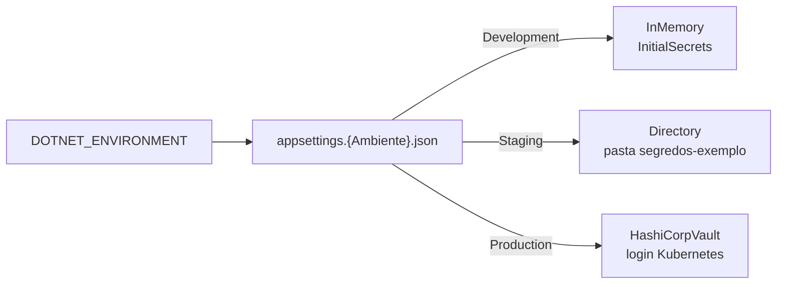

[🏠 TEC.Vault](../README.md) › 🧰 Samples

# 🧰 Samples

> Dois programas de exemplo (nunca viram pacote): a escolha do cofre por ambiente e o gerador de carga usado também pelos testes de carga.

## 📑 Sumário

- [🎯 Visão geral](#-visão-geral)
- [⚙️ TEC.Vault.ConfigSelection](#️-tecvaultconfigselection)
- [📈 TEC.Vault.LoadGenerator](#-tecvaultloadgenerator)
- [❓ Perguntas frequentes](#-perguntas-frequentes)

---

## 🎯 Visão geral

| Sample | Mostra | Rede |
|---|---|:---:|
| [`TEC.Vault.ConfigSelection`](TEC.Vault.ConfigSelection) | O mesmo binário usando um cofre diferente em cada ambiente, sem `if`, só pelo `appsettings.{Ambiente}.json` | ❌ (Development e Staging) |
| [`TEC.Vault.LoadGenerator`](TEC.Vault.LoadGenerator) | Vazão, latência e erros dos provedores sob carga (malha fechada), em memória, com cofre simulado ou com o Key Vault de testes | Só com `--backend azure` |

---

## ⚙️ TEC.Vault.ConfigSelection

Escolha do cofre pela configuração ([documentação](../docs/configuracao-por-appsettings.md)). O `Program.cs` só declara os provedores **disponíveis** (`AddInMemory().AddSynced().AddHashiCorpVault().AddInfisical().AddAzureKeyVault()`); a seção `Vault` escolhe qual usar.



| Ambiente | Configuração | Segredos | Chaves |
|---|---|---|---|
| `Development` | `Vault:Provider = InMemory` com `InitialSecrets` | Em memória | Em memória |
| `Staging` | `Vault:Provider = Directory` (pasta `segredos-exemplo`, um arquivo por segredo, como um volume do Kubernetes) | Arquivos | — (o `Directory` só atende segredos) |
| `Production` | `Vault:Provider = HashiCorpVault`, login Kubernetes, `Certificates:Provider = None` | KV v2 | Transit |

O `appsettings.json` comum liga o cache (`Vault:Cache:Duration = 00:05:00`) e o prefixo da fonte de `IConfiguration` (`Vault:Configuration:Prefix = MinhaApi--`): o segredo `MinhaApi--ConnectionStrings--Db` vira `ConnectionStrings:Db`. O container é registrado **antes** da fonte de configuração, para que um segredo não consiga redirecionar a escolha do cofre. Valores nunca são impressos.

```bash
DOTNET_ENVIRONMENT=Development dotnet run --project samples/TEC.Vault.ConfigSelection -f net10.0
DOTNET_ENVIRONMENT=Staging     dotnet run --project samples/TEC.Vault.ConfigSelection -f net10.0
# Production fora do Kubernetes falha na subida (sem token da service account): falha fechada
DOTNET_ENVIRONMENT=Production  dotnet run --project samples/TEC.Vault.ConfigSelection -f net10.0
```

---

## 📈 TEC.Vault.LoadGenerator

Gerador de carga próprio (malha fechada, sem binário externo): cada worker executa uma operação no cofre, espera o resultado e executa a próxima. O relatório traz vazão, latência (média, p50, p95, p99, máximo) por cenário e os erros agrupados pelo código de `VaultErrors`. `LoadRunner`, `VaultTarget`, `VaultScenarios` e `SimulatedKeyVault` também são usados em processo pelos testes de carga ([🧪 Testes](../docs/testes.md)).

### Backends

| `--backend` | O que mede | Rede |
|---|---|:---:|
| `inmemory` | Custo do componente com o provedor em memória (validação, auditoria, métricas, criptografia real) | ❌ |
| `simulated` (padrão) | Provedor Azure com o **SDK real** sobre `SimulatedKeyVault`, um Key Vault simulado em HTTP com estado; latência e falhas injetáveis | ❌ |
| `azure` | Key Vault de **testes** real, com a credencial de desenvolvedor (`az login`) ou o login OIDC do CI. Cria segredos e uma chave `tec-teste-carga-*` e os exclui e purga no fim | ✅ |

> [!CAUTION]
> Com `--backend azure`, use só o cofre exclusivo de testes e limite a taxa com `--rate`: o Key Vault aplica *throttling* por cofre, e a carga cria, exclui e **purga** itens.

### Misturas

| `--mix` | Operações (peso) |
|---|---|
| `leitura` | Leitura de segredo semeado (com o cache, se `--cache`) |
| `escrita` | Nova versão de segredo num conjunto pequeno de nomes (disputa no mesmo item) |
| `cripto` | Envelope completo (cifra + decifra, com conferência) e assinatura + verificação |
| `misto` (padrão) | Leitura (70), escrita (10), envelope (10), assinatura (5), entrada hostil recusada (4), listagem (1) |

### Uso

```bash
# Azure com SDK real e cofre simulado, mistura completa, 32 workers por 30 s
dotnet run --project samples/TEC.Vault.LoadGenerator -c Release -f net10.0

# Rajada de leituras com cache de 30 s e cofre lento (10 ms por requisição)
dotnet run --project samples/TEC.Vault.LoadGenerator -c Release -f net10.0 -- \
  --mix leitura --cache 30 --latency 10 --concurrency 128 --secrets 20

# Comportamento sob throttling: 10% das requisições com 429
dotnet run --project samples/TEC.Vault.LoadGenerator -c Release -f net10.0 -- --mix leitura --faults 0.1

# Cofre de testes real, até 20 operações por segundo
dotnet run --project samples/TEC.Vault.LoadGenerator -c Release -f net10.0 -- \
  --backend azure --vault https://<cofre-de-testes>.vault.azure.net/ --rate 20 --concurrency 4 --secrets 10
```

| Opção | Padrão | Descrição |
|---|---|---|
| `--backend` | `simulated` | `inmemory`, `simulated` ou `azure` |
| `--mix` | `misto` | `leitura`, `escrita`, `cripto` ou `misto` |
| `--concurrency` | `32` | Workers em paralelo |
| `--duration` / `--warmup` | `30` / `5` | Segundos medidos / de aquecimento (fora das estatísticas) |
| `--secrets` | `100` | Segredos semeados (as leituras sorteiam entre eles) |
| `--cache` | desligado | Liga o cache de segredos por N segundos |
| `--latency` | `0` | Latência por requisição no cofre simulado, em ms |
| `--faults` | `0` | Fração das requisições ao cofre simulado que falham com 429 |
| `--rate` | sem limite | Limite global de operações por segundo |
| `--vault` / `--tenant` | `TEC_TESTES_VAULT_URI` / `TEC_TESTES_TENANT_ID` | Cofre de testes e tenant (só `azure`) |

O processo termina com código `0` sem erros e `1` se alguma operação falhou. Ctrl+C interrompe e imprime o relatório parcial.

<details>
<summary>📄 Exemplo de relatório</summary>

```text
Backend: Simulated · mistura: misto · cache: desligado
Duração: 5.0 s · concorrência: 16 · operações: 428070 · ops/s: 85614 · erros: 0 (0.00 %)
Latência (ms): média 0.19 · p50 0.03 · p95 0.64 · p99 3.16 · máx 71.02
| Cenário | Operações | Erros | p50 (ms) | p95 (ms) | p99 (ms) | máx (ms) |
|---|---:|---:|---:|---:|---:|---:|
| ler segredo | 299237 | 0 | 0.02 | 0.06 | 0.10 | 71.02 |
| gravar segredo | 42720 | 0 | 0.04 | 0.10 | 0.25 | 31.83 |
| envelope cifra+decifra | 42849 | 0 | 0.60 | 2.81 | 3.79 | 36.55 |
| assinar+verificar | 21438 | 0 | 0.59 | 2.80 | 3.73 | 38.83 |
| entrada inválida | 17403 | 0 | 0.01 | 0.01 | 0.03 | 17.47 |
| listar segredos | 4423 | 0 | 2.70 | 7.50 | 9.03 | 29.36 |
```

</details>

> [!NOTE]
> Média e máximo são exatos; os percentis vêm de até 50 mil amostras por cenário e por worker (amostragem por reservatório acima disso), para que o próprio gerador não consuma centenas de MB.

---

## ❓ Perguntas frequentes

<details>
<summary>O ConfigSelection em Production não sobe. É bug?</summary>

Não: fora do Kubernetes não existe o token da service account, e o login no HashiCorp Vault falha na subida (falha fechada). Para testar localmente, use Development ou Staging.

</details>

<details>
<summary>Posso usar o LoadGenerator contra o cofre de produção?</summary>

Não. Ele cria, exclui e purga itens. Use só o cofre exclusivo de testes, sempre com `--rate`.

</details>

---
[🏠 README](../README.md) · [📚 Documentação](../docs/README.md) · [🧪 Testes](../docs/testes.md)
